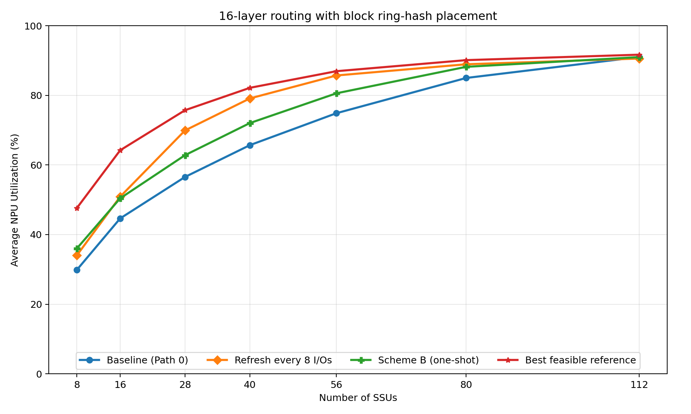
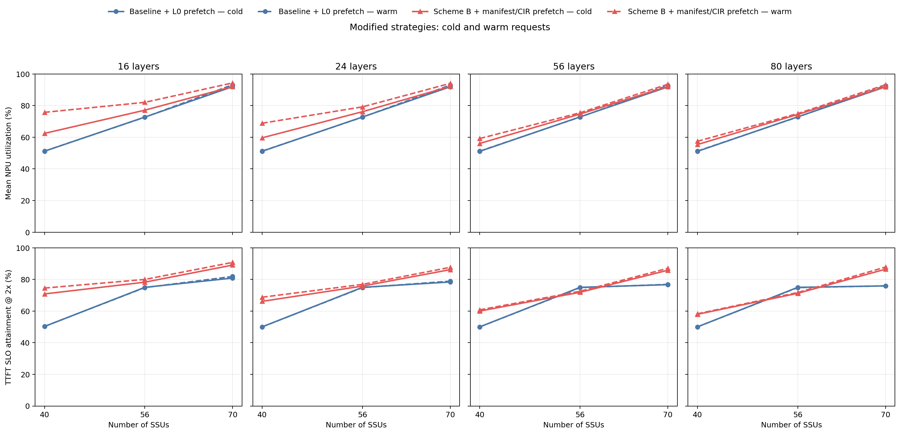

# QoS + SSD 路由仿真

这个仓库只保留四类对比对象：`Baseline`、`Refresh8`、`Scheme B` 和
`Best feasible reference`。所有方案复用相同的 block placement、SSD 服务模型和
NPU 接收限制；可部署的策略逻辑集中在 `policy_logic.py`，离散事件仿真不会成为策略
代码的依赖。

Scheme B 的设计、公式、实验结果和硬件接口另见
[Scheme B 详细分析](SCHEME_B_DETAILED_ANALYSIS.md)。

## 保留的策略

| 策略 | 可见信息 | 决策 |
|---|---|---|
| `baseline` | 不读取 Path 状态 | 所有 I/O 固定进入 Path 0 |
| `refresh8` | 每规划 8 条 I/O 读取一次目标 SSU 的 Path pressure | 在当前类别允许的 Path 中选择预计完成时间最小者；同一窗口用本地 shadow pressure 反映刚规划的 I/O |
| `Scheme B one-shot` | admission 时已知请求 manifest、ring-hash placement 和每层计算预算 | 计算 `NPU × SSU` demand-capped max-min grant，为每个 NPU 分配专属 Path，并把 grant 写成每块 SSU 的 CIR 表 |
| `Scheme B causal warm` | 已完成前一层的 bytes-by-SSU 和计算预算；后续请求的 Layer 0 manifest | 首次冷请求的 Layer 0 使用公共 Path 0；warm 阶段根据已观察信息更新专属 Path/CIR，并在上一请求最后一层计算期间预取下一请求 Layer 0 |
| `Best feasible reference` | 对应实验允许的全局已释放工作信息 | 在相同 placement、SSD40、NPU50 和层依赖下运行容量受限的参考调度器 |

`Best feasible reference` 是可以在当前物理容量模型中执行的候选参考，不是带最优性
证明的数学理论上界，也不会改变 NPU 与 SSD 的访问关系。

## 策略层与仿真层

### 可复制策略层

[`policy_logic.py`](policy_logic.py) 不导入 `sim.py`，不维护事件队列，也不读取仿真
时钟。生产客户端或其他开源框架只需构造不可变输入并消费返回值：

- `baseline_path_ids(...)`：返回固定 Path 0；
- `refresh8_path_ids(...)`：输入一份 pressure snapshot 和至多 8 条 I/O，返回 Path ID；
- `plan_scheme_b(...)`：输入活跃 manifest，返回 demand、grant、专属 Path 和 per-SSU CIR 表；
- `plan_causal_scheme_b(...)`：只根据前层观察和 cold Path 保留量生成新 CIR 表；
- `oracle_priority_key(...)`：Best feasible reference 使用的已释放 I/O 优先级。

[`continuous_batch_control.py`](continuous_batch_control.py) 只保留 Scheme B 使用的
demand-capped equal max-min grant 分配器。`strategy_profiles.py`、
`continuous_prefill_client.py` 和 `scheme_b_prefill.py` 是把纯策略输出转换成硬件/仿真配置
的薄适配层。

### 离散事件仿真层

- [`sim.py`](sim.py)：单请求 prefill 的 workload、ring-hash placement、Static QoS
  仲裁以及 SSD→NPU 两级数据面；
- [`continuous_batch_sim.py`](continuous_batch_sim.py)：固定成员、逐层同步的
  Full-prefill microbatch，以及 batch=1 的跨请求 Layer 0 预取；
- `continuous_prefill_workload.py` 和 `six_request_workload.py`：确定性配对 workload，
  不包含策略决策。

两个仿真器都调用 `policy_logic.py`，策略层本身不能访问未来事件完成时间。

## 共同物理模型

```text
客户端选择 Path / 配置 CIR
            ↓
Static QoS：CIR + Group/Path 仲裁
            ↓
每块 SSD 单命令、不可抢占：service = size / 40 GB/s
            ↓
每个 NPU 独立 FCFS 接收队列：service = size / 50 GB/s
            ↓
数据对该层计算可见
```

- 每个 token block 通过 `(request_id, block_index)` 的一致性 ring hash 放置；同一
  block 的所有层复用同一个 SSU，不同 block 可以落到不同 SSU；
- CIR 影响下一条命令获得 SSD 服务的机会，不把已经选中的单条命令限速成 CIR；
- 多个 SSD 同时返回同一 NPU 时，会在该 NPU 的 50 GB/s 接收队列形成 incast；
- Baseline、Refresh8、Scheme B 和 reference 使用完全相同的请求、placement、到达时间
  与物理数据面。

## 实验与现有结果

### 1. 16 层 SSU 数量扫描

配置为 128 NPU、16 层、SSU=`8/16/28/40/56/80/112`、seed=`42/43`，每个
NPU 有独立 `0–5 ms` launch jitter。客户端每次提交 1 条 I/O，相邻提交间隔为
`0.1 us`。Baseline 与 Refresh8 共用类别 CIR `20/6/8/6 GB/s`、每 Group Path 数
`12/4/12/4` 和 8 个 Group。

纵轴 `Average NPU Utilization` 在这个实验中定义为：先对每个请求计算

```text
16 层计算时间 / (16 层计算时间 + 暴露的 I/O stall)
```

再对 128 个请求等权平均；它不是使用全局 makespan 的 fleet utilization。

| 策略 | SSU 8 | SSU 16 | SSU 28 | SSU 40 | SSU 56 | SSU 80 | SSU 112 |
|---|---:|---:|---:|---:|---:|---:|---:|
| Baseline | 29.885% | 44.646% | 56.561% | 65.701% | 74.872% | 84.999% | 91.017% |
| Refresh8 | 34.065% | 50.887% | 69.925% | 79.126% | 85.714% | 88.937% | 90.584% |
| Scheme B one-shot | 36.032% | 50.422% | 62.817% | 72.048% | 80.591% | 88.199% | 90.994% |
| Best feasible reference | 47.646% | 64.225% | 75.737% | 82.171% | 86.947% | 90.125% | 91.687% |



原始结果与说明：
[report.md](results/routing_refresh_concurrency/report.md)、
[analysis.json](results/routing_refresh_concurrency/analysis.json)。

### 2. Full-prefill microbatch

`continuous_prefill_experiment.py` 比较 `baseline`、`refresh8`、`scheme_b_once`、
`scheme_b_after_l0` 和 `best_feasible`。默认配置为 128 NPU、28 SSU、16 层、batch 8：

- 每个 NPU 从 FIFO 冻结 microbatch 成员，运行中到达的请求不能插入当前 batch；
- 第 k 层必须等待所有成员的第 k 层 I/O 完成，随后只执行一个 joint batch compute；
- 计算开始时预取下一层，最后一层结束时整批同时完成；
- batch 计算时间使用成员 singleton 层时间之和，以保持计算工作量守恒，不假设未经
  测量的硬件 batch 加速；
- Scheme B one-shot 在 microbatch membership 改变时根据 manifest 配置一次；因果版本
  的 Layer 0 使用 Path 0，之后只使用已完成前层的信息。

分析器输出 fleet utilization、active-window utilization、makespan、平均层 I/O barrier
和 P99 请求延迟。Layer 0 没有上一层计算窗口，因此会保留真实 cold-start 排队。

### 3. 连续 batch=1 的 cold/warm 对比

默认矩阵为 128 NPU、每个 NPU 连续 6 个请求、layer=`16/24/56/80`、
SSU=`40/56/70`。请求 k 的最后一层开始计算时，可以预取已经到达的请求 k+1 的
Layer 0；首次请求仍是冷启动。

- cold：请求 0 admission 到请求 5 completion，统计全部 6 个请求；
- warm：请求 1 admission 到请求 5 completion，统计后 5 个请求；
- NPU 利用率：逐 NPU 计算 `compute busy / cohort window`，再对 128 个 NPU 等权平均；
- TTFT SLO：`TTFT <= 2 × compute-only TTFT`，TTFT 使用 completion−admission，
  不包含外部 arrival queue wait。

16 层、SSU=40 时，Scheme B warm 相对 Baseline 的平均 NPU 利用率提升
`+24.50 pp`，TTFT SLO 达标率提升 `+24.22 pp`。完整矩阵见
[cold/warm report](results/cold_warm_modified/report.md)。

现有图片：

- [完整 layer × SSU 矩阵](results/cold_warm_modified/01_cold_warm.png)
- [固定 SSU=40，横轴为层数](results/cold_warm_modified/02_ssu40_cold_warm.png)
- [固定 16 层，横轴为 SSU 数量](results/cold_warm_modified/03_layer16_cold_warm_by_ssu.png)



## 安装与运行

```bash
python3 -m venv .venv
source .venv/bin/activate
python -m pip install -r requirements.txt

# Baseline + Refresh8：2 seed × 7 SSU × 2 策略
python routing_refresh_concurrency_experiment.py --workers 10 --rerun

# Scheme B one-shot：2 seed × 7 SSU
python scheme_b_prefill_experiment.py --workers 10 --rerun

# Best feasible reference：2 seed × 7 SSU
python capacity_constrained_oracle_experiment.py --workers 10

# 校验配对结果并生成主报告和主图
python analyze_routing_refresh_concurrency.py

# Full-prefill：五个保留 case
python continuous_prefill_experiment.py --workers 5 --rerun
python analyze_continuous_prefill.py

# batch=1 cold/warm 矩阵
python cold_warm_experiment.py --workers 8 --rerun
python analyze_cold_warm.py
```

runner 会逐 case checkpoint。未指定 `--rerun` 时，只有代码、数据与实验配置指纹完全
一致的缓存才会被复用。

仓库中的结果 JSON 保留其生成时的代码/数据指纹。本次重构没有把旧结果伪装成由新代码
生成；因此 runner 检测到源码指纹变化后会重新运行。重构前后已对 Baseline、Refresh8、
Scheme B one-shot、因果 Scheme B 和 Best feasible 的确定性小规模数据面结果做逐字节回归，
结果一致。

## 测试

测试额外需要 `pytest`：

```bash
python -m pip install pytest

# 全部测试
python -m pytest -q

# 纯策略与 Scheme B grant/Path/CIR
python -m pytest -q test_policy_logic.py test_scheme_b_prefill.py

# Full-prefill 数据面、层 barrier 和守恒
python -m pytest -q \
  test_continuous_batch_sim.py \
  test_continuous_prefill_modules.py \
  test_full_prefill_microbatch_sim.py

# cold/warm cohort、TTFT SLO 与利用率
python -m pytest -q test_cold_warm_experiment.py test_cold_warm_metrics.py
```

## 主要文件

- [`policy_logic.py`](policy_logic.py)：可移植的 Baseline、Refresh8、Scheme B 和
  reference 策略逻辑；
- [`continuous_batch_control.py`](continuous_batch_control.py)：Scheme B max-min grant；
- [`sim.py`](sim.py)：单请求离散事件数据面；
- [`continuous_batch_sim.py`](continuous_batch_sim.py)：Full-prefill 与跨请求预取数据面；
- `strategy_profiles.py`：Baseline/Refresh8 共用的 Static QoS；
- `scheme_b_prefill.py`：one-shot manifest 到仿真 CIR 配置的适配；
- `routing_refresh_concurrency_experiment.py`：Baseline/Refresh8 SSU 扫描；
- `scheme_b_prefill_experiment.py`：Scheme B one-shot SSU 扫描；
- `capacity_constrained_oracle_experiment.py`：Best feasible reference 扫描；
- `continuous_prefill_experiment.py`：五个保留策略的 Full-prefill 对比；
- `cold_warm_experiment.py`：Baseline 与因果 Scheme B 的 cold/warm 对比；
- `data`：请求画像。

## 模型边界

- Path pressure 读取被视为零延迟、无丢失；
- QoS 是命令级 CIR/Group/Path 仲裁近似，没有逐 token 模拟 bucket depth、credit/debt
  或 CIR 配置传播延迟；
- 未建模固定 NAND/协议延迟、channel/die 并行、QD 吞吐曲线和有限 buffer 反压；
- Full-prefill 使用固定 microbatch 成员，未建模 chunked prefill 或 decode；
- batch compute 使用 singleton 工作量相加的代理，没有真实 batch kernel 测量；
- 画像 KV 字段历史上以 GiB 计算但命名为 `_gb`，绝对容量应按这一单位假设解读。
