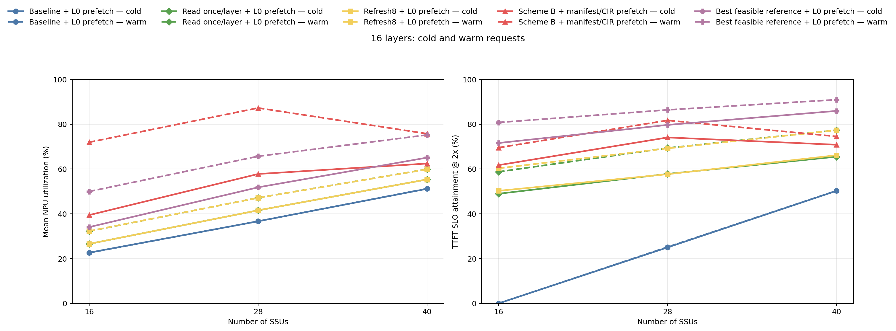

# Scheme B 设计、仿真方法与实验结果详解

本文面向没有读过本项目代码的读者，目标是回答四个问题：

1. Scheme B 到底解决什么问题，如何从请求信息生成 Path 和 CIR；
2. Baseline、Layer-once、Refresh8、Scheme B 和 Best feasible 候选究竟有什么不同；
3. 当前离散事件仿真模拟了哪些硬件行为，最新 cold/warm 实验如何统计；
4. Scheme B 为什么能显著减少中间层 I/O stall，却不一定改善 Layer 0、尾延迟或所有配置下的平均 NPU 利用率。

文中只使用仓库中已经完成的实验结果，不外推未运行的配置。最新且最重要的是固定 16 层、SSU=`16/28/40` 的五策略连续六请求结果：

- 最终 15 行配对结果：[`results/cold_warm_five_strategies_layer16/comparison_results.json`](results/cold_warm_five_strategies_layer16/comparison_results.json)
- 自动生成的表格与差值：[`results/cold_warm_five_strategies_layer16/report.md`](results/cold_warm_five_strategies_layer16/report.md)
- 机器可读分析：[`results/cold_warm_five_strategies_layer16/analysis.json`](results/cold_warm_five_strategies_layer16/analysis.json)
- 最终图：[`results/cold_warm_five_strategies_layer16/03_layer16_cold_warm_by_ssu.png`](results/cold_warm_five_strategies_layer16/03_layer16_cold_warm_by_ssu.png)
- 四份原始输入：[`SSU40 三策略`](results/cold_warm_refresh8_ssu40_layer16/results.json)、[`SSU40 Layer-once`](results/cold_warm_layer_once_ssu40_layer16/layer_once_results.json)、[`SSU40 Best feasible`](results/cold_warm_best_feasible_ssu40_layer16/results.json) 和 [`SSU16/28 五策略`](results/cold_warm_five_strategies_layer16/ssu16_28_results.json)

历史 Baseline/Scheme B 完整 layer×SSU 矩阵仍保存在 [`results/cold_warm_modified/results.json`](results/cold_warm_modified/results.json) 与 [`results/cold_warm_modified/report.md`](results/cold_warm_modified/report.md)。此外还有：

- batch=8 逐层分解：[`results/full_prefill_microbatch/causal_layer0_comparison_report.md`](results/full_prefill_microbatch/causal_layer0_comparison_report.md)
- 单请求路由矩阵：[`results/routing_refresh_concurrency/analysis.json`](results/routing_refresh_concurrency/analysis.json)

当前代码重构后的公共策略入口统一位于 [`policy_logic.py`](policy_logic.py)。该文件不依赖离散事件队列或仿真时间，Baseline、Layer-once、Refresh8、Scheme B 和可行 oracle 的客户端/控制面逻辑可以直接移植到其他框架；`sim.py`、`continuous_batch_sim.py` 等文件只负责提供硬件状态、执行返回的决定并推进仿真。

---

## 1. 先给结论

Scheme B 的核心不是“让一条 I/O 按 CIR 的速率慢慢传输”，而是：

> NPU 根据已知的 KV block 分布和计算时间，计算每个 `NPU × SSU` 流希望得到的长期带宽；全局控制器在每块 SSD 40 GB/s、每个 NPU 接收链路 50 GB/s 的约束下做 demand-capped max-min 分配；随后把 grant 写成每块 SSU 上 NPU 专属 Path 的 CIR。CIR 影响下一条 SSD 命令的仲裁机会，获胜命令仍独占 SSD 后端并以 40 GB/s 完成。

最新的 batch=1、16 层连续六请求实验表明：

- 在 SSU=`16/28/40`，Scheme B 的 warm 平均 NPU 利用率分别为 `71.94%/87.26%/75.74%`，相对 Baseline 提升 `+49.36/+50.59/+24.50 pp`；cold 也分别提升 `+16.77/+21.12/+11.27 pp`。
- Layer-once 与 Refresh8 在三个 SSU 点几乎完全重合。以 SSU=40 为例，warm 利用率是 `59.90%/59.87%`，warm SLO 都是 `77.34%`；Layer-once 只读取 `491,520` 次 pressure，Refresh8 读取 `1,587,648` 次。
- Best feasible 候选的 warm SLO 在 SSU=`16/28/40` 达到 `80.78%/86.41%/90.94%`，均为五策略最高；但 warm 利用率只有 `49.96%/65.68%/75.22%`，在 SSU=16/28 明显低于 Scheme B。这不是容量错误，而是各 SSD 独立优先短的本地 pending 层工作，改善多数请求达标率的同时会牺牲少数长尾，且并不优化本文的每 NPU cohort 利用率。
- 16 层、40 SSU 时，Scheme B 把 warm 请求平均暴露 I/O stall 从 Baseline 的 `109.542 ms` 降到 `39.348 ms`；Best feasible 为 `52.427 ms`。盘更少时差异更大：SSU=16 的 Scheme B 为 `49.958 ms`，Best feasible 为 `198.221 ms`，Baseline 为 `395.120 ms`。
- 第一次请求仍是真实 cold start，所以 Scheme B 的 cold 收益显著小于 warm 收益。历史 batch=8、16 层、28 SSU 分层实验也显示：它把 `L1–L15` 暴露等待之和从 `65.549 ms` 降到 `1.063 ms`，但 Layer 0 平均等待从 `79.165 ms` 增到 `215.910 ms`。
- Scheme B 优化长期 demand-capped max-min 带宽公平，不直接优化 deadline、coflow barrier 或 P99；Best feasible 候选也只是一种 released-I/O 排序目标。两者都不能被称为同时优化所有指标的数学最优策略。

---

## 2. 仿真的硬件与数据面

### 2.1 物理处理链

所有可直接比较的 QoS 策略共享同一数据面：

```text
NPU 为 I/O 选择目标 SSU 和 Path
                ↓
SSU 内部按 Path CIR + 两级 WRR 仲裁下一条命令
                ↓
SSD 单命令、不可抢占：service_time = size / 40 GB/s
                ↓
目标 NPU 的独立 FCFS 接收队列：service_time = size / 50 GB/s
                ↓
整个 block 对计算侧可见
```

对应代码：

- SSD Path、CIR/WRR 仲裁和命令执行：[`sim.py`](sim.py) 中的 `PathQueue`、`DiskIOScheduler`、`_static_qos_service_rates()`。
- NPU 接收链路及完整 Full-prefill 事件循环：[`continuous_batch_sim.py`](continuous_batch_sim.py) 中的 `simulate_continuous_batch()`。

每块 SSD 在任一时刻最多执行一条命令。一个 Path 被选中以后，该命令按完整 `40 GB/s` 服务，而不是按 Path CIR 限速。CIR 是长期命令仲裁份额；例如某 Path 获得 10 GB/s 的有效服务份额，可以理解为长期约四分之一的 SSD 命令服务机会，而不是每条命令只按 10 GB/s 传输。

多个 SSU 可以同时向同一 NPU 返回数据。它们会进入该 NPU 独立的 `50 GB/s` FCFS 接收队列，因此模型保留了 incast 排队；block 必须等 NPU 链路传完才算可用。

### 2.2 CIR、PIR 和 work-conserving 剩余带宽

当前仿真中：

- `CIR`：Path 的保证服务权，参与命令级虚拟完成时间计算；
- `PIR`：所有使用 Path QoS 的策略均设为无限，即 `float("inf")`；oracle candidate 不经过 Path QoS；
- Path 权重和 Group 权重：均为 1；
- 未使用完的 SSD 带宽按活跃 Group、活跃 Path 的 WRR 权重继续分配，调度器是 work-conserving 的。

这解释了一个容易误解的现象：Baseline 的 Path 0 虽然静态 CIR 只有

```text
20 / (8 groups × 12 SS paths/group) = 0.208333 GB/s
```

但当 Path 0 是该 SSD 唯一活跃 Path 时，它能拿到全部 work-conserving 剩余服务机会，SSD 仍可以持续以 40 GB/s 执行命令。`0.208333 GB/s` 不能被理解成 Baseline 的实际 SSD 吞吐上限。

运行时 CIR 更新由 `DiskIOScheduler.update_path_cirs()` 原子提交，只影响后续命令仲裁；已经 in-flight 的 SSD 命令不可抢占，完成时间不变。

### 2.3 Block placement

放置逻辑位于 [`sim.py`](sim.py) 的 `block_ring_hash_disk_id()` 和 `build_block_placement()`：

- key 是 `(request_id, block_index)`；
- consistent ring 每块 SSU 使用 256 个虚拟节点；
- key 不包含 layer，所以同一个 token block 的所有层固定落在同一块 SSU；
- 不同 token block 分别做 ring hash，可以落在不同 SSU，也允许碰巧落在同一 SSU；
- 所有配对策略复用相同 workload hash 和 placement hash，策略不能改变 NPU 与 SSD 的访问关系。

这一放置特征对 Scheme B 很重要：第一层一旦知道一个请求的 block 分布，后续层的 `bytes-by-SSU` 分布相同，不需要每层重新查询 placement。

---

## 3. 五类策略分别做什么

### 3.1 Baseline

Baseline 的客户端逻辑是：

- 所有 I/O 固定写入 Path 0；
- 不读取 Path pressure；
- 使用和其他静态路由策略相同的 Static QoS 调度器、SSD40 和 NPU50 数据面。

可复制的核心函数是 [`policy_logic.py`](policy_logic.py) 的 `baseline_path_ids(io_count, path_id=0)`，输出指定数量的固定 Path ID，不接收 pressure 或仿真状态。[`continuous_prefill_client.py`](continuous_prefill_client.py) 的 `routing_strategy_specs()` 只是把该策略描述成仿真器所需的 `ClientIOConfig`；最新实验在 [`cold_warm_experiment.py`](cold_warm_experiment.py) 的 `_simulate()` 中选择这个适配配置。

Baseline 的优点是所有 NPU 进入同一个 Path 的 FCFS 队列，行为简单，而且唯一活跃 Path 能获得 work-conserving 剩余带宽。缺点是无法表达两个 NPU 不同的需求：只要都在 Path 0，SSD 看到的是一个混合队列，不能通过 CIR 保证 `10 GB/s + 30 GB/s` 这样的需求比例。

最新实验中的 `modified_baseline` 还启用了与 Scheme B 相同的跨请求 Layer0 预取触发时刻，所以比较并不是“Scheme B 有预取、Baseline 没有预取”。两者的差别是 warm Layer0 进入哪个 Path、CIR 如何配置。

### 3.2 Layer-once（每层读取一次）

Layer-once 与 Baseline、Refresh8 使用完全相同的静态类别、Path、CIR 和硬件数据面。它只改变客户端选路：每个请求的每一层，针对该层实际访问的每块 SSU 各读取一次该 SSU 的 Path pressure，然后一次性规划这个 `request-layer-SSU` 中的全部 block。

这里的“一层一次”不是全系统每层只读取一次，也不是一个 NPU 每层只读取一块 SSU。若某层访问 12 块 SSU，就会读取 12 份各自的本地 pressure snapshot。snapshot 之后新规划的 block 不再访问 SSU 状态表，而是在客户端用 local shadow 反映同批次先前已分配的 block。因此它需要的是目标 SSU 当前 Path outstanding-I/O 状态，不需要其他 NPU 的利用率、未来完成事件或全局仿真时钟。

可复制入口是 [`policy_logic.py`](policy_logic.py) 的 `layer_once_path_ids()`。它接收本组全部 block 大小、一次 `PathPressureSnapshot`、合法 Path 集合和静态 `QoSHardwareView`，返回全部 Path ID。与 Refresh8 的差别仅是 pressure window 边界：Layer-once 的 window 是完整 `request-layer-SSU`，Refresh8 的 window 最多 8 条 I/O。

### 3.3 Refresh8

Refresh8 不动态修改 CIR。它保留 [`strategy_profiles.py`](strategy_profiles.py) 的 `FINAL_STATIC`：

| 类别 | 全盘 CIR 预算 | 每组 Path 数 | 8 组总 Path 数 | 单 Path CIR |
|---|---:|---:|---:|---:|
| SS | 20 GB/s | 12 | 96 | 0.208333 GB/s |
| SL | 6 GB/s | 4 | 32 | 0.187500 GB/s |
| LS | 8 GB/s | 12 | 96 | 0.083333 GB/s |
| LL | 6 GB/s | 4 | 32 | 0.187500 GB/s |

NPU 根据请求类别只能在对应类别的合法 Path 集合内选路。每规划 8 条 I/O，客户端读取一次目标 SSU 的 Path outstanding-I/O pressure；然后用同一个 immutable snapshot 加本轮 local planning shadow，估计候选 Path 的完成时间，把这一组 I/O 分散到压力较小的合法 Path。

可复制的核心函数是 [`policy_logic.py`](policy_logic.py) 的 `refresh8_path_ids()`：调用方传入下一组至多 8 条 I/O、`PathPressureSnapshot`、合法 Path 集合和 `QoSHardwareView`，函数返回对应的 Path ID。局部 shadow 和完成时间投影也全部封装在 `policy_logic.py` 内。两个 pressure-aware 方案复用同一个纯 `pressure_aware_path_ids()` 内核；`continuous_batch_sim.py` 决定完整层窗口或 8-I/O 窗口，`sim.py` 只把 pressure report/QoS register 转为纯策略 ABI。

因此 Refresh8 解决的是“同一静态类别内选哪个 Path”，它需要 SSU 暴露 pressure 状态；Scheme B 解决的是“每个 NPU×SSU 流应保证多少带宽”，当前版本不读取 pressure。

### 3.4 Scheme B

仓库中有两个 Scheme B 使用方式，底层都调用 [`policy_logic.py`](policy_logic.py) 的纯策略函数：

1. **One-shot Scheme B**：核心是 `policy_logic.plan_scheme_b()`。一次 admission batch 的 manifest 在启动前全部已知，只计算一次 grant，随后复用所有层。[`scheme_b_prefill.py`](scheme_b_prefill.py) 的 `build_scheme_b_prefill_plan()` 只负责把仿真 placement 转成 `ManifestDemand`，再把纯策略输出转成 `StaticQoSConfig`。它用于早期单请求路由矩阵。
2. **因果、跨请求 Scheme B**：核心是 `policy_logic.plan_causal_scheme_b()`。第一次 Layer0 走公共 cold Path；完成一层 I/O 后，用本层实际 `bytes-by-SSU` 计算下一层；warm 的下一请求如果已经到达，则在上一请求最后一层计算开始时使用其 manifest 配置专属 Path/CIR 并预取 Layer0。[`continuous_batch_sim.py`](continuous_batch_sim.py) 的 `CausalMaxMinSchemeBController` 是状态/事件适配器，负责构造 `CausalLayerObservation`、去掉重复 target 并提交纯策略返回的 CIR 表。最新 cold/warm 实验使用这一版本。

两者使用相同的 demand 与 max-min 思路，区别主要是何时知道信息、何时提交 CIR。

### 3.5 Best feasible 候选与真正的理论上界

项目主图中的 `Best feasible` 不是已经证明的数学最优值，也不是多个候选策略逐点取最大值形成的包络线。它直接绘制唯一一个可执行的、保持 placement、SSD40、NPU50 和层依赖约束的 demand-weighted shortest-visible-layer-work candidate。

该参考候选的纯优先级逻辑是 [`policy_logic.py`](policy_logic.py) 的 `oracle_priority_key()`：对一条 flow 计算 demand-weighted shortest-visible-layer-work 排序键。单请求 runner 由 [`capacity_constrained_oracle_experiment.py`](capacity_constrained_oracle_experiment.py) 接线；最新 cold/warm runner 则通过 [`continuous_prefill_client.py`](continuous_prefill_client.py) 的 `best_feasible_priority_key()` 显式回调到同一个 [`continuous_batch_sim.py`](continuous_batch_sim.py) 数据面。它与其他策略一样逐条提交 I/O，`submit_batch_size=1`、相邻提交间隔 `0.1 µs`，并保留 640 次跨请求 Layer0 预取。每块 SSD 只在自己的已入队 pending I/O heap 中独立使用该排序键，不读取其他 SSD 的队列，也看不到已经 release 但仍在客户端/NPU submission queue、尚未提交到该 SSD 的命令。因此它不是跨 SSD 全局协调器，但仍满足：

- 不能移动 ring-hash placement；
- 每块 SSD 仍是单命令 40 GB/s；
- 每个 NPU 仍受 50 GB/s 接收限制；
- 未来层在原有 prefetch release 事件之前仍不可见；
- 不读取 Path pressure，也不配置 Path/CIR，因此它是容量受限的调度参考，而不是可直接复制的 QoS 客户端；
- 它是可执行 oracle candidate，不是精确求解器。

另一种真正的理想参考是 compute-only upper bound，即假设所有 I/O stall 都为零。它只是上界，不是当前硬件容量下必然可实现的策略。后文使用“Best feasible 参考”而不把它称为严格理论最优。

---

## 4. Scheme B 的计算过程

### 4.1 输入：NPU × SSU demand

对 NPU `n` 和 SSU `s`，定义：

```text
D[n,s] = 下一层在 SSU s 上要读取的 KV 数据量 / 可用于隐藏这批 I/O 的计算时间
```

单位是 GB/s。One-shot 的聚合与 demand 计算位于 [`policy_logic.py`](policy_logic.py) 的 `plan_scheme_b()`；因果版本由 `plan_causal_scheme_b()` 先筛出已拥有上一层观测的 warm flow，再复用 `plan_scheme_b()`。`scheme_b_prefill.py` 和 `continuous_batch_sim.py` 只构造这两个函数需要的输入对象。

例如某 NPU 下一层需要从 SSU 1 读取 `0.03 GB`，上一层计算窗口是 `1 ms = 0.001 s`，则：

```text
D[n,1] = 0.03 / 0.001 = 30 GB/s
```

`D[n,s]` 是希望获得的长期服务率，不代表一条 SSD 命令实际以该速率执行。

最新因果策略允许的输入只有：

- NPU ID；
- 已完成上一层的 `bytes-by-SSU`；
- 该层的计算时间预算；
- 当前已知、已到达的 warm 下一请求 manifest；
- 固定的 SSD 40 GB/s 和 NPU 50 GB/s 容量。

它不使用仿真时钟、不读取 SSD 队列或 Path pressure、不查看尚未到达的未来请求，也不改变 block placement。

### 4.2 约束：grant 不能超过需求与物理容量

控制器输出 `G[n,s]`，满足：

```text
0 <= G[n,s] <= D[n,s]

对每个 NPU n：sum_s G[n,s] <= 50 GB/s
对每个 SSU s：sum_n G[n,s] <= 40 GB/s
```

第一条表示不会给一个流超过其需求的保证带宽；第二条保护 NPU 接收链路；第三条保护 SSD 物理容量。

分配器是 [`continuous_batch_control.py`](continuous_batch_control.py) 的 `allocate_grants()`。当前实验使用等权 progressive filling：所有未饱和 flow 同速增加 grant；某个 flow 达到自身 demand、某个 NPU 达到 50 GB/s 或某个 SSU 达到 40 GB/s 时冻结相关 flow，再把剩余容量继续分给未冻结 flow。这就是 demand-capped max-min fairness。

用户关心的 `10 GB/s + 30 GB/s` 例子正好说明它与简单均分的区别：

```text
一个 SSU 容量：40 GB/s
NPU 1 demand：10 GB/s
NPU 2 demand：30 GB/s

progressive filling 先同时增长到 10/10；
NPU 1 已满足，不再增长；
剩余 20 全部分给 NPU 2；
最终 grant = 10/30，而不是 20/20。
```

如果两个 NPU 的 demand 都至少是 20 GB/s，等权 max-min 才会给出 20/20。

需要注意：当前 max-min 是以 `(NPU, SSU)` flow 为基本公平对象，不是以“整层能否同时完成”的 coflow 为目标，也没有 deadline/aging 权重。这是它平均带宽公平但尾延迟不一定最优的根本原因之一。

### 4.3 输出：专属 Path 与每盘 CIR 表

Path 映射函数同样位于 [`policy_logic.py`](policy_logic.py)。One-shot 版本用：

```python
dedicated_path_id(npu_id) = (npu_id % 8) * 32 + npu_id // 8
```

把 128 个 NPU 均匀放到 8 个 Group，每个 NPU 在每块 SSU 上拥有一个稳定专属 Path。

最新 cold/warm 版本使用 `cold_start_hybrid_path_id()`，把专属 Path 放到每组未占用的后半区，并保留 Path 0 作为公共 cold Path。对每块 SSU：

```text
CIR[path_of_npu_n] = G[n,s]
PIR[path_of_npu_n] = infinity
```

如果仍有尚未观察过任何层的 cold 请求，公共 Path 0 保留 `0.208333 GB/s` CIR，专属 flow 在剩余 `39.791667 GB/s` 容量内做 max-min。所有非零 grant 在同一次控制决定中生成，并通过每块 SSU 的运行时 CIR 表提交。

### 4.4 Layer 0、后续层和跨请求 warm 预取

最新 batch=1 时间线如下：

```text
请求 0 Layer0：没有前一层信息，走公共 Path0，真实排队（cold）
      ↓ Layer0 I/O 完成
记录本层实际 bytes-by-SSU，计算 grant
      ↓ Layer0 compute 开始
按专属 Path/CIR 预取 Layer1
      ↓
每一层 compute 开始时预取下一层
      ↓ 请求 k 的最后一层 compute 开始
如果请求 k+1 已到达：
  Baseline：直接用 Path0 预取 k+1 的 Layer0
  Layer-once/Refresh8：按各自 pressure window 选路后预取 Layer0
  Scheme B：先根据 k+1 manifest 配 CIR，再用专属 Path 预取 Layer0
      ↓
请求 k 完成后，请求 k+1 才正式 admission
```

触发函数是 [`continuous_batch_sim.py`](continuous_batch_sim.py) 的 `_start_cross_request_layer0_prefetch()`。预取只改变 I/O 的开始时刻，不提前请求 admission，也不把外部排队时间计入 TTFT。

第一次请求没有上一请求最后一层可以覆盖 Layer0，因此一定保留 cold start。后续五个请求的 Layer0 则可以和前一请求最后一层 compute 重叠；最新每个 case 都验证了 640 次预取：`128 NPU × 5 warm requests`。Scheme B 的 640 次全部是 manifest-controlled；Baseline、Layer-once、Refresh8 和 Best feasible 都是 0 次 manifest-controlled，但同样分别执行跨请求预取。

---

## 5. 最新 cold/warm 实验设置

实验入口是 [`cold_warm_experiment.py`](cold_warm_experiment.py)，负载由 [`six_request_workload.py`](six_request_workload.py) 构造。

| 项目 | 设置 |
|---|---|
| NPU 数 | 128 |
| 每 NPU 请求数 | 6 |
| 总请求数 | 768 |
| batch | 1 |
| 层数 | 固定 16 |
| SSU 数 | 16、28、40 |
| seed | 42 |
| 初始 NPU jitter | 独立的 0–5 ms |
| placement | `(request_id, block_index)` consistent ring hash；跨层复用 |
| SSD | 每盘单命令、不可抢占、40 GB/s |
| NPU link | 每 NPU 独立 FCFS、50 GB/s |
| I/O 提交 | batch 1；相邻提交间隔 0.1 µs |
| 层内依赖 | 本层所有 block 通过 NPU link 后才能开始 compute |
| 层间预取 | 第 k 层 compute 开始时读取第 k+1 层 |
| 跨请求预取 | 当前请求最后一层 compute 开始时读取下一请求 Layer0 |
| 对比策略 | Baseline、Layer-once、Refresh8、causal Scheme B、Best feasible candidate |

六请求负载不是让某些 NPU 永远轻、另一些永远重。四个代表画像 `SS/SL/LS/LL` 在全系统中各 192 个，共 768 个；每个 NPU 的六请求总计算量和 KV 量被刻意平衡，NPU 间误差低于 0.1%。每个 NPU 六请求合计的每层计算时间约 `43.194–43.233 ms`，每层 KV 约 `0.89957–0.89983 GiB`，平均需求约 `20.808–20.832 GB/s`。

全系统需求为 `2664.946 GB/s`，对应 SSD 容量拐点：

```text
2664.946 / 40 = 66.624 SSUs
```

因此本次三个 SSU 点都位于容量不足区，只是紧张程度不同：

- 16 SSU：总容量 640 GB/s，只有平均需求的约 24%；
- 28 SSU：总容量 1120 GB/s，只有平均需求的约 42%；
- 40 SSU：总容量 1600 GB/s，约为平均需求的 60%，仍明显低于需求。

历史 40/56/70 与 16/24/56/80 层矩阵仍保留用于观察容量拐点和层数趋势，但不是本节最终五策略图的数据范围。

所有六个请求在各 NPU 的初始 jitter 时已经可见，但同一 NPU 仍严格按序 admission。这个构造保证后续请求 manifest 能在上一请求最后一层开始计算时用于 Layer0 预取；如果真实系统直到前一请求完成后才知道下一请求，则 warm 预取收益不能直接复现。

---

## 6. 指标口径

### 6.1 TTFT 和 TTFT SLO

每个请求：

```text
TTFT = completion_time - admission_time
ideal_TTFT = layer_count × request_per_layer_compute_time
```

外部 arrival queue wait 不计入 TTFT。主 SLO 是：

```text
TTFT <= 2 × ideal_TTFT
```

`2×` 是本实验选择的相对 slowdown 门槛，不是数据文件自带的业务 SLO。cold SLO 统计每 NPU 的请求 0–5，共 768 个；warm SLO 统计请求 1–5，共 640 个。实现位于 [`cold_warm_metrics.py`](cold_warm_metrics.py) 的 `_slo_metrics()`。

### 6.2 平均 NPU 利用率

它不是以全局 makespan 为分母，也不是只统计提前完成的请求。对每个 NPU 独立计算：

```text
cold window = 本 NPU 请求0 admission 到请求5 completion
warm window = 本 NPU 请求1 admission 到请求5 completion

utilization_npu = 窗口内 compute busy time / 窗口长度
```

最后对 128 个 NPU 等权平均。所有六个请求都运行完成，避免“只统计已经完成请求”的幸存者偏差。

### 6.3 本文的暴露 I/O stall

最新结果 JSON 保存了请求级 TTFT 和 ideal TTFT，没有保留每层原始 barrier 明细，因此本文对最新 batch=1 实验使用严格可复现的请求级定义：

```text
exposed I/O stall = TTFT - ideal_TTFT
```

它表示没有被计算重叠隐藏、最终暴露到请求 TTFT 中的总等待。它不能告诉我们等待具体发生在第几层。逐层 Layer0 与 L1–L15 分解使用另外一组已经保留 layer metrics 的 batch=8 实验，后文会明确标出配置，二者不能直接混算。

---

## 7. 实验结果：平均 NPU 利用率与 TTFT SLO

### 7.1 最新五策略、16 层、SSU=16/28/40

下面 15 行均来自完整六请求 trace；每个 SSU 内五策略的 workload、placement、arrival trace 和 simulator-input 指纹完全配对。cold 和 warm 是同一 trace 的两个固定 cohort，不是两次独立运行。分析器只自动证明这些输入配对关系，不从不同源码指纹推断策略行为相同；本次另外人工核对了单条提交、`0.1 µs` 间隔、相同跨请求预取触发规则和共享数据面，并在 provenance 中保存人工审计声明。

| SSU | 策略 | cold util | warm util | cold SLO | warm SLO |
|---:|---|---:|---:|---:|---:|
| 16 | Baseline | 22.65% | 22.57% | 0.00% | 0.00% |
| 16 | Layer-once | 26.56% | 32.24% | 48.96% | 58.75% |
| 16 | Refresh8 | 26.57% | 32.28% | 50.26% | 60.31% |
| 16 | Scheme B | **39.42%** | **71.94%** | 61.72% | 69.53% |
| 16 | Best feasible reference | 34.06% | 49.96% | **71.61%** | **80.78%** |
| 28 | Baseline | 36.66% | 36.67% | 25.00% | 25.16% |
| 28 | Layer-once | 41.55% | 47.15% | 57.81% | 69.38% |
| 28 | Refresh8 | 41.55% | 47.12% | 57.68% | 69.22% |
| 28 | Scheme B | **57.78%** | **87.26%** | 74.09% | 81.72% |
| 28 | Best feasible reference | 51.82% | 65.68% | **79.69%** | **86.41%** |
| 40 | Baseline | 51.16% | 51.24% | 50.26% | 50.31% |
| 40 | Layer-once | 55.35% | 59.90% | 65.49% | 77.34% |
| 40 | Refresh8 | 55.34% | 59.87% | 66.15% | 77.34% |
| 40 | Scheme B | 62.44% | **75.74%** | 70.83% | 74.53% |
| 40 | Best feasible reference | **65.09%** | 75.22% | **85.94%** | **90.94%** |

Scheme B 在三个点的 cold/warm 利用率增益都达到此前设定的 `+10 pp` 目标：cold 分别为 `+16.77/+21.12/+11.27 pp`，warm 为 `+49.36/+50.59/+24.50 pp`。SSU=16/28 时 Scheme B 的 warm 利用率比 Best feasible 高 `21.98/21.58 pp`；SSU=40 只高 `0.53 pp`。相反，Best feasible 的 SLO 达标率始终最高。这证明两者的优化目标不同，也证明 Best feasible 不能解释为“所有指标的最优上界”。



完整表、差值和逐结果来源分别见 [`report.md`](results/cold_warm_five_strategies_layer16/report.md)、[`analysis.json`](results/cold_warm_five_strategies_layer16/analysis.json) 和 [`comparison_results.json`](results/cold_warm_five_strategies_layer16/comparison_results.json)。

### 7.2 历史 Baseline/Scheme B layer×SSU 矩阵

历史完整矩阵只包含 Baseline 和 Scheme B。下表保留用于分析层数与容量拐点，不应与上面的五策略固定 16 层扫描混为一次运行。

| Layers | SSU | Baseline cold util | Baseline warm util | Scheme B cold util | Scheme B warm util | Baseline cold SLO | Baseline warm SLO | Scheme B cold SLO | Scheme B warm SLO |
|---:|---:|---:|---:|---:|---:|---:|---:|---:|---:|
| 16 | 40 | 51.16% | 51.24% | 62.44% | 75.74% | 50.26% | 50.31% | 70.83% | 74.53% |
| 16 | 56 | 72.74% | 72.64% | 77.11% | 82.07% | 75.00% | 74.84% | 78.26% | 80.00% |
| 16 | 70 | 91.95% | 93.17% | 92.03% | 94.35% | 80.86% | 81.88% | 89.06% | 90.78% |
| 24 | 40 | 51.13% | 51.24% | 59.64% | 68.86% | 50.00% | 50.00% | 66.15% | 68.75% |
| 24 | 56 | 72.80% | 72.69% | 76.14% | 79.20% | 75.00% | 74.84% | 75.78% | 76.88% |
| 24 | 70 | 91.90% | 92.95% | 92.13% | 94.05% | 78.39% | 78.91% | 86.20% | 87.66% |
| 56 | 40 | 51.08% | 51.24% | 56.08% | 59.18% | 50.00% | 50.00% | 60.03% | 60.78% |
| 56 | 56 | 72.87% | 72.76% | 74.68% | 75.48% | 75.00% | 74.84% | 71.88% | 72.50% |
| 56 | 70 | 91.83% | 92.70% | 92.05% | 93.51% | 76.69% | 76.88% | 85.81% | 87.03% |
| 80 | 40 | 51.07% | 51.24% | 55.37% | 57.44% | 50.00% | 50.00% | 57.94% | 58.28% |
| 80 | 56 | 72.88% | 72.78% | 74.42% | 74.97% | 75.00% | 74.84% | 71.22% | 71.72% |
| 80 | 70 | 91.83% | 92.66% | 91.85% | 93.17% | 75.91% | 75.94% | 86.46% | 87.81% |

Scheme B 相对 Baseline 的平均 NPU 利用率增益：

| Layers | SSU 40 cold | SSU 40 warm | SSU 56 cold | SSU 56 warm | SSU 70 cold | SSU 70 warm |
|---:|---:|---:|---:|---:|---:|---:|
| 16 | +11.27 pp | **+24.50 pp** | +4.37 pp | +9.43 pp | +0.08 pp | +1.18 pp |
| 24 | +8.52 pp | **+17.62 pp** | +3.34 pp | +6.51 pp | +0.23 pp | +1.09 pp |
| 56 | +5.00 pp | +7.94 pp | +1.82 pp | +2.72 pp | +0.22 pp | +0.81 pp |
| 80 | +4.29 pp | +6.19 pp | +1.54 pp | +2.19 pp | +0.02 pp | +0.51 pp |

这里粗体的两个 warm 点达到此前设定的“至少比 Baseline 高 10 pp”目标。cold 口径还有一个点达到目标：16 层、40 SSU 的 `+11.27 pp`。

Layer-once 与 Refresh8 的性能重合，但读取状态表的次数差异很大：

| SSU | Layer-once reads | Refresh8 reads | Layer-once reduction |
|---:|---:|---:|---:|
| 16 | 196,608 | 1,458,080 | 86.52% |
| 28 | 344,064 | 1,522,608 | 77.40% |
| 40 | 491,520 | 1,587,648 | 69.04% |

三个点上，两者 cold/warm 利用率最大差异都不到 `0.05 pp`，SLO 最大差异为 SSU=16 的 `1.56 pp`。因此没有证据表明每 8 条 I/O 重读一次比每 request-layer-SSU 读一次更好。pressure read 在当前模型中是零延迟、无丢失的，所以读取减少不会自动增加图中利用率；它主要代表真实部署时更低的状态网络流量和控制开销。

---

## 8. I/O stall：Scheme B 到底减少了哪里

### 8.1 Warm 请求的平均暴露 stall

最新五策略结果中的请求级 warm 平均暴露 stall 为：

| SSU | Baseline | Layer-once | Refresh8 | Scheme B | Best feasible |
|---:|---:|---:|---:|---:|---:|
| 16 | 395.120 ms | 301.084 ms | 301.167 ms | **49.958 ms** | 198.221 ms |
| 28 | 198.931 ms | 149.930 ms | 150.057 ms | **17.507 ms** | 92.123 ms |
| 40 | 109.542 ms | 84.730 ms | 84.791 ms | **39.348 ms** | 52.427 ms |

Scheme B 相对 Baseline 分别减少 `345.162/181.424/70.194 ms`；Best feasible 分别减少 `196.899/106.808/57.115 ms`。Layer-once 与 Refresh8 的差异始终不到 `0.13 ms`。这与利用率图一致：Scheme B 在 SSU=16/28 更善于保持每个 NPU 持续推进，Best feasible 则把更多容量给短的当前可见工作。

下面是历史 16/24/56/80 层、40/56/70 SSU 矩阵；正值 reduction 表示 Scheme B 比 Baseline 少等待：

| Layers | SSU | Baseline | Scheme B | Reduction |
|---:|---:|---:|---:|---:|
| 16 | 40 | 109.542 ms | 39.348 ms | **70.194 ms** |
| 16 | 56 | 43.113 ms | 25.678 ms | 17.436 ms |
| 16 | 70 | 8.356 ms | 6.806 ms | 1.550 ms |
| 24 | 40 | 164.358 ms | 82.683 ms | **81.675 ms** |
| 24 | 56 | 64.516 ms | 46.116 ms | 18.400 ms |
| 24 | 70 | 12.905 ms | 10.766 ms | 2.139 ms |
| 56 | 40 | 383.644 ms | 283.626 ms | **100.019 ms** |
| 56 | 56 | 150.064 ms | 132.343 ms | 17.721 ms |
| 56 | 70 | 31.167 ms | 27.609 ms | 3.558 ms |
| 80 | 40 | 548.111 ms | 432.507 ms | **115.604 ms** |
| 80 | 56 | 214.202 ms | 194.118 ms | 20.084 ms |
| 80 | 70 | 44.755 ms | 41.769 ms | 2.986 ms |

可见 Scheme B 在 40 SSU 下确实持续减少绝对等待，而且层数越多，绝对减少量从 `70.194 ms` 增到 `115.604 ms`。但是这不等于“利用率增益也应随层数增加”，原因见第 9 节。

### 8.2 Warm 请求的 P99 暴露 stall

最新五策略结果为：

| SSU | Baseline | Layer-once | Refresh8 | Scheme B | Best feasible |
|---:|---:|---:|---:|---:|---:|
| 16 | 490.937 ms | 1223.514 ms | 1222.641 ms | **216.654 ms** | 2204.771 ms |
| 28 | 297.828 ms | 642.216 ms | 640.826 ms | **108.046 ms** | 1201.878 ms |
| 40 | 205.770 ms | 360.424 ms | 357.656 ms | **172.844 ms** | 724.601 ms |

Best feasible 虽然有最高的 `2×` SLO 达标率，但 P99 反而最差：它优先完成大量短的可见层工作，可能长期推迟少数大请求。一个阈值达标率只回答“有多少请求在门槛内”，不能替代 P99。Scheme B 在本次固定 16 层的三个点同时降低均值和 P99，但这不代表所有历史层数配置都如此。

下面保留历史 layer×SSU 矩阵的 Baseline/Scheme B P99：

| Layers | SSU | Baseline P99 | Scheme B P99 | Scheme B - Baseline |
|---:|---:|---:|---:|---:|
| 16 | 40 | 205.770 ms | 172.844 ms | -32.926 ms |
| 16 | 56 | 125.402 ms | 129.606 ms | +4.204 ms |
| 16 | 70 | 53.513 ms | 37.847 ms | -15.666 ms |
| 24 | 40 | 309.123 ms | 318.671 ms | +9.548 ms |
| 24 | 56 | 187.692 ms | 212.594 ms | +24.902 ms |
| 24 | 70 | 76.443 ms | 60.440 ms | -16.003 ms |
| 56 | 40 | 721.798 ms | 869.849 ms | +148.051 ms |
| 56 | 56 | 439.166 ms | 535.786 ms | +96.620 ms |
| 56 | 70 | 166.673 ms | 155.187 ms | -11.486 ms |
| 80 | 40 | 1031.137 ms | 1250.439 ms | +219.302 ms |
| 80 | 56 | 627.491 ms | 771.347 ms | +143.856 ms |
| 80 | 70 | 233.014 ms | 221.789 ms | -11.225 ms |

这张表说明 Scheme B 的均值改善和尾部改善不是同一件事。40/56 SSU 的长请求中，Scheme B 降低了 warm 平均 stall，却扩大了进度离散度，使最慢的一小部分请求更慢。Max-min 保护 flow 的长期份额，但没有判断“哪一个请求只差最后一个 SSU block 就能结束一层”。

### 8.3 第一次请求的 cold-start stall

| Layers | SSU | Baseline first request | Scheme B first request | Scheme B 额外等待 |
|---:|---:|---:|---:|---:|
| 16 | 40 | 112.260 ms | 276.927 ms | +164.667 ms |
| 16 | 56 | 44.315 ms | 94.174 ms | +49.859 ms |
| 16 | 70 | 19.641 ms | 27.407 ms | +7.766 ms |
| 24 | 40 | 169.617 ms | 345.359 ms | +175.742 ms |
| 24 | 56 | 66.089 ms | 110.921 ms | +44.832 ms |
| 24 | 70 | 28.106 ms | 36.941 ms | +8.835 ms |
| 56 | 40 | 399.065 ms | 535.570 ms | +136.506 ms |
| 56 | 56 | 153.317 ms | 174.179 ms | +20.862 ms |
| 56 | 70 | 61.981 ms | 74.326 ms | +12.345 ms |
| 80 | 40 | 571.152 ms | 690.321 ms | +119.169 ms |
| 80 | 56 | 218.852 ms | 235.739 ms | +16.887 ms |
| 80 | 70 | 87.459 ms | 101.190 ms | +13.731 ms |

第一次请求在 Layer0 时所有 NPU 都是 cold；随着早到 NPU 完成 Layer0，它们开始启用专属 warm Path 和 max-min CIR。仍在公共 Path0 中排队的晚到请求只保留 `0.208333 GB/s` CIR，失去 Baseline 中“唯一活跃 Path 获得全部剩余带宽”的优势。这个 mixed cold/warm 阶段正是 Scheme B cold 结果比 warm 结果差的主要原因。

### 8.4 已完成的逐层 barrier 分解：为什么 `1.063 ms` 仍可能 P99 更差

以下数字来自另一组实验：**128 NPU、batch=8、16 层、28 SSU**。它不是最新 batch=1 六请求矩阵，但该实验保留了逐层 barrier，适合回答“等待发生在哪一层”。

| Strategy | Fleet util | Makespan | 初始满 batch L0 平均 | 初始满 batch L1–L15 平均之和 | P99 |
|---|---:|---:|---:|---:|---:|
| Baseline Path0 | 44.9426% | 6453.774 ms | 79.165 ms | 65.549 ms | 5317.867 ms |
| Original Scheme B | 43.5526% | 6659.748 ms | 161.658 ms | 34.715 ms | 5570.189 ms |
| Causal previous-layer Scheme B | 44.9426% | 6453.774 ms | 215.910 ms | **1.063 ms** | 5510.491 ms |

`1.063 ms` 的含义是：对 128 个初始满 batch，先把每个 batch 在 L1–L15 的暴露 barrier 全部相加，再取平均。它不是“每一层 1.063 ms”，也不是“所有 NPU 总共只等 1.063 ms”。若只做算术归一化，等效每层约：

```text
1.063 / 15 = 0.071 ms/layer
```

Baseline 对应 `65.549 / 15 = 4.370 ms/layer`。所以因果 Scheme B 的中间层确实非常有效；P99 仍差是因为平均 Layer0 已经增加到 `215.910 ms`，且 Layer0 P99 达到 `682.353 ms`，远高于 Baseline 的 `138.747 ms`。一次巨大的 Layer0 尾部等待可以压过后面 15 层节省的时间。

---

## 9. 历史矩阵：为什么层数越多，Scheme B 的利用率收益反而下降

直觉“层数越多，Scheme B 使用次数越多，所以收益应越来越高”只考虑了绝对节省，没有考虑利用率是比例，也没有考虑跨请求预取的次数。

### 9.1 跨请求 Layer0 机会不会随层数增加

每个 NPU 固定执行 6 个请求，因此只有 5 个 request boundary，也只有 5 次 warm Layer0 预取。16 层和 80 层的 warm boundary 数量完全相同。

Scheme B 在 boundary 处的关键优势是：下一请求 Layer0 不进入公共 cold Path，而是提前用 manifest 配置专属 CIR。这个优势更像“每个请求边界节省一笔固定量”，并不会因为单个请求从 16 层增加到 80 层而增加 5 倍。

### 9.2 分母中的计算工作随层数线性增加

利用率是 `compute busy / cohort wall time`。层数从 16 增到 80，计算量增加 5 倍。虽然 40 SSU 下 Scheme B 的 warm 绝对 stall 节省从 `70.194 ms` 增到 `115.604 ms`，但它没有增长 5 倍；因此相对于总计算时间的比例被摊薄，利用率增益从 `+24.50 pp` 降到 `+6.19 pp`。

### 9.3 长 trace 会积累进度离散与尾部代价

Max-min 对每个 `(NPU, SSU)` flow 公平，不以“让一个 NPU 当前层所有 SSU 同时完成”为目标。层数增加以后，小的跨 SSU 完成偏差有更多机会累积。结果中可以看到：长请求的平均 stall 仍改善，但 P99 stall 在 40/56 SSU 上反而扩大。

### 9.4 Baseline 的比例接近稳态常数

由于每层 placement 重复、每层计算和 I/O 工作都按层数同比增长，Baseline 在固定 SSU 数下的 compute/stall 比例基本不变，所以 warm 利用率在：

- 40 SSU 约为 `51.24%`；
- 56 SSU 约为 `72.7%`；
- 70 SSU 约为 `92.7–93.2%`。

Scheme B 的额外 boundary 收益被越来越长的稳态区间摊薄，所以曲线逐渐靠近 Baseline。

---

## 10. 历史矩阵：为什么 SSU 越多，Scheme B 的利用率收益下降

### 10.1 40 SSU：带宽分配最有价值

40 SSU 总容量只有 `1600 GB/s`，显著低于约 `2664.946 GB/s` 的总需求。Baseline 的单 Path FCFS 无法表达异构 demand；Scheme B 的 demand cap 能把不需要的份额让给高需求 flow，类似 10/30 而不是 20/20。这里有大量暴露等待可被消除，因而 16 层 warm 利用率可提高 `24.50 pp`。

### 10.2 56 SSU：均值仍改善，SLO 可能发生再分配

56 SSU 总容量 `2240 GB/s`，仍低于需求。Scheme B 能改善平均 stall，但距离容量拐点较近，grant 的重新分配更容易表现为“救活一种请求、让另一种请求刚好越过 SLO”。

80 层、56 SSU 的 warm SLO 分类结果是：

```text
Baseline：SS=0%，SL=100%，LS=100%，LL=100%，总计 74.84%
Scheme B：SS=9.3%，SL=100%，LS=78.0%，LL=100%，总计 71.72%
```

Scheme B 用带宽救回少量 SS 请求，但让更多 LS 请求越过 `2×` 门槛。控制器优化的是即时 max-min bandwidth，而不是最大化 SLO pass count。

### 10.3 70 SSU：Baseline 已接近上限

70 SSU 总容量 `2800 GB/s`，略高于平均需求。Baseline warm 利用率已经约 93%，即使 I/O 完全免费，理论上最多也只剩约 7 pp headroom，不可能再稳定获得 `+10 pp`。

Scheme B 在此处的利用率增益只有 `0.51–1.18 pp`，但 SLO 仍可能明显改善。例如 80 层、70 SSU 时，warm SLO 从 `75.94%` 升到 `87.81%`，主要因为 SS 类从 4.3% 提高到 51.6%，同时 SL/LS/LL 保持 100%。额外容量使这种再分配不再伤害其他类别。

---

## 11. 旧的单请求路由矩阵：Baseline、Refresh8、Scheme B 与 Best feasible

为了同时看到 Refresh8 和 Best feasible，需要引用较早的单请求正式矩阵。配置是 128 NPU、每 NPU 一个请求、16 层、seed 42/43、0–5 ms 到达 jitter，纵轴是每请求 `compute / (compute + exposed I/O stall)`，不是最新六请求 cohort 的平均 NPU 利用率。

| 策略 | SSU 8 | SSU 16 | SSU 28 | SSU 40 | SSU 56 | SSU 80 | SSU 112 |
|---|---:|---:|---:|---:|---:|---:|---:|
| Baseline Path0 | 29.885% | 44.646% | 56.561% | 65.701% | 74.872% | 84.999% | 91.017% |
| Refresh every 8 I/Os | 34.065% | 50.887% | 69.925% | 79.126% | 85.714% | 88.937% | 90.584% |
| Scheme B one-shot | 36.032% | 50.422% | 62.817% | 72.048% | 80.591% | 88.199% | 90.994% |
| Best feasible reference | 47.646% | 64.225% | 75.737% | 82.171% | 86.947% | 90.125% | 91.687% |


这组数据说明：

- Scheme B 不是天然优于 pressure-aware routing。8 SSU 时 one-shot Scheme B 略好于 Refresh8，但 28–80 SSU 时 Refresh8 更好；
- one-shot max-min 只看静态 demand，不看实时队列和请求 criticality；
- Refresh8 利用实时 Path pressure，能修正同一类别内部的偶然冲突；
- Best feasible 的调度目标直接偏向短的可见 layer work，因此能提高平均“每请求计算占比”，但在某些点会牺牲 fleet makespan；不能把该曲线当成所有指标都同时最优。

历史完整 cold/warm 六请求矩阵只运行了 modified Baseline 和 modified Scheme B。现在已经在同一 continuous batch=1 数据面补齐固定 16 层、SSU=`16/28/40` 的 Baseline、Layer-once、Refresh8、Scheme B 与 Best feasible。最终 15 行见 [`comparison_results.json`](results/cold_warm_five_strategies_layer16/comparison_results.json)：每个 SSU 内 workload、placement、trace 与 simulator-input 指纹严格配对，四份原始运行的源码指纹、文件 SHA256 和逐结果 row source 也被完整保留。上面的旧单请求数值仍不能与连续六请求图直接相减，因为利用率分母和请求生命周期不同。

---

## 12. Scheme B 部署需要哪些外部信息、输出什么

### 12.1 必需输入

| 输入 | 谁提供 | 用途 |
|---|---|---|
| NPU ID 到专属 Path 的稳定映射 | 系统初始化 | 保证不同 NPU 的 CIR 可独立配置 |
| 请求的 token block ID / request ID | NPU 或 KV 管理层 | 通过 ring hash 推导目标 SSU |
| ring 配置和 SSU membership | KV placement 控制面 | 计算每个请求的 `bytes-by-SSU` |
| 每层 KV bytes | 请求 manifest / 模型元数据 | demand 分子 |
| 每层预计 compute time | NPU profiling | demand 分母 |
| 当前活跃 NPU/请求 membership | admission 调度器 | 形成全局 demand matrix |
| SSD 40 GB/s、NPU 50 GB/s 容量 | 静态硬件配置 | max-min 约束 |
| warm 下一请求 manifest | 请求已到达后的 admission queue | 在上一请求最后一层期间预取 Layer0 |

不需要的输入包括实时 Path pressure、SSD 内部队列长度、仿真时间和未来未到达请求。

### 12.2 控制器输出

Scheme B 输出：

1. `D[n,s]`：NPU×SSU demand matrix；
2. `G[n,s]`：满足两侧容量约束的 max-min grant；
3. 每个 NPU 使用的专属 Path ID；
4. 每块 SSU 的 256-entry CIR 表或变更项；
5. I/O SQE 中要写入的目标 Path ID。

它不动态输出 PIR；当前 PIR 固定为无限。它也不决定 block 放在哪个 SSU，placement 在进入调度以前已经由 ring hash 固定。

### 12.3 SSU 和系统软件需要的能力

要把仿真策略落到真实环境，至少需要：

- SSU 支持足够多的 Path，并能按 Path 配置 CIR；
- CIR 更新对后续命令原子可见，不要求抢占已执行命令；
- NPU 能在命令中指定 Path；
- 一个集中式控制器能收集全局 active `NPU×SSU` demand，或多个 NPU 能通过等价协议形成同一 grant；
- 控制器能把每盘 CIR 更新下发到对应 SSU；
- admission 层能在上一请求结束前知道下一请求 manifest，才可获得本文 warm Layer0 预取收益。

方案 B 的全局性不是要求统计所有 NPU 的“利用率”，而是需要知道当前活跃 flow 的 demand。Max-min 不读取历史 NPU utilization；它只需要 demand matrix 和容量。

### 12.4 当前仿真低估的控制开销

最新实现每次收到因果 layer observation 都可以评估，但只有 target signature 改变才提交 CIR。以 40 SSU 为例：

| Layers | Control evaluations | CIR commits | Path-entry writes |
|---:|---:|---:|---:|
| 16 | 12,769 | 854 | 746,389 |
| 24 | 18,968 | 819 | 901,790 |
| 56 | 43,619 | 767 | 1,002,132 |
| 80 | 62,062 | 759 | 1,022,020 |

这里的 evaluation 是仿真内部控制回调次数，不等于每次都向硬件写令牌桶；`cir_commits` 才是目标发生变化后的提交次数，`path-entry writes` 是所有改变条目的累计数。不过当前模型把计算、传输和生效延迟都设为零，也没有模拟配置总线带宽。若真实硬件不能承受这一更新量，需要加入控制周期、debounce、只写 delta、double-buffered table 或 membership-event 合并，再重新评估效果。

---

## 13. 为什么 Scheme B 还不是最优策略

### 13.1 Max-min 目标与层完成目标不一致

一层计算要等该 NPU 在所有相关 SSU 上的最后一个 block 到齐。理想策略应关注 coflow completion：让同一 NPU 当前层的各 SSU 分量尽量同时完成。当前 max-min 独立公平对待每个 `(NPU, SSU)`，可能给一个已经不是瓶颈的分量继续分带宽，同时真正决定层 barrier 的分量仍排队。

### 13.2 没有 deadline 或 aging

TTFT SLO 是一个 threshold objective。一个请求如果只差少量带宽就能达标，和已经必然超时的请求，在等权 max-min 中没有区别。因此可能出现 56 SSU 的 SS/LS SLO 交换。若目标是 SLO，需要在不违反 `G<=D` 和容量约束的前提下加入 slack、deadline 和 aging 权重。

### 13.3 公共 cold Path 与 warm 专属 Path 会相互干扰

当前 cold reserve 固定为 Path0 的基础 CIR `0.208333 GB/s`。只要 warm 专属 Path 的 max-min CIR 接近占满 40 GB/s，公共 cold Path 就很难获得 work-conserving 剩余带宽。更合理的实现可能需要单独的 cold pool、为 cold traffic 动态保留容量，或在已知首层请求数时把 cold demand 一并纳入 max-min，而不是只保留固定 0.208333。

### 13.4 不读取 queue state

这是部署可行性的优点，也是性能限制。Scheme B 知道“应该得到多少带宽”，但不知道某个专属 Path 当前已经积压了多少命令、某块 SSD 上哪个请求只差最后一个 block。Refresh8 恰好拥有这一类局部状态信息。

### 13.5 CIR 是长期机会，不是短命令的精确完成时间

命令不可抢占、大小离散、Path 内 FCFS。即使长期 grant 完美满足 10/30，短时间窗口内也可能因命令边界和入队顺序出现偏差。当前没有逐 token bucket 模拟 burst credit/debt，因此无法声称真实硬件会精确复现每个毫秒窗口的 grant。

---

## 14. 代码中策略逻辑与仿真的边界

精简后的结构把可复制策略集中到了一个明确的公共边界：

- **可直接移植的策略/控制逻辑**
  - [`policy_logic.py`](policy_logic.py)：公共数据结构与五类策略入口；Baseline 使用 `baseline_path_ids()`，Layer-once 使用 `layer_once_path_ids()`，Refresh8 使用 `refresh8_path_ids()`，Scheme B 使用 `plan_scheme_b()` / `plan_causal_scheme_b()`，可行 oracle 使用 `oracle_priority_key()`；该模块不导入 `sim`，不接触事件队列或仿真时钟；
  - [`continuous_batch_control.py`](continuous_batch_control.py)：只保留 Scheme B 依赖的 demand-capped `allocate_grants()`。
- **静态硬件描述**
  - [`strategy_profiles.py`](strategy_profiles.py)：Baseline、Layer-once 与 Refresh8 共用的静态类别、Path 和 CIR 配置。
- **薄仿真适配层**
  - [`scheme_b_prefill.py`](scheme_b_prefill.py)：把 prepared placement 转成 `ManifestDemand`，调用 `plan_scheme_b()`，再把纯 CIR 表包装成仿真器 `StaticQoSConfig`；
  - [`continuous_prefill_client.py`](continuous_prefill_client.py)：构造 Baseline/Layer-once/Refresh8/Best feasible 的 `ClientIOConfig`、Scheme B 的仿真 QoS register，并用 `best_feasible_priority_key()` 把 flow 适配为纯 `OracleFlowView`；不在适配层实现 grant 或排序算法；
  - [`capacity_constrained_oracle_experiment.py`](capacity_constrained_oracle_experiment.py)：单请求矩阵中的 oracle runner；最新 continuous runner 通过同一个显式 priority callback 复用纯排序逻辑。
- **离散事件仿真与硬件代理**
  - [`sim.py`](sim.py)：SSD Path 队列、CIR/WRR 仲裁、NPU50 数据面、ring placement，并把 pressure/QoS snapshot 交给 `policy_logic`；
  - [`continuous_batch_sim.py`](continuous_batch_sim.py)：请求到达、admission、层 barrier、compute、跨层/跨请求预取和控制回调时机；其因果 Scheme B controller 只负责状态适配与去重，grant 由 `policy_logic` 生成。
- **runner、实验和指标**
  - [`routing_refresh_concurrency_experiment.py`](routing_refresh_concurrency_experiment.py)：只运行 Baseline 与 Refresh8；
  - [`scheme_b_prefill_experiment.py`](scheme_b_prefill_experiment.py)：单独运行 one-shot Scheme B；
  - [`capacity_constrained_oracle_experiment.py`](capacity_constrained_oracle_experiment.py)：单独运行受容量约束的 oracle candidate；
  - [`cold_warm_experiment.py`](cold_warm_experiment.py)：Baseline/Layer-once/Refresh8/Scheme B/Best feasible 连续实验矩阵与结果 checkpoint；
  - [`cold_warm_metrics.py`](cold_warm_metrics.py)：cold/warm TTFT SLO 和每 NPU 利用率；
  - [`analyze_cold_warm.py`](analyze_cold_warm.py)：配对校验、表格和图片。

[`test_policy_logic.py`](test_policy_logic.py) 直接测试上述纯策略 ABI，包括 Baseline 固定 Path、Layer-once/Refresh8 snapshot 选路、Scheme B 容量约束和 oracle 排序；真实数据面测试还用同一 SSU 的 9 个 block 验证 Layer-once 读取 1 次 pressure、Refresh8 读取 2 次。这些决策不依赖未来仿真事件。

如果要复制到开源框架，真正应迁移的 Scheme B 客户端逻辑是：

```text
manifest/ring placement
        ↓
build demand matrix
        ↓
allocate_grants
        ↓
map grant to per-SSU Path CIR updates
        ↓
submit I/O with the NPU's dedicated Path ID
```

事件队列、SSD completion、NPU link completion 和统计逻辑不应复制到真实客户端。部署框架只需在真实的 layer/request 生命周期回调中调用上面这条逻辑链。

---

## 15. 模型边界与结果适用范围

本项目的结果能用于比较策略，但不能直接等价为某款 SSD 的绝对性能预测：

- 未建模固定 NAND/PCIe/协议延迟、channel/die 并行、QD 吞吐曲线、缓存与反压；
- SSD 被简化为每盘单命令 40 GB/s；
- QoS 是命令级 CIR + 两级 WRR 近似，不是具体厂商令牌桶微架构；
- PIR 固定无限，没有 burst 上限；
- 没有模拟令牌 bucket depth、token 累积、credit/debt；
- CIR 配置计算、下发和生效延迟为零；
- Path pressure 读取在 Refresh8 中视为零延迟且无丢失；
- 最新实验的六个请求在初始 jitter 时均已可见，适用于有排队请求的连续 prefill；
- KV 大小字段历史上按 GiB 计算，但速率数值直接作为 GB/s 使用，因此绝对容量需要按同一单位假设解读；
- 最新结果只有 seed 42，不能替代更多随机 seed 的置信区间。

---

## 16. 最终判断

Scheme B 已经证明了一个重要点：利用 ring-hash manifest 做 demand-aware CIR，确实可以比所有流混在 Path0 中更好地分配紧张 SSD 带宽。最有力的证据不是单独一条利用率曲线，而是四组互相一致的观测：

1. 16/28/40 SSU、16 层 warm 利用率分别提高 `49.36/50.59/24.50 pp`；
2. 三个点的 warm 暴露 stall 分别减少 `345.162/181.424/70.194 ms`；
3. 三个点的 warm P99 stall 也都低于 Baseline；
4. 历史 batch=8 分层实验中，L1–L15 平均等待之和从 `65.549 ms` 降到 `1.063 ms`。

但当前 Scheme B 不是全局最优：

- 第一次 Layer0 的公共 cold Path 会被 warm 专属 Path 挤压；
- max-min 不感知层 barrier、deadline 或 request criticality；
- 平均值改善可能伴随 P99 变差；
- SSU 数达到需求拐点以后，Baseline 已接近 compute-bound，可提升空间自然很小；
- 现实部署还需控制 CIR 更新频率和配置传播开销。

Best feasible 候选提供了另一条重要边界：每块 SSD 在自己的 pending I/O 中使用 demand-weighted shortest-visible-layer-work，可以把 warm SLO 提高到 `80.78–90.94%`，但在 SSU=16/28 的 warm 利用率仍比 Scheme B 低约 `22 pp`，P99 也显著更差。因此它是研究不同 per-SSD 仲裁目标的参考，不是跨 SSD 全局协调器或数学最优曲线；真正严格但不可部署的上界仍是零 I/O stall 的 compute-only 100%。

因此，当前结果最合理的表述是：

> Scheme B 是一个在容量紧张、下一请求 manifest 可提前获得时有效的 demand-aware 带宽分配机制。它能显著改善 warm 平均 NPU 利用率和中间层 stall，但还需要 cold-pool 保护以及 coflow/deadline-aware 的 grant 目标，才能同时改善 Layer0、P99 和 TTFT SLO。

---

## 17. 复现实验与核对数字

```bash
# 新跑 SSU 16/28 的五策略，固定 16 层
python cold_warm_experiment.py \
  --output results/cold_warm_five_strategies_layer16/ssu16_28_results.json \
  --workers 9 --ssu 16 --ssu 28 --layer 16 --rerun

# 复用 SSU40 的四策略原始行，只补 Best feasible
python cold_warm_experiment.py \
  --output results/cold_warm_best_feasible_ssu40_layer16/results.json \
  --workers 1 --case modified_best_feasible --ssu 40 --layer 16 --rerun

# 合并四份 raw source；输出逐结果行保留来源、文件 SHA 和源码指纹
python analyze_cold_warm.py \
  --input results/cold_warm_refresh8_ssu40_layer16/results.json \
  --input results/cold_warm_layer_once_ssu40_layer16/layer_once_results.json \
  --input results/cold_warm_best_feasible_ssu40_layer16/results.json \
  --input results/cold_warm_five_strategies_layer16/ssu16_28_results.json \
  --manual-compatibility-audit-note \
  "Manual audit: one-command submission, 0.1-us spacing, identical L0-prefetch trigger rule, compatible shared data plane" \
  --output-dir results/cold_warm_five_strategies_layer16

# 单请求矩阵：Baseline 与 Refresh8
python routing_refresh_concurrency_experiment.py --workers 10 --rerun

# 单请求矩阵：Scheme B 与受约束 oracle 分别运行
python scheme_b_prefill_experiment.py --workers 10
python capacity_constrained_oracle_experiment.py --workers 10

# 合并三份结果并生成 Best feasible 参考
python analyze_routing_refresh_concurrency.py
```

结果完整性检查记录在每一行的 `diagnostics.invariants`。最终 15 行是 SSU=`16/28/40` 各五策略：每行 768 请求全部完成，cold/warm cohort 固定为 768/640，请求完成、SSD/NPU 字节守恒、每盘单命令、每 NPU 单接收命令、CIR 容量、固定层 barrier 和跨层/跨请求预取等不变量全部通过。每个 SSU 内 assignment/workload/placement/trace/simulator-input/profile/category 指纹一致。

Best feasible 三行均记录 `submit_batch_size=1`、`issue_interval_us=0.1`、`oracle_priority=best_feasible_priority_key`、`future_unreleased_layers_visible=false`，有 640 次跨请求 Layer0 预取，pressure/control/CIR commit/write 全为 0。Layer-once 在 SSU=16/28/40 分别比 Refresh8 少 `86.52%/77.40%/69.04%` 的 pressure read，而利用率几乎不变。合并 provenance 明确记录 `behavior_compatibility_verified_by_analyzer=false` 以及人工 audit note，避免把人工核对伪装成自动证明。顶层 `complete=false` 只表示它不是 runner 的完整默认大矩阵；`selected_complete=true` 表示本次选择的 15 个点已经全部完成。
