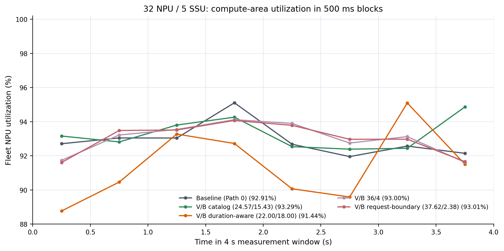
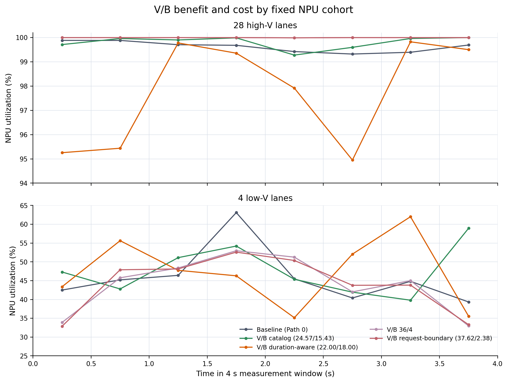
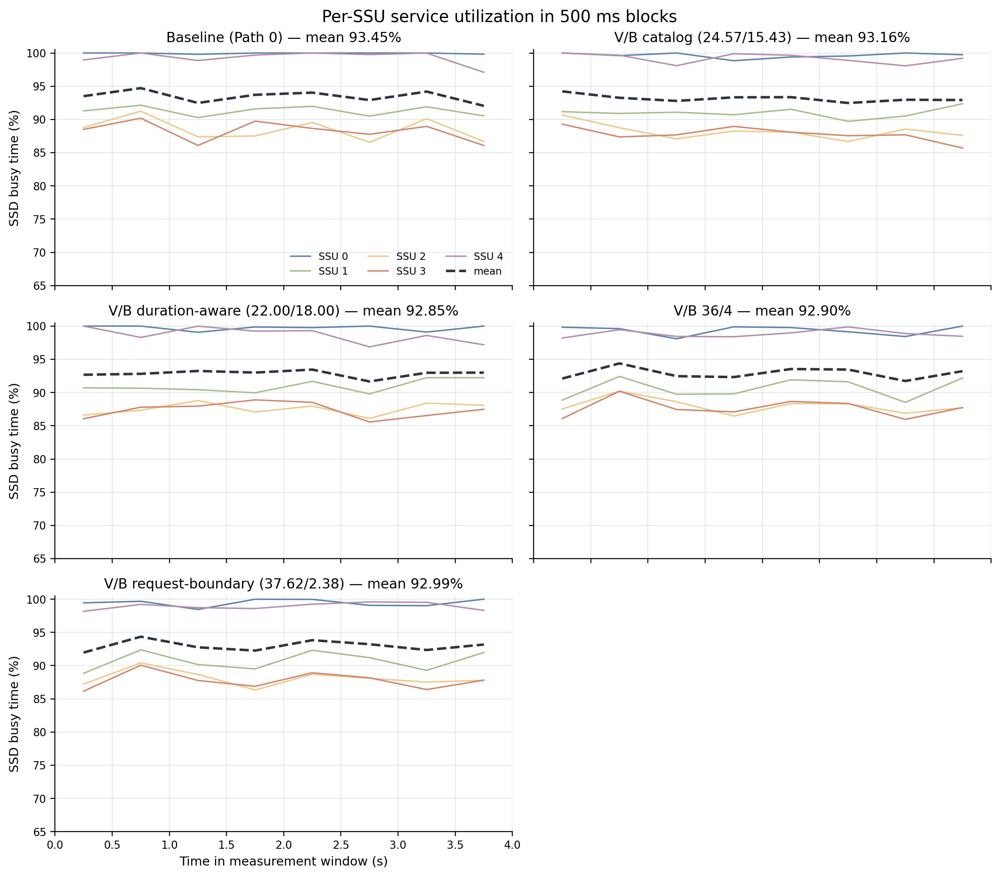
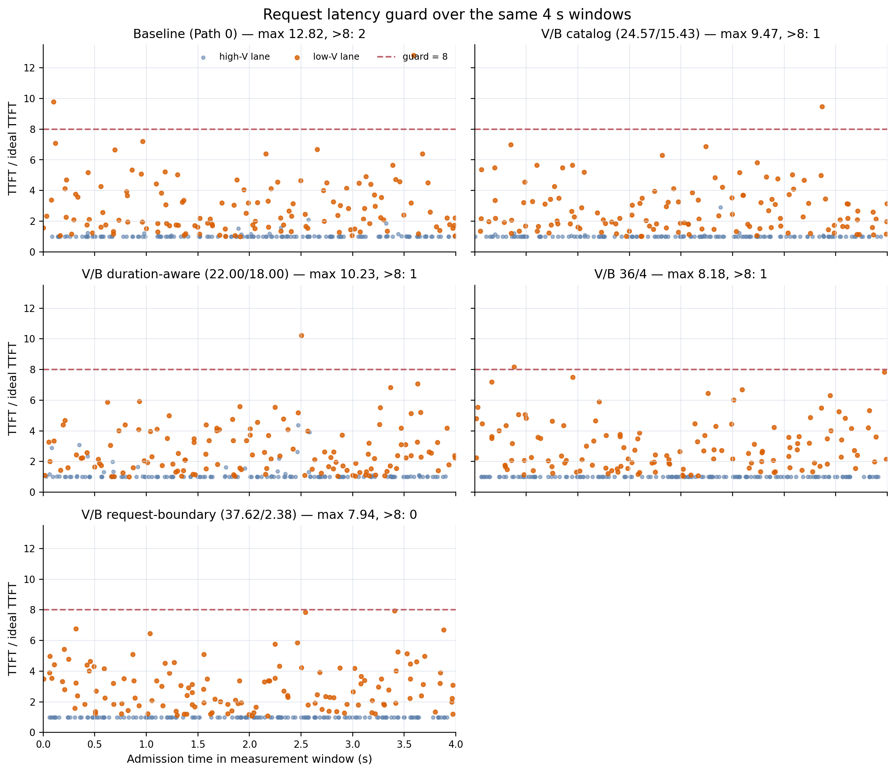

# 32 NPU / 5 SSU：28 个大 V NPU + 4 个小 V NPU 实验报告

## 1. 结论

本次 `seed=42`、warm 后 4 秒实验不支持“28:4 时 V/B 会比 Baseline 好很多”这一预期。

- Baseline 平均 NPU 利用率已经达到 **92.908964%**；28 个大 V NPU 已达到
  **99.623315%**，可优化空间很小。
- 不约束 `TTFT/ideal <= 8` 时，目录公式对应的 V/B（LL/LS =
  24.5676/15.4324 GiB/s）最高，为 **93.285583%**，比 Baseline 高
  **0.376618 个百分点**；但仍有 1 条请求超过 8，最大值为 9.474589。
- 唯一同时满足所有测量请求 `TTFT/ideal <= 8` 且利用率不下降的是
  request-boundary V/B（LL/LS = 37.6191/2.3809 GiB/s）：利用率
  **93.009984%**，只提高 **0.101019 个百分点**。
- 这里只有一个 seed、8 个 500 ms block，而且 +0.101 pp 小于 block 间波动。
  它只能写成“本次观察到的小幅正差”，不能写成已证明的稳定收益。

如果必须满足 `TTFT/ideal <= 8`，本次可选配置是 37.6191/2.3809；但更重要的判断是：
**28:4 让 Baseline 本身接近面积上界，不是展示 V/B 大收益的好 workload。**

## 2. 实验定义

| 项目 | 设置 |
|---|---:|
| NPU / SSU | 32 / 5 |
| 每个 SSU 带宽 | 40 GiB/s |
| 层数 / batch | 16 / 1 |
| master trace | 每 NPU 64 条，共 2,048 条 |
| 随机方式 | 84 个认证画像 IID uniform，seed 42 |
| 固定 cohort | NPU 0--3 小 V；NPU 4--31 大 V |
| 队列深度 | 小 V 每 NPU 216--217 条；大 V 每 NPU 42--43 条 |
| warm-up | 每个 NPU 完成 8 条请求 |
| settle / 测量 | 500 ms / 4,000 ms |
| 时间粒度 | 500 ms，共 8 个 block |
| 延迟约束 | 窗口内 admission 的请求均要求 `TTFT/ideal <= 8` |

大/小 V 使用冻结阈值：

\[
B=D/C,\qquad V=C/B=C^2/D,\qquad V_{cut}=0.00031.
\]

2,048 条请求中有 1,183 条大 V、865 条小 V。先按 `request_id` 排序，再分别
round-robin 到 28 和 4 个固定 NPU。所有策略共享物理请求、placement 和固定布局；
V/B 只额外映射到 LL/LS pool，并启用 `layer_once, TTL=0` 选路。

共同固定布局指纹：

```text
66c60cc004653aafdd1ecb7fd0fe932b74d69cbb4845006c5d98260c26cdf388
```

五个有效 case 使用相同 simulator 和 runner 源码哈希；每个 case 的 31 项 steady-state
invariant 全部通过，32 个 NPU 都有窗口样本，并且没有有限输入耗尽。

## 3. V/B CIR 设置

| case | LL/SSU | LS/SSU | 预算含义 |
|---|---:|---:|---|
| `vb_catalog` | 24.5676 | 15.4324 | 旧公式：`32 * P(high) * E[B|high] / 5 * 1.02` |
| `vb_duration_aware` | 21.9983 | 18.0017 | renewal 均值：`28 * E[D|high]/E[C|high] / 5 * 1.02` |
| `vb_ll36` | 36.0000 | 4.0000 | 经验折中点 |
| `vb_split_aware` | 37.6191 | 2.3809 | `28 * E[B|high] / 5 * 1.02` |

单位均为 GiB/s；每个 SSU 的 LL+LS 恒为 40，没有增加 SSD 总能力。

`E[D]/E[C]` 适合描述无限连续队列的长期平均需求，但本实验也证明：长期均值不是短窗口
deadline 的充分条件。21.9983 配置没有覆盖 SSU 热点、短时 burst 和 cohort 相位聚集；
测量开始时各 SSU outstanding blocks 达到 `[4735, 980, 806, 692, 3954]`，大 V
利用率降到 97.7534%，总体反而下降。

## 4. 有效结果

| 策略 | NPU 利用率 | 相对 Baseline | 大 V 28 NPU | 小 V 4 NPU | SSD 利用率 | 计算面积 NPU·ms | max ratio | >8 |
|---|---:|---:|---:|---:|---:|---:|---:|---:|
| Baseline Path 0 | 92.908964% | 0 | 99.623315% | 45.908511% | 93.450419% | 118,923.475 | 12.824389 | 2 |
| V/B catalog 24.57/15.43 | **93.285583%** | **+0.376618 pp** | 99.800272% | **47.682762%** | 93.164154% | **119,405.546** | 9.474589 | 1 |
| V/B duration-aware 22/18 | 91.437395% | -1.471569 pp | 97.753414% | 47.225266% | 92.853563% | 117,039.866 | 10.230399 | 1 |
| V/B 36/4 | 93.002366% | +0.093402 pp | 99.998793% | 44.027375% | 92.903348% | 119,043.029 | 8.176001 | 1 |
| V/B request-boundary 37.62/2.38 | **93.009984%** | **+0.101019 pp** | **99.998746%** | 44.088644% | 92.989277% | 119,052.779 | **7.935386** | **0** |

约束只针对 4 秒窗口内 admission 的请求，不代表其他 seed。所有违规均来自小 V NPU
上的 `(32,64)` 画像：Baseline 有 9.792318 和 12.824389；catalog 为 9.474589；
duration-aware 为 10.230399；LL=36 为 8.176001；request-boundary 无违规。

## 5. 为什么收益很小

### 5.1 旧结果其实是 18:14，不是 28:4

`VB_EXPERIMENT_REPRODUCTION.md` 中的 `+3.447908 pp` 来自 **18 个大 V NPU + 14 个
小 V NPU**。旧实验的 Baseline 大 V 利用率只有 93.470698%，V/B 可提高到
99.990363%。本次 28:4 下，Baseline 的大 V 已是 99.623315%。

满足 guard 的 37.6191/2.3809 配置可精确分解为：

\[
\frac{28}{32}(99.998746-99.623315)
+\frac{4}{32}(44.088644-45.908511)
=+0.328503-0.227483=+0.101019\ \text{pp}.
\]

策略把大 V 基本推到 100%，但可救回的面积很少；压缩 LS CIR 又损失小 V 面积。

### 5.2 总需求超过容量，但面积上界仍接近 Baseline

对本 trace 用 `sum(D)/sum(C)` 计算全活跃时理想 masking demand：

```text
28 个大 V lane：105.560 GiB/s，约 21.112 GiB/s/SSU
 4 个小 V lane：186.856 GiB/s，约 37.371 GiB/s/SSU
总计：292.417 GiB/s > 5 * 40 = 200 GiB/s
```

不可能让 32 个 NPU 全部 100%。忽略 placement、请求不可分和 burst，先满足 28 个大 V，
再把剩余带宽给小 V，乐观估算为：

\[
U_{optimistic}=\frac{28+4(200-105.560)/186.856}{32}=93.8177\%.
\]

这不是严格数学上界，但说明 Baseline 92.9090% 已接近这一量级。

### 5.3 placement 热点限制有效带宽

Baseline 五个 SSU 利用率为：

```text
99.9526%, 91.2763%, 88.4800%, 88.2481%, 99.2952%
```

SSU0/4 接近满载，SSU1--3 仍有空闲。固定 KV placement 使空闲带宽不能跨 SSU 搬给热点。

### 5.4 NPU 面积增加不要求 SSD busy 增加

request-boundary V/B 比 Baseline 多 129.304 NPU·ms，但 SSD 利用率从 93.4504% 降到
92.9893%。V/B 把有限带宽给每单位 I/O 可释放更多计算面积的请求；它改变服务对象和等待
分布，而不是增加 SSD 能力。

## 6. 4 秒结果的边界

Baseline 前/后 2 秒为 93.4780%/92.3399%；request-boundary V/B 为
93.1708%/92.8491%。它相对 Baseline 的 8 个 block 差值是：

```text
-1.102, +0.437, +0.471, -1.035, +1.105, +1.014, +0.404, -0.486 pp
```

方向并非每个 block 一致。因此能确认“没有大幅收益”和该 seed 下 guard 通过，但不能用
单 seed、4 秒证明长期平均收益稳定大于零。正式统计仍需更长窗口或更多 seed。

## 7. route-only 为什么无有效数字

`route_only` 保留 Baseline 四类 CIR，只把 Path 0 改成 `layer_once, TTL=0`。它把四个
小 V lane 的有限队列全部处理完，触发唯一失败项：

```text
no_backlog_exhaustion = False
completed_by_npu_at_stop[0:4] = [217, 216, 216, 216]
```

其余 30 项 invariant 为真，但输入耗尽会污染稳态利用率，所以 runner 拒绝输出 JSON。
证据保存在 `results/vb_fixed_split_npu32_ssu5_28high_4low_4s/route_only.error.log`。
完成该消融至少需要 128 条/original-NPU backing，并会显著增加运行时间。

## 8. 时序图

### 01：全体 NPU 计算面积利用率



### 02：大 V 与小 V cohort 利用率



### 03：每个 SSU 的服务利用率



### 04：按 admission time 展示 TTFT/ideal



这些是 4 秒 warm measurement 的 500 ms 聚合时序图，不是逐 KV block 的微秒图。连续
实验有数千万事件，把所有 block 画在一张图上不可读；JSON 保留每个 block、NPU、SSU 和
测量请求的数据。

## 9. 复现

```bash
for case in baseline vb_catalog vb_duration_aware vb_ll36 vb_split_aware; do
  python run_vb_fixed_split_npu32_ssu5_experiment.py \
    --case "$case" --requests-per-npu 64 --measurement-ms 4000 --block-ms 500 \
    --output-dir results/vb_fixed_split_npu32_ssu5_28high_4low_4s
done

MPLBACKEND=Agg python plot_vb_fixed_split_npu32_ssu5_4s.py
```

核心文件：

- `run_vb_fixed_split_npu32_ssu5_experiment.py`：matched trace、28:4 lane 和仿真；
- `vb_pool_policy.py`：LL/LS Path 表与 V/B 分类；
- `plot_vb_fixed_split_npu32_ssu5_4s.py`：01--04 PNG/PDF 与 `summary.csv`；
- `results/vb_fixed_split_npu32_ssu5_28high_4low_4s/*.json`：完整原始结果。

共同源码哈希：

```text
runner               d9d9523916f98a51cbb0002789be97be73f3f5989af768b5861fc05a8b42c747
continuous_batch_sim c652bfb22fb6c3d219d7b8f78e172ca5808c55c5e929547ece5da0680129f9b1
vb_pool_policy       cd0dc354a8322301f761fea296e1bee8611cc29a62a9ede7c785525b3a3e41e9
data                  fd197b79865b4c1f42d400100c5e05349ca1ba5f2d42b904af8a1759aabeb04b
```

## 10. 实际部署含义

固定 28:4 是人为 cohort。真实实现还要计入请求迁移、KV locality、NPU 负载均衡和 cohort
比例变化。毫秒级读取 SSU Path pressure、在 admission/layer 边界选 Path、低频修改 CIR
在接口上可实现；但本结果不支持为了 +0.101 pp 立即引入复杂动态控制。更合理的下一步是
用 128 backing 完成 route-only 消融，判断收益主要来自多 Path 去 HOL，还是 LL/LS 分池。
