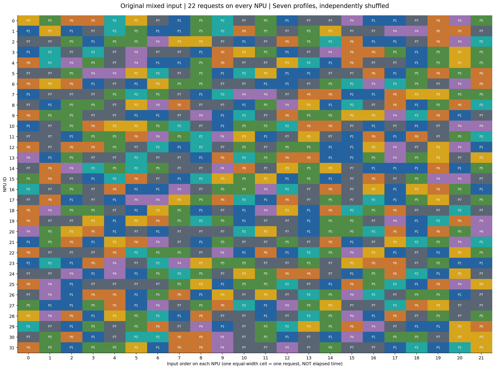
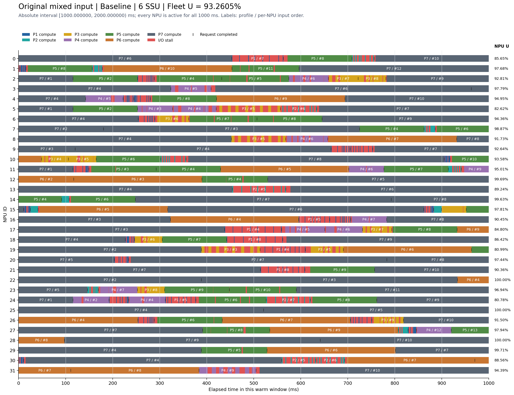
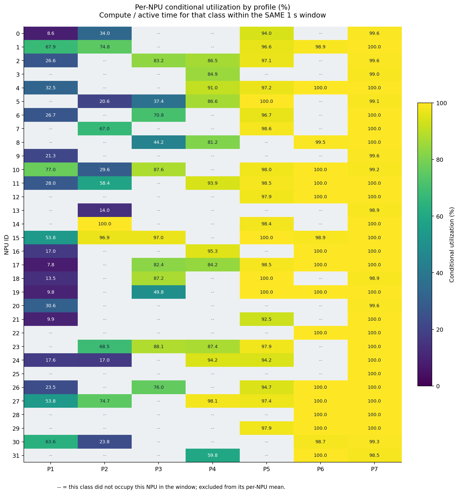
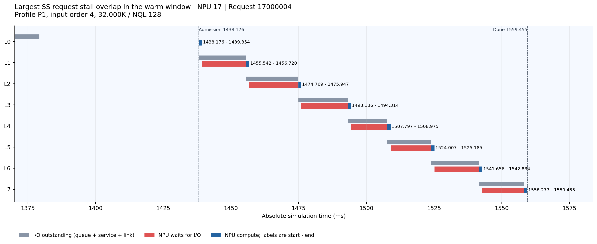

# 原 Baseline 高利用率不等于短请求服务良好：输入与 1 秒时序反证

日期：2026-09-07。本文复核 `baseline_npu32_investigation` 所分析的原 coflow 六盘案例，不重新构造输入、不重跑仿真、不改变请求顺序。

## 要反驳的结论

**“Baseline 整机利用率很高，因此各类请求都没有明显 I/O 等待”不成立。** 本案例的 93.2605% 是正确的设备时间统计；错误在于把它推广成短请求的服务结论。也不能因为短类计算比低，就反过来把整机实际高利用率说成计算错误。

这里长短请求确实在**每张 NPU 的同一串行请求队列中混排**，并非若干卡专跑短流。只把整机均值改为“先逐卡算，再平均”不会解决掩盖，因为原代码本来就这样计算。

## 1. 精确输入：每卡 22 条，32 卡共 704 条

案例：`npu32_ssu6_arrival218_seed20260906_baseline`；32 NPU、6 SSU、每盘40 GiB/s、每卡接收链路50 GiB/s；每请求8层、batch=1，单层及跨请求L0预取；Baseline-only，seed=20260906。

NPU0–31 **每一张卡**都具有下表相同配额，卡内顺序各自独立打乱。P1:P2:P3:P4:P5:P6:P7 = **4:2:2:2:4:3:5**。

| 画像 | 序列/NQL | 类别 | 每卡请求数 | 32卡请求数 | 每层计算 ms | 每层读取 MiB | V/C GiB/s |
|---|---|---|---|---|---|---|---|
| P1 | 32K / 128 | SS | 4 | 128 | 1.178026 | 43.828125 | 36.332734 |
| P2 | 32K / 256 | SS | 2 | 64 | 1.997480 | 43.656250 | 21.343424 |
| P3 | 64K / 512 | SL | 2 | 64 | 6.386487 | 87.312500 | 13.351019 |
| P4 | 96K / 512 | LL | 2 | 64 | 9.070842 | 131.312500 | 14.137041 |
| P5 | 192K / 512 | LL | 4 | 128 | 17.123906 | 263.312500 | 15.016498 |
| P6 | 192K / 1024 | LL | 3 | 96 | 34.100782 | 262.625000 | 7.520934 |
| P7 | 192K / 2048 | LL | 5 | 160 | 68.056186 | 261.250000 | 3.748769 |

类别使用原仿真器的两个维度，不是按本次请求是否等待来分类：

| 类别 | 总序列长度 | NQL |
|---|---|---|
| SS | ≤80K | <512 |
| SL | ≤80K | ≥512 |
| LS | >80K | <512 |
| LL | >80K | ≥512 |

第一位表示序列长短，第二位表示 NQL 大小。`1K=1024 token`。类别只是画像分类；Baseline 在每个 SSU 均走本盘的 Path0 FIFO，不按这四类分配四条路径。

每卡按模拟器类别计数为 **SS:SL:LS:LL = 6:2:0:14**；全体为 **192:64:0:448**。如果把32K当短、192K当长，则还有64K与96K两种中间画像，不能将七画像偷偷合成一个没有定义的二分类。

**历史输入存在同卡重复画像**，例如每卡有5条192K/NQL2048。本文保留该历史事实；新低利用率文档使用的是每卡画像不重复的另一组输入，两者不能混称。

请求归属精确规则：`request_id = npu_id × 1,000,000 + input_order`，`input_order=0..21`。例如 request 17000004 是 NPU17 的第5条输入。完整704条、参数与所有时间见 [all_inputs_and_times.csv.gz](data/high/all_inputs_and_times.csv.gz)。

每卡前4条的 arrival=0，共128条；其余576条按原 coflow 到达时钟入队，最后一条 arrival=3538.929294 ms。arrival、admission、first_layer_io_start、completion 均分别保存，未套用新实验的全0到达时钟。

图1：全部32卡的完整22请求顺序。每格等宽表示一条输入的位置，不是执行时长；P1–P7与上表一一对应。

## 2. 为什么时间均值高：计算预算与占用份额都偏向长计算请求

SS占完整输入请求数27.2727%，但只占完整输入纯计算时间的 **1.5811%**；这是完整704请求的统计，不是warm分母。原near配额为了满足平均盘容量条件，增加了NQL2048长计算请求，因此这组人工输入的难度与固定短卡坏例不同，不能称作生产trace。

在本秒实际时间账中，SS只占 **6.0010%** 的NPU占用时间；P7单独占 **59.6307%**，其中 **99.6879%** 都在计算。这才是“高均值掩盖短类等待”的直接窗口证据，不能把完整输入纯计算占比拿来代替窗口占用占比。

## 统计口径：把“逐卡平均”和“按时间合并”分开

所有下列利用率都只使用指定的同一个 1 秒窗口 `[a,b)`，边界事件按实际重叠时长裁剪，不只统计窗口内完成的请求。

- 整机利用率：每卡在窗口内的计算时间除以 1000 ms，再对 32 卡等权平均。等待 I/O 计入分母。
- 逐卡、逐类条件利用率：令 `Cᵢ,g` 为卡 i 处理类别 g 的计算时长，`Aᵢ,g` 为其处理该类的占用时长（计算＋等待），则 `Uᵢ,g=Cᵢ,g/Aᵢ,g`。先逐卡算，再对窗口内确实出现该类的卡等权平均。
- 合并时间条件利用率：`U_g=ΣCᵢ,g/ΣAᵢ,g`。这是按该类占用时长加权的结果，不等同于上项逐卡等权平均。
- 表中 `—` 表示该卡在这一秒没有运行该类，条件利用率无分母；不能填成 0，也不意味着完整输入中没有该类。

\[
\bar U=\frac1{32}\sum_i\frac{C_i}{1000}
=\sum_g\underbrace{\frac{\sum_iA_{i,g}}{32000}}_{该类占用的卡时间份额}
\underbrace{\frac{\sum_iC_{i,g}}{\sum_iA_{i,g}}}_{合并时间条件利用率}.
\]

上式的类别求和只包括 `ΣᵢAᵢ,g>0` 的类别；没有占用时间的类别不参与。

所有卡在观测窗口全程有已接纳请求，故这几组的 `compute+stall=1000 ms/卡`、idle=0。“已接纳”与“外部已到达”是两个时刻；跨请求 L0 预取可早于接纳。

## 3. 原始事件绘制的 1 秒时序图

固定窗口 **[1000.000000, 2000.000000) ms**。共有183条请求与窗口重叠，151条在窗口完成；这两个数都不等于完整输入704条。

图2：全部32张NPU的同一秒。横轴是相对窗口起点的0–1000ms；绝对时间=1000ms+横轴。彩色条为对应P画像的计算，红色为等待I/O，黑色短竖线为请求完成；右侧为逐卡整秒利用率。

长块标注 `P7 / #6` 的含义是P7画像、该卡第7条输入（序号从0起）；较窄请求不堆叠文字，全部完成时间和层边界在CSV中。横条上反复出现P7/P6而短请求成为较窄的红段，说明掩盖已经发生在每张卡内部。图并未省略任何与窗口重叠的计算事件。

可手算：所有卡计算合计 **29843.348635 NPU-ms**，等待合计 **2156.651365 NPU-ms**，两者之和32000；整机U=`29843.348635/32000`=93.2605%。

## 4. 同一秒的逐类别、逐画像利用率

下表“先逐卡算再平均”对应你提出的口径；“合并时间计算比”用于还原整机的时间账。两者都不是“每请求等权平均”。

| 类别/画像 | 完整输入条数 | 该秒出现卡数 | 先逐卡算再平均 | 合并时间计算比 | 占全部卡时间 |
|---|---|---|---|---|---|
| SS | 192 | 24 | 35.0646% | 25.1808% | 6.0010% |
| SL | 64 | 11 | 73.0651% | 66.9992% | 3.3363% |
| LS | 0 | 0 | — | — | 0.0000% |
| LL | 448 | 32 | 98.7102% | 98.7330% | 90.6628% |

SS只有24张卡在该秒出现，SL只有11张，LL有32张；因此分别使用24、11、32作逐卡条件平均的卡数，不能一律除32或给缺失格填0。

| 类别/画像 | 完整输入条数 | 该秒出现卡数 | 先逐卡算再平均 | 合并时间计算比 | 占全部卡时间 |
|---|---|---|---|---|---|
| P1 | 128 | 19 | 31.0248% | 19.7753% | 3.8535% |
| P2 | 64 | 13 | 52.2517% | 34.8805% | 2.1475% |
| P3 | 64 | 11 | 73.0651% | 66.9992% | 3.3363% |
| P4 | 64 | 12 | 86.9222% | 86.4285% | 4.1252% |
| P5 | 128 | 21 | 97.4346% | 97.2501% | 13.3137% |
| P6 | 96 | 17 | 99.7590% | 99.7310% | 13.5931% |
| P7 | 160 | 32 | 99.7190% | 99.6879% | 59.6307% |

图3：每张NPU × 七种画像的条件利用率，所有格子都来自图2同一秒。灰格“--”表示该秒没有对应画像，不是0%。颜色刻度0–100%，格内标出数值。

### 每张 NPU 的整秒与分类利用率

| NPU | 整秒 U | SS 条件 U | SL 条件 U | LS 条件 U | LL 条件 U |
|---|---|---|---|---|---|
| 0 | 85.6528% | 16.1710% | — | — | 98.6025% |
| 1 | 97.6777% | 71.8596% | — | — | 98.6694% |
| 2 | 92.8122% | 26.6169% | 83.2386% | — | 96.9924% |
| 3 | 97.7887% | — | — | — | 97.7887% |
| 4 | 94.9540% | 32.4570% | — | — | 98.8070% |
| 5 | 82.6166% | 20.6495% | 37.4051% | — | 96.5739% |
| 6 | 94.3577% | 26.6630% | 70.8218% | — | 98.9409% |
| 7 | 98.8727% | 66.9588% | — | — | 99.6529% |
| 8 | 91.7314% | — | 44.1945% | — | 97.9453% |
| 9 | 92.6444% | 21.3035% | — | — | 99.5690% |
| 10 | 93.5835% | 38.3842% | 87.6210% | — | 98.9049% |
| 11 | 95.0058% | 41.6091% | — | — | 98.4779% |
| 12 | 99.6875% | — | — | — | 99.6875% |
| 13 | 89.2445% | 14.0075% | — | — | 98.9329% |
| 14 | 99.6281% | 100.0000% | — | — | 99.6221% |
| 15 | 97.8056% | 74.6801% | 96.9974% | — | 99.6433% |
| 16 | 90.4530% | 17.0247% | — | — | 99.5945% |
| 17 | 84.8017% | 7.7707% | 82.4336% | — | 96.4197% |
| 18 | 86.4243% | 13.5077% | 87.1859% | — | 99.0574% |
| 19 | 80.9896% | 9.7841% | 49.7512% | — | 100.0000% |
| 20 | 97.4411% | 30.6335% | — | — | 99.5616% |
| 21 | 90.3597% | 9.9492% | — | — | 98.7734% |
| 22 | 100.0000% | — | — | — | 100.0000% |
| 23 | 96.9384% | 68.5098% | 88.0736% | — | 98.2199% |
| 24 | 80.7769% | 17.2947% | — | — | 96.7847% |
| 25 | 100.0000% | — | — | — | 100.0000% |
| 26 | 91.4964% | 23.5380% | 75.9934% | — | 99.1007% |
| 27 | 97.9362% | 65.3213% | — | — | 99.2559% |
| 28 | 100.0000% | — | — | — | 100.0000% |
| 29 | 99.7057% | — | — | — | 99.7057% |
| 30 | 88.5638% | 26.8555% | — | — | 99.0564% |
| 31 | 94.3852% | — | — | — | 94.3852% |

## 5. 层间错位不能保证下一层不堵

按预先说明的规则，选择“本秒内SS请求等待重叠时间最大”的一条作为放大例：NPU17、request `17000004`，输入序号4。这是最坏请求示例，不能把它的比例当总体均值。

图4：该真实请求的8层事件。灰色是I/O发出至就绪的总历时（包含排队、服务和链路），不是SSD独占服务；蓝色是计算，红色是NPU实际等待。图使用绝对毫秒，文字标出计算起止。

| 层 | 发出 I/O ms | I/O 就绪 ms | 计算开始 ms | 计算结束 ms | 该层 NPU 等待 ms |
|---|---|---|---|---|---|
| 0 | 1370.120110 | 1379.272558 | 1438.176296 | 1439.354322 | 0.000000 |
| 1 | 1438.176296 | 1455.542090 | 1455.542090 | 1456.720116 | 16.187767 |
| 2 | 1455.542090 | 1474.768927 | 1474.768927 | 1475.946953 | 18.048811 |
| 3 | 1474.768927 | 1493.135550 | 1493.135550 | 1494.313576 | 17.188597 |
| 4 | 1493.135550 | 1507.796957 | 1507.796957 | 1508.974983 | 13.483382 |
| 5 | 1507.796957 | 1524.006750 | 1524.006750 | 1525.184776 | 15.031767 |
| 6 | 1524.006750 | 1541.655829 | 1541.655829 | 1542.833855 | 16.471052 |
| 7 | 1541.655829 | 1558.276846 | 1558.276846 | 1559.454872 | 15.442991 |

此请求接纳到完成 121.278576 ms，8 层纯计算 9.424208 ms，I/O 等待 111.854368 ms，计算比 7.7707%。这是单个明确标出的请求，不代替全体平均。

这条请求L1–L7连续存在等待，直接反驳“第N层堵过后，N+1层必然因错位而清空”。相位移动会改变后续竞争，有时缓解、有时复发；这张图不能单独估算错位对整机U的因果贡献。

## 6. 全部32卡的输入序列（可与图1和请求ID逐项对应）

| NPU | 输入序号0→21的画像顺序 |
|---|---|
| 0 | P3 P5 P6 P6 P2 P3 P7 P1 P5 P2 P7 P5 P1 P7 P7 P4 P1 P1 P7 P6 P4 P5 |
| 1 | P1 P3 P1 P7 P2 P5 P1 P1 P5 P2 P6 P5 P7 P5 P3 P7 P7 P4 P4 P6 P6 P7 |
| 2 | P7 P7 P5 P1 P5 P5 P4 P3 P3 P7 P1 P7 P6 P5 P2 P6 P1 P1 P7 P6 P4 P2 |
| 3 | P1 P2 P7 P2 P7 P4 P7 P7 P1 P6 P3 P5 P1 P7 P4 P6 P6 P5 P1 P5 P3 P5 |
| 4 | P6 P2 P4 P5 P7 P4 P1 P1 P5 P6 P7 P7 P3 P2 P1 P6 P7 P7 P1 P5 P3 P5 |
| 5 | P7 P7 P5 P4 P4 P3 P2 P7 P5 P1 P2 P3 P1 P1 P7 P7 P6 P1 P5 P6 P5 P6 |
| 6 | P6 P3 P6 P1 P7 P1 P3 P5 P5 P7 P7 P1 P1 P7 P5 P2 P4 P2 P5 P7 P4 P6 |
| 7 | P1 P7 P7 P7 P5 P2 P5 P7 P1 P2 P4 P4 P7 P6 P6 P1 P1 P6 P3 P3 P5 P5 |
| 8 | P7 P1 P5 P5 P7 P3 P4 P6 P7 P7 P1 P5 P4 P3 P1 P2 P7 P6 P1 P5 P6 P2 |
| 9 | P6 P5 P5 P7 P7 P1 P1 P7 P4 P1 P2 P7 P6 P5 P5 P3 P3 P4 P2 P6 P1 P7 |
| 10 | P1 P7 P5 P6 P3 P3 P5 P2 P7 P1 P5 P5 P2 P6 P6 P7 P1 P7 P1 P7 P4 P4 |
| 11 | P7 P7 P1 P5 P5 P6 P4 P5 P2 P4 P3 P1 P7 P3 P7 P1 P6 P1 P6 P7 P5 P2 |
| 12 | P6 P7 P6 P6 P5 P7 P2 P1 P2 P7 P5 P7 P5 P5 P1 P1 P3 P4 P7 P3 P4 P1 |
| 13 | P4 P1 P5 P7 P7 P2 P7 P7 P1 P6 P2 P5 P6 P6 P1 P1 P5 P4 P5 P3 P7 P3 |
| 14 | P7 P6 P4 P2 P5 P2 P5 P7 P7 P4 P6 P7 P3 P5 P3 P7 P1 P1 P1 P6 P1 P5 |
| 15 | P5 P6 P7 P1 P2 P6 P7 P1 P2 P3 P5 P3 P1 P5 P1 P7 P6 P7 P5 P4 P4 P7 |
| 16 | P2 P7 P5 P7 P6 P1 P1 P4 P7 P5 P5 P4 P2 P7 P6 P7 P3 P1 P3 P6 P5 P1 |
| 17 | P7 P6 P1 P7 P1 P4 P4 P3 P5 P6 P2 P1 P6 P7 P5 P7 P2 P1 P5 P3 P7 P5 |
| 18 | P6 P4 P5 P5 P7 P1 P3 P5 P1 P7 P1 P4 P3 P1 P6 P2 P5 P6 P7 P7 P2 P7 |
| 19 | P6 P7 P7 P3 P1 P3 P6 P5 P2 P5 P1 P7 P7 P1 P5 P5 P7 P4 P1 P2 P6 P4 |
| 20 | P4 P5 P3 P6 P1 P7 P1 P7 P7 P7 P2 P3 P7 P1 P5 P5 P2 P6 P1 P6 P5 P4 |
| 21 | P1 P5 P6 P1 P3 P6 P4 P7 P1 P5 P7 P7 P5 P7 P6 P1 P7 P3 P2 P5 P4 P2 |
| 22 | P6 P7 P7 P7 P6 P2 P5 P5 P7 P4 P1 P6 P1 P2 P5 P4 P3 P1 P7 P1 P3 P5 |
| 23 | P1 P2 P1 P6 P4 P7 P2 P4 P3 P5 P5 P7 P7 P5 P7 P3 P6 P6 P7 P5 P1 P1 |
| 24 | P7 P7 P4 P1 P4 P1 P5 P2 P5 P7 P3 P5 P6 P6 P7 P1 P5 P6 P2 P1 P3 P7 |
| 25 | P6 P4 P1 P7 P7 P7 P7 P5 P3 P1 P5 P5 P2 P7 P1 P6 P5 P2 P1 P6 P4 P3 |
| 26 | P7 P4 P1 P6 P6 P1 P5 P6 P1 P3 P7 P3 P7 P2 P5 P4 P2 P7 P5 P5 P1 P7 |
| 27 | P5 P1 P1 P5 P6 P1 P4 P7 P5 P6 P2 P1 P4 P5 P3 P7 P7 P2 P6 P3 P7 P7 |
| 28 | P3 P4 P6 P1 P3 P5 P2 P1 P6 P7 P7 P1 P7 P2 P5 P4 P1 P6 P7 P5 P7 P5 |
| 29 | P2 P7 P1 P5 P7 P5 P6 P7 P4 P1 P7 P5 P2 P3 P5 P6 P4 P7 P1 P1 P3 P6 |
| 30 | P7 P5 P6 P1 P7 P2 P2 P6 P6 P4 P7 P5 P1 P7 P1 P4 P1 P5 P5 P7 P3 P3 |
| 31 | P6 P5 P1 P5 P5 P3 P1 P6 P6 P4 P7 P7 P4 P7 P5 P7 P7 P1 P2 P1 P2 P3 |

## 数据与复核范围

本次没有新仿真。原native结果、精确manifest与冻结源码分别校验哈希，704请求身份和全部卡内顺序匹配；两套独立重聚合均得到相同逐卡整秒U。完整记录见 [源数据审计](audits/high_source_audit.json)、[统计结果](data/high/statistics.json)、[逐请求窗口账](data/high/warm_requests.csv)、[逐层时刻](data/high/warm_layers.csv.gz)、[逐卡逐类别表](data/high/per_npu_category.csv)。所有CSV的utilization字段以0–1保存，本文百分比乘100。

本例支持“高设备利用率不代表短请求服务好”，不支持“Baseline的设备利用率实际很低”。该一秒也不证明所有窗口或业务分布相同。

来源：

- [调查报告](https://github.com/chguo0503/qos_storage_sim/blob/main/results/baseline_npu32_investigation/docs/report.md)
- [原Baseline结果](https://github.com/chguo0503/qos_storage_sim/blob/f18ac08991c6449aa7700052e3125cc162d2bca3/results/coflow_global_5ms_experiments/data/formal_results/npu32_ssu6_arrival218_seed20260906_baseline.json)
- [原精确输入manifest](https://github.com/chguo0503/qos_storage_sim/blob/f18ac08991c6449aa7700052e3125cc162d2bca3/results/coflow_global_5ms_experiments/data/formal_results/inputs/4415bef488bc4a3805e94d3e9bc98169dd463c3400f4bc1750d7305534b4463d.json)
- [冻结分类源码](https://github.com/chguo0503/qos_storage_sim/blob/f18ac08991c6449aa7700052e3125cc162d2bca3/results/coflow_global_5ms_experiments/data/formal_results/source_versions/5f3a9bb82c5740a86c9c916e01495326a0bf4363fb6a5312cb99ac747e8600fd/sim.py)
- [冻结输入配额代码](https://github.com/chguo0503/qos_storage_sim/blob/f18ac08991c6449aa7700052e3125cc162d2bca3/results/coflow_global_5ms_experiments/data/formal_results/source_versions/e1147311dabbe3117300fbdfdf56c39748771cc3f37ea07d085bb76166464d22/run_shared_path_experiments.py)
- [冻结coflow到达时钟代码](https://github.com/chguo0503/qos_storage_sim/blob/f18ac08991c6449aa7700052e3125cc162d2bca3/results/coflow_global_5ms_experiments/data/formal_results/source_versions/9c6a435a87903ddb8d0c02789088b1f58eb8ab6bc017964ae049bb0afd36edb3/run_coflow_experiments.py)
