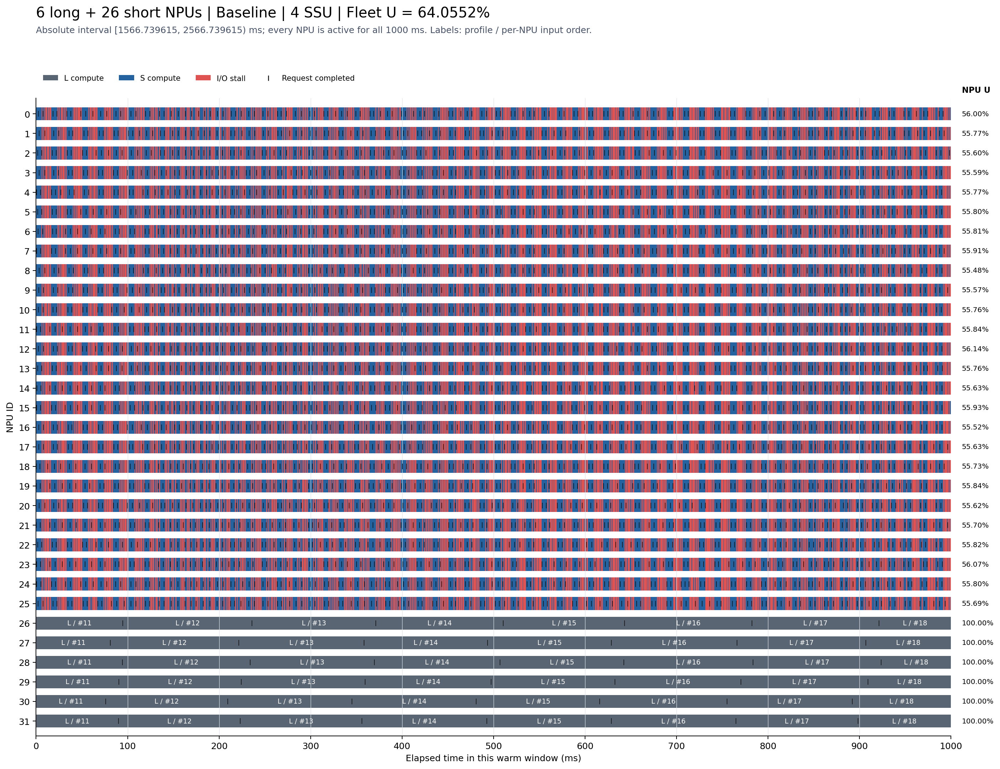
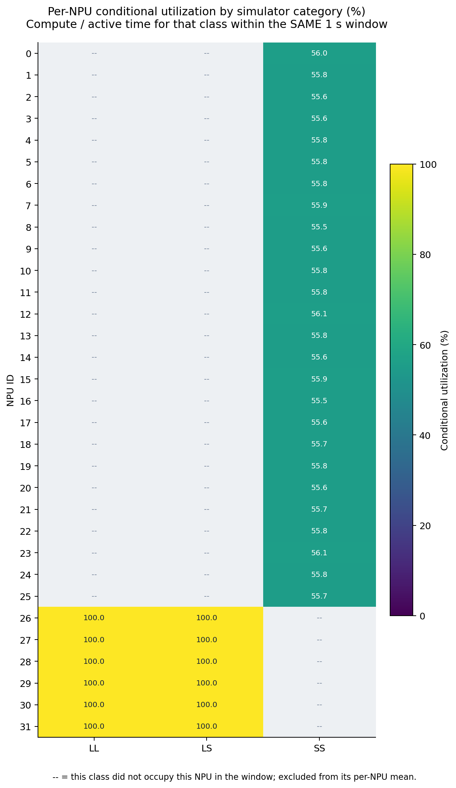
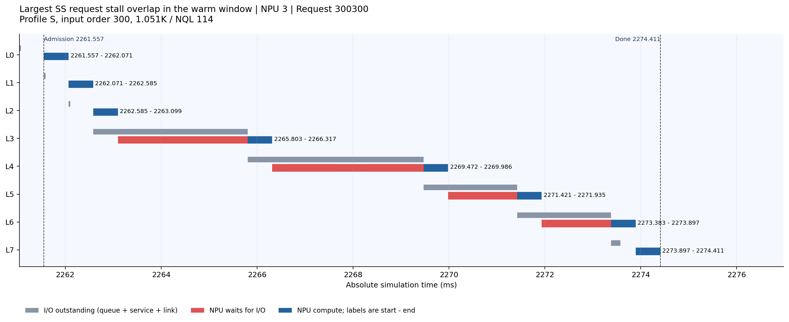
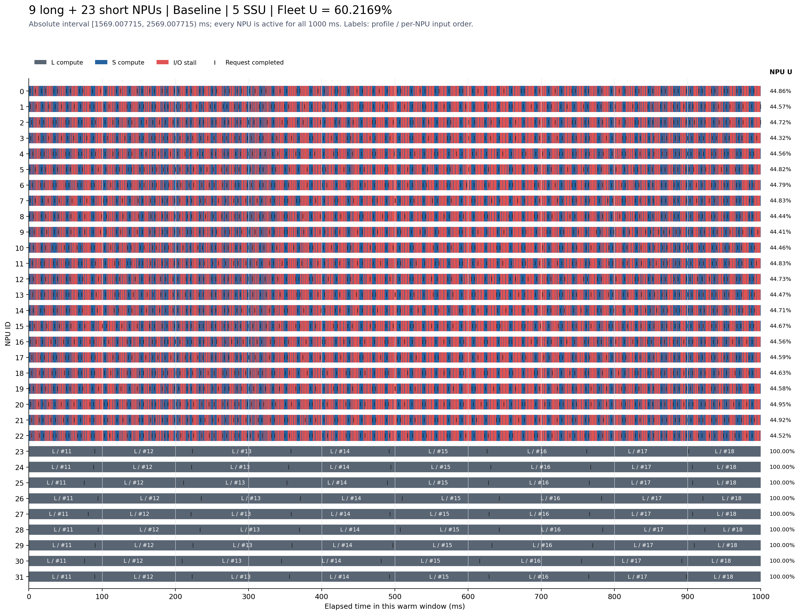
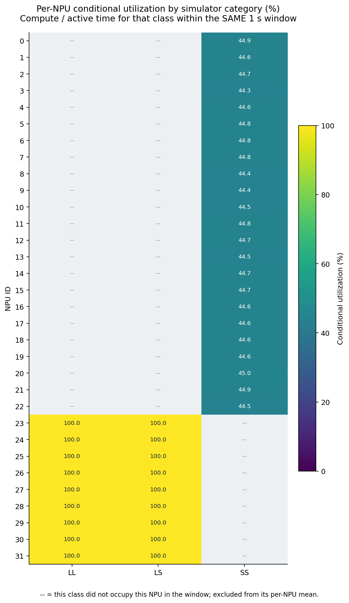
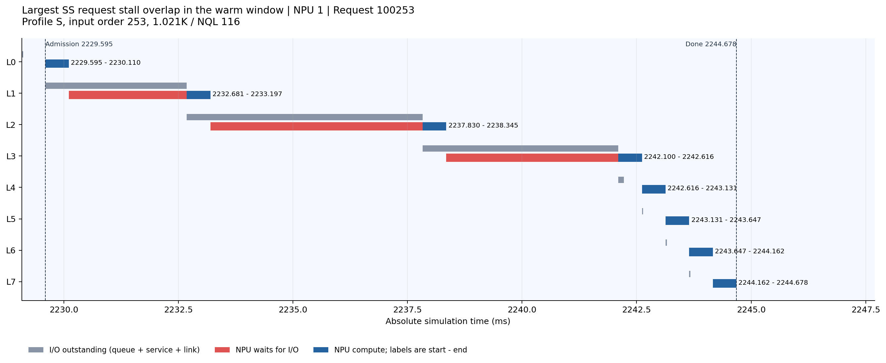
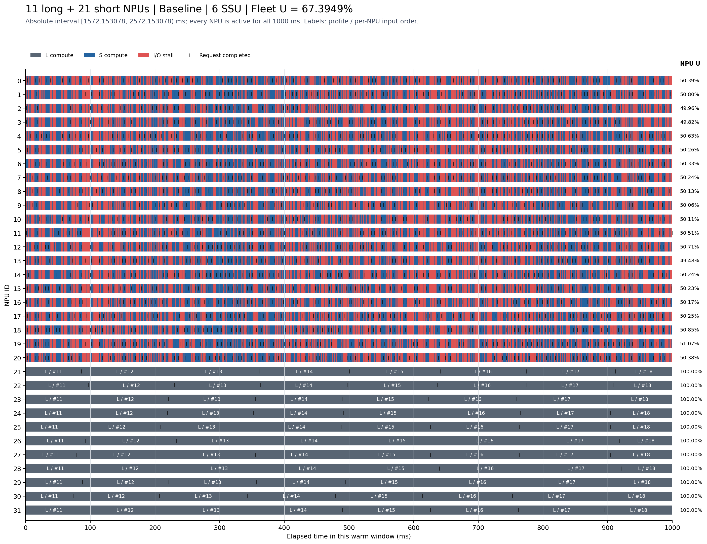
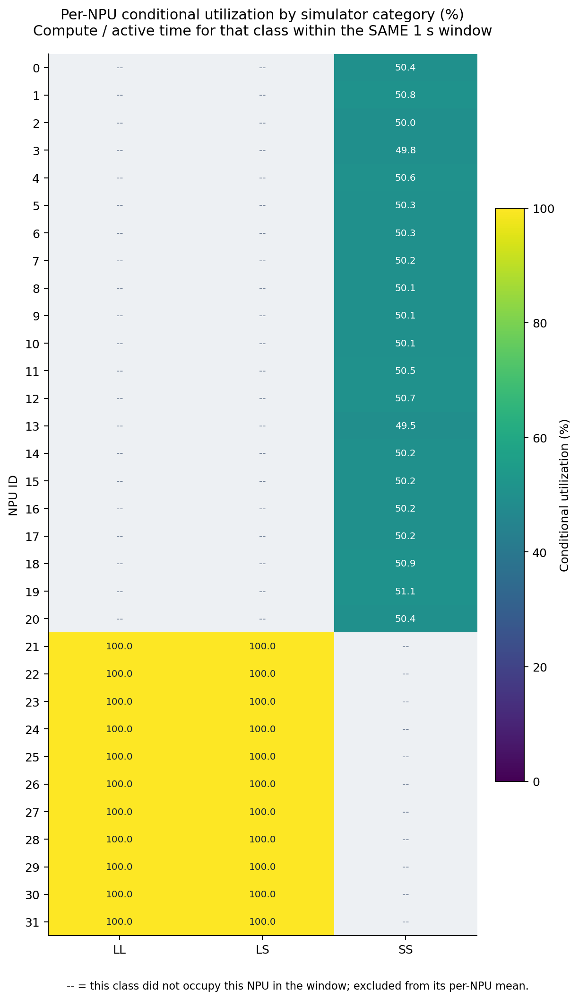
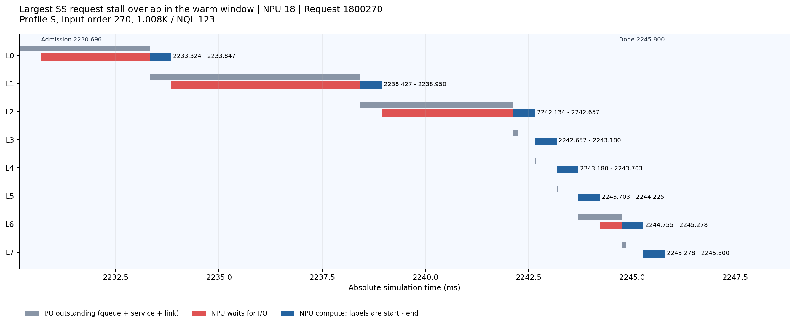

# 什么输入使 Baseline 利用率低：精确绑定、数量、类别与 1 秒时序

日期：2026-09-07。本报告重聚合此前已完成的三个32-NPU Baseline边界案例，不新增或重跑仿真。

## 结论与适用范围

少数长流卡持续发出大层读取，多数短流卡的计算窗口又很短时，短流等待可以进入整机均值。本组固定画像族、固定卡绑定与seed下，4/5/6 SSU分别在 **6长:26短、9长:23短、11长:21短** 得到64.0552%、60.2169%、67.3949%的整机利用率；长流仍100%。

这些点通过“完整输入理想平均需求不超过最热盘40GiB/s”的筛选。它排除了持续平均容量超额，不证明每个瞬时deadline可满足，也不证明全部损失都能由另一调度策略消除。比例不是适用于任意画像的常数。

与第一份文档相比，本例改变了输入画像和固定分离/混排方式；它们是不同输入的机制实例，不能当作同输入算法优劣对照。

## 1. 请求类别与精确输入构造

类别使用原仿真器的两个维度，不是按本次请求是否等待来分类：

| 类别 | 总序列长度 | NQL |
|---|---|---|
| SS | ≤80K | <512 |
| SL | ≤80K | ≥512 |
| LS | >80K | <512 |
| LL | >80K | ≥512 |

第一位表示序列长短，第二位表示 NQL 大小。`1K=1024 token`。类别只是画像分类；Baseline 在每个 SSU 均走本盘的 Path0 FIFO，不按这四类分配四条路径。
| 族名 | 含义 | 实际总token范围¹ | 实际NQL范围¹ | 模拟器类别 | 每层计算ms¹ | 每层读取MiB¹ |
|---|---|---|---|---|---|---|
| S | 短族，约1K/NQL128 | 960–1088 | 112–144 | SS | 0.509658–0.550550 | 1.095703–1.310547 |
| L | 长族，约192K/NQL512 | 196480–196608 | 496–528 | LL/LS | 16.590793–17.654434 | 263.128540–263.329956 |

¹表中数值范围从4-SSU案例实际输入读取；各卡逐请求精确值均在对应输入CSV。生成候选池短族为token960–1088/NQL112–144，长族为token196480–196608/NQL496–528。长族跨NQL512边界，因而同时包含LS和LL，不能把全部长族直接标为LL。

**1K短族的计算时间由原data的32K/48K向外推，长族邻近值使用插值；这是一组合成机制输入，不是硬件实测1K画像，也不是生产trace。** 每请求8层、batch=1；每SSU40GiB/s，每NPU接收链路50GiB/s；Baseline每盘独立Path0 FIFO，一层预取并启用跨请求L0预取，seed=20260907。

每卡准备约5秒纯计算工作量的有限有序backlog，故短卡有约1182条、长卡37条，不能把卡数比写成请求条数比。每卡内部 `(total_tokens,NQL)` 不重复；各卡输入顺序固定，跨不同SSU数时同角色同卡序列保持不变。跨卡仍可出现相同参数。

所有 `arrival_ms=0`；实际接纳、L0 I/O与完成时间另记。未运行到的未来请求保留空时刻，不把它们当作已经完成。

### 三个案例的精确卡绑定与完整请求人口

| SSU | 短族NPU | 长族NPU | 长:短卡数 | 长:短请求条数 | 输入总条数 | SS条数 | LS条数 | LL条数 | 最热盘理想GiB/s |
|---|---|---|---|---|---|---|---|---|---|
| 4 | 0–25 | 26–31 | 6:26 | 222:30737 | 30959 | 30737 | 105 | 117 | 38.775901 |
| 5 | 0–22 | 23–31 | 9:23 | 333:27189 | 27522 | 27189 | 159 | 174 | 39.841274 |
| 6 | 0–20 | 21–31 | 11:21 | 407:24826 | 25233 | 24826 | 190 | 217 | 38.757173 |

三例均无SL。请求归属精确规则：`request_id=npu_id×100000+input_order`，每卡序号从0连续递增。各卡的ID区间与请求数在后文全部列出；区间内每一个整数都对应该卡的一条请求，具体参数和时间见完整CSV。

## 统计口径：把“逐卡平均”和“按时间合并”分开

所有下列利用率都只使用指定的同一个 1 秒窗口 `[a,b)`，边界事件按实际重叠时长裁剪，不只统计窗口内完成的请求。

- 整机利用率：每卡在窗口内的计算时间除以 1000 ms，再对 32 卡等权平均。等待 I/O 计入分母。
- 逐卡、逐类条件利用率：令 `Cᵢ,g` 为卡 i 处理类别 g 的计算时长，`Aᵢ,g` 为其处理该类的占用时长（计算＋等待），则 `Uᵢ,g=Cᵢ,g/Aᵢ,g`。先逐卡算，再对窗口内确实出现该类的卡等权平均。
- 合并时间条件利用率：`U_g=ΣCᵢ,g/ΣAᵢ,g`。这是按该类占用时长加权的结果，不等同于上项逐卡等权平均。
- 表中 `—` 表示该卡在这一秒没有运行该类，条件利用率无分母；不能填成 0，也不意味着完整输入中没有该类。

\[
\bar U=\frac1{32}\sum_i\frac{C_i}{1000}
=\sum_g\underbrace{\frac{\sum_iA_{i,g}}{32000}}_{该类占用的卡时间份额}
\underbrace{\frac{\sum_iC_{i,g}}{\sum_iA_{i,g}}}_{合并时间条件利用率}.
\]

上式的类别求和只包括 `ΣᵢAᵢ,g>0` 的类别；没有占用时间的类别不参与。

所有卡在观测窗口全程有已接纳请求，故这几组的 `compute+stall=1000 ms/卡`、idle=0。“已接纳”与“外部已到达”是两个时刻；跨请求 L0 预取可早于接纳。

## 2. 相同统计口径下的结果

| SSU | 绝对warm窗口ms | 整机U | 短族逐卡平均U | 长族逐卡平均U | 捕获时已接纳 | warm内完成 |
|---|---|---|---|---|---|---|
| 4 | [1566.739615, 2566.739615) | 64.0552% | 55.7602% | 100.0000% | 9180 | 3470 |
| 5 | [1569.007715, 2569.007715) | 60.2169% | 44.6496% | 100.0000% | 6975 | 2493 |
| 6 | [1572.153078, 2572.153078) | 67.3949% | 50.3161% | 100.0000% | 6840 | 2574 |

每卡至少完成4个请求达到暖机门槛，再继续运行1000ms才进入观测窗口，随后连续积分1000ms；不是启动第1秒，也不是整个有限manifest的几何中心。一个warm窗口不能单独证明统计稳态。

## 3. 4 SSU：6张长卡＋26张短卡

图：4 SSU的全部32卡同一秒。横轴0对应绝对1566.739615ms，右端对应2566.739615ms。S蓝色与L灰色表示画像族的计算，红色为I/O等待，黑色短竖线是请求完成点；S/L族名不要与SS/LS/LL类别混淆。

这一秒总计算 **20497.664953 NPU-ms**、等待 **11502.335047 NPU-ms**；二者合计32000。共有3502条已接纳请求与窗口重叠，3470条在窗口完成。

### 类别统计与每卡条件利用率

| 类别/画像 | 完整输入条数 | 该秒出现卡数 | 先逐卡算再平均 | 合并时间计算比 | 占全部卡时间 |
|---|---|---|---|---|---|
| SS | 30737 | 26 | 55.7602% | 55.7602% | 81.2500% |
| SL | 0 | 0 | — | — | 0.0000% |
| LS | 105 | 6 | 100.0000% | 100.0000% | 10.1718% |
| LL | 117 | 6 | 100.0000% | 100.0000% | 8.5782% |

每卡×模拟器类别的条件利用率。SS只出现在短族卡，LS/LL只出现在长族卡；无该类占用的格子标“--”。本例各活跃卡的LS、LL条件利用率均100%。

### 全部32卡的输入分配与整秒利用率

| NPU | 固定画像族 | 输入条数 | SS/LS/LL条数 | 完整request_id区间 | 整秒U |
|---|---|---|---|---|---|
| 0 | S短族 | 1182 | 1182/0/0 | 0–1181 | 56.0008% |
| 1 | S短族 | 1181 | 1181/0/0 | 100000–101180 | 55.7702% |
| 2 | S短族 | 1182 | 1182/0/0 | 200000–201181 | 55.5956% |
| 3 | S短族 | 1182 | 1182/0/0 | 300000–301181 | 55.5868% |
| 4 | S短族 | 1182 | 1182/0/0 | 400000–401181 | 55.7683% |
| 5 | S短族 | 1181 | 1181/0/0 | 500000–501180 | 55.7988% |
| 6 | S短族 | 1182 | 1182/0/0 | 600000–601181 | 55.8062% |
| 7 | S短族 | 1183 | 1183/0/0 | 700000–701182 | 55.9130% |
| 8 | S短族 | 1183 | 1183/0/0 | 800000–801182 | 55.4841% |
| 9 | S短族 | 1182 | 1182/0/0 | 900000–901181 | 55.5737% |
| 10 | S短族 | 1183 | 1183/0/0 | 1000000–1001182 | 55.7621% |
| 11 | S短族 | 1182 | 1182/0/0 | 1100000–1101181 | 55.8424% |
| 12 | S短族 | 1182 | 1182/0/0 | 1200000–1201181 | 56.1355% |
| 13 | S短族 | 1181 | 1181/0/0 | 1300000–1301180 | 55.7604% |
| 14 | S短族 | 1182 | 1182/0/0 | 1400000–1401181 | 55.6272% |
| 15 | S短族 | 1182 | 1182/0/0 | 1500000–1501181 | 55.9274% |
| 16 | S短族 | 1184 | 1184/0/0 | 1600000–1601183 | 55.5167% |
| 17 | S短族 | 1183 | 1183/0/0 | 1700000–1701182 | 55.6261% |
| 18 | S短族 | 1182 | 1182/0/0 | 1800000–1801181 | 55.7254% |
| 19 | S短族 | 1182 | 1182/0/0 | 1900000–1901181 | 55.8386% |
| 20 | S短族 | 1183 | 1183/0/0 | 2000000–2001182 | 55.6231% |
| 21 | S短族 | 1181 | 1181/0/0 | 2100000–2101180 | 55.6967% |
| 22 | S短族 | 1182 | 1182/0/0 | 2200000–2201181 | 55.8209% |
| 23 | S短族 | 1183 | 1183/0/0 | 2300000–2301182 | 56.0706% |
| 24 | S短族 | 1183 | 1183/0/0 | 2400000–2401182 | 55.8025% |
| 25 | S短族 | 1182 | 1182/0/0 | 2500000–2501181 | 55.6935% |
| 26 | L长族 | 37 | 0/15/22 | 2600000–2600036 | 100.0000% |
| 27 | L长族 | 37 | 0/19/18 | 2700000–2700036 | 100.0000% |
| 28 | L长族 | 37 | 0/16/21 | 2800000–2800036 | 100.0000% |
| 29 | L长族 | 37 | 0/15/22 | 2900000–2900036 | 100.0000% |
| 30 | L长族 | 37 | 0/21/16 | 3000000–3000036 | 100.0000% |
| 31 | L长族 | 37 | 0/19/18 | 3100000–3100036 | 100.0000% |

[完整输入与四类时刻](data/low4/all_inputs_and_times.csv.gz) · [逐请求窗口账](data/low4/warm_requests.csv) · [逐层事件](data/low4/warm_layers.csv.gz) · [每卡分类数值](data/low4/per_npu_category.csv)。CSV保留全部输入顺序，数据中空观察时刻表示未执行到。

### 具体输入样例：短卡NPU0与第一张长卡

| NPU | 卡内序号 | request_id | 总token | NQL | 类别 | arrival ms |
|---|---|---|---|---|---|---|
| 0 | 0 | 0 | 998 | 123 | SS | 0.000000 |
| 0 | 1 | 1 | 1083 | 117 | SS | 0.000000 |
| 0 | 2 | 2 | 1030 | 118 | SS | 0.000000 |
| 0 | 3 | 3 | 961 | 128 | SS | 0.000000 |
| 0 | 4 | 4 | 980 | 112 | SS | 0.000000 |
| 0 | 5 | 5 | 1052 | 138 | SS | 0.000000 |
| 26 | 0 | 2600000 | 196533 | 515 | LL | 0.000000 |
| 26 | 1 | 2600001 | 196506 | 497 | LS | 0.000000 |
| 26 | 2 | 2600002 | 196534 | 500 | LS | 0.000000 |
| 26 | 3 | 2600003 | 196523 | 518 | LL | 0.000000 |
| 26 | 4 | 2600004 | 196501 | 521 | LL | 0.000000 |
| 26 | 5 | 2600005 | 196588 | 500 | LS | 0.000000 |

上表只用于阅读示例；完整请求不抽样，全部保存在前述CSV。

### 层级放大：request 300300

选择规则仍是本秒内SS请求等待重叠时间最大的一条。

灰条是I/O发出到就绪的总历时，不代表盘一直独占服务；蓝条计算，红条是暴露给NPU的等待，文字为绝对计算起止时间。

| 层 | 发出 I/O ms | I/O 就绪 ms | 计算开始 ms | 计算结束 ms | 该层 NPU 等待 ms |
|---|---|---|---|---|---|
| 0 | 2261.042447 | 2261.075351 | 2261.557324 | 2262.071215 | 0.000000 |
| 1 | 2261.557324 | 2261.589683 | 2262.071215 | 2262.585106 | 0.000000 |
| 2 | 2262.071215 | 2262.104263 | 2262.585106 | 2263.098997 | 0.000000 |
| 3 | 2262.585106 | 2265.803088 | 2265.803088 | 2266.316979 | 2.704091 |
| 4 | 2265.803088 | 2269.471652 | 2269.471652 | 2269.985543 | 3.154674 |
| 5 | 2269.471652 | 2271.421493 | 2271.421493 | 2271.935384 | 1.435950 |
| 6 | 2271.421493 | 2273.383496 | 2273.383496 | 2273.897387 | 1.448112 |
| 7 | 2273.383496 | 2273.580257 | 2273.897387 | 2274.411278 | 0.000000 |

此请求接纳到完成 12.853954 ms，8 层纯计算 4.111128 ms，I/O 等待 8.742826 ms，计算比 31.9834%。这是单个明确标出的请求，不代替全体平均。

## 4. 5 SSU：9张长卡＋23张短卡

图：5 SSU的全部32卡同一秒。横轴0对应绝对1569.007715ms，右端对应2569.007715ms。S蓝色与L灰色表示画像族的计算，红色为I/O等待，黑色短竖线是请求完成点；S/L族名不要与SS/LS/LL类别混淆。

这一秒总计算 **19269.404020 NPU-ms**、等待 **12730.595980 NPU-ms**；二者合计32000。共有2525条已接纳请求与窗口重叠，2493条在窗口完成。

### 类别统计与每卡条件利用率

| 类别/画像 | 完整输入条数 | 该秒出现卡数 | 先逐卡算再平均 | 合并时间计算比 | 占全部卡时间 |
|---|---|---|---|---|---|
| SS | 27189 | 23 | 44.6496% | 44.6496% | 71.8750% |
| SL | 0 | 0 | — | — | 0.0000% |
| LS | 159 | 9 | 100.0000% | 100.0000% | 14.9653% |
| LL | 174 | 9 | 100.0000% | 100.0000% | 13.1597% |

每卡×模拟器类别的条件利用率。SS只出现在短族卡，LS/LL只出现在长族卡；无该类占用的格子标“--”。本例各活跃卡的LS、LL条件利用率均100%。

### 全部32卡的输入分配与整秒利用率

| NPU | 固定画像族 | 输入条数 | SS/LS/LL条数 | 完整request_id区间 | 整秒U |
|---|---|---|---|---|---|
| 0 | S短族 | 1182 | 1182/0/0 | 0–1181 | 44.8638% |
| 1 | S短族 | 1181 | 1181/0/0 | 100000–101180 | 44.5742% |
| 2 | S短族 | 1182 | 1182/0/0 | 200000–201181 | 44.7204% |
| 3 | S短族 | 1182 | 1182/0/0 | 300000–301181 | 44.3151% |
| 4 | S短族 | 1182 | 1182/0/0 | 400000–401181 | 44.5598% |
| 5 | S短族 | 1181 | 1181/0/0 | 500000–501180 | 44.8195% |
| 6 | S短族 | 1182 | 1182/0/0 | 600000–601181 | 44.7871% |
| 7 | S短族 | 1183 | 1183/0/0 | 700000–701182 | 44.8340% |
| 8 | S短族 | 1183 | 1183/0/0 | 800000–801182 | 44.4388% |
| 9 | S短族 | 1182 | 1182/0/0 | 900000–901181 | 44.4122% |
| 10 | S短族 | 1183 | 1183/0/0 | 1000000–1001182 | 44.4574% |
| 11 | S短族 | 1182 | 1182/0/0 | 1100000–1101181 | 44.8312% |
| 12 | S短族 | 1182 | 1182/0/0 | 1200000–1201181 | 44.7306% |
| 13 | S短族 | 1181 | 1181/0/0 | 1300000–1301180 | 44.4660% |
| 14 | S短族 | 1182 | 1182/0/0 | 1400000–1401181 | 44.7086% |
| 15 | S短族 | 1182 | 1182/0/0 | 1500000–1501181 | 44.6713% |
| 16 | S短族 | 1184 | 1184/0/0 | 1600000–1601183 | 44.5627% |
| 17 | S短族 | 1183 | 1183/0/0 | 1700000–1701182 | 44.5909% |
| 18 | S短族 | 1182 | 1182/0/0 | 1800000–1801181 | 44.6268% |
| 19 | S短族 | 1182 | 1182/0/0 | 1900000–1901181 | 44.5806% |
| 20 | S短族 | 1183 | 1183/0/0 | 2000000–2001182 | 44.9546% |
| 21 | S短族 | 1181 | 1181/0/0 | 2100000–2101180 | 44.9158% |
| 22 | S短族 | 1182 | 1182/0/0 | 2200000–2201181 | 44.5191% |
| 23 | L长族 | 37 | 0/17/20 | 2300000–2300036 | 100.0000% |
| 24 | L长族 | 37 | 0/16/21 | 2400000–2400036 | 100.0000% |
| 25 | L长族 | 37 | 0/21/16 | 2500000–2500036 | 100.0000% |
| 26 | L长族 | 37 | 0/15/22 | 2600000–2600036 | 100.0000% |
| 27 | L长族 | 37 | 0/19/18 | 2700000–2700036 | 100.0000% |
| 28 | L长族 | 37 | 0/16/21 | 2800000–2800036 | 100.0000% |
| 29 | L长族 | 37 | 0/15/22 | 2900000–2900036 | 100.0000% |
| 30 | L长族 | 37 | 0/21/16 | 3000000–3000036 | 100.0000% |
| 31 | L长族 | 37 | 0/19/18 | 3100000–3100036 | 100.0000% |

[完整输入与四类时刻](data/low5/all_inputs_and_times.csv.gz) · [逐请求窗口账](data/low5/warm_requests.csv) · [逐层事件](data/low5/warm_layers.csv.gz) · [每卡分类数值](data/low5/per_npu_category.csv)。CSV保留全部输入顺序，数据中空观察时刻表示未执行到。

### 具体输入样例：短卡NPU0与第一张长卡

| NPU | 卡内序号 | request_id | 总token | NQL | 类别 | arrival ms |
|---|---|---|---|---|---|---|
| 0 | 0 | 0 | 998 | 123 | SS | 0.000000 |
| 0 | 1 | 1 | 1083 | 117 | SS | 0.000000 |
| 0 | 2 | 2 | 1030 | 118 | SS | 0.000000 |
| 0 | 3 | 3 | 961 | 128 | SS | 0.000000 |
| 0 | 4 | 4 | 980 | 112 | SS | 0.000000 |
| 0 | 5 | 5 | 1052 | 138 | SS | 0.000000 |
| 23 | 0 | 2300000 | 196507 | 496 | LS | 0.000000 |
| 23 | 1 | 2300001 | 196557 | 499 | LS | 0.000000 |
| 23 | 2 | 2300002 | 196481 | 525 | LL | 0.000000 |
| 23 | 3 | 2300003 | 196540 | 509 | LS | 0.000000 |
| 23 | 4 | 2300004 | 196561 | 500 | LS | 0.000000 |
| 23 | 5 | 2300005 | 196547 | 516 | LL | 0.000000 |

上表只用于阅读示例；完整请求不抽样，全部保存在前述CSV。

### 层级放大：request 100253

选择规则仍是本秒内SS请求等待重叠时间最大的一条。

灰条是I/O发出到就绪的总历时，不代表盘一直独占服务；蓝条计算，红条是暴露给NPU的等待，文字为绝对计算起止时间。

| 层 | 发出 I/O ms | I/O 就绪 ms | 计算开始 ms | 计算结束 ms | 该层 NPU 等待 ms |
|---|---|---|---|---|---|
| 0 | 2229.079415 | 2229.111664 | 2229.594567 | 2230.110056 | 0.000000 |
| 1 | 2229.594567 | 2232.681185 | 2232.681185 | 2233.196674 | 2.571129 |
| 2 | 2232.681185 | 2237.829528 | 2237.829528 | 2238.345017 | 4.632854 |
| 3 | 2237.829528 | 2242.100209 | 2242.100209 | 2242.615698 | 3.755193 |
| 4 | 2242.100209 | 2242.223931 | 2242.615698 | 2243.131187 | 0.000000 |
| 5 | 2242.615698 | 2242.644285 | 2243.131187 | 2243.646676 | 0.000000 |
| 6 | 2243.131187 | 2243.159774 | 2243.646676 | 2244.162165 | 0.000000 |
| 7 | 2243.646676 | 2243.675463 | 2244.162165 | 2244.677654 | 0.000000 |

此请求接纳到完成 15.083087 ms，8 层纯计算 4.123911 ms，I/O 等待 10.959175 ms，计算比 27.3413%。这是单个明确标出的请求，不代替全体平均。

## 5. 6 SSU：11张长卡＋21张短卡

图：6 SSU的全部32卡同一秒。横轴0对应绝对1572.153078ms，右端对应2572.153078ms。S蓝色与L灰色表示画像族的计算，红色为I/O等待，黑色短竖线是请求完成点；S/L族名不要与SS/LS/LL类别混淆。

这一秒总计算 **21566.375427 NPU-ms**、等待 **10433.624573 NPU-ms**；二者合计32000。共有2606条已接纳请求与窗口重叠，2574条在窗口完成。

### 类别统计与每卡条件利用率

| 类别/画像 | 完整输入条数 | 该秒出现卡数 | 先逐卡算再平均 | 合并时间计算比 | 占全部卡时间 |
|---|---|---|---|---|---|
| SS | 24826 | 21 | 50.3161% | 50.3161% | 65.6250% |
| SL | 0 | 0 | — | — | 0.0000% |
| LS | 190 | 11 | 100.0000% | 100.0000% | 18.0119% |
| LL | 217 | 11 | 100.0000% | 100.0000% | 16.3631% |

每卡×模拟器类别的条件利用率。SS只出现在短族卡，LS/LL只出现在长族卡；无该类占用的格子标“--”。本例各活跃卡的LS、LL条件利用率均100%。

### 全部32卡的输入分配与整秒利用率

| NPU | 固定画像族 | 输入条数 | SS/LS/LL条数 | 完整request_id区间 | 整秒U |
|---|---|---|---|---|---|
| 0 | S短族 | 1182 | 1182/0/0 | 0–1181 | 50.3852% |
| 1 | S短族 | 1181 | 1181/0/0 | 100000–101180 | 50.8024% |
| 2 | S短族 | 1182 | 1182/0/0 | 200000–201181 | 49.9579% |
| 3 | S短族 | 1182 | 1182/0/0 | 300000–301181 | 49.8243% |
| 4 | S短族 | 1182 | 1182/0/0 | 400000–401181 | 50.6327% |
| 5 | S短族 | 1181 | 1181/0/0 | 500000–501180 | 50.2648% |
| 6 | S短族 | 1182 | 1182/0/0 | 600000–601181 | 50.3329% |
| 7 | S短族 | 1183 | 1183/0/0 | 700000–701182 | 50.2365% |
| 8 | S短族 | 1183 | 1183/0/0 | 800000–801182 | 50.1291% |
| 9 | S短族 | 1182 | 1182/0/0 | 900000–901181 | 50.0599% |
| 10 | S短族 | 1183 | 1183/0/0 | 1000000–1001182 | 50.1051% |
| 11 | S短族 | 1182 | 1182/0/0 | 1100000–1101181 | 50.5124% |
| 12 | S短族 | 1182 | 1182/0/0 | 1200000–1201181 | 50.7128% |
| 13 | S短族 | 1181 | 1181/0/0 | 1300000–1301180 | 49.4824% |
| 14 | S短族 | 1182 | 1182/0/0 | 1400000–1401181 | 50.2415% |
| 15 | S短族 | 1182 | 1182/0/0 | 1500000–1501181 | 50.2328% |
| 16 | S短族 | 1184 | 1184/0/0 | 1600000–1601183 | 50.1700% |
| 17 | S短族 | 1183 | 1183/0/0 | 1700000–1701182 | 50.2485% |
| 18 | S短族 | 1182 | 1182/0/0 | 1800000–1801181 | 50.8535% |
| 19 | S短族 | 1182 | 1182/0/0 | 1900000–1901181 | 51.0689% |
| 20 | S短族 | 1183 | 1183/0/0 | 2000000–2001182 | 50.3839% |
| 21 | L长族 | 37 | 0/15/22 | 2100000–2100036 | 100.0000% |
| 22 | L长族 | 37 | 0/16/21 | 2200000–2200036 | 100.0000% |
| 23 | L长族 | 37 | 0/17/20 | 2300000–2300036 | 100.0000% |
| 24 | L长族 | 37 | 0/16/21 | 2400000–2400036 | 100.0000% |
| 25 | L长族 | 37 | 0/21/16 | 2500000–2500036 | 100.0000% |
| 26 | L长族 | 37 | 0/15/22 | 2600000–2600036 | 100.0000% |
| 27 | L长族 | 37 | 0/19/18 | 2700000–2700036 | 100.0000% |
| 28 | L长族 | 37 | 0/16/21 | 2800000–2800036 | 100.0000% |
| 29 | L长族 | 37 | 0/15/22 | 2900000–2900036 | 100.0000% |
| 30 | L长族 | 37 | 0/21/16 | 3000000–3000036 | 100.0000% |
| 31 | L长族 | 37 | 0/19/18 | 3100000–3100036 | 100.0000% |

[完整输入与四类时刻](data/low6/all_inputs_and_times.csv.gz) · [逐请求窗口账](data/low6/warm_requests.csv) · [逐层事件](data/low6/warm_layers.csv.gz) · [每卡分类数值](data/low6/per_npu_category.csv)。CSV保留全部输入顺序，数据中空观察时刻表示未执行到。

### 具体输入样例：短卡NPU0与第一张长卡

| NPU | 卡内序号 | request_id | 总token | NQL | 类别 | arrival ms |
|---|---|---|---|---|---|---|
| 0 | 0 | 0 | 998 | 123 | SS | 0.000000 |
| 0 | 1 | 1 | 1083 | 117 | SS | 0.000000 |
| 0 | 2 | 2 | 1030 | 118 | SS | 0.000000 |
| 0 | 3 | 3 | 961 | 128 | SS | 0.000000 |
| 0 | 4 | 4 | 980 | 112 | SS | 0.000000 |
| 0 | 5 | 5 | 1052 | 138 | SS | 0.000000 |
| 21 | 0 | 2100000 | 196515 | 525 | LL | 0.000000 |
| 21 | 1 | 2100001 | 196534 | 518 | LL | 0.000000 |
| 21 | 2 | 2100002 | 196564 | 526 | LL | 0.000000 |
| 21 | 3 | 2100003 | 196527 | 521 | LL | 0.000000 |
| 21 | 4 | 2100004 | 196598 | 497 | LS | 0.000000 |
| 21 | 5 | 2100005 | 196535 | 528 | LL | 0.000000 |

上表只用于阅读示例；完整请求不抽样，全部保存在前述CSV。

### 层级放大：request 1800270

选择规则仍是本秒内SS请求等待重叠时间最大的一条。

灰条是I/O发出到就绪的总历时，不代表盘一直独占服务；蓝条计算，红条是暴露给NPU的等待，文字为绝对计算起止时间。

| 层 | 发出 I/O ms | I/O 就绪 ms | 计算开始 ms | 计算结束 ms | 该层 NPU 等待 ms |
|---|---|---|---|---|---|
| 0 | 2230.169729 | 2233.324177 | 2233.324177 | 2233.846898 | 2.628657 |
| 1 | 2233.324177 | 2238.427371 | 2238.427371 | 2238.950093 | 4.580474 |
| 2 | 2238.427371 | 2242.134390 | 2242.134390 | 2242.657111 | 3.184297 |
| 3 | 2242.134390 | 2242.242540 | 2242.657111 | 2243.179832 | 0.000000 |
| 4 | 2242.657111 | 2242.685147 | 2243.179832 | 2243.702553 | 0.000000 |
| 5 | 2243.179832 | 2243.207868 | 2243.702553 | 2244.225275 | 0.000000 |
| 6 | 2243.702553 | 2244.754867 | 2244.754867 | 2245.277588 | 0.529592 |
| 7 | 2244.754867 | 2244.869278 | 2245.277588 | 2245.800309 | 0.000000 |

此请求接纳到完成 15.104790 ms，8 层纯计算 4.181769 ms，I/O 等待 10.923020 ms，计算比 27.6851%。这是单个明确标出的请求，不代替全体平均。

## 6. 为什么这种输入能压低整机U

短卡持续处理短族，不会在同一卡后续穿插长计算请求来稀释短类等待。长族每层读取约263MiB，短族只有约1.2MiB，但短族计算窗口约0.53ms，无法容忍共享队列前方的大量工作；长族约17ms的计算窗口则仍把自己的I/O隐藏住。两者共享各盘Path0时，出现“长卡满算、短卡反复等待”的结果。

这支持“短deadline与共享FIFO排队相冲突”的解释；单张NPU事件图不能给出每条物理IO前面是谁，也不能据此宣称任何其他策略都能100%。所有层使用同一请求的原ring placement，层号变化不会自动把数据换到另一组盘。

例如4SSU：`(6×100%+26×55.7602498%)/32=64.0552030%`。这里26张短卡占整机81.25%的权重；与原混排案例SS只占6.0010%窗口卡时间的情况不同。这解释了同样“短请求受伤”，为什么一个整机仍高、另一个整机明显下降。

## 7. 固定长流后，什么短流更容易使U下降

此前同seed、4SSU、固定4张约192K/NQL512长卡＋28张短卡的已完成对照如下；此表是对应各case自身的1秒warm统计，不与上面的6长:26短图混用：

| 短族 | 输入请求平均每层计算ms | 整机U | 短族U | 长族U |
|---|---|---|---|---|
| 约1K/NQL64 | 0.468 | 75.8509% | 72.4010% | 100.0000% |
| 约1K/NQL128 | 0.529 | 77.9826% | 74.8372% | 100.0000% |
| 约1K/NQL256 | 0.698 | 83.5526% | 81.2029% | 100.0000% |
| 约1K/NQL512 | 1.103 | 94.3859% | 93.5839% | 100.0000% |
| 约32K/NQL2048 | 14.390 | 100.0000% | 100.0000% | 100.0000% |

同一批长卡不变时，真正关键的是短流计算窗口/容忍排队的余量；序列更短并不是唯一条件。这些变化同时改变V与C，不能从这几行把C的独立因果贡献与V的贡献完全拆开。

## 数据与复核范围

此次对三份完整原生事件档案重新求交，逐卡计算区间、活跃区间、类别、卡内顺序及输入唯一性均核验；结果与前次原始metrics一致。没有用完成请求数量估计利用率，没有改变输入、到达或请求分卡。输入采用此前每卡唯一整数画像构造；其哈希与配置保存在sources目录。

- [4SSU独立审计](audits/low4_source_audit.json)、[5SSU独立审计](audits/low5_source_audit.json)、[6SSU独立审计](audits/low6_source_audit.json)。
- 每个 `data/low*/statistics.json` 含全部32卡计数、类别分解与窗口时间账。
- `sources/low*/metrics.json`、`input_metadata.json` 保留原配置；`sources/fixed_long_sensitivity/` 保留上述固定4长对照的原指标与输入元数据。
- 本组原生仿真器基线为 [qos_storage_sim / f18ac089](https://github.com/chguo0503/qos_storage_sim/tree/f18ac08991c6449aa7700052e3125cc162d2bca3)；本文数据属于本次对话中已运行的新输入，不伪装为GitHub既有结果。
