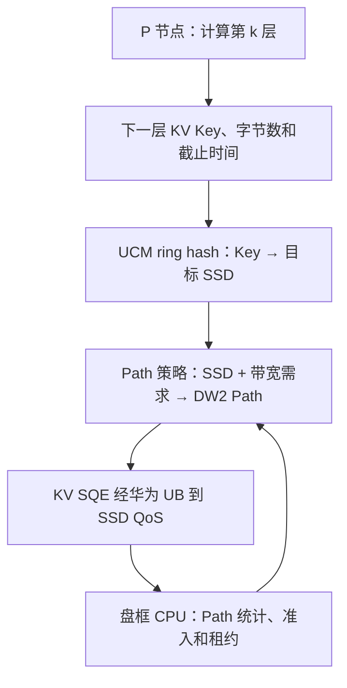

# LLM PD 分离 Prefill 阶段的 SSD QoS 带宽调度方案

> 目标：在不增加 GPU 等待时间的前提下，尽可能提高每块 SSD 在 Prefill 读阶段的有效带宽利用率。
> 场景：远端 P 节点通过华为 UB，以 KV SQE 形式访问 SSD；KV SQE 的 DW2 可指定目标 SSD 内的 QoS Path。
> 日期：2026-08-23

## 0. 先给结论

本文推荐按以下顺序落地：

1. **首选方案：QoS 参数固定 + 盘框 CPU 做毫秒级准入与 Path 租约 + 客户端填写 DW2。**
   - SSD 的 CIR、PIR、WRR 权重不需要随每次请求修改。
   - 盘框 CPU 根据各 Path 的带宽、IOPS、排队压力和客户端上报的下一层带宽需求，周期性分配“本周期可以使用哪些 Path”。
   - 客户端在租约允许的 Path 集合内选择具体 Path，并把 Path ID 写入 KV SQE 的 DW2。
   - 这是性能、SLO 保证能力和实现复杂度之间最均衡的方案。

2. **低复杂度方案：QoS 参数固定 + 静态主备 Path 集合 + 客户端自主选择。**
   - 初始化阶段用一致性哈希为每个 P 节点在每块 SSD 上生成多个主 Path 和备用 Path。
   - 运行期间不配置 SSD QoS，也不要求盘框 CPU 逐请求参与。
   - 适合负载较稳定、能够按最坏情况完成静态容量规划的场景，也适合作为推荐方案的降级模式。

3. **高性能但高复杂度方案：盘框 CPU 毫秒级调整 CIR/PIR/WRR + Path 租约。**
   - 能把客户端的实时带宽需求直接转化为硬件保证带宽和调度权重。
   - 适合负载偏斜严重、必须强化隔离或前两种方案仍不能稳定满足尾延迟的场景。
   - 不建议一开始就采用，因为 QoS 配置、原子切换、状态一致性和异常恢复都明显更复杂。

**不推荐把“一个 P 节点永久绑定一个 Path”作为最终方案。** 1:1 固定绑定实现简单，但容易出现某些 Path 很忙、其他 Path 空闲的情况；如果一个 P 节点同时处理多个推理请求，还会把不同截止时间的请求混在同一队列中，产生队头阻塞。

另外，问题最后写的是“每个 DPU 的利用率”，但本次明确的系统中没有 DPU 调度层，40 GB/s 也是**每块 SSD**的带宽。因此本文所有公式和结论都按“每块 SSD 利用率”计算。

---

## 1. 系统边界与必要假设

### 1.1 已确定的系统条件

- 只讨论 LLM 的 PD 分离场景中的 Prefill 阶段。
- 采用 layerwise 方式：GPU 计算第 \(k\) 层时，从 SSD 读取第 \(k+1\) 层需要的数据。
- 所有 P 节点运行同一个模型。
- P 节点数量和 SSD 数量在初始化时确定，运行期间不动态增加。
- 每块 SSD 的标称带宽为 \(40\ \text{GB/s}\)。
- 每块 SSD 有 256 个 QoS Path，分成 8 个组，每组 32 个 Path。
- 每个 Path 有独立的 CIR、PIR 和权重；调度包含组内 WRR、组间 WRR 和最终 RR。
- 客户端通过华为 UB 下发 KV SQE；DW2 指定目标 SSD 内的 QoS Path。
- 读请求可以携带带宽需求。
- 盘框 CPU 位于 SSD 附近，可统计每块 SSD、每个 QoS Path 的 IOPS、带宽和压力。
- CIR/PIR/权重不适合逐请求实时修改，但允许毫秒级配置。

### 1.2 本文的软件抽象

本文不展开 UCM 或 KV client 的代码，只采用以下抽象：

1. 客户端生成 KV 读请求；
2. UCM 的路由逻辑根据 KV Key 选择目标 ASU/SSD；
3. 调度器为已经确定的目标 SSD 选择 QoS Path；
4. 客户端把 Path ID 写入 KV SQE 的 DW2；
5. KV SQE 通过华为 UB 发送到 SSD。

本文假设 UCM 路由得到的一个 ASU/NodeId 对应一个物理 SSD QoS 域。如果一个 ASU 实际聚合了多块物理 SSD，则还需要在 ASU 内增加“ASU → 物理 SSD”的数据放置步骤；本文的准入、容量和 Path 方案仍应在**物理 SSD**维度执行。

### 1.3 40 GB/s 必须是端到端可达到的有效上限

SSD 标称带宽是 40 GB/s，并不自动意味着客户端一定能读到 40 GB/s。端到端有效带宽还可能受 UB、PCIe、介质、控制器和队列深度限制。定义：

$$
C_s^{\text{eff}}=
\min\left(
40,\ C_s^{\text{UB}},\ C_s^{\text{PCIe}},\ C_s^{\text{media}},\ C_s^{\text{controller}}
\right)
$$

其中：

- \(C_s^{\text{eff}}\)：第 \(s\) 块 SSD 真正可用于调度的有效带宽；
- \(C_s^{\text{UB}}\)：UB 到该 SSD 的可用带宽；
- \(C_s^{\text{PCIe}}\)、\(C_s^{\text{media}}\)、\(C_s^{\text{controller}}\)：其他链路或部件的有效上限。

后文为了便于说明，默认实测确认 \(C_s^{\text{eff}}=40\ \text{GB/s}\)。如果实测只有 36 GB/s，所有公式中的 40 都应替换成 36。

---

## 2. UCM ring hash 解决什么，不解决什么

UCM 的 KV 路由器支持基于虚拟节点的一致性哈希。以 ring hash 为例，可以把它简单理解为：

1. 把每个 ASU/SSD 映射成哈希环上的多个虚拟节点；
2. 对 KV Key 计算哈希值；
3. 从该位置沿环找到第一个虚拟节点；
4. 这个虚拟节点所属的 ASU/SSD 就是目标节点。

用公式表示：

$$
s(k)=\operatorname{NextClockwise}\bigl(h(k)\bigr)
$$

其中：

- \(k\) 是 KV Key；
- \(h(k)\) 是 Key 的哈希值；
- \(s(k)\) 是该 Key 对应的目标 SSD。

UCM 当前分支中的 ring hash 默认使用虚拟节点，并把一次批量请求中的 Key 按目标节点分组，再为每个目标节点生成独立的传输子任务。由于 SSD 集合在本场景初始化后不变化，ring hash 的映射也会比较稳定。

但是 ring hash **只回答“数据在哪块 SSD”**，不回答以下问题：

- 该请求应该进入目标 SSD 的哪个 QoS Path；
- 当前哪个 Path 最空闲；
- 下一层需要多少带宽才能按时读完；
- 多个 P 节点同时访问同一块 SSD 时如何做准入和带宽分配。

因此必须把两级决策分开：

还要特别注意：**QoS Path 只能改变目标 SSD 内部的排队和带宽分配，不能把一个已经位于 SSD 0 的 KV 数据改到 SSD 1 读取。** 如果 ring hash 或数据热度导致某块 SSD 的需求长期超过 40 GB/s，仅仅调整 Path 无法解决，必须调整数据放置、增加副本或在 Prefill 准入阶段限制并发。

---

## 3. 把“下一层必须及时读完”写成数学条件

### 3.1 调度对象不应只是 P 节点

推荐的调度对象是：

$$
f=(\text{P 节点},\ \text{推理请求},\ \text{下一层},\ \text{目标 SSD})
$$

本文把它称为一个 **layer-read flow**。

原因是一个 P 节点可能同时处理多个请求。若永久使用一个 P 节点一个 Path，不同请求、不同层和不同截止时间会混在一起。只有当每个 P 节点任意时刻最多执行一个 Prefill 请求时，flow 与 P 节点才近似等价。

### 3.2 可用于 SSD 读取的时间窗口

设 flow \(i\) 正在计算第 \(k\) 层，并读取第 \(k+1\) 层。第 \(k\) 层计算时间为 \(T_{i,k}^{\text{comp}}\)。不能把全部计算时间都交给 SSD，因为还要扣除 UB 传输、控制周期和安全余量：

$$
S_{i,k}=
T_{i,k}^{\text{comp}}
-\tau_{i,k}^{\text{UB}}
-\Delta^{\text{ctrl}}
-\delta^{\text{safe}}
$$

其中：

- \(S_{i,k}\)：SSD 真正可使用的服务窗口；
- \(\tau_{i,k}^{\text{UB}}\)：UB 传输和固定协议开销；
- \(\Delta^{\text{ctrl}}\)：控制面统计和下发可能造成的最坏滞后；
- \(\delta^{\text{safe}}\)：为带宽波动、尾延迟和测量误差保留的安全时间。

例如：

- 当前层计算时间为 100 ms；
- UB 和协议最坏需要 4 ms；
- 控制信息最多陈旧 5 ms；
- 预留 6 ms 安全余量。

则 SSD 可使用的窗口是：

$$
S=100-4-5-6=85\ \text{ms}
$$

### 3.3 每块 SSD 上的最低带宽需求

ring hash 以后，一个 layer 的 KV 数据可能分布在多块 SSD 上。设 flow \(i\) 在第 \(s\) 块 SSD 上需要读取 \(D_{i,s}\) GB，则这块 SSD 至少要提供：

$$
b_{i,s}^{\text{need}}=\frac{D_{i,s}}{S_i}
$$

单位要保持一致。如果 \(D\) 使用 GB，\(S\) 使用秒，则结果是 GB/s。

例如，第 1 块 SSD 上有 1.7 GB 数据，服务窗口为 85 ms，即 0.085 s：

$$
b^{\text{need}}=\frac{1.7}{0.085}=20\ \text{GB/s}
$$

这表示该 flow 在这块 SSD 上的平均有效带宽不能低于 20 GB/s，否则下一层会晚到，GPU 就会等待。

### 3.4 多盘请求是一个 coflow，最慢的盘决定是否等待

同一层的数据如果分布在多块 SSD 上，GPU 必须等所有必要数据都到齐。因此完成时间是：

$$
F_i=\max_{s\in\mathcal S_i}F_{i,s}
$$

其中 \(F_{i,s}\) 是第 \(s\) 块 SSD 上该 flow 的完成时间。即使 7 块 SSD 都很快，只要第 8 块是慢盘，GPU 仍然会等待。调度器必须按 coflow 思维同时检查所有相关 SSD，而不能只看全盘平均带宽。

### 3.5 单块 SSD 的基本可行条件

定义一个安全容量：

$$
C_s^{\text{sched}}=\eta C_s^{\text{eff}},\qquad 0<\eta<1
$$

\(\eta\) 是安全系数。例如 \(\eta=0.9\) 时，40 GB/s 的 SSD 只按 36 GB/s 做承诺，剩下 4 GB/s 用来吸收 WRR 取整、短时抖动、控制滞后和尾延迟。

在多个 flow 的服务窗口大致相同时，一个容易理解的准入条件是：

$$
\sum_{i\in\mathcal A_s}b_{i,s}^{\text{need}}
\le C_s^{\text{sched}}
$$

其中 \(\mathcal A_s\) 是同时访问 SSD \(s\) 的活跃 flow 集合。

如果左边是 45 GB/s，而 SSD 的安全容量只有 36 GB/s，任何 Path 映射、CIR、PIR 或 WRR 算法都不能让所有请求按时完成。这是物理容量不足，不是调度算法不够聪明。

对于释放时间和截止时间差别较大的请求，还可以用更严格的区间检查：

$$
\sum_{i:\ a_i\ge t_1,\ d_i\le t_2}D_{i,s}
\le C_s^{\text{sched}}(t_2-t_1)
$$

它的意思是：在任意时间区间 \([t_1,t_2]\) 内，必须在这个区间中完成的数据总量，不能超过 SSD 在该区间能传输的数据量。

### 3.6 利用率应该怎样定义

对时间窗口 \(W=[t_0,t_1]\)，第 \(s\) 块 SSD 的有效利用率定义为：

$$
U_s(W)=
\frac{\text{窗口内实际读取的有效 KV 字节数}}
{C_s^{\text{eff}}\cdot |W|}
$$

其中 \(0\le U_s\le1\)。

应统计“有可服务读任务的活跃窗口利用率”，同时报告整段 Prefill 的利用率。若系统当时根本没有未完成读请求，SSD 空闲不是调度失败，也不应该制造无用 IO 来追求 100%。真正目标是：

1. 所有已准入 flow 的下一层数据都在截止时间前到达；
2. 只要还有可服务读任务，SSD 就尽量不空闲，即保持 work-conserving；
3. 避免一块盘 100% 而另一块盘长期很低的冷热不均。

---

## 4. CIR、PIR、WRR 与带宽份额的关系

### 4.1 三个参数分别做什么

- **CIR**：希望对 Path 保证的基础速率。所有 Path 的承诺不能超过 SSD 的可承诺容量。
- **PIR**：该 Path 允许达到的峰值速率。若 PIR 设置过低，即使其他 Path 空闲，该 Path 也不能借满整盘带宽。
- **WRR 权重**：多个 Path 同时拥塞时，决定它们获得服务机会的相对比例。

一个安全的基本约束是：

$$
\sum_{p=0}^{255}\operatorname{CIR}_p
\le C_s^{\text{sched}}
$$

### 4.2 等权重不一定等带宽

如果硬件 WRR 按“IO 个数”给机会，Path \(p\) 的平均 IO 大小为 \(\bar L_p\)，那么它得到的字节带宽近似与 \(w_p\bar L_p\) 成比例：

$$
x_p\approx
B_g\frac{w_p\bar L_p}
{\sum_{q\in\mathcal A_g}w_q\bar L_q}
$$

其中：

- \(B_g\) 是该组得到的带宽；
- \(w_p\) 是 Path 权重；
- \(\mathcal A_g\) 是组内活跃 Path。

只有在 IO 大小相同，或者硬件按字节/deficit 调度时，才可以近似写成：

$$
x_p\approx B_g\frac{w_p}{\sum_qw_q}
$$

因此在实现前必须从 SSD 硬件手册确认：WRR 的服务单位是 IO、字节还是 quantum，以及一次选中 Path 后最多可连续发射多少 IO。这里的“一次仲裁选中一个 Path”也不等于该 Path 的 outstanding 数量只能是 1。

### 4.3 推荐的固定基础配置

当希望避免运行时配置 QoS 时，可以先把 256 个 Path 做成等价的“带宽票据”：

- 8 个组使用相同的组权重；
- 组内 Path 使用相同的 Path 权重；
- 每个 Path 的 CIR 相同；
- PIR 设置得足够高，使活跃 Path 可以借用空闲带宽；
- 所有组都应是 work-conserving，空组的份额能够被其他组借用。

例如：

$$
\operatorname{CIR}_p=c_0,
\qquad
c_0\le\frac{C_s^{\text{sched}}}{256}
$$

当 \(C_s^{\text{sched}}=36\ \text{GB/s}\) 时：

$$
c_0\le\frac{36}{256}=0.140625\ \text{GB/s}
$$

这不是说一个活跃 Path 最多只能得到 0.140625 GB/s。CIR 是基础承诺；如果 PIR 足够大且其他 Path 空闲，work-conserving 调度应允许它借到更高带宽。

---

## 5. P 节点与 QoS Path 应该怎样映射

| 映射方式 | 优点 | 主要问题 | 建议 |
|---|---|---|---|
| P 节点与 Path 永久 1:1 | 最简单，统计和隔离直观 | 负载变化时容易冷热不均；一个 P 节点的多个 flow 会队头阻塞；P 节点数可能超过 256 | 只作为最简单基线 |
| 多个 P 节点静态哈希到同一 Path | 不需要控制面，支持超过 256 个 P 节点 | 哈希碰撞会形成热点；同一 Path 内无法按截止时间区分 | 可作为降级模式，不宜作为强 SLO 方案 |
| 一个 flow 使用多个 Path | 可用 Path 数量近似表达带宽份额，能并行发出更多 SQE | 需要拆分 SQE、维护 Path 集合 | 固定 QoS 时推荐 |
| 动态主 Path + 备用 Path | 能绕开热点或故障，不需要复制 KV 数据 | 需要租约或负载视图，切换要防抖 | 推荐与多 Path 组合 |
| 一个 flow 独占一个动态 CIR Path | 隔离和保证最强，公式最直接 | 活跃 flow 多于 Path 时无法一一对应；QoS 配置复杂 | 仅用于动态 QoS 方案 |

本文的“主备 Path”是指**同一块 SSD 内的两个 QoS 入口**，不是两份 KV 数据。切换到备用 Path 不会改变目标 SSD，也不需要重新放置数据。

---

## 6. 方案一：固定 QoS + 静态主备 Path 集合 + 客户端选择

### 6.1 核心思想

利用“P 节点和 SSD 数量固定、所有 P 节点使用同一模型”这一特点，在初始化阶段完成最坏情况容量规划，并为每个 P 节点在每块 SSD 上生成稳定的主 Path 集合和备用 Path 集合。运行时不修改 CIR/PIR/权重。

数据路由与 Path 路由使用两个不同的哈希：

$$
\text{SSD}=H_{\text{data}}(\text{KV Key})
$$

$$
\text{Path candidates}
=H_{\text{path}}(\text{P 节点 ID},\text{SSD ID},\text{salt})
$$

两个哈希必须使用不同的输入或 salt，避免多个 P 节点在数据层和 Path 层同时发生相关碰撞。

### 6.2 为什么不是简单 1:1

初始化时先估算 P 节点 \(i\) 在 SSD \(s\) 上的峰值需求 \(b_{i,s}^{\text{peak}}\)。假设该 SSD 准备用 \(K_s\) 个活跃 Path 当作带宽票据，则分配给它的主票据数可以近似为：

$$
k_{i,s}^{\text{pri}}=
\max\left(
1,
\left\lceil
K_s\frac{b_{i,s}^{\text{peak}}}
{\sum_j b_{j,s}^{\text{peak}}}
\right\rceil
\right)
$$

直观解释：

- 一个 P 节点需要的峰值带宽越大，就分到越多 Path；
- 客户端把这个 SSD 上的 SQE 轮流发到这些主 Path；
- 多个等权 Path 相当于多个调度机会，因此可以近似表达更大的带宽份额。

备用 Path 应放在与主 Path 不同的组中，并尽量避免与其他 P 节点的主 Path 高度重合。

### 6.3 运行流程

1. ring hash 根据 KV Key 确定目标 SSD；
2. 客户端计算该 SSD 上的 \(D_{i,s}\)、\(S_i\) 和 \(b_{i,s}^{\text{need}}\)；
3. 正常情况下，在主 Path 集合中轮询或选择预计完成时间最小的 Path；
4. 如果主 Path 的本地 outstanding、近期完成时间或盘框 CPU 广播的压力超过阈值，则切换到备用 Path；
5. 客户端把最终 Path ID 写入 DW2，并通过 UB 发送 KV SQE。

可以使用如下的简单代价函数选 Path：

$$
\operatorname{Cost}(p)=
\frac{Q_p+D_{\text{new}}}{\widehat B_p}
+\lambda\cdot \operatorname{StaleAge}_p
$$

其中：

- \(Q_p\)：估计仍在 Path 中排队的字节数；
- \(D_{\text{new}}\)：新 SQE 的字节数；
- \(\widehat B_p\)：该 Path 最近观测到的有效带宽；
- \(\operatorname{StaleAge}_p\)：负载信息已经陈旧了多久；
- \(\lambda\)：陈旧信息的惩罚系数。

### 6.4 为什么这个方案好

- 不修改 SSD QoS，硬件和固件复杂度最低；
- 客户端只增加 Path 候选表和 DW2 选择，软件改动相对小；
- 多 Path 能减少 1:1 绑定造成的热点；
- 主备集合使客户端可以在同一 SSD 内绕开拥塞 Path；
- 映射稳定，便于调试、统计和故障定位；
- 当 PIR 足够高且 QoS work-conserving 时，空闲 Path 的带宽可以被忙 Path 借用。

### 6.5 局限性

- 它只能依赖初始化时的峰值估计保证 SLO；如果实际并发超过估计，无法做严格的实时准入；
- 多个客户端可能同时看到某个 Path 很空并一起切过去，出现“惊群”；
- 客户端看到的是局部或延迟的负载信息，不如盘框 CPU 的全局视图准确；
- 如果同一块 SSD 的物理需求已经超过 40 GB/s，主备 Path 也无能为力。

因此，该方案适合作为低复杂度方案和故障降级方案，但不是最强的生产方案。

---

## 7. 方案二：固定 QoS + 盘框 CPU 准入/Path 租约 + 客户端填写 DW2（推荐）

### 7.1 核心思想

把系统分成两个平面：

- **控制面**：盘框 CPU 汇总所有 SSD/Path 的带宽、IOPS、队列压力和客户端下一层需求，按毫秒周期计算准入结果和 Path 租约；
- **数据面**：客户端根据租约选择 Path、填写 DW2，KV SQE 仍然直接通过 UB 到 SSD，盘框 CPU 不转发每个数据 SQE。

这里把“类似 DRB”抽象成：**集中形成资源视图、周期性分配资源，数据面只携带轻量标识并高速执行。**

### 7.2 为什么不让盘框 CPU 逐 IO 选择 Path

若盘框 CPU 要为每个 IO 选择 Path，它必须满足下列至少一种条件：

1. 每个 KV SQE 先经过 CPU，由 CPU 改写 DW2；或者
2. SSD 前端增加一个能够读取带宽需求并重定向 Path 的硬件模块。

第一种会让 CPU 进入数据通路，增加一次排队和处理，容易形成单点瓶颈；第二种则需要新的硬件能力，复杂度更高。更合理的方式是：

> 盘框 CPU 选择“客户端在未来若干毫秒可以使用的 Path 集合”，客户端选择“当前这一个 SQE 最终使用集合中的哪个 Path”。

### 7.3 带宽需求字段如何真正发挥作用

仅仅把 \(b^{\text{need}}\) 放进 KV SQE，并不会自动产生 QoS 效果，必须有模块消费它。推荐同时采用两条路径：

- 客户端在发送本层数据 SQE 前，向盘框控制面汇总上报 \((D_{i,s},S_i,b_{i,s}^{\text{need}})\)；
- 每个 KV SQE 仍携带带宽需求，供 SSD/CPU 做统计、校验和事后诊断。

这样盘框 CPU 在数据请求真正到达前就能做准入和租约分配，而不是收到 SQE 后才发现 DW2 已经选错。

### 7.4 控制流程

为了真正满足“Prefill 一旦开始，任何层都不因读数据而等待”，需要两级准入：

1. **会话级准入**：在 Prefill 开始前，客户端根据输入规模、KV 命中信息和模型各层参数，提交各层在各 SSD 上的需求包络；盘框 CPU 检查预计重叠的所有 Prefill 是否可行。只有通过后才允许该 Prefill 开始。
2. **层级调度**：Prefill 运行中，客户端提交下一层的更准确需求，CPU 用毫秒级租约优化 Path 和多余带宽，但不能撤销会话级准入已经承诺的最低资源。

运行流程如下：

1. Prefill 开始前，客户端估算各层需求包络：

   $$
   b_{i,s,\ell}^{\text{env}}=
   \frac{D_{i,s,\ell}^{\text{upper}}}
   {S_{i,\ell}^{\text{lower}}}
   $$

   这里用数据量上界和服务窗口下界，得到偏保守的带宽上界。
2. 盘框 CPU 对预计同时运行的 Prefill 做会话级联合准入；
3. 运行到第 \(k\) 层时，客户端对第 \(k+1\) 层 KV Key 做 ring hash，得到每块 SSD 上更准确的字节数 \(D_{i,s}\)；
4. 客户端计算该层每块 SSD 的最低带宽 \(b_{i,s}^{\text{need}}\)；
5. CPU 在已经承诺的资源范围内细化分配，并返回带版本号和失效时间的 Path 租约；
6. 客户端在租约中的主 Path 集合内分发 SQE，并保留不同组中的备用 Path；
7. CPU 每隔 \(\Delta^{\text{ctrl}}\) 毫秒根据实际带宽和排队重新分配租约；
8. 客户端只在新租约版本生效后迁移，旧租约在宽限期后失效。

如果只在第 \(k\) 层已经开始计算后才检查第 \(k+1\) 层是否有容量，一旦检查失败，就已经来不及保证 GPU 不等待。因此，层级请求携带带宽需求是“精细调度信息”，不能代替 Prefill 开始前的会话级准入。

### 7.5 联合准入和 coflow 分配

给每个 flow 定义一个加速系数 \(\alpha_i\)：

$$
x_{i,s}=\alpha_i b_{i,s}^{\text{need}}
$$

- \(\alpha_i=1\)：刚好能在截止时间前完成；
- \(\alpha_i>1\)：提前完成；
- \(\alpha_i<1\)：会错过截止时间，不允许出现在已准入集合中。

盘框 CPU 可以求解一个简单的 max-min 问题：

$$
\max\ \min_i\alpha_i
$$

满足：

$$
\alpha_i\ge1
$$

$$
\sum_i\alpha_i b_{i,s}^{\text{need}}
\le C_s^{\text{sched}},\qquad \forall s
$$

小白式理解如下：

1. 先保证每个已准入 flow 至少拿到 \(\alpha_i=1\)，也就是“不会让 GPU 等待”的最低带宽；
2. 如果还有剩余带宽，再尽量公平地增大所有人的 \(\alpha_i\)；
3. 哪块 SSD 最先达到容量上限，哪块 SSD 就是这个 coflow 集合的瓶颈；
4. 其他 SSD 的多余带宽可以继续服务别的 flow，不能因为某一个 coflow 的慢盘而空闲。

如果不存在满足 \(\alpha_i\ge1\) 的解，CPU 必须在会话级准入阶段延迟或拒绝新的 Prefill，而不是让它运行到中间层才把 GPU 卡住。这样可能增加开始 Prefill 前的排队时间，但能保证“已开始执行的 Prefill 不因下一层未读完而停顿”。

### 7.6 用 Path 数量近似表达目标带宽

QoS 参数固定时，可以把活跃 Path 看成带宽票据。设某组开放 \(K_g\le32\) 个活跃票据，CPU 希望 flow \(i\) 在 SSD \(s\) 上获得目标速率 \(x_{i,s}\)，则它在该组中的票据数近似为：

$$
k_{i,s,g}\approx
K_g\frac{x_{i,s}}
{\sum_jx_{j,s}}
$$

由于 \(k\) 必须是整数，需要使用最大余数法做取整，并利用预留的安全带宽吸收误差。8 个组都应进行近似相同的比例分配，而不是把一个大 flow 的所有 Path 都塞进一个组。

在等组权重、等 Path 权重和等 IO 大小的理想情况下：

$$
x_{i,s}\approx
\sum_{g=0}^{7}
B_{s,g}\frac{k_{i,s,g}}{K_g}
$$

### 7.7 主备租约

建议每个 flow 获得：

- 若干主 Path：正常发送 SQE；
- 1～2 个备用 Path：位于不同组，平时不发送或只发送探测 IO；
- 一个租约 epoch；
- 一个生效时间和失效时间；
- 可选的每个 Path 最大 outstanding 或字节配额。

只有当以下条件之一出现时才切备用：

- 预计完成时间超过剩余 slack；
- 主 Path 的队列或完成延迟连续多个周期超过阈值；
- CPU 发布新 epoch；
- Path 或 SSD 报错。

使用连续多个周期和最小驻留时间可以防止主备之间反复抖动。

### 7.8 为什么这个方案好

- SSD QoS 配置保持固定，避开最复杂、最容易出错的配置路径；
- 盘框 CPU 有全局视图，可以避免多个客户端同时抢同一个“看起来空闲”的 Path；
- 控制粒度是毫秒级租约而不是逐 IO，CPU 不进入高带宽数据通路；
- 客户端仍只做需求计算、查租约和填写 DW2，复杂度可控；
- 同时检查所有相关 SSD，可以减少 coflow 慢盘导致的 GPU 等待；
- 通过准入保证 SLO，通过 work-conserving 和高 PIR 使用剩余带宽；
- Path 数量提供了比永久 1:1 更细的带宽份额调节能力。

这也是本文最推荐的生产方案。

---

## 8. 方案三：毫秒级动态 CIR/PIR/WRR + Path 租约

### 8.1 适用条件

当以下情况明显存在时，可以考虑动态配置：

- 负载偏斜很强，固定票据法误差过大；
- 必须为某些 flow 提供更强的硬件隔离；
- IO 大小差异导致等权 Path 不能准确表达字节带宽；
- 固定 QoS + 租约已经做了，但尾部仍频繁接近 deadline。

### 8.2 映射粒度

如果活跃 flow 数不超过可用 Path 数，推荐：

- 一个活跃 layer-read flow 对应一个主 Path；
- 在其他组保留一个备用 Path；
- CIR/PIR/权重按该 flow 的目标带宽配置。

如果活跃 flow 多于 Path 数，不应随机混合，而应把**截止时间和带宽需求相近**的 flow 聚合到同一 Path，减少队头阻塞。

### 8.3 CIR 的计算

设 Path \(p\) 上聚合的 flow 集合为 \(\mathcal F_p\)，其目标保证速率为：

$$
r_p^{\text{target}}=
\sum_{i\in\mathcal F_p}b_{i,s}^{\text{need}}
$$

可以设置：

$$
\operatorname{CIR}_p
=Q_{\text{rate}}\left(r_p^{\text{target}}\right)
$$

其中 \(Q_{\text{rate}}(\cdot)\) 表示按照硬件支持的步长向上或向下量化。配置后仍必须满足：

$$
\sum_p\operatorname{CIR}_p
\le C_s^{\text{sched}}
$$

为防止向下量化导致 deadline miss，保证型 Path 通常应向上取整；因此准入时还要把量化后的 CIR 总和重新检查一遍。

### 8.4 PIR 的计算

PIR 的作用是允许 Path 借用空闲带宽。可以使用：

$$
\operatorname{PIR}_p=
\min\left(
C_s^{\text{eff}},
\operatorname{CIR}_p+h_p
\right)
$$

其中 \(h_p\) 是 burst headroom。紧急 flow 的 \(h_p\) 可以较大；普通 flow 较小。若硬件的 WRR 和 token bucket 已能可靠控制拥塞，也可以让活跃 Path 的 PIR 接近整盘带宽，以提高空闲资源借用能力。

### 8.5 WRR 权重的计算

如果 WRR 按字节调度，可以让权重与目标带宽近似成比例：

$$
w_p\propto r_p^{\text{target}}
$$

如果 WRR 按 IO 个数调度，则需要修正平均 IO 大小：

$$
w_p\propto
\frac{r_p^{\text{target}}}{\bar L_p}
$$

组权重同理，应近似与组内所有 Path 的目标带宽之和成比例：

$$
W_g\propto
\sum_{p\in g}r_p^{\text{target}}
$$

所有权重都要量化为硬件允许的整数，并在量化后验证实际份额。

### 8.6 不能每毫秒无条件重配

推荐加入以下保护：

1. **阈值**：只有新旧目标差异超过 \(\theta\)，或者预测会 miss deadline，才触发配置；
2. **连续确认**：普通负载变化连续出现 \(H\) 个周期后才重配；
3. **最小驻留时间**：一个 Path 配置至少保持 \(T_{\text{hold}}\)；
4. **epoch**：QoS 配置和客户端租约都带版本号；
5. **先配置、再发布**：SSD 确认新配置生效后，CPU 才向客户端发布新租约；
6. **先迁移、再回收**：旧 Path 排空后，才能重新配置成其他用途；
7. **容量不变量**：任何中间步骤都必须保证 CIR 总和不超过安全容量。

若硬件没有原子批量更新能力，可以把 Path 分成 A/B 两个配置池：先在空闲池中准备新配置，客户端切换并排空旧池，再回收旧池。代价是可用 Path 数量减少，但能显著降低配置瞬间破坏 SLO 的风险。

### 8.7 为什么这个方案好

- 客户端的 \(b^{\text{need}}\) 能直接转化为硬件保证速率；
- 对突发、长尾和负载偏斜的适应能力最强；
- 能提供更强的隔离、可解释性和故障定位能力；
- 当 flow 数较少时，一个 flow 一个 Path，deadline 分配非常直接。

### 8.8 代价

- SSD QoS 配置链路复杂，必须处理配置失败、部分生效、回滚和版本一致性；
- 盘框 CPU 的算法、状态机和测试量明显增加；
- 配置延迟可能已经占用 layerwise 的一部分 slack；
- 频繁调整会产生抖动，甚至比固定配置更差；
- 必须准确理解硬件 CIR/PIR、token bucket、WRR 和组间调度语义。

因此它是增强方案，而不是第一版方案。

---

## 9. 三种方案的复杂度与能力对比

| 维度 | 方案一：静态主备 | 方案二：固定 QoS + CPU 租约 | 方案三：动态 QoS + CPU 租约 |
|---|---:|---:|---:|
| SSD 硬件改动 | 低 | 低 | 中到高 |
| SSD QoS 运行时配置 | 无 | 无 | 毫秒级 |
| 客户端复杂度 | 低到中 | 中 | 中 |
| 盘框 CPU 软件复杂度 | 低 | 中 | 高 |
| CPU 是否逐 IO 转发 | 否 | 否 | 否 |
| Path 映射 | 静态 1→K + 主备 | 动态 1→K + 主备租约 | 动态 1→1 或 1→K + 主备 |
| 全局准入能力 | 仅初始化 | 强 | 强 |
| 对负载变化的适应 | 一般 | 好 | 最好 |
| 对带宽偏斜的处理 | 一般 | 好 | 最好 |
| SLO 保证强度 | 依赖最坏情况规划 | 在容量可行时较强 | 在容量可行且配置可靠时最强 |
| 工程风险 | 最低 | 较低 | 最高 |
| 推荐定位 | 低复杂度/降级 | **主方案** | 后续增强 |

---

## 10. 一个完整的数值例子

假设某块 SSD：

- 实际有效带宽 \(C^{\text{eff}}=40\ \text{GB/s}\)；
- 安全系数 \(\eta=0.9\)；
- 因此承诺容量 \(C^{\text{sched}}=36\ \text{GB/s}\)。

两个 flow 同时访问这块 SSD：

### Flow A

- 数据量：\(D_A=1.44\ \text{GB}\)；
- 可用窗口：\(S_A=72\ \text{ms}=0.072\ \text{s}\)。

需要：

$$
b_A^{\text{need}}=rac{1.44}{0.072}=20\ \text{GB/s}
$$

### Flow B

- 数据量：\(D_B=0.80\ \text{GB}\)；
- 可用窗口：\(S_B=50\ \text{ms}=0.05\ \text{s}\)。

需要：

$$
b_B^{\text{need}}=rac{0.80}{0.05}=16\ \text{GB/s}
$$

总需求：

$$
20+16=36\ \text{GB/s}
$$

刚好不超过安全容量，因此可以准入。

假设 CPU 在该 SSD 上启用 64 个等权 Path 票据，并均匀分散到 8 个组，每组 8 个。按比例分配：

- A 获得 36 个票据；
- B 获得 28 个票据。

可以在 4 个组中分成 A:B = 5:3，在另外 4 个组中分成 4:4。若所有 flow 都有足够 outstanding，按整盘 40 GB/s 粗略估计：

$$
x_A\approx40\times\frac{36}{64}=22.5\ \text{GB/s}
$$

$$
x_B\approx40\times\frac{28}{64}=17.5\ \text{GB/s}
$$

完成时间分别为：

$$
T_A=\frac{1.44}{22.5}=0.064\ \text{s}=64\ \text{ms}<72\ \text{ms}
$$

$$
T_B=\frac{0.80}{17.5}\approx45.7\ \text{ms}<50\ \text{ms}
$$

两者都能按时完成。这里额外的 4 GB/s 安全带宽还吸收了票据取整、WRR 误差和短时抖动。B 完成后，如果 A 仍有未完成 IO，work-conserving 调度应允许 A 借用 B 释放的带宽。

反例：如果两个 flow 的最低需求分别是 25 GB/s 和 18 GB/s，总需求为 43 GB/s，已经超过 36 GB/s 安全容量。此时增加 Path 数、切备用 Path或修改权重都不能保证两者按时完成，必须在 Prefill 开始前限制其中一个请求，或者改变数据放置/并发规模。

---

## 11. 为什么推荐方案能提高 SSD 利用率

### 11.1 避免静态 Path 热点

永久 1:1 映射时，繁忙 P 节点的 Path 可能持续排队，而空闲 P 节点的 Path 没有工作。动态租约让 CPU 可以把更多 Path 票据给高需求 flow，并把它们分散到不同组。

### 11.2 保持 work-conserving

只要满足以下条件：

- SSD 内仍有可发射的读 SQE；
- UB 能持续供给；
- 队列深度和 outstanding 足够；
- PIR 没有把活跃 Path 过度限速；
- 空闲组/Path 的份额可以被借用；

则总服务速率应尽量接近：

$$
\sum_i x_{i,s}(t)\approx C_s^{\text{eff}}
$$

因此活跃窗口利用率可以接近 1。

### 11.3 先准入，再追求满带宽

CPU 先保证每个已准入 flow 的最低带宽，再把剩余带宽用于提前完成。这样不会出现“SSD 看上去 100% 很忙，但关键下一层数据仍然晚到”的假高利用率。

### 11.4 控制 coflow 慢盘

CPU 同时检查一个 layer 涉及的所有 SSD，可以优先给瓶颈盘上的分片分配足够资源，避免只优化平均带宽却被单个慢盘拖住。

### 11.5 控制面不阻塞数据面

盘框 CPU 只分配租约，不转发每个 SQE。KV 数据仍直接经 UB 到 SSD，因此控制逻辑不会成为 40 GB/s 数据通路上的新瓶颈。

---

## 12. 各组件的职责划分

| 决策或动作 | 推荐执行者 | 原因 |
|---|---|---|
| 根据 KV Key 选择目标 SSD | UCM/KV client 的 ring hash | 与数据放置保持一致 |
| 计算下一层字节数、计算窗口和最低带宽 | 客户端 | 客户端最了解模型层、请求和 GPU 计算进度 |
| 汇总所有客户端和 SSD 的压力 | 盘框 CPU | 拥有盘框全局视图 |
| 做容量准入和 coflow 检查 | 盘框 CPU | 避免各客户端独立决策造成总需求超载 |
| 分配主/备 Path 集合和租约 | 盘框 CPU | 毫秒级控制，不进入每个 IO 的数据通路 |
| 在租约集合中选择具体 SQE Path | 客户端 | 低延迟，直接填写 DW2 |
| 执行 CIR/PIR/WRR/RR | SSD QoS 硬件 | 快速数据面 |
| 初始化或毫秒级修改 QoS 参数 | 盘框 CPU | 集中维护容量不变量和配置版本 |

最重要的一条是：**盘框 CPU 不应成为逐 SQE 转发代理；客户端也不应在没有全局准入的情况下自行承诺带宽。**

---

## 13. 实现前必须确认的硬件能力

这些信息会影响公式到真实带宽的误差，但不改变推荐架构：

1. CIR 是严格保证、整形上限还是仅用于仲裁？未使用的 CIR 能否被其他 Path 借用？
2. PIR 对应的 token bucket 大小和突发持续时间是多少？
3. 组内和组间 WRR 是按 IO 数、字节数还是 quantum 调度？
4. 一次选中 Path 后最多发射多少 IO？这与 outstanding 上限是否独立？
5. 最终 RR 的仲裁对象是什么？是否是 work-conserving？
6. CIR/PIR/权重的配置步长、最小值、最大值和生效延迟是多少？
7. 是否支持原子批量更新或影子配置？如果不支持，更新中间态如何处理？
8. Path 级带宽、IOPS、队列深度和完成延迟的统计周期与精度是多少？
9. DW2 的 Path ID 是每个 KV SQE 独立生效，还是一个 batch 内所有条目共享一个 Path？
10. 每个 Path、每个客户端和整块 SSD 的最大 outstanding/队列深度是多少？

在这些能力没有确认前，应使用安全系数 \(\eta\) 和实测校准表，不要假设“权重 2 就一定等于权重 1 的两倍字节带宽”。

---

## 14. 建议的落地步骤

### 阶段 0：测量硬件能力

- 测单 Path 能否借满 40 GB/s；
- 测多个等权 Path 的字节带宽比例；
- 分别测试相同和不同 IO 大小；
- 测 8 个组同时活跃时的组间份额；
- 测 CIR/PIR/权重配置的生效时间和瞬态；
- 测需要多少 outstanding 才能跑满盘和 UB。

### 阶段 1：部署方案一

- 固定等价 Path 配置；
- 静态一致性哈希生成主备 Path；
- 客户端支持根据 DW2 选择 Path；
- 建立最坏情况容量表和降级策略。

### 阶段 2：升级为推荐方案二

- 客户端上报下一层 \(D\)、\(S\)、\(b^{\text{need}}\)；
- 盘框 CPU 汇总 Path/SSD 遥测；
- 增加联合准入、Path 票据和租约 epoch；
- 客户端按租约填写 DW2；
- 加入主备切换、防抖和租约过期处理。

### 阶段 3：仅在必要时增加方案三

- 先动态调整少量 Path 的 CIR/PIR；
- 再考虑 WRR 权重；
- 加入双池、排空、原子性和回滚状态机；
- 用 A/B 实验确认动态配置确实比固定票据明显改善尾部 SLO。

---

## 15. 建议统计的指标

### SLO 指标

- 下一层按时完成率；
- GPU 因下一层数据未到导致的等待时间；
- 每个 flow 的 deadline slack：

$$
\operatorname{Slack}_i=d_i-F_i
$$

要求已准入 flow 的 Slack 不小于 0，并重点观察 p1 或最小 Slack。

### 利用率指标

- 每块 SSD 活跃窗口利用率 \(U_s\)；
- 所有 SSD 的平均利用率；
- 最低 SSD 利用率；
- SSD 间不均衡度，例如：

$$
I_U=\frac{\max_sU_s-\min_sU_s}
{\frac{1}{M}\sum_sU_s+\epsilon}
$$

### 调度与控制指标

- 每 Path 带宽、IOPS、队列字节数和完成延迟；
- Path 租约变更次数；
- 主备切换次数和抖动次数；
- QoS 配置次数、失败次数和生效时延；
- 准入拒绝或延迟的 Prefill 数量；
- 预测带宽与实测带宽误差。

---

## 16. 最终建议

### 推荐生产架构

采用**方案二：固定 QoS + 盘框 CPU 毫秒级准入/Path 租约 + 客户端填写 DW2**。

具体选择如下：

- 数据 SSD：由 UCM ring hash 根据 KV Key 决定；
- 调度单位：\((P\text{ 节点},\text{请求},\text{层},\text{SSD})\) flow，而不是永久的 P 节点；
- P 节点与 Path：动态 1→K，并配置跨组备用 Path；
- CIR/PIR/WRR：第一版固定，不逐请求修改；
- 盘框 CPU：统计、联合准入、分配租约，不逐 IO 转发；
- 客户端：计算 \(b^{\text{need}}\)、查租约、选择 Path、填写 DW2；
- SLO：在 Prefill 开始前完成容量准入，保证已开始的 Prefill 不因下一层读晚而停顿；
- 利用率：通过高 PIR、work-conserving、足够 outstanding 和动态 Path 票据尽量跑满每块有积压请求的 SSD。

### 何时选择另外两个方案

- 如果希望最快实现、负载稳定且能按最坏情况规划：先上方案一；
- 如果方案二经过实测仍无法稳定控制强偏斜和尾延迟，并确认 QoS 毫秒级配置可靠：再增加方案三；
- 无论使用哪个方案，只要某块 SSD 的 deadline 需求总和超过有效容量，就必须做 Prefill 准入、调整数据放置或增加副本，Path 调度本身不能突破物理上限。

---

## 参考资料

- [UCM KV transport 目录（feature_26h1）](https://github.com/ModelEngine-Group/unified-cache-management/tree/feature_26h1/ucm/transport/kv)
- [UCM Router 接口：ring hash、Maglev 与 affinity 路由](https://github.com/ModelEngine-Group/unified-cache-management/blob/feature_26h1/ucm/transport/kv/common/include/kv_common/router.h)
- [UCM Router 实现：虚拟节点 ring hash 与批量 Key 分组](https://github.com/ModelEngine-Group/unified-cache-management/blob/feature_26h1/ucm/transport/kv/common/src/router.cpp)
- [UCM ASU client：按路由结果构造各目标节点的传输任务](https://github.com/ModelEngine-Group/unified-cache-management/blob/feature_26h1/ucm/transport/kv/asu/client/src/client_task_manager.cpp)
- [UCM ASU 配置示例：RING_HASH 与虚拟节点数](https://github.com/ModelEngine-Group/unified-cache-management/blob/feature_26h1/examples/ucm_config_asu.yaml)
- [华为：QoS 服务模型、流量监管/整形与拥塞管理](https://info.support.huawei.com/info-finder/encyclopedia/zh/QoS.html)
- [华为：WRR/DRR 队列调度命令与权重说明](https://support.huawei.cn/enterprise/en/doc/EDOC1100333649/7bb5ba83/congestion-avoidance-and-congestion-management-commands)
