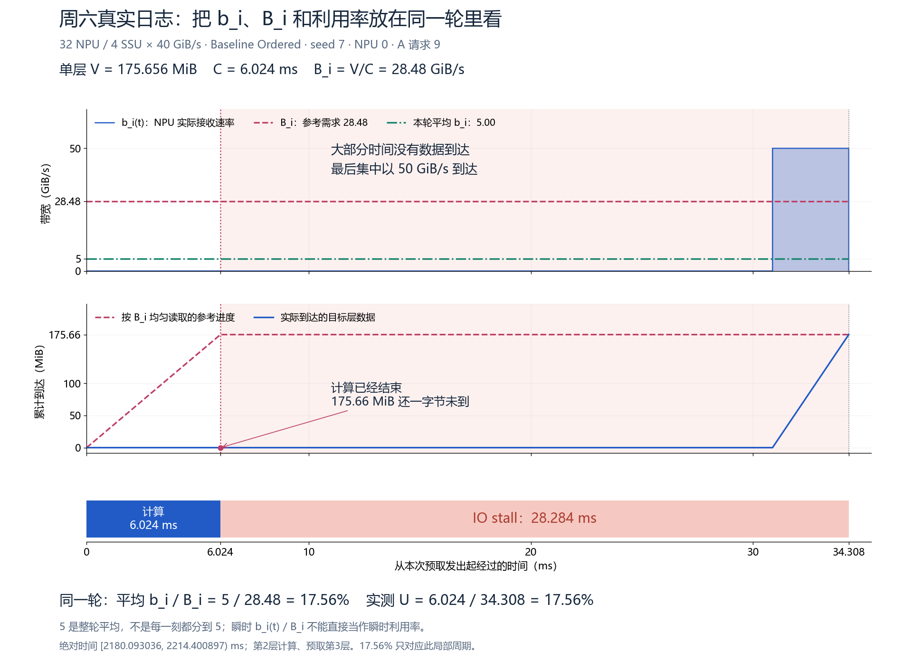

# 周六实验：b_i、B_i 和实测利用率能否对上？

**能对上一部分，而且已有真实日志验证；但不能说整个混合请求实验的利用率都能用一个 b_i/B_i 算出来。**

本文只读取 2026-09-12 已完成实验的输入、逐层计算日志和逐块传输日志，没有启动新仿真。重点看 32 NPU、4 SSU（每盘 40 GiB/s）的结果。

## 1. 先把两个字母分开

这里的 `i` 是 NPU 编号。请求类别也叫 A、B，其中“B 类请求”的 B 与公式中的 `B_i` 不是同一个意思。

| 写法 | 通俗含义 | 本文图里的口径 |
|---|---|---|
| `B_i = V_i / C_i` | 想把一层读取藏在一层计算里，需要多快 | 当前请求自身的每层读取量 / 每层纯计算时间 |
| `b_i(t)` | 这一刻实际来了多快的数据 | 逐块日志重建的 **NPU 接收速率** |
| `本轮平均 b_i` | 把这一轮里收到的数据，摊到整轮时间上 | 整轮接收量 / 整轮时长，包含等待时段 |

`B_i` 是参考需求，不是 SSD 的限速。固定请求内部各层的 V、C 相同，因此 B_i 不变；NPU 换成另一个画像的请求时，B_i 才切换。

教程理想模型中的 b 指持续可用的供给；本图的 `b_i(t)` 则是实际到达速率。两者只有在核实相应周期条件后，才能建立下文的联系。

**实际到达带宽不是始终平稳的。** 预取可以先把数据准备好，随后 NPU 一边计算、一边暂时没有新数据到达。所以不能把瞬时 `b_i(t)=0` 解释成瞬时利用率为 0。

## 2. 最直接的正例：28.48 的需求，只获得整轮平均 5

先看这张新整理的局部图，三个面板使用同一条时间轴：



[单独打开 PNG](assets/bi_Bi_A_local.png) · [单独打开 PDF](assets/bi_Bi_A_local.pdf)

图中是 **4 盘 Ordered，NPU 0，A 请求 9**：第 2 层计算开始时，发出第 3 层预取。绝对时间为 `[2180.093036, 2214.400897) ms`。

```text
A 每层要读取：175.65625 MiB
A 每层计算：  6.024012 ms
B_i：        28.475926 GiB/s

这段稳定轮转中，32 卡都在处理 A，4 盘持续忙碌、每卡获得等量服务：
本轮平均 b_i = 4 × 40 / 32 = 5 GiB/s

按这个平均供给，读一层约需 34.307861 ms。
只能用计算藏住其中的 6.024012 ms。
剩下等待 = 34.307861 - 6.024012 = 28.283850 ms。

带宽模型：5 / 28.475926                = 17.558692%
实测时间：6.024012 / 34.307861          = 17.558692%
```

这里带宽与计算时间分别使用 GiB/s、毫秒，计算时已换成同一单位。不是拿 MiB 数字直接除以 GiB/s。

**这一次确实对齐了。** 核对时先用输入量、卡数和盘容量计算周期，再与真实读取完成时间、计算区间分别比较；没有先拿实测利用率反推出一个带宽来凑相等。对全部 32 卡裁剪同一个上述时间窗口，整机利用率也为 17.558692%。

但“32 卡同为 A、等量服务、持续排队并形成稳定轮转”是这段日志满足的条件；不能只凭每卡 A:B=1:2，就提前断言整场都满足这些条件。

图应当这样读：

1. **上图：** 红虚线是需求 28.48；蓝线是实际到达，最后会升到 50；绿线是整轮平均 5。绿线不表示每一刻都分到了 5。
2. **中图：** 6.024 ms 时计算已经结束，下一层需要的 175.66 MiB 却还一字节未到。蓝线到 34.308 ms 才爬到完整数据量。
3. **下图：** NPU 算了 6.024 ms，等了 28.284 ms，这一轮只有 17.56% 的时间在计算。

这也解释了为什么 **实际带宽后来已经高于 B_i，NPU 却仍在 IO stall**：它在补之前没收到的数据，还没有收齐下一层要用的全部数据。

## 3. 为什么它不能直接算整个两秒窗口？

上面的 17.56% 对应一个固定 A 的局部周期，**不是**整个 `[2,4)` 秒窗口的利用率。

整个窗口里，每张卡会在 A、B 请求之间切换：

| 请求画像 | 每层读取 | 每层计算 | 请求自身 B_i |
|---|---:|---:|---:|
| A：128K 总长，新增 256 | 175.65625 MiB | 6.024012 ms | 28.475926 GiB/s |
| B：32K 总长，新增 4K | 38.5 MiB | 28.592842 ms | 1.314932 GiB/s |

混合后，读取到达时间、请求切换、提前准备的数据以及窗口边界都会影响结果。实测中已经有一个明确反例：

```text
4 盘 Ordered，NPU 15，窗口 [2,4) 秒：

实际到达带宽的整窗平均 = 2.885620 GiB/s
参考需求 B_i 的整窗平均 = 10.319665 GiB/s

直接相除：2.885620 / 10.319665 = 27.962344%
按真实计算时间统计的利用率：   70.234884%
```

因此，**“整窗平均 b / 整窗平均 B”不是这类混合请求的利用率公式。** 也不能改成把真实瞬时到达带宽逐点代入 `min(1, b_i(t)/B_i(t))`，就认为得到了瞬时利用率。固定供给模型中的 b 与实际突发到达曲线，不能无条件互换。

我们统计 warm 窗口时，仍然应该使用：

```text
U_window = 所有 NPU 在窗口内的实际计算时间总和 / (NPU 数量 × T)

t：时间轴上的一个时刻。
T：整个统计窗口的长度；[2,4) 秒时，T = 2 秒。
```

## 4. 整体结果与数学解释是什么关系？

以下都是 **32 NPU、4 SSU**，Random 为 seed 7、19、43 的整机结果均值，Ordered 为固定 `ABB` 顺序。每卡都是 40A+80B。

| 统计窗口 | Baseline Random | Baseline Ordered |
|---|---:|---:|
| warm `[2,4)` 秒 | 99.01% | 70.23% |
| 长窗口 `[2,20)` 秒 | 98.90% | 71.34% |

**已得到的联系是：**同一批请求改变卡内顺序，会改变各卡何时进入高需求 A 阶段。Ordered 中出现很多卡同时进入 A 的时段，读取集中、等待增多；Random 的时序更分散。局部 b/B 正例解释了其中一个稳定 A 轮次为什么低效。宏观的 70.23% 和 71.34% 则来自完整窗口计算日志，不能只用这一个局部轮次推导。

还有两个不能跨过去的限制：

- 那段全 A 的参考总需求约 `32 × 28.475926 = 911.23 GiB/s`，高于四盘的 160 GiB/s。其全部等待不能算成 FIFO 独有的损失；这不是严格逐盘逐时刻欠载的证据。
- 周六这批 A/B 实验只运行了 Baseline，没有同输入的 Once per layer 对照。因此尚未验证“换 L3 调度后能追回多少利用率”，也没有用这批数据验证“小 B_i 优先”的最优分配规则。这里实际比较的是卡内请求顺序。

## 5. 现有图哪些有用，哪些需要注意？

- [NPU 15 的 Random / Ordered 带宽全景](../../results/baseline_ab128_32_ratio12_20260912/figures/ssu4/per_npu/npu_15.png)：适合看两秒内的切换与等待分布。图中浅蓝是 SSD 读出，深蓝是 NPU 收到，两者不同；曲线采用 0.5 ms 分箱。图标题的 Random 99.69% 是 seed 7 的这张卡，不是上表的整机三 seed 均值。
- [B 请求首层的累计到达图](../../results/baseline_ab128_32_ratio12_20260912/figures/ssu4/deadline_ordered_B.png)：适合看数据为什么迟到。它的 38.5 MiB 预取借用前一个 A 的 6.024 ms 计算，截止需求是 6.2413 GiB/s，不能直接用 B 请求自身的 1.3149 GiB/s。实际到 31.629 ms 收齐，因此等待 25.605 ms。
- 本文新增的 [A 局部图](assets/bi_Bi_A_local.png)：专门解释 b_i、B_i 与利用率；由逐块接收起止事件重建，无时间分箱或平滑。

若只记一个判断方法：**先看下一层的数据是否在当前计算结束前收齐；只有在固定画像下，供给稳定或周期条件已核实，才用 `min(1, 本轮平均 b_i / B_i)` 解释利用率。**

## 核对来源

- [局部周期、首层交接和整窗反例的审计记录](../../results/baseline_ab128_32_ratio12_20260912/formula_review/handoff_checks.json)
- [局部关系独立核验代码](../../results/baseline_ab128_32_ratio12_20260912/formula_review/verify_handoffs.py)
- [整体窗口对比数据](../../results/baseline_ab128_32_ratio12_20260912/comparison.json)
- [新增图生成代码](build_bi_alignment.py) · [新增图数据与来源校验](bi_alignment_checks.json)
