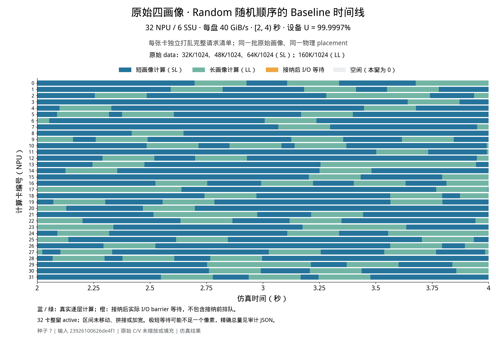
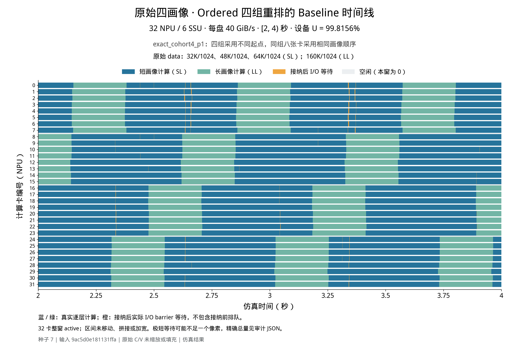

**原始四画像：预定欠载主组的完整结果**

20/20 个计划运行全部完成并通过独立检查。32 NPU、6 SSU、每盘40 GiB/s；暖窗[2000,4000) ms。每卡整窗active且都有长短计算，暖机与全程逐盘欠载均通过。以下五种子等权平均±样本标准差，单位为%。

| 顺序 | 策略 | NPU平均利用率 | 暖接纳SLO×1.5达标率 |
|---|---|---:|---:|
| random | baseline | 99.999279 ± 0.000550 | 100.000000 ± 0.000000 |
| random | once | 99.902142 ± 0.055537 | 100.000000 ± 0.000000 |
| ordered | baseline | 99.811649 ± 0.017310 | 100.000000 ± 0.000000 |
| ordered | once | 99.642192 ± 0.156045 | 100.000000 ± 0.000000 |

**这组原始输入没有复现原图的大幅下降。** Baseline由随机改为Ordered，平均只下降0.187629个百分点（相对约0.188%）；Once的平均利用率也没有优于Baseline。

| 角色 | 原始 data 行 | 单层计算 ms | 单层读取 MiB | 每卡请求数 |
|---|---|---:|---:|---:|
| S1 | 32K/1024 | 7.257232 | 42.625 | 14 |
| S2 | 48K/1024 | 9.941586 | 64.625 | 14 |
| S3 | 64K/1024 | 12.625941 | 86.625 | 14 |
| L | 160K/1024 | 28.732067 | 218.625 | 7 |

每卡49条、全局1568条，每请求8层。三个S只是相对于L更短，策略分类为SL；原图三个S的分类为SS。Ordered小段为L,(S1,S2,S3)×2，重复7次；四个8卡组按原构造算法错开。Random各卡独立打乱同一配额。短任务纯计算份额67.490889%，接近原图67.467124%。任意组合逐盘名义需求上界39.630698<40 GiB/s。

原图短C只有0.528–0.899ms，此组为7.257–12.626ms，预取隐藏时间长很多。8个Long层的单盘服务工作量由约8.56ms变成7.12ms；这说明同规模读取突发更容易被计算遮住，但不是对所有实际队列的等待上界证明。

此替换还改变了读取量、长短时长比、请求配额、实际相位，以及Once的SS→SL类别Path/CIR池。因此它是原始数据适用性对照，不是只改变数据来源的单因素消融，也没有穷尽整个data的合法输入空间。

SLO选择暖窗内被NPU接纳的请求，按完成−接纳≤1.5×8C判断，跟踪至完成；不含接纳前队列等待，不是用户到达时刻计时的TTFT。

本页仅统计预定可行主组；nearest替换属于过载诊断，单独见[总报告](comparison.md)。冻结主组行及各原始结果路径/哈希见[primary_source_rows.json](primary_source_rows.json)。

两张独立的暖窗时间线（seed 7 Baseline，橙色为实际IO等待）：

[图形与来源审计](figures/timeline_audit.json)。
