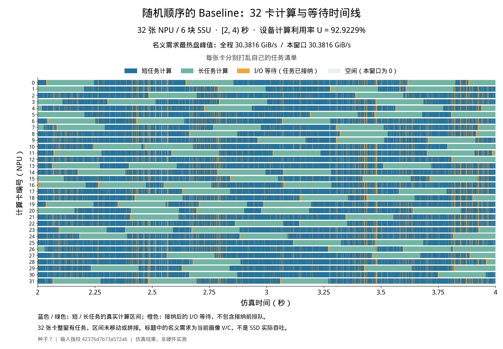
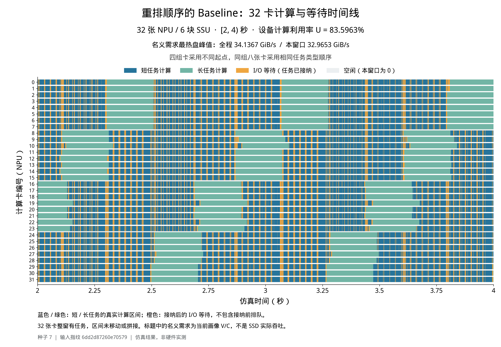
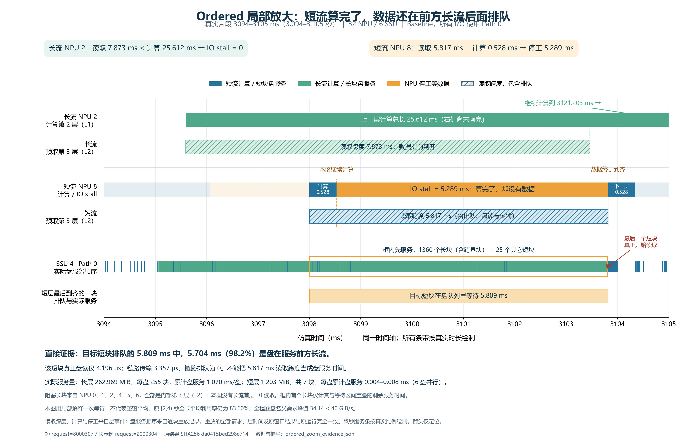

**32 NPU / 6 SSU：相同请求集合、不同输入顺序的 Baseline 欠载实验**

2026-09-08。主观测窗口固定为仿真时间 **[2000,4000) ms**。每盘 40 GiB/s，每卡接收链路 50 GiB/s，8 层，请求固定绑定原 NPU。所有数字均为本仓库离散事件仿真结果，不是硬件测量。

初次阅读可先看 [14 页中文入门图解 PDF](tutorial/baseline_newonce_beginner_guide.pdf)：从一张卡如何读数和计算讲起，第 11–14 页专门解释 NewOnce 的选路、共享预约账本与实测效果。

**追加实验与阅读入口**

[全部追加实验的统一 Markdown 汇总](warm_comparison_tables.md)已完成，含四组对照、原始画像参数和两张独立时间线。

后续验证已经表明：原始欠载四画像中，Baseline 五种子平均 Random 为 99.9993%、Ordered 为 99.8116%，没有复现原图约 10% 的下降。不要将下面初次探索的构造画像结果直接推广到原始 data。

- [原构造画像：Random / Ordered × Baseline / Once，20 格](paired_once_5seeds/comparison.md)
- [同一人口固定长短卡，40 格](role_separated_5seeds/comparison.md)
- [原始 data 全表与欠载子集随机抽样，20 格](raw_data_random_5seeds/comparison.md)
- [原始欠载四画像替换，20 个主组运行与两张独立图](raw_quartet_replacement/primary_comparison.md)

随机 / Ordered × Baseline / Once per layer 的五种子实验已经完成，见 [暖窗利用率与 SLO 对比表](paired_once_5seeds/comparison.md)。原图 seed 7 的相对 10.04% 下降是存在性案例；五种子平均下降为 7.44%，没有稳定达到 10%。下文的 38 份输入与 39 次仿真计数仅指初次探索批次，追加实验另行统计。

**初次探索可确认的结论**

找到了符合本轮约定的存在性案例：同一批请求，Baseline 从独立随机排序的 **92.922866%**，降到分组排列的 **83.596252%**，下降 **9.326614 个百分点、相对 10.036942%**。不能把它写成下降 10 个百分点。每卡整窗均有长、短计算且无 idle；全程逐盘当前请求的名义需求都低于 40 GiB/s。

这个幅度对随机种子敏感。固定同一排列设计，另外两个种子下仍下降，但没有重复达到相对 10%。因此证据支持“某些相关排列会使 Baseline 明显变差”，不支持“任意混合输入都会差 10%”或“该降幅在生产中常见”。后文保留未达标结果。

初次探索完成 **38 份输入 manifest、39 次仿真（38 次 Baseline、1 次 NewOnce）**，执行与来源审计全部通过。按暖窗/每卡混合及全程容量条件筛选后，36 次运行有效；存在输入模板相同、提交种子不同的重复运行，不能称为 39 个独立样本。完整结果见 [全部案例表](all_results.md)。

主要观测是 **短请求内部层等待增加**；这与大读取突发在共享 FIFO 中延迟短读取的机制一致。源码、排列干预和多路径对照共同支持这个解释；后续逐块观察重放进一步确认了局部短读取的 5.809 ms 排队中，98.2% 的时间在服务先入队的长块，见本文末尾局部放大图。这个片段不能代替全窗归因统计，也没有单独改变 FIFO 机制的消融。长计算本身不会占住其他卡；相反，它给自己的预取留下更多时间。每盘有独立的 Path0 FIFO，六个盘不是一条全局 FIFO。

**带宽约束的准确含义，以及首层预取如何记账**

记请求每层计算时间为 $C_r$ 秒，每层在盘 $s$ 的实际读取量为 $V_{r,s}$ GiB；$r_n(t)$ 是卡 $n$ 当前已接纳的请求。此次约束为：

$$
D_s(t)=\sum_{n:\,r_n(t)\text{存在}}\frac{V_{r_n(t),s}}{C_{r_n(t)}}<40,
\qquad \forall s,\forall t.
$$

按本轮约定，短请求最后一层计算期间，仍记当前短请求已有的 $V/C$，不额外加上下一条长请求首层的 $V_L/C_S$；下一请求被接纳时再切换画像。因此，我同意“不把首层预取再加一份”作为**名义需求的定义**。但这不等于首层读取没有成本，也不等于它的字节量等于当前短请求的一层。仿真保留所有首层 I/O、实际排队和链路传输，分别统计首层与内部层等待。

此条件约束的是“当前请求画像的速率之和”。它不约束真实提交的突发字节量、已经排队的旧工作量，不能单凭它断言所有预取截止期都可满足。一般速率约束还需要描述突发规模，例如 $A(t+\tau)-A(t)\le R\tau+B$；其中 $B$ 不能仅由 $R$ 推出。[RFC 3290 附录 A](https://www.rfc-editor.org/rfc/rfc3290#appendix-A)

扫描按全部 admission/completion 事件进行，同一时间事件合并后更新六盘向量。画像在事件之间不变，所以这不是间隔采样，也不是只验整个输入的平均值。另检查每卡名义需求不超过 50 GiB/s。选中案例的逐盘全程峰值如下：

| Baseline 输入 | 全程最热盘峰值 GiB/s | 主窗最热盘峰值 GiB/s | 任一盘超过 40 的时间 |
|---|---:|---:|---:|
| 随机，seed 7 | 30.381565 | 30.381565 | 0 ms |
| 重排，seed 7 | 34.136730 | 32.965262 | 0 ms |

这组画像不能证明“任意可能的长短并发组合都欠载”：若强行让 32 卡同时处理该长画像，通用逐盘上界会达到 53.475344 GiB/s。这里通过的是**实际完整运行每个事件区间**的检查。不要把这两种证明混用。初始另一组长画像 160K/1024 则具有任意组合逐盘不超过 39.630698 GiB/s 的强证书，但本轮尚未在它上面得到相对 10% 的排列退化。

**究竟输入什么请求**

S1、S2、S3、L 是本文的完整定义，不采用 E72、V38 一类隐含参数的代号。每卡完整输入有 608 条：三个短画像各 200 条，长画像 8 条；32 卡共 **19456 条**。读取按 176 KiB 块均匀轮转到六个盘，并保留每个原始请求的逐块 placement。

| 名称 | 序列长度 / NQL | 每层计算 ms | 每层读取 MiB | 单卡名义带宽 GiB/s | 8 层纯计算 ms |
|---|---|---:|---:|---:|---:|
| S1 | 1K / 128 | 0.527909 | 1.203125 | 2.225624 | 4.223271 |
| S2 | 1K / 256 | 0.697245 | 1.031250 | 1.444369 | 5.577964 |
| S3 | 1K / 384 | 0.899455 | 0.859375 | 0.933047 | 7.195638 |
| L | 192K / 768 | 25.612344 | 262.968750 | 10.026627 | 204.898752 |

整条 8 层请求的读取量分别为 9.625、8.250、6.875、2103.750 MiB。短计算不自动意味着高带宽：带宽由 $V/C$ 同时决定，此处短请求的读取量也小，所以其名义带宽反而低。

来源限制：S1–S3 的计算时间由现有 helper 基于 data 中 32K、48K 数据向 1K 外推；S3 的 NQL 384、L 的 NQL 768 使用邻近 NQL 插值。它们是用户允许的**基于 data 构造的画像**，不能称为原始 data 行或实测 1K 性能。

随机基准：每卡先拿到上述完整配额，再分别用 `seed + npu_id * 100003` 独立打乱，卡间顺序不同。

重排：先组成如下 76 条请求的模板，重复 8 次：

```text
L, (S1, S2, S3) × 25
```

然后把整个有限序列循环左移，具体为：

| NPU | 组内卡数 | 循环左移的请求条数 | 对应的纯计算前缀 ms |
|---|---:|---:|---:|
| 0–7 | 8 | 0 | 0.000000 |
| 8–15 | 8 | 1 | 204.898752 |
| 16–23 | 8 | 21 | 316.681226 |
| 24–31 | 8 | 48 | 469.653085 |

上述毫秒数只是输入序列的纯计算相位，**不是运行时的实际起跑时间或 barrier**。没有插入暂停、强制同步、跨卡迁移或额外请求。所有请求在 t=0 到达 NPU 的有限饱和队列；SSD 仍按原逻辑逐层接收 I/O。

每张卡都运行三种短画像和长画像，但同一组内八张卡采用同一画像顺序，这是人为制造跨卡相关性的压力输入。它不能代表“各卡输入始终相互独立”的现实假设。这也是从独立随机输入转向较坏输入时引入的关键条件，应明确展示而不是隐藏。

**数学上为什么这样排列**

目标同时满足两个条件：大请求的**读取突发**足够大，短请求的**预取计算窗口**足够短。设某盘在短读取之前已排入的工作量为 $Q_s$，简化 FIFO 完成下界为：

$$
W_{\mathrm{disk},S}\ge\frac{Q_s+V_{S,s}}{40}.
$$

当该时间超过 $C_S$，短请求下一层开始时就可能缺数据。还须考虑实际客户端提交交错与每卡接收链路，不能把“同时开始”直接当作“所有长块已经在短块前面”。

本例八张卡的一层长读取若集中排在前面，每盘需要约 **8.560181 ms** 服务；短请求的计算预算只有 **0.528–0.899 ms**。与此同时，长请求自身每层约 25.612 ms，足以隐藏大部分读取。让四组在不同相位进入长段，目的在于反复干扰另外几组的短段，而不是只在冷启动堵一次。

为了让短请求受损能反映到整机时间平均，短请求必须占有足够的总计算时间。本输入短请求的完整纯计算份额为 **67.467124%**，不是只占少量卡时间的边缘类别。

窗口内没有 idle 时，设备利用率为：

$$
U=1-\frac{W_{\mathrm{IO}}}{32\times2000\ \mathrm{ms}}.
$$

相对随机基准降低 10%，需要新增至少 **5947.063431 NPU-ms** 等待；实际 seed 7 新增 **5969.032932 NPU-ms**，只比门槛多约 21.97 NPU-ms。这解释了为何必须做种子复核，而不能把刚过线结果当作稳定规律。

**整机、类别、请求等权：不能换指标凑目标**

设备 U 为所有计算区间与主窗交集总长除以 64000 NPU-ms。类别池化 U 为该类的计算总时间除以接纳后 active 总时间；请求等权 U 为每个正重叠请求的窗口片段 $C/(C+W)$ 的算术平均。最后一个是窗口片段指标，不是完整请求 TTFT，也不含接纳前排队时间。

| 主窗指标 | 随机 seed 7 | 重排 seed 7 |
|---|---:|---:|
| 整机设备 U | 92.922866% | 83.596252% |
| 请求等权 U | 91.534836% | 84.598256% |
| 短类池化 U | 90.781891% | 78.206007% |
| 长类池化 U | 97.670974% | 97.458720% |
| 短类请求等权 U | 91.449827% | 84.445251% |
| 长类请求等权 U | 97.263624% | 95.332185% |
| 短类占总计算时间 | 67.334215% | 67.359975% |

请求等权 U 的相对降幅约 7.58%，**没有达到 10%**。短类计算份额仅变了 0.025760 个百分点；按重排后的份额、保持随机各类池化 U 不变，合成整体 U 仍是 92.921138%。因此整体下降不能主要解释为窗口里长短构成变了。

| 主窗暴露等待，NPU-ms | 随机 seed 7 | 重排 seed 7 | 新增 |
|---|---:|---:|---:|
| 首层 L0 | 950.905370 | 1617.769979 | 666.864609 |
| 内部层 L1–7 | 3578.460320 | 8880.628643 | 5302.168323 |
| 合计 | 4529.365690 | 10498.398622 | 5969.032932 |

**88.8279% 的新增等待在内部层 L1–7。** 长类内部层没有暴露等待；长类主窗总等待反而减少约 7.88 NPU-ms。单卡短转长首层本来就可能不够预取：本例长首层仅过 50 GiB/s 链路就约需 5.136108 ms，长于短计算。这一不可完全隐藏的开销保留在 L0 账中。

**暖机与完整批次检查**

随机和重排的每卡 active 均为 2000 ms。随机每卡最少短/长计算分别 915.981901 / 187.034212 ms；重排分别 1066.110902 / 409.797504 ms。每卡第 4 条请求最晚完成分别为 229.765444 / 245.692237 ms，均早于要求的 1500 ms。这里的“在运行”包括计算与等待 I/O；若要求每卡每时刻都在计算，则利用率按定义就是 100%。

完整相同人口也退化，不只是固定两秒里碰巧变差：

| 完整 19456 请求 | 随机 seed 7 | 重排 seed 7 |
|---|---:|---:|
| 总纯计算量，NPU-ms | 161234.069096 | 161234.069096 |
| 总暴露 I/O 等待，NPU-ms | 12808.454548 | 30721.634893 |
| makespan，ms | 5473.955203 | 6052.529924 |
| 完整批次设备 U | 92.046143% | 83.247249% |

makespan 增加 10.569592%。完整批次 U 包含最后部分卡提前结束的尾部 idle，不能当成另一段全卡 active 的暖窗。

**自然错开与随机性**

自然错开确实有帮助，本轮并没有证明它普遍失效。原始 data 中 32K/1024 与 160K/1024 的独立随机混合，设备 U 为 99.88%–100.00%；在已试的原始画像重排中，最大下降约 1.84 个百分点。

另一个合成短流案例中，按近似纯计算量分段只能得到约 0.43 个百分点下降；让每个重复模板中各短画像的配额精确相同后，下降明显加大。实际事件分析显示，近似分组的长层释放跨度可从约 0.03 ms 扩到暖窗的 57–78 ms；主要差异来自累计等待，不能全解释为计算时长漂移。因此，卡间相位、短画像顺序与等待反馈是关键变量。

固定上文精确四组模板，种子复测结果如下：

| 种子 | 随机 Baseline U | 重排 Baseline U | 下降百分点 | 相对下降 |
|---|---:|---:|---:|---:|
| 7 | 92.922866% | 83.596252% | 9.326614 | 10.036942% |
| 19 | 92.043367% | 85.474565% | 6.568802 | 7.136638% |
| 43 | 91.296985% | 85.511681% | 5.785304 | 6.336797% |

每对随机/重排使用相同的提交 seed。跨行同时改变随机基准的输入排序和底层提交 seed，因而不是只改变输入随机排列的单因素种子试验。重排后的画像模板与 placement 指纹相同，但提交 seed 不同，仍产生不同执行轨迹；不能把它们当作三个独立设计的坏输入。

最后补试 l768 四组的 2/3/4 长请求宏周期，设备 U 分别为 87.686205%、85.441642%、83.793858%；l1024 四组的 2 长请求宏周期为 85.038097%，均未优于已选案例。其中 l768 的 4 长宏周期在主窗有六张卡没有长计算，必须排除，不能用其完整批次较低的 U 替代合格暖窗。

全部审计还排除了 `synthetic_s150_l1_seed7`（NPU 14 主窗无长计算），以及 `concurrency_l1024_seed7__exact_cohort2_p1`（全程逐盘峰值 40.124773 GiB/s，违反欠载条件）。这三个案例保留原始结果但不计入有效证据。唯一同时通过全部条件且达到相对 10% 排列退化的，仍是上文 seed 7 案例。

**同一坏输入的多路径策略对照**

冻结 seed 7 的重排输入、NPU 绑定、placement、计算/读取量、提交 seed、预取触发规则和静态 CIR 配置，仅换为既有 `new_once` 策略：

| 指标 | Baseline | NewOnce |
|---|---:|---:|
| 主窗设备 U | 83.596252% | 99.140886% |
| 主窗请求等权 U | 84.598256% | 99.944274% |
| 主窗短类池化 U | 78.206007% | 100.000000% |
| 主窗长类池化 U | 97.458720% | 97.400297% |
| 主窗内部层 L1–7 暴露等待，NPU-ms | 8880.628643 | 0.000000 |
| 全程逐盘名义峰值，GiB/s | 34.136730 | 32.944469 |
| makespan，ms | 6052.529924 | 5104.219748 |

NewOnce 的主窗全卡活跃、每卡混合、暖机检查与全程逐盘欠载检查均通过。整机提高 **15.544633 个百分点**，这与本轮主要的“随机 Baseline 对重排 Baseline”比较是两件事。

这个干预支持共享 FIFO 的服务次序是显著影响因素，但不是“只把 path 数量从 1 改成多条”的严格消融：NewOnce 同时使用全局 reservation/ack 账、按类别限制的路径池及静态 CIR/WRR 仲裁，从而改变 I/O 服务次序和后续相位。没有请求迁移或 NPU 接纳队列重排，也没有运行时 CIR 写入。模型的控制操作延迟设为零；不能由此宣称现实控制成本也为零。

短类收益伴随长类轻微让步：对完整相同的 256 条长请求，池化 U 从 97.426683% 变成 97.153350%，总等待增加 151.472986 NPU-ms。完整 19200 条短请求池化 U 则从 78.759783% 提高到 99.994577%。这些完整人口比较避免把主窗两种策略完成不同数量请求造成的构成差异误读为收益或代价。

**图与可复核文件**

随机与重排分别导出为独立图片；六盘需求也独立成图。所有图均提供 PNG、单页 PDF、SVG，见 [图片目录与读图说明](figures/separate/README.md) ；[展开的全部图片文件](figures/separate/)随项目保存。





图中蓝色为短计算、绿色为长计算、橙色为接纳后的 I/O 等待。[随机六盘需求图](figures/separate/random_demand.png) 与 [重排六盘需求图](figures/separate/ordered_demand.png) 的六条线是当前请求 $V/C$，不是 SSD 实际吞吐。



局部图取原暖窗内的 **3094–3105 ms**。NPU 2 长流预取内部第 3 层（L2）花费 7.872949 ms，小于上一层计算的 25.612344 ms，IO stall 为零；NPU 8 短流预取同样的层序号花费 5.817127 ms，上一层仅计算 0.527909 ms，因此暴露 **5.289218 ms** 等待。这里“读取跨度”包括排队和传输，不是自身占用磁盘的服务时间。

逐块记录确认：使短层最后就绪的 SSU 4 数据块排队 **5.809174 ms**，期间 **5.704269 ms（98.2%）** 是服务在它之前入队的长块，另有 0.104904 ms 服务其它短块，没有空闲。轮到目标短块后，真实盘服务仅 **4.196 微秒**，链路传输 3.357 微秒，链路排队为零。阻塞长块来自 NPU 0、1、2、4、5、6，均为内部 L2；本图窗口没有长流首层 L0 读取。这为该次等待提供了直接 FIFO 服务证据；该局部片段不替代全窗平均，也不是对全部等待的归因统计。

数据来自冻结输入的观察重放，请求、层时间戳、窗口指标及磁盘统计均与原运行完全一致，见 [重放审计](diagnostics/ordered_block_trace_audit.json) 与 [图中数值及来源](figures/separate/ordered_zoom_evidence.json)。原合并图保留在 [此处](figures/concurrency_l768_seed7_comparison.png)。

- [全部案例表](all_results.md)、[独立逐事件核算 JSON（gzip）](analysis.json.gz)、[全部窗口与指标 CSV](summary.csv)。无效暖窗与未达到目标的案例均保留。
- [测试前数学推导](mathematical_design.md)、[相位诊断](phase_diagnostics.json)。
- [随机输入 manifest](inputs/concurrency_l768_seed7.json.gz)、[重排输入 manifest](inputs/concurrency_l768_seed7__exact_cohort4_p1.json.gz)。同目录 description 文件记录画像、配额、精确相位和来源。
- [审计脚本](analyze.py)、[精确顺序生成器](exact_order_design.py)、[绘图脚本](plot_case.py)、[种子复核脚本](run_replication.py)。
- [NewOnce 对照命令与结果哈希](new_once_control_record.json)。

重排时因原模拟器按同 arrival 下的 request_id 排序，重新编码位置 ID，同时保存 original_request_id 双射。核对每卡请求人口、计算/读取参数、arrival、NPU 绑定与每块 placement 完全一致；仅顺序和相关位置 ID 改变。核心模拟器没有修改，运行结果附有源码哈希及 invariants。

源码定位：[Path0 客户端](../../continuous_prefill_client.py)、[磁盘 FIFO 与调度](../../sim.py)、[逐层预取及提交随机顺序](../../continuous_batch_sim.py)、[共用运行配置](../../run_coflow_experiments.py)。全部运行在本地并行完成。

在仓库根目录可直接复跑冻结输入：

```bash
python3 -B run_baseline_npu32_stress.py --manifest results/baseline_32npu6ssu_underload/inputs/concurrency_l768_seed7.json.gz --strategy baseline --assignment fixed --window 2000:4000 --output /tmp/underload_random_recheck
python3 -B run_baseline_npu32_stress.py --manifest results/baseline_32npu6ssu_underload/inputs/concurrency_l768_seed7__exact_cohort4_p1.json.gz --strategy baseline --assignment fixed --window 2000:4000 --output /tmp/underload_ordered_recheck
python3 -B results/baseline_32npu6ssu_underload/analyze.py --strategies baseline
```

**结论的边界**

本轮证明该 FIFO Baseline 在定义明确的逐时刻名义欠载条件下，会因某些相关排列而退化。机制证据与“大读取突发延迟短读取、超出短预取预算”一致，但没有证明物理突发完全无拥塞、所有生产长短混合都会坏，也没有测得生产 TTFT/SLO。输入外推、固定八层、均匀 striping、有限饱和队列、组内模板相关、提交随机性和两秒观察窗口，都是外推到真实系统前必须保留的条件。
