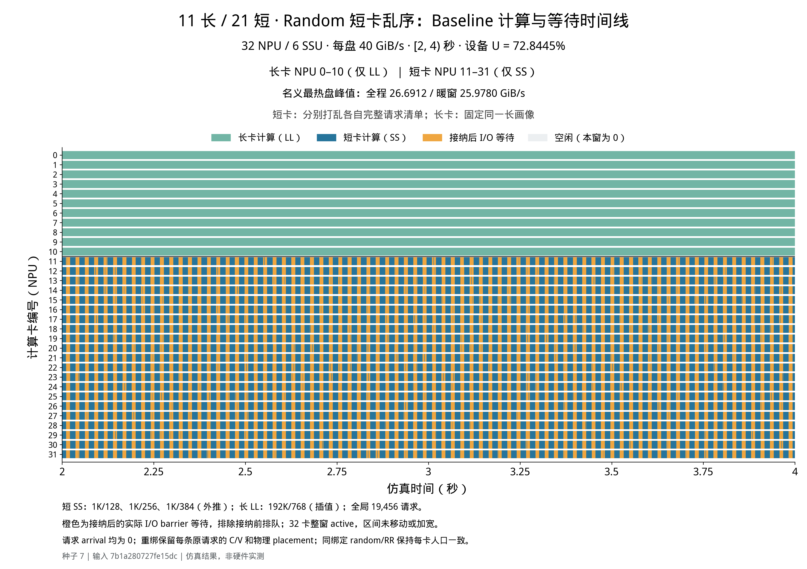
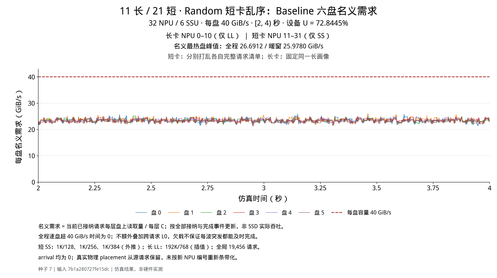
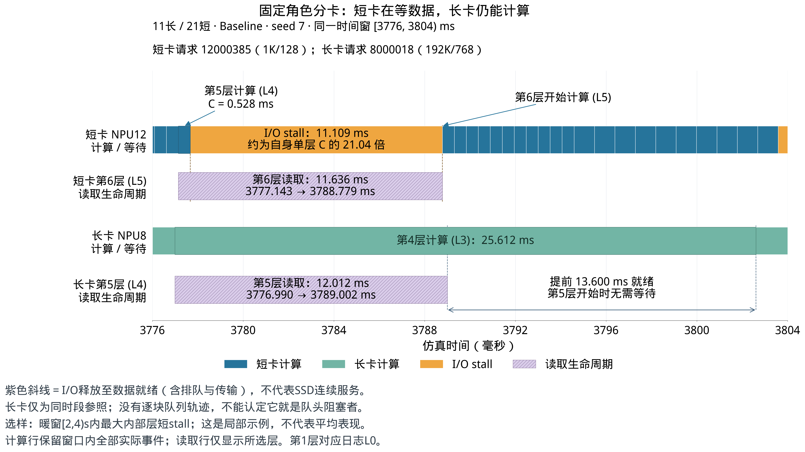

**固定长短卡：输入如何分配、图应该怎么看**

这里的“长卡／短卡”指任务分工，所有 NPU 的硬件配置相同。长卡只处理 L，短卡只处理 S1、S2、S3；全部 32 张卡仍共享同一组 6 块 SSU。没有为长短卡划分专用磁盘，也没有运行时跨卡迁移。原混合实验也固定绑定 NPU；这次改变的是长短请求分到不同卡，因此不能把变化单独归因于“固定绑定”。

**全部图均为 seed 7 的 Baseline 单次轨迹**，从现有仿真日志绘制，没有重跑仿真、拼接时间或加宽等待。统一主窗 [2000,4000) ms；每盘 40 GiB/s、每卡接收链路 50 GiB/s、每请求 8 层。图中值与此前报告的五种子均值略有不同，是统计范围不同。

**输入的四种请求**

全局仍是原实验的 19,456 条构造请求：三种短请求各 6,400 条，长请求 256 条。下面的 C、V 都是单层值；每条请求有八层。1K 短画像采用外推，192K/768 长画像采用插值，这组不是后面的原始 data 四画像实验。

| 名称 | 序列长度 / NQL | 单层计算 C（ms） | 单层读取 V（MiB） | 整条8层纯计算（ms） |
|---|---|---:|---:|---:|
| S1 | 1K / 128 | 0.527909 | 1.203125 | 4.223271 |
| S2 | 1K / 256 | 0.697245 | 1.031250 | 5.577964 |
| S3 | 1K / 384 | 0.899455 | 0.859375 | 7.195638 |
| L | 192K / 768 | 25.612344 | 262.968750 | 204.898752 |

**每张 NPU 实际分到多少条**

下表中的数量都是“每张卡”的数量。同一行的卡具有相同配额，但 Random 下的请求身份和排列不相同。两种绑定方案分别使用完整的同一全局请求集合，不能把两种方案的请求数量相加。

| 绑定方案 | NPU编号 | 卡数 | 每卡 S1 | 每卡 S2 | 每卡 S3 | 每卡 L | 每卡总请求 |
|---|---|---:|---:|---:|---:|---:|---:|
| 11长/21短 | 0–2 | 3 | 0 | 0 | 0 | 24 | 24 |
| 11长/21短 | 3–10 | 8 | 0 | 0 | 0 | 23 | 23 |
| 11长/21短 | 11–26 | 16 | 305 | 305 | 305 | 0 | 915 |
| 11长/21短 | 27–31 | 5 | 304 | 304 | 304 | 0 | 912 |
| 6长/26短 | 0–3 | 4 | 0 | 0 | 0 | 43 | 43 |
| 6长/26短 | 4–5 | 2 | 0 | 0 | 0 | 42 | 42 |
| 6长/26短 | 6–9 | 4 | 247 | 247 | 247 | 0 | 741 |
| 6长/26短 | 10–31 | 22 | 246 | 246 | 246 | 0 | 738 |

分配时，先把每种画像对应的原请求身份独立打乱，再从该角色编号最小的 NPU 开始轮流分发。不能整除的余数分给前面的卡，所以会出现 23/24、304/305 等配额差别。分卡完成后才安排卡内顺序；同一绑定方案内的 Random 与轮流排序保持每张卡的请求身份、C、V 和实际落盘位置相同。

**卡内怎样输入和执行**

所有请求在 t=0 就进入各自卡的有限待处理队列；不是把整条请求的八层读取都在 t=0 发给 SSD。每卡每次处理一条请求，按既有逐层预取机制推进；计算当前层时可以预取下一层，最后一层计算时可以预取本卡下一请求的首层。

- 长卡：队列里全是 L，Random 和轮流排序的长请求身份顺序完全一致。
- 短卡 Random：分别独立打乱本卡的整份 S1/S2/S3 清单。
- 短卡 round_robin（轮流）：S1 → S2 → S3 → S1 → S2 → S3，直到清单耗尽。这不是原混合实验的四组 Ordered 相位构造。

例如，11长/21短方案中，下面是两张短卡 Random 队列的真实前12条：

| NPU | 真实队列前12条（从左向右执行） |
|---|---|
| 11 | S2 → S2 → S2 → S2 → S3 → S1 → S3 → S1 → S2 → S2 → S3 → S3 |
| 12 | S3 → S2 → S1 → S2 → S2 → S3 → S2 → S1 → S3 → S3 → S2 → S2 |

短卡始终没有长请求，因此它也不会在短请求末层突然预取本卡下一条长请求。它仍会与其他长卡共享 SSD 的 FIFO，受到那些长读取的影响。

每条请求原有的 176 KiB 分块和 SSU 落盘位置原样保留。原条带规则是 `SSU = (块序号 + 原NPU编号//4) % 6`；重新分卡后不按新 NPU 编号重新计算 placement。因此每张新卡的不同请求可能保留不同的原条带起点。

[详细分配与随机种子公式](input_assignment.md)；[逐卡配额CSV](input_assignment_by_npu.csv)。四个完整队列CSV位于 `input_sequences/`，可查到每条请求的新卡、队列位置和原身份。

**独立图片下载**

| 绑定 | 短卡顺序 | 32卡计算／等待时间线 | 六盘名义需求 |
|---|---|---|---|
| 11长/21短 | random | [PNG](figures/separate/l11_s21_random_baseline.png) / [PDF](figures/separate/l11_s21_random_baseline.pdf) / [SVG](figures/separate/l11_s21_random_baseline.svg) | [PNG](figures/separate/l11_s21_random_demand.png) / [PDF](figures/separate/l11_s21_random_demand.pdf) / [SVG](figures/separate/l11_s21_random_demand.svg) |
| 11长/21短 | round_robin | [PNG](figures/separate/l11_s21_round_robin_baseline.png) / [PDF](figures/separate/l11_s21_round_robin_baseline.pdf) / [SVG](figures/separate/l11_s21_round_robin_baseline.svg) | [PNG](figures/separate/l11_s21_round_robin_demand.png) / [PDF](figures/separate/l11_s21_round_robin_demand.pdf) / [SVG](figures/separate/l11_s21_round_robin_demand.svg) |
| 6长/26短 | random | [PNG](figures/separate/l6_s26_random_baseline.png) / [PDF](figures/separate/l6_s26_random_baseline.pdf) / [SVG](figures/separate/l6_s26_random_baseline.svg) | [PNG](figures/separate/l6_s26_random_demand.png) / [PDF](figures/separate/l6_s26_random_demand.pdf) / [SVG](figures/separate/l6_s26_random_demand.svg) |
| 6长/26短 | round_robin | [PNG](figures/separate/l6_s26_round_robin_baseline.png) / [PDF](figures/separate/l6_s26_round_robin_baseline.pdf) / [SVG](figures/separate/l6_s26_round_robin_baseline.svg) | [PNG](figures/separate/l6_s26_round_robin_demand.png) / [PDF](figures/separate/l6_s26_round_robin_demand.pdf) / [SVG](figures/separate/l6_s26_round_robin_demand.svg) |

**11长/21短的局部放大：** [PNG](figures/separate/l11_s21_random_zoom.png) / [PDF](figures/separate/l11_s21_random_zoom.pdf) / [SVG](figures/separate/l11_s21_random_zoom.svg).

建议先打开 11长/21短 Random 的时间线：NPU 0–10 的绿色是长计算，NPU 11–31 的蓝色是短计算，橙色是接纳后的真实 I/O 等待。长卡与短卡分界在 NPU 10 和 11 之间。6长/26短图的分界在 NPU 5 和 6 之间。所有卡在整个主窗都有任务。

再看对应的六盘需求图。它画的是每张卡“当前请求单层在该盘的读取量 / 单层计算时间”之和，不是磁盘实际吞吐，也不是物理队列长度。

| seed 7 情况 | 整机 U | 短卡 U | 长卡 U | 逐事件扫描的全程名义峰值（GiB/s） | 全程超40时间 |
|---|---:|---:|---:|---:|---:|
| 11/21 random | 72.8445% | 58.6202% | 100.0000% | 26.691155 | 0 ms |
| 11/21 round_robin | 72.8428% | 58.6177% | 100.0000% | 31.735895 | 0 ms |
| 6/26 random | 83.3630% | 79.5237% | 100.0000% | 19.321644 | 0 ms |
| 6/26 round_robin | 83.4815% | 79.6696% | 100.0000% | 26.559836 | 0 ms |

不依赖具体排序的逐盘名义需求上界为：11长/21短 **31.735895 GiB/s**，6长/26短 **26.559836 GiB/s**，均低于40。这与表中逐事件扫描得到的某次运行名义峰值是两个概念。名义需求不额外叠加跨请求首层预取，但仿真保留所有真实读取及其等待。

**局部放大图的读法**

该图在完整落入暖窗的内部短层等待中，选择最大的一次来说明现象，不代表平均等待。短卡 NPU12 的前层计算只有约0.528 ms，随后等待约11.109 ms，约为自身单层计算的21.04倍。同期长卡 NPU8 的一段读取跨度约12.012 ms，完整落在25.612 ms计算内，因此该层没有额外等待。精确时间戳见 [zoom_evidence.json](figures/separate/zoom_evidence.json)。

读取跨度包含排队、服务和传输，不等于这张卡一直占着SSD。此图用现有层日志作同时间参照，没有该case的逐块物理服务轨迹，因此不能认定图中的特定长请求就是短请求的FIFO队头阻塞者。

这些图说明固定角色的构造输入会持续暴露短卡等待；它们不满足原混合实验“每张卡同时有长短”的条件，也不能推广为所有原始 data 输入都一样差。6长卡方案的整批尾部还有绑定不均衡，主窗图没有把尾部空卡时间算入。

**复现与来源**

主图：`plot_role_separate.py`；局部图：`plot_role_zoom.py`；输入导出：`export_input_assignment.py`。绘图与队列导出不修改冻结输入、策略或仿真结果。图文件自带来源信息，绘图审计JSON和输入审计JSON保留路径、SHA256及逐项核验。
