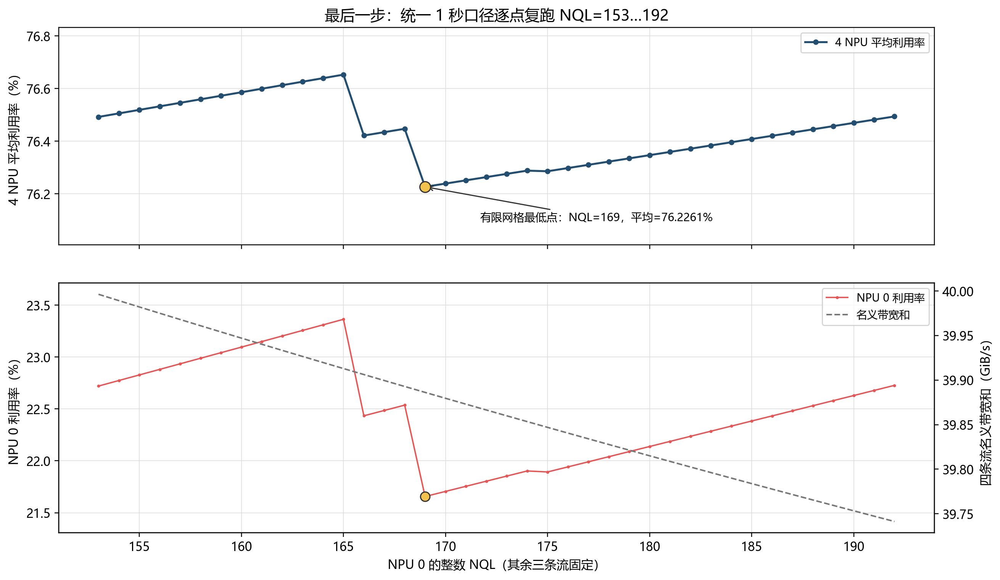
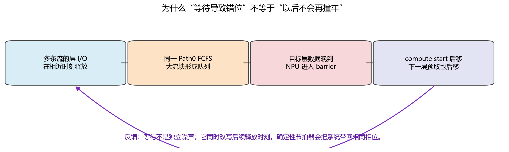

这是一份**仿真反例教程，不是 GLM-5.1 实机性能预测**。

研究条件：4 个独立 NPU 执行通道、1 个 SSU、每请求 8 层、跨请求预取开启；Prefill 的 KV 数据从 SSD 直接传入 HBM，**不使用主机 DRAM 缓存或中转**。

在这组输入和当前 Baseline 模型中，四卡名义带宽和为 **39.8862 GiB/s**，中间 1 秒的平均计算时间利用率为 **76.2261%**；NPU0 仅为 **21.6560%**。

最重要的结论不是“平均带宽不够”，而是：

> 一层数据能否按时到达 HBM，取决于排队、服务与接收的总时间。平均带宽够用，不代表短计算层的读取 deadline 能被满足。等待会改变下一层的读取时刻，但不保证消除后续碰撞。

本版修订重点：

- 明确 SSD→HBM 数据路径，不引入 DRAM 缓存作为缓解手段。
- 拆开输入表，手算 NPU0 与 NPU1 的每个关键数字。
- 用完整时序纠正“等待期间读自己的数据，所以与此前排队无关”的归因。
- 补入五组敏感性测试、逐层 deadline 指标及 HBM 预取成本。
- 区分已验证事实、模型假设、现实预测和优化建议。
- 重绘图 1：定义蓝条与空白，分层展示 NPU1 预取；保留图 4 的配色与微秒放大修订。
- 图 4 补标 NPU2 的 L2 读取延迟，解释 SSD 时间占比，并新增四卡 0–10 ms 放大图。
- 补齐请求编号、层号、时间原点和预算词典；周期与因果小图使用事件标记，并反复显示各卡 V/C。
- 图 4A 聚焦 SSU 侧：每卡独立读取行，仅标发起与最后 SSD 完成，不画 HBM 接收标记。附同页精确时刻表，发起间隔箭头连到同卡的两个发起点。

阅读路线：第 1–3 节建立概念；第 4 节照着算输入；第 5–7 节看 trace 与对照；第 8–10 节判断现实适用性和改进方向；第 11 节复现与核对来源。

\newpage
\tableofcontents
\newpage

# 固定讨论范围：SSD 直通 HBM

**先认识图里的人和事，再读结论。**

一个 **NPU** 是一张独立执行任务的卡；一个 **请求** 是交给某张卡处理的一项完整工作。本实验每个请求依次运行 8 层，层号为 **L0、L1、…、L7**。层号从 0 起计，所以 L2 是层号 2、按执行顺序数的第 3 层，不能把它当作“2 个请求”。

\begin{longtable}{@{}p{0.32\linewidth}p{0.62\linewidth}@{}}
\toprule
写法 & 含义与容易混淆的地方 \\
\midrule
\endhead
\texttt{npu\_id=1} & 图中简写 NPU1，表示卡的编号，不是请求编号。 \\
\texttt{request\_id=100020} & 图中简写 R100020，是请求的唯一编号，类似订单号；不是 token 长度、层数或时间。 \\
\texttt{layer=3} & 图中简写 L3，是请求内部的第 3 号层，按顺序数为第 4 层。 \\
R100020/L3 & 请求 100020 的 L3；用“请求号/层号”定位一个层任务，不是 $100020\times3$ 的计算量。 \\
\bottomrule
\end{longtable}

本实验编号规则为 `NPU编号 × 100000 + 流内序号`，序号从 0 开始。因此 R100020 属于 NPU1，是它预置流中的第 21 个请求；**并不是测量窗口内的第 21 个请求**。这是构造脚本为了避免重号采用的规则，不是模型或硬件规范。

图里从 R110/L7 切到 R111/L0，意思是“旧请求做完最后一层，转入新请求第一层”。每层读取又会拆成多条 **I/O 命令**；因此请求、层、I/O 命令是三个不同层级。

**再认识每层的两个输入和两个时间。**

- $V$：这一层必须从 SSD 读到 HBM 的 KV 数据量；不是 NQL，也不是全部 8 层之和。
- $C$：NPU 计算一层需要的时间。本模型在算本层时预取下一层，因此 $C$ 也是通常能隐藏下一层 I/O 的时间预算。
- $S=V/B$：在纯带宽模型中，SSD 真正服务这些字节需要累计多久；$B=40$ GiB/s。它不包含排队。
- $L=t_{\mathrm{ready}}-t_{\mathrm{release}}$：从发起读取到这一层 KV 全部到齐 HBM 的延迟，包含排队、服务与接收。

**本例贯穿全文的每层需求卡。** 后面的图重复显示 V/C，避免读图时不断翻页。1 GiB=1024 MiB；1 ms=1000 µs。

| NPU | 每层读取 V (MiB) | 每层计算 C (ms) | SSD 累计服务 S (ms) |
|---:|---:|---:|---:|
| 0 | 1.148071 | 0.582149 | 0.028029 |
| 1 | 263.505859 | 12.390165 | 6.433249 |
| 2 | 262.796875 | 29.856563 | 6.415939 |
| 3 | 262.796875 | 29.856563 | 6.415939 |

这些是构造输入的数值，不是“所有 GLM-5.1 硬件都需要这么久”的结论。第 4 章解释来源与计算。

**时间词典。** “7.562 ms 发起”是一个**时刻**；“到 SSD 完成用了 12.856 ms”是一段**时长**，不能在横轴上直接寻找“12.856”这个完成点。完成点是“发起时刻 + 延迟”。图中文字会四舍五入，最后一位可能有舍入差；绘制位置与核算使用原始精度。

除图中明确写明“预测从现在 0 开始”或“微秒尾部放大”外，全文时间线统一把测量窗口起点 2430.127253 ms 记作 **0 ms**；负数表示窗口之前，0–10 ms 只是这一秒里的一小段。用 a、b、c 等字母标记太近的事件，并在同图下方列精确时间；不靠目测标准刻度推算。

“发起读取”不等于 SSD 已开始服务；“SSD 服务完成”不等于最后数据已到 HBM；“HBM 到齐”也不一定立即计算——前一层可能还没算完。**deadline** 是“这层数据最晚何时到齐才不挡住计算”的时刻；**barrier** 是因为数据未到齐而实际暴露的等待。

\newpage

## 数据路径与调度路径是两件事

按用户指定的场景：Prefill 所需的历史 KV 默认位于 SSD，读取后直接进入目标 NPU 的 HBM；不经过主机 DRAM 的数据缓存或 bounce buffer（中转缓冲区）。当前模拟器的相关阶段可以理解为：

$$
\text{命令进入 Path0}\longrightarrow\text{SSU/SSD 服务}
\longrightarrow\text{接收链路传入 HBM}\longrightarrow\text{层数据 ready}.
$$

它没有主机 DRAM 数据缓存阶段，因此这次澄清**不要求改变已有仿真结果**。但模型也没有实现真实 HBM 容量分配、淘汰与 DMA 引擎争用；“没有 DRAM 阶段”不等于“已验证真实直通硬件”。

这里的“无 DRAM”限定的是 **KV 数据载荷**，不要求 CPU 完全不参与提交，也不要求控制面元数据消失。作为同类技术实例，NVIDIA GDS 允许存储与 GPU 内存直接 DMA，控制路径仍可由 CPU 驱动执行。这说明直通路径具有工程可行性，不证明本项目 NPU 使用同一实现。[S1：GDS 官方概述](https://docs.nvidia.com/gpudirect-storage/overview-guide/index.html)

| 问题 | 本文采用的条件 |
|:--|:--|
| 数据经过哪里？ | SSD 直接到 HBM，无主机 DRAM 数据缓存/中转 |
| 命令按什么顺序服务？ | Baseline 全进 Path0，Path 内严格 FIFO |
| 后端同时处理多少命令？ | 模型中每 SSU 只有一条活动命令 |

SSU 的共享服务带宽为 40 GiB/s，每 NPU 有独立的 50 GiB/s 接收链路；后者不是 HBM 本地读写带宽。

**第一条不能推出后两条。** 直通只改变数据传输路径；队列是否可重排、介质是否并行、是否限制队列深度，必须另行确认。

## 四个 NPU 在模型里代表什么

每个 NPU 独立运行自己的固定请求流，`batch_size=1`。该请求等 I/O 时，模拟器不会调度另一个请求的计算去填满同一张卡；跨请求预取只帮助读取，不等于跨请求计算并发。

若真实“四张卡”共同组成一个张量并行或流水线并行组，而不是四个独立执行通道，就不能直接套用这四条独立时间线。必须重新确定每卡的计算、KV 分片、同步等待与链路负载。

## 三个结论边界

**单位：** 后文按用户后续明确的 **40 GiB/s** 讨论。主输入 39.886158 GiB/s 等于 42.827436 GB/s，不满足字面的十进制 40 GB/s。原结果另有输入 37.172558 GiB/s = 39.913730 GB/s，平均利用率为 77.7745%。该审计只收紧输入需求，物理 SSU 仍为 40 GiB/s，不能说验证了“40 GB/s 的物理 SSU”。

**搜索范围：** 76.2261% 是固定其它三条流后，NPU0 的整数 NQL=153…192 共 40 个候选中的最低值，不是全局最小值。

**数据来源：** `data` 有 84 个参数点，但没有概率、频率权重或测量设备说明。本例保留其参数关系并插值/外推，不能声称复现了真实请求分布。

\newpage

# 先看结果，再审计测量口径

## 只统计中间一秒

每个 NPU 先完成至少 8 个请求，再稳定运行 500 ms，随后测量精确的 1,000 ms。主实验的绝对窗口为：

$$[2430.127253,\ 3430.127253]\ \mathrm{ms}.$$

利用率定义为**计算事件占据的时间比例**：

$$U_i=\frac{\text{窗口内 compute 覆盖时间}}{1000\ \mathrm{ms}},
\qquad\bar U=\frac{U_0+U_1+U_2+U_3}{4}.$$

它不是峰值 FLOPS 利用率，也不是 MFU。显示 100% 不表示算子达到了硬件峰值吞吐。

| NPU | 计算时间 (ms) | 等 I/O 时间 (ms) | 利用率 |
|---:|---:|---:|---:|
| 0 | 216.560 | 783.440 | 21.6560% |
| 1 | 832.484 | 167.516 | 83.2484% |
| 2 | 1000.000 | 0.000 | 100.0000% |
| 3 | 1000.000 | 0.000 | 100.0000% |

平均为 **76.2261%**。每卡均有 active request，compute 与 I/O barrier（因数据未到齐而等待）覆盖完整一秒。不是因为 NPU0 没有任务才利用率低。

SSD busy 为 **869.105 ms**，实际服务吞吐为 **34.7642 GiB/s**。所以不是 SSD 始终满载；反复出现的是“突发提交—排队—计算停顿”的结构。

{width=100%}

**图 1 怎么读：** A 图每卡分为“读取”和“算/等”两行。蓝条起点是发起该层读取，终点是该层所需 KV 全部到达 HBM，不能把整段当作 SSD 持续传输。蓝条内也可能正在排队；读取轨道空白才表示该卡当时没有已发起但未完成的层级读取，不代表 NPU 或 SSD 空闲。

B 图将请求 100020 的 L3–L6 读取分行，层号沿用日志、从 L0 开始。26.854 ms 时，L3 读取和等待同时结束，NPU1 开始计算 L3 并预取 L4。因此，旧图里“红色结束后继续出现的蓝线”属于下一层 L4，而不是同一层 L3 还没读完。

33.343 ms 时 L4 已到齐，但 L3 还要计算到 39.244 ms。这 **5.901 ms** 内，全部 NPU1 读取记录均无未完成区间，NPU1 状态仍是计算；到 39.244 ms 开始计算 L4 时才发起 L5 读取。这解释了蓝线为何断开：当前模型只在本层计算开始时预取下一层，并非读完一层就立即继续预取下下层。跨请求预取已开启，也不改变这一层深限制。图上时间保留三位小数，边界位置使用原始精度。

## 中间窗口不能忽略所有 Layer 0

中间窗口排除了仿真最初的冷启动，但每运行 8 层就进入下一请求的 Layer 0。跨请求预取改变这些 Layer 0 的读取时刻，它们仍参与排队。

SLO 是“请求有没有在规定时限内完成”的统计。本实验 NPU0–3 在这一秒内分别从等待队列**新接纳**了 47、8、4、4 个请求；把它们加入统计名单，再跟踪到 8 层做完。接纳不是请求到达，也不是预取开始。各卡最后 1 个样本都在窗口结束后才完成，**不能说所有样本都在这一秒内完成**。利用率仍只截取指定一秒的计算；窗口前已接纳、但窗口内仍在算的请求，也贡献利用率。

\newpage

# 三个基本量：数据量、计算时间、读取时间

## token、NQL 与每层 KV

设总长度为 $T$，本次新增 query token 数为 $N$（NQL）。本例把 $T-N$ 个历史 token 的 KV 作为 SSD 上待读取的前缀，每 token、每层采用 **1,408 byte** 的数据量模型。

$$V_{\mathrm{bytes}}=(T-N)\times1408,\qquad
V_{\mathrm{GiB}}=V_{\mathrm{bytes}}/2^{30}.$$

不是每层重新计算全部历史 token；它们提供当前 query 所需的 KV。每层计算时间 $C$ 来自 `data` 或其插值/外推，**不是只按 NQL 比例缩放**。

还要区分完整冷 Prefill 与读取已有前缀 KV 后处理新增 token：本例研究后者。若从未存在可读取的前缀 KV，就不能直接假设有同样的 SSD 读取量。

## 名义带宽是速率，不是读取时间

若 $C$ 用 ms 表示，则：

$$B_i=\frac{V_i}{C_i/1000}\quad(\mathrm{GiB/s}).$$

含义：在无 I/O 等待的连续计算节拍下，要用本层计算时间掩盖下一层读取，需要多少平均速率。它不是瞬时提交速率、带宽预留或发生阻塞后的实际吞吐。

结果字段 `instantaneous_fixed_stream_sum_gibps` 应读作“四条固定画像的名义需求和”，不能理解为平滑的瞬时到达。每请求 8 层时，数据量与理想计算时间均乘 8，比值不变。

$(T-N)/C$ 的单位是 token/s，乘 1,408 后是 byte/s；这是**带宽需求，不是时间**。无竞争、40 GiB/s 的纯带宽 SSD 模型下，自身服务时间为：

$$S_i=\frac{V_i}{40}\times1000\quad(\mathrm{ms}).$$

真正决定是否停顿的是从释放读取到 HBM ready 的总延迟：

$$L_i=W_{\mathrm{before}}+S_i+W_{\mathrm{between}}+T_{\mathrm{tail}}.$$

分别表示：首次服务前等待、自身服务、自身命令之间的等待、最后 SSD 完成后的接收尾部。相邻层同为固定计算时间 $C_i$ 时：

$$\mathrm{barrier}_i=\max(0,L_i-C_i).$$

SSD 与接收链路可以按命令流水重叠，不能再把整层 $V/50$ 一律串行加在 SSD 完成时间后；$T_{\mathrm{tail}}$ 只计最后残留的接收时间。

## 预取怎样形成反馈

本层计算开始时提交下一层读取，本层计算结束就是下一层数据的 deadline。用 $x_k$ 表示第 $k$ 层计算开始、$F_{k+1}$ 表示下一层 HBM ready，则：

$$x_{k+1}=\max(x_k+C_k,F_{k+1}).$$

数据晚到会推迟下一层计算，也推迟再下一层读取。最后一层开始计算时，预取下一个已到达请求的 Layer 0；仍只提供一个计算窗口，不是无限深预取。

\newpage

# 输入怎样算出来，以及怎样找到候选

## 四条输入：拆成两张表

沿用仓库习惯，1K = 1,024 token。“命令”指本模拟器的 QoS I/O 命令，不是 NAND 物理页。

| NPU | 总 token $T$ | NQL $N$ | SSD token $T-N$ | 命令/层 |
|---:|---:|---:|---:|---:|
| 0 | 1,024 | 169 | 855 | 7 |
| 1 | 196,608 | 368 | 196,240 | 1,534 |
| 2 | 196,608 | 896 | 195,712 | 1,529 |
| 3 | 196,608 | 896 | 195,712 | 1,529 |

| NPU | KV/层 (GiB) | 计算/层 (ms) | 名义需求 (GiB/s) |
|---:|---:|---:|---:|
| 0 | 0.001121163 | 0.582149 | 1.925903 |
| 1 | 0.257329941 | 12.390165 | 20.768888 |
| 2 | 0.256637573 | 29.856563 | 8.595684 |
| 3 | 0.256637573 | 29.856563 | 8.595684 |

$$1.925903+20.768888+8.595684+8.595684
\simeq39.886158\ \mathrm{GiB/s}.$$

NPU0 是**短计算、小读取、怕排队**的流；NPU1 是**大读取、较短计算**的流；NPU2/3 是**大读取、较长计算**的流。这些角色名称不代表额外调度优先级。

四条输入均不是原表的离散点：NPU1/2/3 在 192K 长度上沿 NQL 插值；NPU0 还把 32K/48K 的长度关系外推至 1K。文件哈希能证明来源未变，不能证明原表是硬件实测。

**TTFT 别混用：** 输入画像中的“78 层等效 TTFT”是 $78C$，而本例 8 层的理想纯计算总时间是 $8C$。例如 NPU0 分别为 45.407660 ms 与 4.657196 ms，均不是含 I/O 停顿的实际请求延迟。模拟器 SLO 统计的请求耗时从 admission 到 completion，不含所有请求在时间 0 到达后等待接纳的时间。

下面用原表与四则运算分别算 NPU0、NPU1，不必先背表里的数字。

\newpage

## 手算 NPU0：1K 总长度，NQL=169

**第一步：算 SSD 上的历史 KV。**

$$
\begin{aligned}
T-N&=1024-169=855\ \text{token},\\
V_0&=855\times1408=1{,}203{,}840\ \text{byte},\\
V_0/2^{30}&=0.001121163368\ \text{GiB}.
\end{aligned}
$$

每条满命令含 128 token，所以 $855=6\times128+87$：6 条满命令加 1 条尾命令，共 7 条。

**第二步：从原表取得计算时间端点。单位为微秒 µs。**

| 总长度 | NQL=128 的计算/层 (µs) | NQL=256 的计算/层 (µs) |
|:--|---:|---:|
| 32K | 1178.025959 | 1997.479696 |
| 48K | 1513.570276 | 2668.568314 |

在每个 NQL 上，沿 32K 与 48K 两点确定的直线外推到 1K：

$$C_{1K,n}=C_{32K,n}+\frac{1-32}{48-32}
\left(C_{48K,n}-C_{32K,n}\right).$$

得到 $C_{1K,128}=527.908845$ µs，$C_{1K,256}=697.245498$ µs。

**第三步：在 NQL=128 与 256 之间插值到 169。**

$$a=\frac{169-128}{256-128}=\frac{41}{128}=0.3203125,$$

$$
\begin{aligned}
C_0&=527.908845+a(697.245498-527.908845)\\
&\simeq582.149492\ \mu\mathrm{s}=0.582149492\ \mathrm{ms}.
\end{aligned}
$$

这就是 **0.582 ms 的来源**：它是外推/插值结果，不是“169 token 在任意 NPU 上一定算这么久”。

**第四步：分别算名义带宽与自身读取时间。**

$$B_0=\frac{0.001121163368}{0.000582149492}
\simeq1.925903\ \mathrm{GiB/s},$$

$$S_0=\frac{0.001121163368}{40}\times1000
=0.028029084\ \mathrm{ms}.$$

自身读取约 0.028 ms，计算预算 0.582 ms；单独服务时很宽裕。但共享 Path0 的排队可以远大于这两者。

\newpage

## 手算 NPU1：192K 总长度，NQL=368

**第一步：算数据量。**

$$
\begin{aligned}
T-N&=192\times1024-368=196{,}240\ \text{token},\\
V_1&=196{,}240\times1408=276{,}305{,}920\ \text{byte},\\
V_1/2^{30}&=0.257329940796\ \text{GiB}.
\end{aligned}
$$

$196{,}240=1533\times128+16$，即 1,533 条满命令加 1 条尾命令。

**第二步：直接在原表的 192K 行插值，无需长度外推。**

| 原表点 | 每层计算时间 (µs) |
|:--|---:|
| (192K, NQL=256) | 8708.365858 |
| (192K, NQL=512) | 17123.906302 |

$$b=\frac{368-256}{512-256}=\frac{112}{256}=0.4375,$$

$$
\begin{aligned}
C_1&=8708.365858+b(17123.906302-8708.365858)\\
&\simeq12390.164802\ \mu\mathrm{s}=12.390164802\ \mathrm{ms}.
\end{aligned}
$$

**第三步：算带宽与自身读取时间。**

$$B_1=\frac{0.257329940796}{0.012390164802}
\simeq20.768888\ \mathrm{GiB/s},$$

$$S_1=\frac{0.257329940796}{40}\times1000
=6.433248520\ \mathrm{ms}.$$

**为什么 NQL 只有 NPU0 的 2.18 倍，计算时间却是 21.28 倍？** 因为同时把总长度从 1K 改成了 192K。原表的计算时间同时依赖总长度与 NQL；两次计算不处于相同上下文。

这解释的是**本表的数值生成方法**，不能单凭比例证明真实 kernel 的规律。尤其 NPU0 是远离最短 32K 数据点的外推，短序列固定开销、算子与并行方式可能改变结果。

NPU2/3 同理：在 (192K,512) 和 (192K,1024) 之间，用权重 $(896-512)/512=0.75$ 插值，得到 29.856563 ms；每层自身 SSD 服务约 6.415939 ms。

\newpage

## 为什么选两条“长计算的大流”

这不是低利用率的必要条件，也不是必须保住两张卡满载才能构造坏输入，只是本次可解释的搜索策略：

- NPU2/3 每层各读约 0.2566 GiB，足以制造大突发；29.8566 ms 的计算窗口又能隐藏本次 trace 中各自的读取。
- 因为几乎不等待，它们的节拍保持稳定，周期性地向队列注入大量命令。
- NPU0 的计算窗口只有 0.582 ms，最怕这种长队列；NPU1 进一步增加竞争。

长计算降低的是**该流的长期名义需求**，提高的是**它自己**掩盖读取的能力；每次释放的数据量仍然很大。

两张卡始终满载还会使四卡平均值至少为 50%。若探索更低的全局平均利用率，就不应把这个角色组合固定成必要前提。

## 连续输入与有限搜索

四个 lane 分别预置 3,000、150、150、150 个请求，原实验均在时间 0 到达。这是充足 backlog 的闭环压力测试，不是真实流量回放。短流数量更多，是为了防止它先耗尽任务。

最后固定 NPU1/2/3，只对 NPU0 的 NQL=153…192 统一复跑，选出 169。NQL=153 的名义和更高（39.9962 GiB/s），平均利用率反而为 76.4921%，高于 169 的 76.2261%。**更靠近带宽上限，不保证利用率更低。**

{width=100%}

trace 记录了 207,297 条与窗口相交的 SSD 命令：全部进入 Path0，入队与服务次序失配为 0，每 SSU 同时最多服务一条命令。观察器开关前后的仿真摘要哈希相同，说明采集没有改变本次运行。

\newpage

# 为什么等待造成错位，仍没消除低利用率

## 错位是事实，自动变均匀不是必然

你的推理前半段成立：某层等过以后，下一层读取会推迟。缺失的一步是：**推迟后的时刻，是否一定避开其它流下一次突发？**

本例没有独立的外部计时器持续均匀释放 I/O，而是在计算开始时提交下一层读取。等待改变下一次到达，到达又进入有 backlog 的同一 FIFO，后续等待继续受它控制。

{width=100%}

在本次确定性 trace 中，改变后的相位最终重复。准确说法是**观察到周期性释放模式**，不是证明所有初始状态都会收敛到同一周期。

旧图曾把下图的 NPU 身份图例放进上图，且微秒级命令缩在 100 ms 轴上难以分辨。本版图 4 统一使用蓝/红/绿/紫标识 NPU0/1/2/3，等待改为灰色斜纹。**在图 4 中，红色代表 NPU1，不代表等待；其它图仍按各自图例读。**

\newpage

## 用一个周期看清楚

**本节一直使用这组输入：** NPU0 每层读 1.148 MiB、算 0.582 ms；NPU1 读 263.506 MiB、算 12.390 ms；NPU2/3 各读 262.797 MiB、算 29.857 ms。总需求仍为 39.886158 GiB/s，SSU 服务能力为 40 GiB/s。

**阅读顺序：在 A 中选一张卡，先看它的“计算/等待”行，再看紧邻的“层读取”行；然后查同页时刻表，最后看下一页 B 的 SSD 服务占比。** 每张卡都有自己的读取行，不再把“两次发起间隔”的箭头悬在四卡上方。

**这里只看 SSU 侧的两个事件：** 空心圆 ○ 是一层读取任务被发起；方块 ■ 是这一层的**最后一条 SSD 命令完成**。○→■ 的线包含排队，不表示一直独占 SSD，也不包含后续接收链路尾部。“发起”不是第一条命令开始 SSD 服务；SSD 完成时刻来自物理命令 trace。

本图不展示 HBM 接收事件。这里只简化展示，**没有删除仿真中的接收过程**；计算/等待行仍取完整仿真结果，不把 NPU 开始计算的时刻提前到 SSD 完成。

图内的 0a/0b、1a/1b、2a/2b、3a/3b，是每卡两次**相邻**读取的例子标签，不是新的请求编号。具体请求和层号在同页表中。深色为这八个例子，浅色为其余读取；原始 0–100 ms 事件全部保留，没有筛掉其它请求。

{width=100%}

\newpage

{width=100%}

**图 4（续）：** B 把同一 0–100 ms 的 SSD 实际服务按 0.1 ms 汇总成时间占比；C 放大到 8.000–8.100 ms，显示命令的真实交替顺序。A/B 的横轴单位是 ms，C 为 µs；B/C 的数据和分桶口径未改动。

**照着 A 的表追一个例子：NPU2 的 2a→2b。** 2a 是 R200010/L2：7.561568 ms 发起，20.417279 ms 完成最后一条 SSD 命令。2b 是同一请求的 L3，在 37.418131 ms 发起。箭头两端是表中“○ 发起”列的两个数，不是“○ 发起”和“■ SSD 完成”两列。

$$\text{两次发起间隔}=37.418131-7.561568\simeq29.856563\ \mathrm{ms}.$$

从 2a 的 SSD 完成到 2b 发起，还隔了 **17.000851 ms**。此时本卡已经读完 L2，但仍在计算 L1；**不等于共享 SSD 空闲了 17 ms**，SSD 可以服务其它卡。NPU3 同理：3a 的 SSD 完成为 20.241040 ms，3b 发起为 37.413935 ms，间隔 17.172894 ms；3a→3b 的两个发起仍相隔 29.856563 ms。

**三个时长都按图中端点计算。** 2a 的 ○→■ 是 **12.855712 ms**；2a 的 ■→2b 的 ○ 是 **17.000851 ms**；两段相加，才是两个 ○ 之间的 **29.856563 ms**。前一层 L1 要算到 37.418131 ms，才会开始算 L2、发起 L3。因此一次 SSD 读取完成，不会立即触发下一次层读取。

**口径说明：** 旧版 12.859069 ms 计算到 HBM 到齐；本图改为只计算到 SSD 完成，少了约 3.357 µs 的接收尾部。这不是仿真变快，而是终点变了。

这次 L2 的物理 SSD 服务分布在 7.733611–20.417279 ms，横向跨度为 12.683669 ms；其中 SSD **累计真正服务 NPU2 的时间只有 6.415939 ms**，其余时间服务其它卡。服务累计时间、服务分布跨度、发起到最后 SSD 完成的延迟，不能混为同一个“读取时间”。图中数字四舍五入显示，绘制位置保留 trace 精度。

**B 的 y 轴如何计算？** 把时间切成每格 0.1 ms，即 100 µs。统计每格内 SSD 真正服务某张卡的累计时长，再除以整格时长：

$$
p_{i,k}=100\%\times\frac{\text{第 }k\text{ 格内，SSD 服务 NPU }i\text{ 的时长}}{0.1\ \mathrm{ms}}.
$$

跨格的命令按与每格重叠的时间分别计入，不是按命令数、请求数或者排队时间计数。分母包括 SSD 空闲时间，不是只用忙碌时间作分母；四卡占比加上灰色空闲占比恒为 100%。这是单 SSD 串行服务的时间分配，并非四卡同时各占一个物理通道。

两组可以直接对照 trace 的例子如下，未列出的卡在该格内均为 0：

| 时间格 (ms) | 时间分配对象 | 累计时长 (µs) | 占整格比例 |
|:--|:--|--:|--:|
| 5.2–5.3 | NPU0，蓝色 | 28.029 | 28.029% |
| 5.2–5.3 | SSD 空闲，灰色 | 71.971 | 71.971% |
| 8.0–8.1 | NPU2，绿色 | 50.354 | 50.354% |
| 8.0–8.1 | NPU3，紫色 | 49.646 | 49.646% |

**要读色带的厚度，不是它的上边界坐标。** 例如 8.0–8.1 ms 中紫色从 50.354% 堆到 100%，它自己只占 49.646%，不是 100%。C 图展示的正是这一格内绿/紫命令交替的真实顺序。

**为什么蓝色像细线？** NPU0 每层只读 855 个历史 token 的 KV，拆成 7 条命令，总量为 1,203,840 byte。在 40 GiB/s 下，累计 SSD 服务时间仅为 **28.029 µs**。常见的一次短服务只落在一两个 0.1 ms 格内，而 B 的 100 ms 横轴包含 1,000 格，每格只占图宽的 0.1%，因此显得很窄。这是数据的时间尺度，不是人为给 NPU0 画了更细的线。

若该层服务全部落在一个格内，蓝色高度就是 28.029%；跨格则分摊，同格内有多层服务则累加。**蓝色服务很短，不代表 NPU0 等得很短：长时间排队不画进 B 的服务占比，造成的计算停顿要看 A 的灰色等待。**

\newpage

下面新增 0–10 ms 的局部图：上图放大四卡计算/等待及读取发起，下图保留原来的 0.1 ms 分桶，只把横轴范围缩短，蓝条因此可辨。没有改变仿真或中间一秒的利用率统计口径。

{width=100%}

NPU0 在约 7.589 ms 发起 L6 读取，8.171 ms 计算完 L5 后开始等 L6，直到 10.131 ms 才读齐；这个结束时刻略超出图的右边界。NPU2 在 7.562 ms 发起 L2，20.417 ms 才完成 SSD 服务，其终点也不在 0–10 ms 视窗内，须回看图 4A 的读取行与事件表（2a）。注意该表只列 SSD 完成，不列接收完成。**右边界 10 ms 不表示请求完成或读取结束。**

NPU0 左侧的 L6/L7 属于请求 110，随后 L0–L6 属于请求 111；4.096 ms 开始计算旧请求 L7 时，就预取了新请求的 L0，4.678 ms 才正式接纳请求 111。这是跨请求预取，而不是同一个请求的层号倒退。

\newpage

**P 从哪里来？先读两个时刻，再谈公式。** 第 4 章从 data 插值得到 NPU2/3 每层计算时间为 29.856562816 ms。它们自己的 KV 提前读齐，没有等待，所以每算完一层，就能立即算下一层、发起再下一层读取。

在图 4A 的 NPU3 读取行，3a、3b 相邻两次发起时刻是 7.557371713 ms 和 37.413934529 ms。绿色箭头属于 NPU2，紫色箭头属于 NPU3，不能跨卡混用端点。用紫色箭头的后一时刻减去前一时刻：

$$P=37.413934529-7.557371713=29.856562816\ \mathrm{ms}.$$

因此 P 是**观察到的相邻发起间隔/重复周期**，不是用数据量除以 SSD 带宽算出来的，也不是事先另设的读取期限。保留六位小数是 29.856563 ms，保留四位是 29.8566 ms。

**三个公式在算什么？它们都是“计算时长 + 等待时长 = 观察区间长度”。** 我们统一观察从 7.557372 到 37.413935 ms 这一段，长度就是 P。在这段内，trace 中每张卡不是在计算，就是在等 I/O，所以两者相加必须等于 P。

{width=100%}

- **NPU2/3：** 每层算 29.856563 ms；这一周期的计算累计量正好是 1 个 C，等待为 0，所以 $1C_{2/3}+0=P$。
- **NPU1：** 每层算 12.390165 ms；本周期计算累计量是 2 个 C，即 24.780330 ms，再加等待 5.076233 ms，得到 P。第 6.1 节的 a–e 图会说明这次等待怎样形成。
- **NPU0：** 每层只算 0.582149 ms；本周期计算累计量等价于 11 个 C，即 6.403644 ms，其余 23.452918 ms 都在等，所以同样得到 P。第 6.2 节先拆出其中两次坏等待。

1、2、11 是**累计计算量折合的层数，不是请求个数**。这个公共周期的起止可能切到某张卡某层计算的中间，因此不必有恰好 11 个完整层全部落在区间内。23.452918 ms 是区间内所有等待片段的总和，也不是“某一层读取耗时”。

这三个等式是对 trace 的核算，不是证明所有输入必然周期重复的数学定理。同一模式下，请求编号和层号仍向前走；“重复”指资源使用与释放的相位图案，不是同一个请求被重新运行。整秒利用率仍用 1000 ms 计算，不能拿一周期账本替代它。

## 跨请求预取已经开启，为何还不够

**记住小流预算：NPU0 每层读 1.148 MiB、算 0.582149 ms，自身 SSD 服务仅需 0.028029 ms。** 开始算这一层时，才发出下一层读取，所以通常只有一个 C 的提前量。

第 6.2 节的 R111/L7 是一个具体例子：c 点 10.130560 ms 发起，d 点 10.712709 ms 就需要它到齐，但 e 点 26.881344 ms 才真正到齐。三点都在该节图中标明。跨请求预取既不提高优先级，也不越过现有队列。

所以不是没有预取，而是**提前量远小于排队尾延迟**。第 10 节会计算加深预取的时间与空间成本，不能笼统说“多预取两层即可”。

\newpage

# 归因看完整时序，不能只看等待时 SSD 在读谁

## NPU1：排队早发生，停顿晚暴露

**先拿需求卡：** NPU1 每层读 **263.505859 MiB**，算 **12.390165 ms**；若 SSD 只服务自己，累计服务只需 **6.433249 ms**。因此“自己的字节太多，单独也赶不及”不是本例原因。其它竞争者仍是 NPU0 的 1.148 MiB/0.582 ms，以及 NPU2/3 各 262.797 MiB/29.857 ms。

这里研究 **R100020/L3**，即“编号 100020 的请求的层号 3”。看图时按 a→b→c→d→e 读；所有主图时刻仍相对测量窗口起点，不另换原点。

{width=100%}

**a→b：排队已经发生，但 NPU 还没停。** a=9.387382 ms 时，开始计算 L2，同时发起 L3 读取。直到 b=20.417279 ms，L3 第一条命令才开始 SSD 服务。中间 11.029897 ms 是“首次服务前等待”。NPU1 在计算 L2，因此这段 I/O 排队不等于同样长的 NPU 空闲。

**c：计算预算用完，才暴露停顿。** L2 需要 12.390165 ms，所以 c=a+C=21.777547 ms 就算完了。此时 L3 仍未读齐，NPU1 从 c 开始等待。c 就是这次 L3 的 deadline；不是另外随意设定的时刻。

**b→d→e：SSD 服务结束，还要等 HBM 到齐。** 从 b 到 d=26.850528 ms，SSD 连续服务这层的 1,534 条命令，共 6.433249 ms。最后数据还需 0.003252 ms，即 3.252 µs，到 e=26.853780 ms 才到齐 HBM。由于 d/e 太近，图中把它们放大显示，不能因为主图肉眼看不出间隔就当它们相等。

现在照图做两个减法：

$$L=e-a=17.466398\ \mathrm{ms},\qquad
\text{NPU 等待}=e-c=5.076233\ \mathrm{ms}.$$

也可以核算 $L=(b-a)+(d-b)+(e-d)=11.029897+6.433249+0.003252$ ms。这是同一次读取从发起到到齐的完整账，不是三次不同读取。

**关键纠正：** barrier 暴露期间，SSD 确实主要读 NPU1 自己的数据；但自身服务原本只需 6.433 ms，可以被 12.390 ms 的计算隐藏。此前约 11.030 ms 的排队推迟了服务起点，最终突破 deadline。

“等待时 SSD 正在服务谁”只是**时间重叠统计**，不能直接当成因果分摊。应同时检查 release、首次服务、最后服务、ready 和 deadline，必要时对服务顺序做干预对照。

## NPU0 的长尾有多严重

**重新拿需求卡：NPU0 每层仅读 1.148071 MiB、算 0.582149 ms；自身 SSD 累计服务仅 0.028029 ms。** NPU1/2/3 一层分别要服务约 6.433/6.416/6.416 ms，它们的单层服务量都远大于 NPU0 的计算预算。

先看一个请求，不急着看百分位。下面只研究 **R111 的 L6、L7**，与 0–10 ms 放大图右端连接起来：

{width=100%}

**第一段：a→b→c。** a=7.589134 ms 发起 L6，同时计算 L5；b=8.171283 ms 算完 L5，但 L6 到 c=10.130560 ms 才到齐。因此 L6 的读取延迟是 c−a=2.541426 ms，而 NPU0 真正停止计算的时间只是 c−b=1.959276 ms。前 0.582149 ms 被 L5 计算掩盖了。

**第二段：c→d→e。** c 时开始算 L6，同时发起 L7。d=10.712709 ms 又把 0.582149 ms 预算用完；L7 直到 e=26.881344 ms 才到齐。所以 L7 读取延迟 e−c=16.750784 ms，暴露等待 e−d=16.168634 ms。**不是“L7 自己的 1.148 MiB 要读 16.751 ms”，而是排队后才能轮到其短服务。**

这就是“错位了，仍可能再等”的具体证据：第一次等待把下一次发起推到了 c，却没有保证 c 之后的前方队列是空的。是否重现要看后续 trace，不能仅凭“发生了错位”判断队列会自然变均匀。

**再看整秒汇总。下面都是时长或统计量，不是图上要定位的事件时刻。** NPU0 这 1 秒累计计算 216.560 ms，累计等待 783.440 ms；其中约 779.590 ms 的等待与其它卡的 SSD 服务重叠。重叠只说明同时发生什么，具体因果要结合上面的先后顺序及第 7 章对照。

其**命令级**排队中位数仅 0.0205 ms，P95 却为 16.7323 ms，P99/最大值约 16.7445 ms。不能把命令百分位直接当成层延迟百分位；一层要等多条命令全部到齐。

另按“deadline 落在中间一秒内”的层统计：

| NPU | 层数 | 超时层数 | 超时比例 | 最大 release→ready (ms) |
|---:|---:|---:|---:|---:|
| 0 | 372 | 134 | 36.02% | 16.750784 |
| 1 | 67 | 33 | 49.25% | 17.466398 |
| 2 | 34 | 0 | 0% | 12.859069 |
| 3 | 34 | 0 | 0% | 12.687026 |

NPU0 的超时比例不及 NPU1，但坏等待相对其 0.582 ms 计算窗口更长，时间利用率反而更低。**超时次数、超时严重度与整卡利用率要分开看。**

## 为什么 NPU 利用率低，SSD 也没有始终满载

**仍是同一组 V/C，没有减少输入任务。** 这里说的是整秒统计可以同时偏低，**不是 SSD 大段空闲时所有 NPU 都在等它**。在图 5 黑框的 5.2–5.3 ms 内，四张卡都在计算，SSD 却有 71.971 µs 空闲；计算和 SSD 活动本来就不要求一直同步。

反过来看图 5 的右端：NPU0 从 8.171 ms 开始等 L6，但 SSD 正在服务 NPU2/3，并没有闲着。这个等待的终点 c=10.130560 ms 已在本章 NPU0 因果图中标出。不同时间段发生的事情不能混成一句“卡在等，所以 SSD 那时一定闲”。

39.8862 GiB/s 是按**无等待计算节拍**得到的名义需求，即每卡的 V/C。发生等待后，下一层读取释放也推迟，实际到达速率随之下降。

例如在周期账本那段内，NPU0 发起 11 层，每层 V=0.001121163 GiB，因此发起数据的平均速率约为 $11V/P=0.4131$ GiB/s，而不是它无等待时的 1.9259 GiB/s。这里 P 要换成秒后再相除。整秒 SSD 实际服务吞吐为 34.7642 GiB/s，这是另一个直接由服务 trace 统计的量，不要求与任一局部周期完全相同。

这形成“排队导致计算停顿，停顿又减少未来 I/O 到达”的反馈。名义需求不超过 40 GiB/s，既不是逐层延迟保证，也不排除 SSD 空闲。

\newpage

# 对照与敏感性：不只是一组精确周期

**本章默认需求卡不变：** NPU0 为 1.148 MiB/0.582 ms，NPU1 为 263.506 MiB/12.390 ms，NPU2/3 为 262.797 MiB/29.857 ms（前者每层 V，后者每层 C）。只有表里明确说明的 NPU3 变体才改变需求。

## 只改变 Path 映射

保持同一输入、物理 SSU、40 GiB/s、静态 QoS 表与预取方式，只把四个 NPU 分到 Path0/1/2/3。调度器可在四个队头之间仲裁，但后端带宽没有增加。

| 配置 | 平均利用率 | NPU0 | NPU1 |
|:--|---:|---:|---:|
| Baseline：全部 Path0 | 76.2261% | 21.6560% | 83.2484% |
| 四个独立 Path 对照 | 95.8124% | 100.0000% | 83.2495% |

两者 NPU2/3 均为 100%。每次实验都按相同预热规则选自己的中间一秒，分别记为 0–1000 ms；绝对起点记录在结果文件中。它们是两次独立运行的统计，不是图 4 同一条时间线上突然切换了 Path。

该对照支持**模型内因果判断**：单 FIFO 缺少流间隔离是 NPU0 低利用率的关键条件。对照不是 Baseline 搜索结果，也不证明多 Path 能满足每条流的所有 deadline。

NPU1 基本没改善，只说明**这一次具体跨 Path 仲裁仍没解决它的停顿**，不能反推原先那 11 ms 排队不重要。共享带宽、仲裁份额、突发次序与预取窗口仍共同决定 ready 时刻。

## 五组已复跑的确定性测试

全部保持单 Path0、8 层、跨请求预取、中间一秒统计与名义和不超过 40 GiB/s；所有仿真不变量通过。只改指明的变量。

| 测试 | 名义和 (GiB/s) | 平均利用率 | NPU0 | NPU1 |
|:--|---:|---:|---:|---:|
| 原参数，seed=42 | 39.8862 | 76.2261% | 21.6560% | 83.2484% |
| 仅改 seed=1 | 39.8862 | 76.2261% | 21.6560% | 83.2484% |
| 启动错开 | 39.8862 | 78.3173% | 15.1526% | 98.1166% |
| NPU3 NQL=900 | 39.8480 | 78.5778% | 14.5537% | 99.7573% |
| NPU3 NQL=928 | 39.5898 | 78.2365% | 15.7763% | 97.1696% |

NPU2/3 在所有测试中都为 100%。具体扰动：

- 启动错开：lane 到达起点为 0、7.5、15、22.5 ms，每 lane 内仍有充足 backlog，不是持续随机到达抖动。
- NPU3 NQL=900：计算由 29.8566 改为 29.9892 ms。
- NPU3 NQL=928：计算改为 30.9176 ms。改 NQL 同时更新 KV 数据量与带宽，不是单改时钟。

这里 seed 是构造时采用的随机种子编号，不是请求编号；启动错开是四条请求流的初始到达时间，不是每一层都额外等待。NPU3 两个变体的每层 V/C 分别是：NQL=900 时 262.791504 MiB/29.989195 ms，NQL=928 时 262.753906 MiB/30.917618 ms；NPU0/1/2 保持需求卡原值。

**已支持：** 不要求所有 lane 同时启动，也不要求两条长流的计算时间完全相等，当前模型仍可低于 80%。

**尚不支持：** 这些点不能给出真实负载中的出现概率，未测试每层随机 jitter、真实设备并行、HBM 容量限制或完整 78 层模型。

注意：启动错开后均值变好，NPU0 却从 21.66% 降到 15.15%。改善均值不等于改善短流公平性。

## 是否只是窗口碰巧截到坏时段

原参数的一秒切成十个 100 ms 子窗口，平均利用率在 75.0176%–77.3054% 之间。敏感性测试的逐块范围也存入结果文件。这支持窗口内持续低利用率，不证明所有更长时间与其它输入都相同。

\newpage

# 现实中的 SSD→HBM Prefill 会出现吗

**本章开始讨论现实适用条件，不再给新的实机性能结论。** 实验参照仍是 NPU0 的 1.148 MiB/0.582 ms、NPU1 的 263.506 MiB/12.390 ms、NPU2/3 的 262.797 MiB/29.857 ms；这些 V/C 到真实系统必须重新测量。

## 机制可能出现，76.23% 不能照搬

在无主机 DRAM 数据缓存场景中，下列条件若同时满足，长尾排队导致低计算利用率是合理风险：

1. 多 NPU 共享同一 SSU 的有限服务能力。
2. 某些层读取很大，短时间集中进入不可越过的队列。
3. 其它层计算短、预取窗口短，deadline 对排队敏感。
4. 数据晚到时，没有其它已 ready 的计算可调度到该卡。
5. 读取释放依赖计算开始，等待反馈到未来到达。

这些条件**不需要主机 DRAM 参与，也不需要原参数的精确锁相**。随机性可能打散固定周期，仍留下概率性的长尾碰撞。出现频率与严重度要由真实输入和硬件 trace 证明。

## 先核实真实 Path 是否等于本模型 FIFO

NPU2/3 每层各 1,529 条命令，客户端每 0.1 µs 提交一条，约 **0.1528 ms** 发完整层；后端单独消化却需 **6.4159 ms**。快速提交与慢速消化形成长队列。

模型还采用每 SSU 一条不可抢占活动命令，未限制 Path 的 QD（在途/排队命令数），也未模拟真实介质延迟。因此它能展示 FIFO 风险，不能自动代表 flash 内部执行方式。

NVMe 规范允许普通命令在同一或不同 Submission Queue 中重排处理，也不要求按提交顺序完成（融合操作等另有约束）。所以**一个 NVMe 队列不天然等于本项目的严格 FIFO Path0**。实际 SSU 的 FIFO 约束究竟在软件入口、QoS 调度器还是数据可用之前，需单独确认。[S2：NVMe Base 2.0a，§3.1.2](https://nvmexpress.org/wp-content/uploads/NVMe-NVM-Express-2.0a-2021.07.26-Ratified.pdf)

介质并行也不保证消除问题：前端若仍把紧急命令挡在长队列后，延迟仍可能增加。但必须用实际 QD、仲裁与并行度验证。

## GLM-5.1 的读取量与计算量还需落地

官方配置含 78 层、前 3 层 dense、`index_topk=2048`，最大位置数为 202,752。本例 192K = 196,608 token 在其范围内，但只运行 8 层且每层计算时间相同，并未模拟 dense/MoE 层差异。[S3：GLM-5.1 官方配置](https://huggingface.co/zai-org/GLM-5.1/blob/main/config.json)

1,408 byte 可对应一种 BF16 打包假设 $(512+64+128)\times2$，但**维度不能单独证明实际 SSD 格式就是这个大小**。应核实 KV 布局、索引是否分开、压缩量化、对齐过读与每卡分片。

DSA 按 query 选择 token 索引；不同实现可能直接使用稀疏索引，也可能先生成掩码。不能因 top-k=2048 就把整个 Prefill 层的 SSD 读取量定为 2,048 token：多个 query 的选择并集、索引读取、块粒度过读及是否预取全前缀都会影响实际字节数。[S4：Transformers GLM DSA 实现](https://github.com/huggingface/transformers/blob/main/src/transformers/models/glm_moe_dsa/modeling_glm_moe_dsa.py)

无主机 DRAM 时，**哪些 KV 已在 HBM、哪些必须从 SSD 取、HBM 有多少预取空间**仍是变量。但本次结果没有凭空引入 HBM 命中率，仍按构造的每层 SSD 字节数执行。

“500 TFLOP/s”只能给出指定 FLOPs 模型下的理想算时下界。精度、kernel、稀疏实现、通信、内存带宽与固定开销会改变实测 $C$。不要用未经验证的理想时间替换表中时间后，就称其为硬件预测。

## 应采哪些实机数据

至少用相同的层/请求 ID 对齐：

- 实际 compute start/end，及是否有其它请求填补等待。
- 实际 SSD 字节、命令大小，而不仅是逻辑 token 长度。
- Path queued bytes、active remaining bytes、QD 与服务次序。
- release、首次服务、SSD 最后完成、**HBM ready** 与 deadline。

同时检查链路拓扑，以及直通路径是否发生兼容回退。这不是建议引入 DRAM，而是防止实测违背“无 DRAM”的实验条件。[S1：直通与兼容路径说明](https://docs.nvidia.com/gpudirect-storage/overview-guide/index.html)

\newpage

# 写一个判断 Path 是否赶得上 deadline 的函数

**这章换成“站在现在预测多久能读完”。** 所以示例图明确把现在记为 t=0，不是沿用图 4 的绝对事件。实际 NPU0 仍每层读 1.148071 MiB、计算预算 0.582149 ms；额外指定的前方队列是演示输入，不要当作刚才 trace 中测得的队列。

## 冻结的单 FIFO 可以按字节快速估算

设 $Q$ 为活动命令**剩余**字节，加上所有确定排在目标前面的 queued bytes；$R$ 为目标还需读取的字节。若目标全部命令位置已确定、只有该 Path 竞争、后端为纯带宽模型，则：

$$T_{\mathrm{ssd}}=\frac{Q+R}{40\times2^{30}}\times1000\ \mathrm{ms},
\qquad\mathrm{slack}=D-T_{\mathrm{ssd}}.$$

$D$ 为剩余预算。slack 非负表示预计满足，数值为提前量；负值表示预计不能满足，绝对值为欠缺时间。目标已经入队时，不要把其字节同时计入 $Q$ 和 $R$。

逐项理解：Q 是“必须先替别人处理的剩余字节”，R 是“还要替自己处理的字节”，D 是“从现在起还允许等多少毫秒”。先读完 Q，再读完 R；如果预计 SSD 耗时超过 D，就输出不满足及差额。它不直接代表 HBM 到齐保证。

以 NPU0 为例，忽略接收尾部，能容忍的前方 backlog 为：

$$
\begin{aligned}
Q_{\max}&=40\times\frac{0.582149492}{1000}-0.001121163368\\
&=0.0221648163\ \mathrm{GiB}\simeq22.697\ \mathrm{MiB}.
\end{aligned}
$$

约 132 条 176 KiB 满命令，而一条大流的一层有 1,529 条。22.697 MiB 是这个冻结队列和 deadline 下的预算，**不是全系统通用的安全 QD**。

## 只给 I/O 个数够不够

不够，除非等大且大小已知。100 条 176 KiB 命令的数据量是 100 条 4 KiB 命令的 **44 倍**。

`BLOCK_SIZE=128` 指 **128 token/命令**，不是“128 个 KV block”，也不是 128 KiB：

$$128\times1408=180{,}224\ \mathrm{byte}=176\ \mathrm{KiB}.$$

要分清应用 KV block、主机/QoS I/O 命令、SSD 内部 NAND 页。4 KiB 逻辑块或对齐要求，不意味着 NAND 颗粒只支持 4 KiB；一次主机读取可覆盖多个逻辑块，大小受控制器和软件栈限制。若真要聚合 128 个 KV block，先给出每 block 的 token 数，再核实硬件命令上限。[S2：NVMe Base 的命令与传输限制](https://nvmexpress.org/wp-content/uploads/NVMe-NVM-Express-2.0a-2021.07.26-Ratified.pdf)

本模型的尾命令未强制 4 KiB 补齐。真实直通若要求对齐，实际读取量可能大于逻辑 KV 字节，需将补齐与过读计入。

## IOPS、固定延迟与多 Path 的边界

带宽和 IOPS 同时限制时，简化吞吐耗时下界为：

$$T_{\mathrm{throughput}}=\max\left(\frac{Q+R}{B},\frac{N_Q+N_R}{I_{\max}}\right).$$

式中时间为秒，$B$ 为 byte/s。这是聚合估算，不是任意并行 SSD 的精确完成时间。固定开销、介质延迟、QD、并发和尾延迟仍需考虑；IOPS 若已包含同一开销，不能再重复叠加。

40 GiB/s 若全是 4 KiB 命令，需 **10,485,760 IOPS** 才能跑满；若全为 176 KiB 满命令，约需 **238,313 IOPS**，纯带宽服务约 4.196 µs/命令。客户端 0.1 µs 提交间隔不是 SSD IOPS 参数。

\newpage

## 两个可以直接使用的例子

{width=100%}

**例 A：给定等大小命令数，并考虑 IOPS 上限。**

```python
from path_deadline_estimator import (
    estimate_uniform_fcfs_path_deadline,
)

result = estimate_uniform_fcfs_path_deadline(
    path_io_ahead=100,
    required_io_count=10,
    io_size_bytes=4096,
    time_budget_ms=1.0,
    bandwidth_gib_s=40.0,
    iops_limit=100_000,
)
print(result.meets_deadline)  # False
print(result.shortfall_ms)    # 约 0.1 ms
```

这里 IOPS 下界 $110/100000=1.1$ ms，超出 1 ms 预算。函数预测 **SSD 阶段**，HBM ready 还需接收尾部。目标尚未全部入队、有未来命令交错，或多 Path 共享服务时，应使用完整事件模型；不能无条件把设备峰值当成每条 Path 的保证带宽。

**例 B：直接用前方字节数判断 NPU0 是否赶得上。**

```python
from path_deadline_estimator import estimate_fcfs_path_deadline

result = estimate_fcfs_path_deadline(
    path_bytes_ahead=256 * 2**20,  # 256 MiB ahead
    required_bytes=1_203_840,     # NPU0 layer KV bytes
    time_budget_ms=0.582149492,
    bandwidth_gib_s=40.0,
)
```

SSD 阶段预计 $6.25+0.028029=6.278029$ ms，欠缺约 **5.695880 ms**。这个例子没有设置 IOPS ceiling：即使纯带宽足够高，前方字节量也能让短 deadline 失败。若目标命令已经分散在队列中，必须按其实际相对位置计算，不能把整个 Path 的所有字节一律当作前方字节。

\newpage

# 无 DRAM 前提下怎样优化系统

**本章都是优化建议或预算估算，除四 Path 对照外没有实现验证。** 记住最急的 NPU0：每层 V=1.148071 MiB，C=0.582149 ms；大流 NPU1 的 V/C=263.506 MiB/12.390 ms，NPU2/3=262.797 MiB/29.857 ms。不能只加预取深度而不计算 HBM 成本。

以下是工程建议，不是已完成的性能测试。优先级按本次证据排列，应同时关心均值、短流 deadline 与公平性。

## 优先减少紧急读取前方的排队字节

可选方向：独立可仲裁 Path；按 deadline/字节份额调度；大突发分批提交，限制一条流一次排在别人前面的字节量。

四 Path 对照已显示更换可选队头能改善 NPU0。仅缩小单条命令，却仍一次性把同一批全排在 FIFO 前面，未必减少小流前方的总字节。

代价：更多队列状态、调度和遥测；小命令增加 IOPS/提交成本；过度节流会减少设备并行和吞吐。上节的 132 条不能当作未经验证的全局配置。

## 深预取必须计算时间与 HBM 空间

旧版“提前两层或更多层就能吸收 10–17 ms”过于含糊。NPU0 的预算为：

$$2C_0=1.164299\ \mathrm{ms},\qquad
\left\lceil\frac{16.7}{0.582149492}\right\rceil=29.$$

若坏排队仍为 16.7 ms 量级，需要约 **29 个这样的连续计算窗口**的提前量，两层明显不足；严格覆盖 17 ms 则需 30 个。

{width=100%}

但每请求只有 8 层，现有跨请求预取仅取下一请求 Layer 0。这意味着更深的跨请求/跨层机制，并要求未来 KV 地址已知；若稀疏选择依赖当前 query 计算结果，过早精确预取未必可行。

29 份 NPU0 每层 KV 约 **33.29 MiB**；这只是该流 KV 数量级，未含当前工作集、索引、对齐和其它请求。对约 0.2566 GiB/层的大流同样保留 29 份，则约 **7.44 GiB**。无 DRAM 时，缓冲必须占用 HBM，挤占权重、活跃 KV 和计算工作区。

**提前更多读取还会改变队列本身。** “29”是保持原延迟不变的预算估算，不是实现后消除等待的保证；应同时限制预取在途字节并重跑 trace。

## 错峰与调度其它计算

可以显式安排大读取的发送节拍，但不能把它推过自己的 deadline。敏感性结果说明，简单错开启动可能改善均值，却进一步伤害短流。

若允许某请求等 I/O 时执行另一个 HBM 数据已 ready 的请求，整卡空闲可能减少。这不需要 DRAM，但需要 HBM 空间、独立可运行工作与调度器支持，会改变当前 batch=1 的执行语义。

不要用无限增加某类请求排队时间来换取利用率。一起报告逐卡利用率、层超时比例/超时量、请求实际延迟和 HBM 峰值占用。

## 推荐验证顺序

先校准实际计算与 SSD 字节，再加入 QD、介质并行和接收链路；之后分别测试队列隔离、按字节限突发、受 HBM 预算约束的深预取。每次只改一个可解释条件，保留相同一秒计量口径。

目前已验证的优化对照只有四 Path 映射；其它建议均待测，不能把预测写成收益承诺。

\newpage

# 复现、证据与来源

## 文件与复现命令

原始结果、输入表、搜索表和 trace 未修改。当前版本另存为带 `_v3_2` 的 Markdown/PDF，保留 `_v3_1` 和更早 PDF。SSU 侧图 4A 的新文件为 `05a_per_npu_ssu_events.pdf`，B/C 为 `05bc_ssd_service.pdf`，旧版图 4A 也保留。

图 4A 的八个例子和发起间隔另存于 `tutorial_read_event_audit.json`；全部与 0–100 ms 相交的读取事件另存于 `figure4_read_events_0_100ms.csv`，其中 `last_ssd_ms` 是最后 SSD 完成，`ready_ms` 是 HBM 到齐。该 CSV 是原始 trace 的派生表，不是新仿真。

CSV 的 `complete_trace=false` 表示该层较早的命令在测量窗口之前，采集字节量不完整；其发起和最终完成时刻仍可定位。图中八个深色例子均已验证有完整命令记录。

构建脚本会调用独立复核器，重算输入、覆盖时间、层超时与 NPU1 时序，并检查来源哈希。周期账本及 NPU0 的 a–e 事件另外输出到 `tutorial_beginner_event_audit.json`，全部由已有 trace 推导。敏感性与原数字审计仍在 `tutorial_sensitivity_results.json` 和 `tutorial_numeric_audit.json`。

在仓库根目录运行，不重跑原搜索：

```bash
python run_baseline_path0_tutorial_sensitivity.py --jobs 3
python -m unittest test_path_deadline_estimator \
  test_baseline_path0_tutorial_assets \
  test_baseline_path0_beginner_assets \
  test_baseline_path0_read_event_assets
python build_baseline_path0_tutorial.py
```

需要项目 Python/绘图依赖、Pandoc、XeLaTeX 与文档指定字体。PDF 可用 `pdfinfo`、`pdftoppm` 检查。

从头重跑原搜索和四 Path 对照，建议用新目录保留既有证据：

```bash
python run_baseline_4npu_ssu1_low_utilization.py \
  --output results/baseline_path0_reproduction
```

先读 `input_profiles.csv` 与 `search_summary.csv`，再用 `request_layer_timeline.csv` 对齐层的 release/ready/deadline，用 `physical_block_trace.csv` 查入队与服务。旧文件名中的 physical block **不表示真实 NAND 页操作**。

实现入口：

- `policy_logic.py`：`baseline_path_ids()` 决定 Path0。
- `sim.py`：`PathQueue` 实现 FIFO。
- `continuous_batch_sim.py` 中的两个预取触发函数：  
  `_handle_compute_schedule()`；  
  `_start_cross_request_layer0_prefetch()`。

## 外部来源与支持范围

核对日期为 2026-09-05。外部资料支持架构边界，不是 76.2261% 的来源；该数值来自本地仿真与 trace。

1. [S1：NVIDIA GDS Overview Guide](https://docs.nvidia.com/gpudirect-storage/overview-guide/index.html)：直接 DMA、控制面与数据面、兼容回退；不是本项目 NPU/SSU 规格。
2. [S2：NVMe Base Specification 2.0a](https://nvmexpress.org/wp-content/uploads/NVMe-NVM-Express-2.0a-2021.07.26-Ratified.pdf)：命令次序与传输限制；不定义本项目自有 QoS Path。
3. [S3：GLM-5.1 官方配置](https://huggingface.co/zai-org/GLM-5.1/blob/main/config.json)：层数、索引、维度与最大位置数；不提供对应硬件的计算时间。
4. [S4：Transformers GLM DSA 实现](https://github.com/huggingface/transformers/blob/main/src/transformers/models/glm_moe_dsa/modeling_glm_moe_dsa.py)：query 级 top-k 和实现差异；不定义你的 SSD KV 格式。

## 最终判断

**已验证：** 当前单 FIFO、固定画像、有限预取的 Baseline 可在名义和不超过 40 GiB/s 时，使中间一秒平均计算时间利用率低于 80%；五个确定性测试均成立。

**机制：** 短计算流容忍的前方排队字节很少；大突发推迟其读取，等待又反馈到下一层释放。错位不保证消除后续碰撞。原参数形成稳定周期，但原周期并非低利用率的必要条件。

**现实预测：** 无主机 DRAM 数据缓存的 SSD→HBM Prefill 仍可能受到这一机制影响；具体数值取决于实际调度、读取量、计算时间、HBM 缓冲、设备并行和可调度工作。未经校准，不把仿真百分比当成硬件结论。
