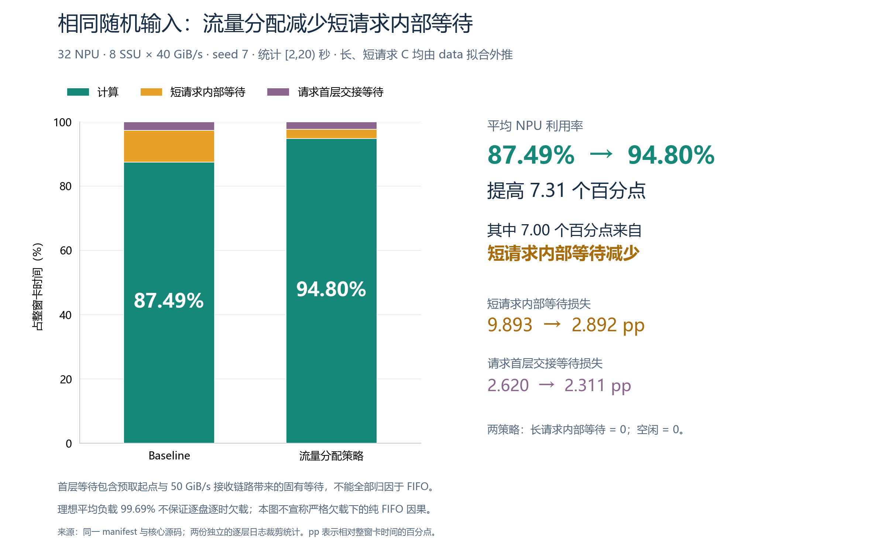
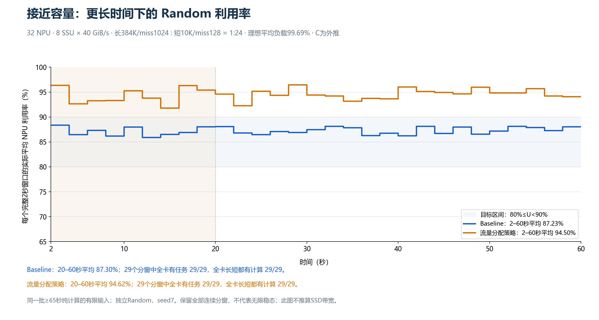

# Baseline Random：接近容量时，怎样寻找长期80几的输入

**已找到符合“Random长期80多”的构造输入。** 32卡、8盘，每卡独立打乱长384K/miss1024与短10K/miss128，请求数比1:24。五种子在2–20秒的Baseline平均利用率为**87.31%**，同输入流量分配策略为**94.70%**，提高**7.39个百分点**；两策略每个种子均全32卡活跃且每卡运行过长、短请求。

这组单层计算时间C由data外推，属于模型中的构造结果；99.69%的负载是整批输入的理想平均值，**不是逐盘逐时欠载**。原始data组也有80多的结果，但没有同样明显的策略收益。下面同时保留成功、未达标和覆盖不通过的案例，先解释输入怎样选，再对应实际等待和b/B。[重点结果](key_results.md) · [全部逐组统计](comparison.md)。

## 研究问题与比较边界

这次只运行 Random：32张NPU每张都准备长、短请求，固定分卡，各卡独立打乱自己的完整队列。主问题是能否让 Baseline 在持续运行时平均利用率落在80几；不要求恰好80%。同时检查流量分配策略是否能改善，不能把“找到了低利用率”自动解释成“证明了策略优越”。

Baseline 的具体含义是**每块盘自己的 Path0 FIFO**。另一张卡的长计算不会直接占用本卡计算器；可能阻塞本卡的是排在前方的读取。当前模型也没有“两个请求类别各自固定限速、余量不能借用”的 Baseline 规则。[实现](../../shared_path_baseline.py)只有统一 Path0 路由，服务仍由盘与每卡接收链路执行。

| 项目 | 本次设置 |
|---|---|
| NPU | 32张；每卡接收链路50 GiB/s |
| SSU | 主要构造结果8块；原始data负载对照3块；另有4/6块探索；每块40 GiB/s |
| 单请求 | batch=1，8层；原有层间和跨请求首层预取 |
| L1 | 全部请求t=0到达，固定绑定NPU，每卡一条有限待处理队列 |
| L2 | `Random(seed + 100003*NPU编号)`独立打乱整个人口；没有反复播放同一小段 |
| L3 | Baseline；部分同输入配对运行`once`，图中称“流量分配策略” |
| 工作量 | 每卡至少22秒纯计算工作；完整运行到全部请求完成 |
| 主统计 | `[2,4)`秒；另报`[2,20)`秒和连续2秒分窗 |
| 种子 | 初筛7；主组预先固定确认19、43、67、101；不按结果剔除 |
| 负载 | 初始理想平均负载率0.95–1.05；另明确标出约1.10的轻度过载敏感性 |

这里的Random是**随机顺序**：先选定画像与数量，再打乱；不是从data全部84个画像均匀抽样。各卡配额相同、顺序不同，同一画像内V/C相同；后续另用10K/12K/14K短请求和352K/384K/416K长请求检查画像变化，仍不能代表现实请求的全部多样性。

这里既有一次性到达的有限输入，也有“一个请求完成后才接纳本卡下一个请求”的内部反馈。**截取中间窗口不会改变到达或反馈机制**，不宜单凭统计窗口给整个系统贴开环/闭环标签。

`rho≈1` 指整批工作在不等待时的平均需求接近容量，**不表示逐盘逐时欠载**。所有真实读取，包括跨请求首层预取，都进入仿真。逐盘名义需求峰值、超限时间和真实盘忙率另行统计。

## 怎样用数学选择请求

先记三个量：V是每层读取量，C是每层计算时间，B=V/C是把下一层读取藏进计算所需的参考平均速率。B小不等于一次读取小；B相近的两个请求，也可能有很不同的读取突发规模。

对每卡nL个长计算请求和nS个短计算请求：

```text
理想平均总需求 = 32 * (nL*VL + nS*VS) / (nL*CL + nS*CS)
rho = 理想平均总需求 / SSU总容量
短计算工作占比 f = nS*CS / (nL*CL + nS*CS)
```

先把rho控制在预定范围，再检查f。短请求数量多，但C很短时，f仍可能很小；不能只凭“短请求很多”推断平均NPU利用率一定很差。

下一步反算需要的等待。本次每请求8层，设wL/wS为含零等待样本的平均内部层等待，dL/dS为每请求首层没藏住的等待：

```text
纯计算 P = 8 * (nL*CL + nS*CS)
内部等待 W = 7 * (nL*wL + nS*wS)
首层等待 F = nL*dL + nS*dS
U ≈ P / (P + W + F)
```

这条式子假定长期完成混合接近输入比例；任意有限窗口仍必须按实际时间线核算。若只有短内部层等待，其余等待都为零，达到目标利用率所需的平均等待是：

```text
wS_needed = (8/7) * (1/U_target - 1) * CS/f
U_target用小数：89%代入0.89，85%代入0.85。
```

早期筛选使用连续层近似，省略8/7和首层交接项。旧预测表原样保留并标明近似；[更新阈值及有限8层核对](goal_80s_update.md)给出修正。完整推导与样例见[通俗方法说明](report_core.md)。

## b/B怎样对上实际利用率

对同一请求内部、首尾完整的一层预取周期：

```text
D = 本层计算C + 下一层数据没到齐造成的等待w
平均b = 这个周期实际收到的下一层V / D
B = V/C
所以 平均b/B = C/D
```

这里的平均b包含零接收的等待区间，不是SSD或NPU链路的限速；b/B也不是瞬时NPU利用率。这是一条同周期、同字节量的记账等式。它解释“为什么这层利用率低”，但不能只用B提前预测FIFO排队多久。

整机利用率仍是：

```text
U[T] = 窗口内所有实际计算区间的总时长 / (32*T)
```

从完整层周期汇总时，要按周期持续时间加权，并补回首层交接和窗口截断区间。直接平均图上线条高度比，或者用整窗平均供给除以整窗平均需求，都不能替代此指标。

## 结果、图与解释

全部90个科学案例已完成，包括主组Baseline和Once的五种子确认、异质输入对照及两组更长输入配对。下面的尺度对照是事先声明的4个seed7探索组，不能把其中最低值当成多种子平均。

### 为什么原始data里的长短混合，不一定足够差

原始`main512`组用192K/miss4096与32K/miss512，数量比1:9，3盘，理想负载99.7313%。五种子长期U仍为95.0157% ± 0.3916个百分点。它确实有短层等待，但等待相对于计算预算还不够大。

| 五种子Baseline组 | 短层C ms | 含零短内部等待的种子均值 ms | 平均等待/C | 长窗U均值 |
|---|---:|---:|---:|---:|
| 原始main512，3盘 | 3.702133 | 0.998036 | 约27% | 95.0157% |
| 构造context384，8盘 | 0.716653 | 0.471602 | 约66% | 87.3140% |

**后者虽然绝对等待更短，等候占计算时间的比例却更高。** 两组短纯计算权重均约20%，所以这个比例差异能明显影响整机U。main512按有限8层、其余等待为零的目标式，达到89%需短内部平均等待约2.6569ms，而实测仅0.9980ms。[同口径阈值与来源](goal_80s_update.md)。

这不是只改变一个参数的对照：盘数、长短画像和数量比都不同。它解释了为何本轮原始数据候选可能不够差，但不能证明原始data的所有混合方式都做不到。本次仍完整保留没有达到目标的候选。

### 平均负载接近容量的尺度对照

固定32卡、8盘、每卡独立Random。短请求总10K/miss128，`C=0.716653ms`、`V=13.578125MiB`、`B=18.502534GiB/s`。长请求固定miss1024，改变总输入：

| 长总输入 | 每卡L:S数量比 | 长B GiB/s | 理想负载率 | 含零短内部平均等待 ms | warm U | 2–20秒 U | 两窗逐卡长短覆盖 |
|---:|---:|---:|---:|---:|---:|---:|---|
| 200K | 1:14 | 7.5392 | 99.5799% | 0.313961 | 90.1366% | 90.2855% | 均32/32 |
| 256K | 1:17 | 7.6365 | 99.5813% | 0.381490 | 89.1802% | 89.1161% | 均32/32 |
| 384K | 1:24 | 7.7554 | 99.6878% | 0.467224 | 87.4838% | 87.4866% | 均32/32 |
| 512K | 1:31 | 7.8161 | 99.7430% | 0.529443 | 87.2531% | 86.3175% | 均32/32 |

200K长C取原始data；10K短C及256/384/512K长C都由data区间外推。这里的U是模拟器运行后测得，不是新硬件测量。这是明确的构造反例，不应包装成“data现成行已经得到同样结果”。

**B只变化约3.7%，单长读取盘侧尺度却从0.835ms增到2.144ms。** 后者不是每次必等时长；但如果前方排着相同数量的长层读取，单层读取变大，就更容易错过短请求的0.717ms截止。仿真确实测到含零平均等待增大，而不仅是一张极端截图变差。这是“平均需求相近，突发大小仍然重要”的证据。实际队列也随长短数量比、完成进度和到达时序变化，因此不能称为严格只改变V的单变量实验。

### 384K这一组，到底怎样输入

每张卡先放33个长请求、792个短请求，合计825个请求、至少22.047秒纯计算工作，再独立打乱整个队列。没有每隔一段重新对齐，没有给某张卡固定只跑短或只跑长，也没有运行中强行调整顺序。

**为什么是1:24？** 8盘总容量320GiB/s，按32卡折算的平均输入预算为`d=10GiB/s`。设每个长请求配q个短请求，令一组请求的总读取量除以总计算时间等于d：

```text
(VL + q*VS)/(CL + q*CS) = d
q = (d*CL - VL)/(VS - d*CS) = 24.4279
```

C在这两式中用秒。本例长B约7.76、短B约18.50，分别位于d=10两侧，才能用正的数量配比调到这个目标。取整数q=24，理想总需求为319.0009GiB/s，即容量的99.6878%。这里`d=10`只用于配输入，没有给每卡设置10GiB/s限速。一组“1长+24短”有0.668102秒纯计算工作，取33组的数量就超过22秒；随后把全部825个请求一起打乱，**不是按组重复播放**。长期测试同理扩大数量再完整打乱。

固定种子7、19、43、67、101的Baseline结果为：warm平均87.1287% ± 0.3784个百分点，2–20秒平均87.3140% ± 0.1103个百分点。五个种子、两个统计窗口均全32卡活跃且每卡两类都有实际计算。这里±是种子间样本标准差，不是置信区间。[逐种子数值与SLO](key_results.md)。

| 类别 | 总输入 / miss | 命中并读取的token | 单层C | 单层V | B=V/C |
|---|---|---:|---:|---:|---:|
| L：长计算、大读取 | 384K / 1024 | 383K | 66.313030ms | 526.625MiB | 7.755372GiB/s |
| S：短计算、小读取 | 10K / 128 | 9.875K | 0.716653ms | 13.578125MiB | 18.502534GiB/s |

**小读取不等于小B。** 这里短请求读取少，但可用计算时间更短，所以它的B反而更大。另行测试的[低B短计算方向](low_b_short_math.md)才对应教程里“便宜的低B请求被FIFO拖住”这一问题。

下面的等待与周期机制使用384K组的**seed7**，不是把五个种子混在一起。在`[2,20)`秒，32卡共有`32*18=576`卡秒：

```text
实际计算：503.922796卡秒
短内部层等待：56.985434卡秒
首层/请求交接等待：15.091770卡秒
长内部层等待和空闲：0

U = 503.922796 / 576 = 87.4866%
```

内部短等待贡献9.8933个百分点损失，首层贡献2.6201个百分点。首层里包含50GiB/s单卡接收链路本来就藏不住的部分，不能把这2.6201个百分点全部叫FIFO问题。

输入中的短纯计算权重为20.5953%。按前面的有限8层阈值，如果其他等待都为零，要到89%需要短内部层平均等待约0.491514ms；实测为0.467224ms。只代入内部等待的固定混合近似给出约89.49%，再把首层交接等损失纳入，才得到87%左右。这样能解释为什么不能把所有下降都归给一个内部层的FIFO等待。

同组121,963个完整短内部周期中，33.79%出现等待，其余不等；含零平均等待是0.467224ms，周期平均长度1.183876ms：

```text
完整短周期的平均b = V / 平均D = 11.200402GiB/s
平均b/B = 11.200402 / 18.502534 = 60.5344%
```

这对应短内部周期的时长加权计算比例。把首层等其他区间也纳入后，短类别利用率为60.7029%，长类别为98.1991%；它们各占28.5696%、71.4304%的已接纳卡时间：

```text
整机U = 28.5696%*60.7029% + 71.4304%*98.1991%
      = 87.4866%
```

因此短类的60%左右、整机的87%左右并不矛盾；短内部周期b/B与短类别利用率也因首层和窗口边界而略有区别。

[512K同请求内部放大图](runs/context8_L512m1024_S10m128_ssu8_h22000_seed7/baseline/figures/internal_median_wait/baseline_random_short_internal_cycle.png)展示了目标短IO前方实际服务的长IO。该样例等待1.467ms，是避开请求首尾的正等待样本中位附近；它不是512K全部短层的平均0.529ms，更不是384K组的0.467ms。

### 同输入切换策略：下降主要来自哪里

seed7使用完全相同的manifest、请求绑定、顺序、盘数和计算画像，仅切换L3策略。两策略warm和长窗均全32卡活跃、每卡两类都算过。

这里的流量分配策略是现有`once`：每次为“一个请求的一层在一块SSU上的读取块”规划path，使用每5ms采集的压力快照，在该类别允许的path内估计完成时间。规划下一块时会把本次已分配的读取计入临时队列估计；不是把整层固定到一个path，也不是直接按B从小到大排序。它保持NPU请求顺序不变，使用静态QoS参数，不进行运行时CIR更新。[入口](../../shared_path_once.py) · [分配实现](../../policy_logic.py)。

本例长请求在原代码中归LL，短请求归SS。沿用的[静态配置](../../strategy_profiles.py)每盘给SS/SL/LS/LL的CIR预算分别为20/6/8/6GiB/s；预算不是类别带宽上限，PIR没有有限上限，空余带宽仍按调度规则分配。因此，这个对照包含多path与类别隔离、静态QoS和压力路由的共同作用。**本次没有做组件拆分实验，不能把全部收益单独归给压力估计算法，也不能声称每层必须重新规划才有这些收益。**

| 策略 | warm U | 2–20秒 U | 长窗SLO×1.5 | 长窗SLO×2 |
|---|---:|---:|---:|---:|
| Baseline | 87.4838% | 87.4866% | 55.1254% | 78.7890% |
| 流量分配策略 | 94.9137% | 94.7971% | 89.3712% | 98.8078% |

真实整机U提高7.3105个百分点。其中，短内部等待损失从9.8933降到2.8917个百分点，贡献7.0016个百分点；首层交接损失从2.6201降到2.3111个百分点，贡献0.3090个百分点。两策略长内部等待、空闲均为0。约95.77%的U增益对应短内部等待减少。



同一张卡、同一个请求、同一对内部层的等待从1.154052降到0.407920ms，周期计算比例从38.31%升到63.73%。这对[Baseline局部图](runs/context8_L384m1024_S10m128_ssu8_h22000_seed7/baseline/figures/internal_median_wait/baseline_random_short_internal_cycle.png)与[流量分配局部图](runs/context8_L384m1024_S10m128_ssu8_h22000_seed7/once/figures/internal_paired_comparison/allocation_random_short_internal_cycle.png)使用相同请求ID和层，但两策略到达该层的绝对时间不同；它不是孤立改变该层服务的一次反事实实验。

从全部完整短内部周期看，而不是只看放大样例：

| 策略 | 全部短周期数 | 含零平均等待 ms | 平均完整周期D ms | 周期平均b GiB/s | 平均b/B |
|---|---:|---:|---:|---:|---:|
| Baseline | 121,963 | 0.467224 | 1.183876 | 11.200402 | 60.5344% |
| 流量分配策略 | 133,376 | 0.124883 | 0.841536 | 15.756768 | 85.1601% |

这里B始终为18.502534GiB/s。表中平均b按完整周期数乘以每层V、再除以总周期时长重建，分析字段为`work_implied_mean_b`；不是把每个周期的b简单平均，也不是对整个2–20秒每层逐块trace重新积分。完整层接收的字节量由冻结输入与完成日志核验，逐块trace只覆盖局部放大窗口。需求画像没变，短周期因少等而变短，平均b更接近B。

这不等于推翻教程中有条件的“小B优先”结论。那个结论把画像固定、带宽看作可任意连续分配，解决静态容量不足时的总利用率问题。本次还有读取突发和预取截止：长层计算预算约66.313ms，短层只有0.717ms。**早点完成一个短IO，可以避免短层等待；稍晚完成长IO，则可能仍赶得上长层截止。** 结果中长内部等待始终为0，与这种时间余量相符。因此不能把静态B排序直接当成当前离散预取系统的完整调度准则，也不据此宣称Once最优。

三个容易混淆的整机带宽口径也要分开：

| 2–20秒或整批输入口径 | Baseline GiB/s | 流量分配策略 GiB/s |
|---|---:|---:|
| 整批输入按纯计算折算的理想需求 | 319.0009 | 319.0009 |
| 窗口内当前画像B总和的时间平均 | 346.4254 | 324.7753 |
| NPU实际收到的总字节 / 窗口时间 | 276.5105 | 300.6192 |

第一行相同，因为输入没变。第二行会变：高B短请求等得更久，就在“当前正在处理的请求”中占据更多时间。因此理想平均负载99.69%并不意味着当前画像需求始终小于320GiB/s；Baseline实际有87.57%的长窗时间出现逐盘名义超限。第三行是物理接收量，受真实预取进度与窗口边界影响。**用第三行除以第二行不会得到整机U**；前面的b/B等式要求同一个完整层周期。

另外四个固定种子的Once配对确认已经全部完成。五个种子、两个统计窗口、两种策略都满足全32卡活跃且每卡两类都有实际计算，结果如下：

| 策略 | warm U均值±SD | 2–20秒U均值±SD | warm SLO×1.5 / ×2 | 长窗SLO×1.5 / ×2 |
|---|---:|---:|---:|---:|
| Baseline | 87.129% ± 0.378pp | 87.314% ± 0.110pp | 55.015% / 77.491% | 54.867% / 78.077% |
| 流量分配策略 | 94.760% ± 1.039pp | 94.705% ± 0.131pp | 88.911% / 99.022% | 88.870% / 98.653% |

按同seed先求差、再平均，长窗U提高**7.391 ± 0.164个百分点**。只看后续19、43、67、101四个确认种子，平均提高**7.411 ± 0.182个百分点**，四个种子均改善。SLO列按seed等权平均，不是请求合并通过率；全部精确数值和样本数见[重点统计](key_results.md)。

[五种子warm独立PNG](figures/five_seed_strategy_comparison/warm_2_4s_npu_utilization.png) · [五种子长窗独立PNG](figures/five_seed_strategy_comparison/long_2_20s_npu_utilization.png)。每张图画出所有seed，不只画均值。

后续Once确认是在看到seed7收益后启动，固定上述四个种子再运行，并不冒称整套Once矩阵在研究开始前已经预注册。

### 扩大到接近一分钟，是否还只有中间两秒比较差

384K主组另把每卡队列扩大为98个长请求、2352个短请求，保持1:24比例，纯计算工作为65.474秒。对这2450个请求重新完整独立Random；这不是22秒输入的相同前缀，也没有周期重复。

Baseline在`[20,60)`秒的利用率为**87.2975%**，在`[2,60)`秒为**87.2278%**。把后一个窗口划成全部29个连续两秒窗口，利用率范围为**85.8961%～88.3495%**，每个窗口都全32卡活跃，且每卡实际计算过长、短两类请求。因此在这次更长运行中，80几并不是只挑中间某个两秒窗口才出现。

同输入流量分配策略也已完成，`[2,60)`秒的U为**94.5045%**，比Baseline提高**7.2767个百分点**；`[20,60)`秒为**94.6227%**。两策略全部29个两秒分窗均全32卡活跃、每卡实际算过长短两类。

| 更长输入，seed7 | 2–60秒 U | 同窗SLO×1.5 | 同窗SLO×2 |
|---|---:|---:|---:|
| Baseline | 87.2278% | 55.1955% | 78.7644% |
| 流量分配策略 | 94.5045% | 88.2946% | 98.6318% |



这是一个固定种子的较长确认，并不证明无限时间或任意请求分布都会保持该结果。[长窗口逐项统计](long_horizon/context384/long_horizon_comparison.md)及对应JSON保留全部两秒分窗。20秒以后的物理带宽没有被观测器保存，所以这里只依据完整计算与等待日志讨论利用率，不补造后段的SSD供给曲线。

### 原始data的轻度过载邻域

固定总128K/miss256与总32K/miss4096，3盘，只改变每卡数量比。seed7初筛为：

| A:B | 理想负载率 | Baseline warm U | Baseline 2–20秒 U | warm长短覆盖 |
|---|---:|---:|---:|---:|
| 7:15 | 99.9016% | 88.2542% | 93.3924% | 32/32 |
| 1:2，参考组 | 104.0915% | 87.5719% | 90.9892% | 32/32 |
| 32:63 | 105.0812% | 88.1190% | 89.0997% | **31/32** |
| 17:31 | 110.0796% | 88.3122% | 88.5433% | 32/32 |

32:63和17:31已使用原定另外4个种子确认，五种子结果如下，包含全部种子与warm覆盖失败：

| 原始data配比 | warm U均值±SD | 2–20秒U均值±SD | warm全卡混合通过 | 长窗全卡混合通过 |
|---|---:|---:|---:|---:|
| 32:63，rho=105.0812% | 87.1946% ± 4.5669pp | 90.0758% ± 1.4811pp | 3/5 | 5/5 |
| 17:31，rho=110.0796% | 87.6888% ± 1.8719pp | 87.8448% ± 0.7159pp | 4/5 | 5/5 |

五种子全部全32卡活跃。105%组的长期均值超过90%，其中两个种子分别91.01%和92.18%，所以初筛seed7的89.10%并不代表稳定的80几；这些较高结果没有被删除。110%组长期均值进入80几，但其中一个warm种子仍未满足每卡混合条件。

17:31的seed7同输入流量分配策略长窗U为88.7134%，与Baseline仅相差约0.17个百分点。它说明这批输入能得到80几，**尚不支持FIFO替换能大幅提高整机U**。局部图中，前方排队还有更多其他A类大读取，不能把全部等待归给B类长计算请求。

把这组原始data的每卡纯计算人口扩大到至少65秒后，重新完整Random；在20–60秒中Baseline为86.26%、流量分配策略86.31%，在2–60秒中分别为87.38%、87.11%。因此更长测试仍有80几的平均U，但也没有显示显著策略收益。全部29个连续两秒分窗见[长时间曲线](figures/long_horizon/random_utilization_all_2s_windows.png)，其中有高于90%的分窗，并不主张每两秒都低。两策略在主warm与长统计窗均32卡混合；29个诊断分窗中分别17/29和16/29满足每卡两类都计算，其余也原样保留。[逐窗U与SLO表](long_horizon_comparison.md)。

对于完整批次共同分母或稳定完成混合，容量本身就给出`U<=min(1,1/rho)`。110.08%负载的此上界约90.84%，所以必须把容量因素与策略差异分开；不能把整批上界直接套到任意2秒窗口。

### 请求尺寸不同后，低利用率是否还存在

先做三组seed7对照，全部仍为32卡、8盘、独立完整Random；两个窗口都全32卡活跃且每卡实际运行过粗类别L/S。细类别S1/S2/S3不要求每张卡在两秒里全部见到。

| 输入方式 | 每卡数量 | 理想负载率 | warm U | 2–20秒 U |
|---|---|---:|---:|---:|
| 长384K；短全部12K | 35长 + 630短 | 100.2029% | 88.9535% | 88.4233% |
| 长384K；短10K/12K/14K混合 | 35长 + 三种短各210 | 100.2029% | 88.7801% | 88.3304% |
| 长352K/384K/416K混合；短10K | 三种长各11 + 792短 | 99.6878% | 87.6334% | 87.6387% |

前两组每卡总读取量、总计算量、请求数及粗长短身份顺序严格配平；短miss均128，长miss均1024。它们长期U仅相差约0.093个百分点，因此在这个配对实验中，低U不依赖所有短请求尺寸完全相同。这个12K均值配方与前面的10K主组配比不同，不能把两者差异都归因于尺寸多样性。

第三组把原主组33个384K长请求拆成352K/384K/416K各11个，保持每卡总C/V和粗身份顺序不变，长期U仍为87.6387%，与原主组seed7的87.4866%相近。

短异质组另外使用固定19、43、67、101确认Baseline，五个种子已经全部完成：warm平均**88.5343% ± 0.6844个百分点**，2–20秒平均**87.9903% ± 0.2239个百分点**。五个种子在两个窗口均全32卡活跃且每卡两类都实际计算；±为种子样本标准差。新增四个种子的长窗结果为88.0129%、87.7058%、87.9640%、87.9385%，全部保留，未按高低或覆盖筛选。

seed7的Once配对也已完成，同一整批输入的结果如下。**Once在这个异质组只有一个种子，不能与Baseline五种子均值直接相减来声称配对收益。**

| 异质短请求，seed7 | warm U | 2–20秒 U | 长窗SLO×1.5 | 长窗SLO×2 |
|---|---:|---:|---:|---:|
| Baseline | 88.7801% | 88.3304% | 49.5143% | 75.4909% |
| 流量分配策略 | 95.6611% | 95.2398% | 90.7615% | 98.5292% |

同seed长窗U提高6.9094个百分点，两个窗口两策略都全32卡活跃且每卡两类实际计算。SLO仍是接纳后的prefill完成代理，两策略在窗口内接纳的请求数可不同。

全部C仍为明确外推；这些是多种尺寸的模型画像，不是真实线上prompt内容或真实到达分布。确认是看到pilot结果后才启动，完整结果见[重点统计](key_results.md)。

### 低B短计算：能降低U，但两秒混合覆盖成为限制

这一方向把短请求改为总10K/miss1024，C=3.566245ms、V=12.375MiB、B=3.388708GiB/s；4盘总容量160GiB/s。长请求仍固定miss1024，单层B约7.54～7.82GiB/s。因此短请求在平均带宽意义上更便宜，但一次长读取依然可能错过短层截止。

| 长总输入 | L:S | 理想负载率 | warm U | 2–20秒 U | warm混合卡数 | 长窗混合卡数 |
|---:|---:|---:|---:|---:|---:|---:|
| 200K | 1:16 | 99.5799% | 92.0264% | 92.5271% | 32/32 | 32/32 |
| 256K | 1:21 | 99.5899% | 91.2933% | 91.5450% | 30/32 | 32/32 |
| 384K | 1:32 | 99.8711% | 86.0996% | 88.1412% | 27/32 | 32/32 |
| 512K | 1:43 | 100.0107% | 84.5528% | 84.6854% | 22/32 | 32/32 |

四组、两个窗口均全32卡有活跃请求。后3组warm缺少的都是长请求计算，不是卡空闲。384K/512K虽把长期U降到80几，但没有满足固定warm两秒内每卡两类都计算的条件，不能用来替代前面的主组。它们也是单seed探索；没有为了让覆盖通过而挑另一个窗口或只保留有利种子。

短C均为外推，200K长C为原始data，其余长C也外推。这组另外改变了盘数、短C/V和配比，不是仅切换调度优先级的对照。

## 怎样理解SLO

本次沿用先前的 **TTFT代理SLO**：窗口内被NPU接纳的请求，跟踪到最终prefill完成，检查：

```text
完成时间 - 接纳时间 <= 1.5（或2）* 8 * 该请求单层C
```

它不包括接纳前的请求队列等待，也没有真实首token事件，不能称为端到端TTFT。所有t=0到达的请求若改从到达计时，会得到另一组结果。不同策略在同一2秒窗内接纳到的请求也可能不同，因此配对冻结同一整批输入，同时保留SLO分母与分类结果。

## 输入来源和适用边界

- 原始组保持`data`中的总输入长度、miss数量、单层C和V。这里的128K指总输入，不能再加一次miss。
- `fit*`组的长请求来自原始data；10K/12K/16K短请求C由固定miss=128的32K–200K数据外推。读取量仍按命中token数计算，没有额外填充读取。
- `context*`组固定10K短画像，扩展长请求200K/256K/384K/512K。200K长C来自原始data，其余长C也为外推。不能当成真实512K设备测试，也不证明目标硬件支持这种上下文。
- 原始、短C外推和长短C均外推分别标注；外推训练残差小，不等于区间外准确。
- “接近容量”也依赖C是否准确。384K主组的长纯计算权重约79.4%；若只把长C改成当前值的1.1倍或0.9倍、输入数量与V保持不变，理想负载率会分别变为92.35%或108.29%。这是负载公式的敏感性计算，不是新的仿真结果，更不能据此推算新的U。要转为真实设备结论，应先校准相应总长与miss的C，再重新配比与测试。
- 没有找到低利用率的候选也保留；初筛最低值有选择偏差，要看预定确认种子，不能只报最低种子。
- 本次沿用8层，而data中的原TTFT字段按78层保存。8层会改变请求交接频率、完整请求时长和两秒混合覆盖概率，不能直接把本次SLO或覆盖率外推为78层模型的结论。
- 全部请求t=0已可用，没有在线到达间隔、运行中迁移、真实HBM容量约束或设备计算校准；本次证明的是给定模拟器中的输入与排队行为。
- [调度适配器](../../shared_path_sim_adapter.py)把控制计算与控制通信的仿真延迟设为0；主机上的策略计算耗时只作诊断，不推进NPU时间线。因此Once收益没有扣除真实实现的控制开销，不能把这里的百分点直接称为硬件净收益。也不能把Python仿真运行时长直接当成真实控制器延迟。

## 可核验的材料

[全部结果和SLO](comparison.md) · [早期公式与实测等待](math_result_table.md) · [更新目标与修正](goal_80s_update.md) · [分析口径](analysis说明.md) · [固定初始计划](study_plan.json)。

[90个科学案例的最终源文件与结果核验](final_research_audit.json) · [数学复核](mathematical_review.md) · [主结果独立审阅](final_main_report_review.md) · [项目清理记录](cleanup_execution.md)。

每个case保留冻结输入、完整结果、命令、来源哈希、实际服务统计和独立分析。需要放大图的case额外保留逐块SSD/链路trace。根目录原始`data`与模拟器核心未修改；新画像、配比和Random队列另建并明确记录。
