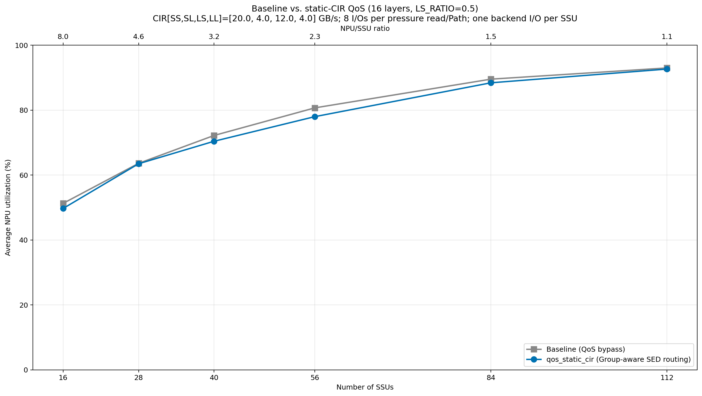

# Batch=8、16 层静态 CIR QoS 结果

日期：2026-08-25

## 实验口径

- 128 个 NPU，`LS_RATIO=0.5`，seed 42，16 个 layer。
- SSU 数量：`[16, 28, 40, 56, 84, 112]`。
- 每块 SSU 40 GB/s、256 个 Path、8 个 Group，整盘任意时刻最多一个不可抢占的 active I/O。
- Baseline：QoS bypass；NPU 内 FCFS，NPU 间逐 I/O RR。
- QoS：静态 CIR `[SS,SL,LS,LL]=[20,4,12,4]` GB/s，PIR uncapped，Group/Path WRR 权重均为 1。
- 同一 `(request, layer, SSU)` 内每 8 个 I/O 读取一次完整 Path 压力；尾组不足 8 个也读取一次。每个批次只选择一个 Path，但批内 block 仍是独立 I/O。
- 空 Path 未使用的 CIR 采用全局回收，再经 Group WRR 和 Path WRR 分配给活跃 Path。

复现命令：

```bash
python experiment.py \
  --layers 16 \
  --pressure-read-interval 8 \
  --path-binding-batch-size 8 \
  --rerun \
  --output-dir results/batch8_l16
```

结果文件本身是拆分两个参数之前生成的 schema 6 历史产物；上面的 schema 7
命令使用等价的 `8/8` 语义。新默认值是 `8/1`，不会复用这里的结果。

## 平均 NPU utilization

| SSU | NPU/SSU | Baseline | QoS batch=8 | 变化 |
|---:|---:|---:|---:|---:|
| 16 | 8.0 | 51.2572% | 49.6889% | -1.5683pp |
| 28 | 4.6 | 63.5901% | 63.4673% | -0.1228pp |
| 40 | 3.2 | 72.1805% | 70.3975% | -1.7830pp |
| 56 | 2.3 | 80.6756% | 77.9725% | -2.7032pp |
| 84 | 1.5 | 89.5263% | 88.4024% | -1.1239pp |
| 112 | 1.1 | 92.9793% | 92.6411% | -0.3382pp |

六点平均变化为 `-1.2732pp`。最好点是 28 SSU，但仍比 Baseline 低 `0.1228pp`；退化最大的是 56 SSU，为 `-2.7032pp`。因此没有任何点达到 `+10pp`，也没有任何点单纯在平均 utilization 上超过 Baseline。



## 各类别 p95 TTFT 变化

正值表示 QoS 比 Baseline 更慢。

| SSU | SS | SL | LS | LL | p95 门槛 |
|---:|---:|---:|---:|---:|:---:|
| 16 | -143.6332 ms | -1.0416 ms | -65.3547 ms | +19.0920 ms | 未通过 |
| 28 | -51.5802 ms | -0.0429 ms | -32.3042 ms | +8.8685 ms | 未通过 |
| 40 | -12.6222 ms | +0.9781 ms | -14.5488 ms | +4.1900 ms | 未通过 |
| 56 | -3.5237 ms | +1.0757 ms | -6.4247 ms | +1.6215 ms | 未通过 |
| 84 | -1.3125 ms | +0.2013 ms | -2.9847 ms | +0.2242 ms | 未通过 |
| 112 | -0.0667 ms | +0.6144 ms | -1.2670 ms | -1.0591 ms | 未通过 |

静态 CIR 明显帮助了 SS 和 LS，但主要由 SL 或 LL 的尾延迟恶化导致每个 SSU 点都未通过 p95 门槛。Jain utilization 公平性只在 16、28 SSU 改善；40、56、84、112 SSU 均低于 Baseline。六点硬门槛全部失败。

## 压力读取次数

每个 SSU 目标上的尾组都会单独读取一次，因此“配置为每 8 个 I/O 一次”不等于全局严格每 8 个一次。SSU 越多，每个 `(request, layer, SSU)` 的 I/O 越少，尾组占比越大。

| SSU | 独立后端 I/O | 256-Path 压力读取 | 平均 I/O/读取 |
|---:|---:|---:|---:|
| 16 | 1,704,832 | 227,542 | 7.492 |
| 28 | 1,704,832 | 238,158 | 7.158 |
| 40 | 1,704,832 | 248,618 | 6.857 |
| 56 | 1,704,832 | 263,251 | 6.476 |
| 84 | 1,704,832 | 289,608 | 5.887 |
| 112 | 1,704,832 | 319,575 | 5.335 |

所有策略和 SSU 点的 `max_backend_active_io` 都为 1；QoS 和 Baseline 在每个点均完成相同的 1,704,832 个独立 block I/O。

## 是否比之前更好

结论：没有。

当前工作区中的 schema 5 结果只有 4 层。在那个不同口径下，16/28/40/56/84/112 SSU 的 QoS utilization 增益分别为 `+1.73/+5.33/+7.27/+8.58/+8.29/+7.18pp`；本次 16 层 batch=8 六点则全部为负。由于层数和 Path 绑定/压力读取语义同时变化，这组数字只能说明趋势反转，不能当作严格的单变量消融。

Git 历史中的旧 16 层 q256 图也不能直接比较：它允许 queue depth 4、最多 4 个 active flow，并使用 200 us batch 和旧的连续带宽/队列模型；当前模型强制整盘只有一个 active I/O。

从本次类别结果推断，8 个 I/O 固定到一个 Path 会降低 Path 级负载分散，并让静态类别 CIR 更长时间地控制该批次的离散服务顺序。该机制改善 SS/LS，却把等待转移给 SL/LL，最终没有提高总体 utilization。因为“压力读取频率”和“同 Path 绑定粒度”在本实验中同时设为 8，若要严格区分二者影响，需要再做独立消融。
