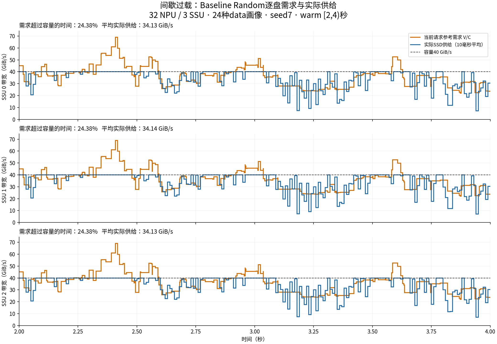
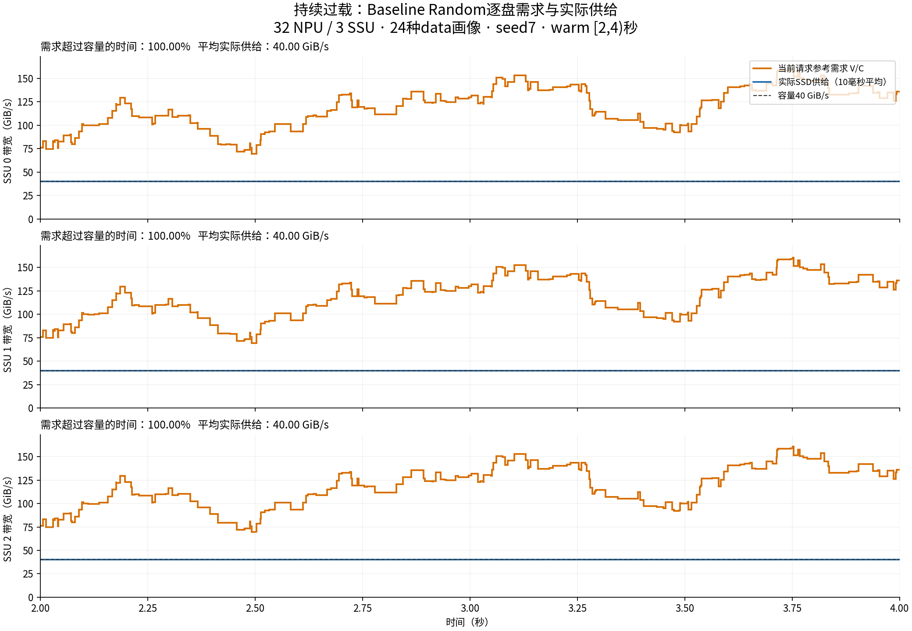

**多样data输入：Baseline Random与三个L3策略的实测结果**

上一轮只有两种固定画像；本次使用24种真实data画像，覆盖四个类别。两组各跑三个种子、四种策略，共24次完整仿真，结果均已完成并校验。

间歇过载组完整人口SLO最高的是固定候选池：相对Baseline的SLO变化+4.51个百分点，NPU利用率变化+0.26个百分点，实际达标完成数/秒变化+5.11%。这是本次三种子结果，不代表任意多样输入都如此。
持续过载组完整人口SLO最高的是固定候选池：相对Baseline的SLO变化+35.17个百分点，NPU利用率变化-0.29个百分点，实际达标完成数/秒变化+84.73%。这是本次三种子结果，不代表任意多样输入都如此。

**持续过载的warm窗口中，固定候选池将LL达标率从Baseline的95.08%改变为27.17%。总达标率与某个类别的保障是两个目标；若要求各类别均不明显退化，不能只凭总体达标率宣布策略更好。**

**输入怎样构造**

32 NPU，3 SSU × 40 GiB/s，每NPU接收链路50 GiB/s，8层，batch=1。总输入长度 `[32,64,80,128,160,200]K` 与miss `[256,1024,2048,4096]` 两两组合，共24种画像。读取量、计算时间全部直接取data，没有缩放或人为填充。总长度包含miss部分。

| 每个总长度下的配额 | miss256 | miss1024 | miss2048 | miss4096 | 每卡请求总数 | 每卡不同画像数 |
|---|---:|---:|---:|---:|---:|---:|
| 间歇过载 | 1 | 1 | 1 | 2 | 30 | 24 |
| 持续过载 | 3 | 2 | 1 | 1 | 42 | 24 |

例如间歇组，每张卡有1个32K/miss256、1个32K/miss1024、1个32K/miss2048、2个32K/miss4096；其他五种总长度使用相同规则。随后每卡独立打乱整个请求集合。三个种子7、19、43；同一种子下四个策略使用完全相同的输入与卡内顺序。

每卡配额相同，具体顺序不同；不是每卡重复播放相同的A/B顺序。所有请求在t=0到达、固定绑定卡，卡内完成一个后再接纳下一个。data是画像目录，本次配比是为了覆盖不同负载状态构造的，不声称是真实agent流量的经验分布。

所选画像的单卡B最高约29.66 GiB/s，低于50 GiB/s接收链路；条带落盘后，单卡对任意单盘的需求也低于40。持续过载来自多卡需求叠加，不是靠选取单卡本身就超过链路容量的画像构造。

**先验证两种负载状态确实成立**

参考需求按每卡当前已接纳请求的 `B=每层读取量V/每层纯计算时间C` 统计，再按真实落盘量分到各盘；在计算和IO stall期间都保留该参考值。未来排队请求不同时叠加，未接纳的下一请求首层不重复计需求。它不是瞬时新提交I/O速率。实际SSD供给则统计所有物理读取，包括跨请求预取。

下面是原warm `[2,4)`秒，逐事件积分得到的时间比例，盘序均为0/1/2：

| Baseline场景 | seed | 各盘需求超过40的时间比例 | 各盘平均实际供给 GiB/s | NPU利用率 | SLO达标率 |
|---|---:|---|---|---:|---:|
| 持续过载 | 7 | 100.00% / 100.00% / 100.00% | 40.00 / 40.00 / 40.00 | 64.08% | 37.86% |
| 持续过载 | 19 | 100.00% / 100.00% / 100.00% | 40.00 / 40.00 / 40.00 | 63.58% | 41.62% |
| 持续过载 | 43 | 100.00% / 100.00% / 100.00% | 40.00 / 40.00 / 40.00 | 59.49% | 41.40% |
| 间歇过载 | 7 | 24.38% / 24.38% / 24.38% | 34.13 / 34.14 / 34.13 | 99.12% | 95.51% |
| 间歇过载 | 19 | 21.53% / 21.95% / 21.95% | 33.20 / 33.20 / 33.21 | 99.39% | 96.47% |
| 间歇过载 | 43 | 22.84% / 22.84% / 22.84% | 31.39 / 31.38 / 31.38 | 99.21% | 96.84% |

“间歇过载”指Baseline运行中时而超过容量、时而低于容量；“持续过载”指基本整个窗口都超过容量。新策略改变各请求的驻留时间，所以即使输入相同，参考需求的时间分布也会变化；所有策略的逐盘比例保存在CSV，不能把Baseline的比例直接套给它们。





图中橙线是参考需求，蓝线是物理SSD吞吐的10ms平均，灰线是每盘容量。三盘分别显示，不把总容量120误作单盘容量40，也不把GiB/s写成十进制GB/s。两线之比不等于NPU利用率；参考需求还会受到高需求请求因等待而延长驻留时间的影响。

**warm [2,4)秒：三个种子等权平均**

| 场景 | 策略 | NPU利用率 | SLO×1.5达标率 | 达标完成数/秒 | SS达标率 | SL达标率 | LS达标率 | LL达标率 |
|---|---|---:|---:|---:|---:|---:|---:|---:|
| 间歇过载 | Baseline Random | 99.24% | 96.27% | 81.00 | 65.56% | 100.00% | 91.53% | 100.00% |
| 间歇过载 | 动态选路：温和 | 99.43% | 98.56% | 82.83 | 100.00% | 100.00% | 84.44% | 100.00% |
| 间歇过载 | 动态选路：较强 | 99.51% | 98.77% | 83.00 | 100.00% | 100.00% | 86.40% | 100.00% |
| 间歇过载 | 固定候选池 | 99.18% | 100.00% | 84.83 | 100.00% | 100.00% | 100.00% | 100.00% |
| 持续过载 | Baseline Random | 62.38% | 40.30% | 39.67 | 0.00% | 40.50% | 0.00% | 95.08% |
| 持续过载 | 动态选路：温和 | 65.11% | 62.49% | 63.50 | 95.39% | 96.10% | 34.12% | 29.77% |
| 持续过载 | 动态选路：较强 | 64.61% | 48.48% | 47.50 | 75.30% | 80.09% | 20.78% | 19.84% |
| 持续过载 | 固定候选池 | 64.37% | 76.96% | 77.17 | 97.44% | 95.07% | 100.00% | 27.17% |

SLO沿用前次口径：`prefill完成时刻 - 接纳时刻 <= 1.5 * 8 * 本请求每层纯计算时间`。它不包含接纳前排队，不是真实首token事件。窗内接纳的所有请求均跟踪到最终完成，没有剔除窗后完成或超时请求。“达标完成数/秒”另按窗口内实际完成时刻筛选，避免把窗后完成数算成窗内吞吐。

这里的SS/SL/LS/LL沿用代码类别：第一个字母按总长度（≤80K为S），第二个按miss（<512为S）。它们不是直接按实测读取量与计算毫秒数二分；例如LS并不保证比所有SL计算时间更短。

**扩大到[2,6)秒**

| 场景 | 策略 | NPU利用率 | SLO×1.5达标率 | 达标完成数/秒 | SS达标率 | SL达标率 | LS达标率 | LL达标率 |
|---|---|---:|---:|---:|---:|---:|---:|---:|
| 间歇过载 | Baseline Random | 99.23% | 95.68% | 79.58 | 64.41% | 100.00% | 89.48% | 100.00% |
| 间歇过载 | 动态选路：温和 | 99.47% | 99.10% | 83.00 | 100.00% | 100.00% | 90.46% | 100.00% |
| 间歇过载 | 动态选路：较强 | 99.55% | 99.40% | 83.08 | 100.00% | 100.00% | 93.61% | 100.00% |
| 间歇过载 | 固定候选池 | 99.41% | 100.00% | 84.08 | 100.00% | 100.00% | 100.00% | 100.00% |
| 持续过载 | Baseline Random | 66.19% | 42.35% | 41.83 | 0.00% | 42.25% | 0.00% | 96.78% |
| 持续过载 | 动态选路：温和 | 67.41% | 63.85% | 64.50 | 96.85% | 95.45% | 37.01% | 31.56% |
| 持续过载 | 动态选路：较强 | 67.56% | 52.17% | 51.50 | 80.67% | 81.30% | 26.32% | 23.57% |
| 持续过载 | 固定候选池 | 66.85% | 78.15% | 78.33 | 98.77% | 95.21% | 100.00% | 33.59% |

两个固定窗口内，全部32张卡持续有请求执行。24种输入覆盖不等于warm两秒内每卡都已执行全部24种；完整每卡队列才保证包含全部画像。逐画像的窗口计数和SLO见[profile_slo.csv](profile_slo.csv)。

**同一完整请求集合：包含开始和末尾排空**

| 场景 | 策略 | NPU利用率 | SLO×1.5达标率 | 达标完成数/秒 | SS达标率 | SL达标率 | LS达标率 | LL达标率 |
|---|---|---:|---:|---:|---:|---:|---:|---:|
| 间歇过载 | Baseline Random | 96.42% | 93.51% | 78.64 | 61.46% | 98.61% | 79.17% | 100.00% |
| 间歇过载 | 动态选路：温和 | 97.09% | 97.78% | 82.81 | 97.57% | 99.22% | 88.54% | 98.70% |
| 间歇过载 | 动态选路：较强 | 96.85% | 97.60% | 82.46 | 96.18% | 98.96% | 90.28% | 98.44% |
| 间歇过载 | 固定候选池 | 96.68% | 98.02% | 82.66 | 97.57% | 98.26% | 95.83% | 98.44% |
| 持续过载 | Baseline Random | 63.50% | 41.10% | 40.83 | 0.46% | 46.70% | 0.23% | 96.61% |
| 持续过载 | 动态选路：温和 | 63.09% | 63.52% | 62.71 | 91.67% | 93.49% | 39.70% | 30.30% |
| 持续过载 | 动态选路：较强 | 63.65% | 50.87% | 50.66 | 76.62% | 79.34% | 26.74% | 21.18% |
| 持续过载 | 固定候选池 | 63.21% | 76.26% | 75.42 | 96.30% | 92.10% | 90.74% | 34.55% |

完整每种子间歇组960请求、持续组1344请求，全部完成。完整人口比固定窗口更适合核对是否真的救回更多请求；全程利用率包含有限输入的排空，不能与warm利用率混作同一个统计量。

**与教程公式怎样对上**

```text
理想整机平均需求 = 32 * sum(各画像请求数 * V) / sum(各画像请求数 * C)
全部计算卡时间固定 = 32 * 每卡纯计算时间
全程实际U = 全部计算卡时间 / (32 * 总历时)
总历时 >= 全部读取量 / 三盘总容量
```

间歇组理想整机需求101.587 GiB/s，低于120；持续组183.907 GiB/s，高于120。按全批工作量，持续组即使三盘一直满速、没有额外尾部损失，全程U也不可能超过65.25%。因此这一组的低利用率有明确的容量原因，不能全部归罪FIFO。这是全批工作量上界，不要求每个两秒窗口都低于这个数字。

另一方面，总工作量接近相同，不意味着哪些请求先达标也相同。L3改变服务份额，可能在总带宽近似固定时改变请求达标率。这正是同时报告U、分类SLO和实际达标完成数/秒的原因。

**三个策略做了什么，下一步怎么优化**

三个策略都只改变新I/O的候选path池，池内复用原Once并读取5ms拥塞快照。L1绑定、L2顺序、盘内FIFO、CIR/PIR均不改。mild/aggressive按剩余等待预算分别收窄到每组2/1条；static固定使用初始预算。未接纳的跨请求首层仍走原Once完整池。

static在这24种画像上等价于 `每层C>12ms则收窄`，并不等价于“带宽需求低就收窄”。例如32K/miss1024的C=7.257ms、B=5.736 GiB/s，保留全池；200K/miss1024的C=35.443ms、B=7.539 GiB/s，却被收窄。后者虽然时间预算更长，读量和需求也更大，不能只看绝对6ms门槛。

还存在原QoS配置的影响：SS/SL/LS/LL类别全池的每盘CIR合计分别为20/6/8/6 GiB/s，合法候选池分别有96/32/96/32条。持续组LL承担约41.95%的总读取量，却只有全池CIR的15%；static又把LL候选池收窄。这不是实测LL带宽比例，因为空闲份额仍可借用、实际活跃path会变化；但它说明类别配置与收窄规则共同参与了结果，不能把LL退化只解释成“长请求可以多等”。

优先考虑两项有明确对照的改进，**本轮尚未实现或验证其收益**：

1. 保留稳定的初始候选池，临近超时时只允许扩池，不因“剩余层数变少、平均预算变大”而再次缩池。它针对第一版动态规则可能在收尾阶段降低服务机会的问题；但扩池也会抢占其他请求，不能保证总达标数上升。
2. 在决定池宽前，用本层逐盘V、当前可重叠计算时间、剩余等待预算，以及5ms快照估算候选池下的数据到齐时间。预计赶不上才扩大候选池；对已经明显不可能挽救的请求仍保留最低服务，不无限追赶。预测必须考虑逐盘并行、NPU接收链路和FIFO旧积压，不能把整个剩余计算时间从读盘可用时间中简单减掉，因为读和算可以重叠。

后续应在开发种子选择规则，用新的种子验证，以实际达标完成数/秒为主要收益，同时限制类别退化。还应增加原Once完整候选池对照：本轮比较Baseline与三个候选时，同时引入了多path与原类别CIR差异，不能把全部收益都归功于SLO预算判断。

若只调整候选池仍无法满足类别保障，应另设一组L3对照，调整类别CIR配置或采用共享服务池。它仍属于L3，但会改变本轮固定的QoS配置，必须单独记录，不与本轮选路结果混在一起。更详细的数学例子见[优化分析](OPTIMIZATION_NOTES.md)。

本次只测24种设计配比，不代表任意多样输入。计算画像和控制延迟仍按原仿真设定，未计额外调度CPU/通信成本。读取层数是8，data里的78层等价TTFT没有直接当作8层SLO阈值。

**复现文件**

- [逐种子精确结果](comparison.csv)、[三种子汇总](macro_summary.csv)、[逐画像SLO与分母](profile_slo.csv)
- [24种输入的读取量、计算时间、需求及配额](input_profile_summary.csv)
- [方法与校准规则](METHOD.md)、[正式运行清单](formal_plan.json)
- [策略代码](policy.py)、[输入构造器](construct_manifest.py)、[统计及来源校验](comparison.json)

所有24次完整运行的输入、核心源码、策略源码、请求数、IO块数、FIFO、原分卡与卡内顺序校验通过。两个pilot只用于确认负载类型，未混入正式均值。
