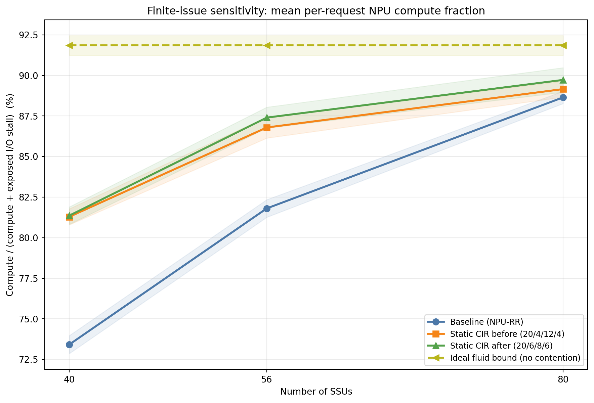

# 四策略有限发行敏感性

正式配置：128 NPU、16 层、SSU=40/56/80、seed=42/43、每 NPU 0–5 ms 独立到达延迟。三个可运行策略统一使用 batch=1、每条命令 0.1 us 发行间隔；两个 Static 策略统一 refresh8，只改变固定 CIR。

0.1 us 是并发可见性的因果敏感性参数，不宣称是某款 NPU 的实测发行延迟。阴影表示两个 seed 的最小–最大范围，主曲线是两 seed 均值；图中严格只有用户指定的四个方案。

## 两 seed 均值

每格为 `request compute fraction / fleet compute utilization`；Fluid bound 没有联合 makespan，因此 fleet 为 N/A。

| SSU | Baseline | Static before | Static after | Fluid bound |
|---:|---:|---:|---:|---:|
| 40 | 73.420% / 15.293% | 81.289% / 15.207% | 81.363% / 15.250% | 91.842% / N/A |
| 56 | 81.806% / 15.339% | 86.791% / 15.274% | 87.400% / 15.306% | 91.842% / N/A |
| 80 | 88.645% / 15.354% | 89.156% / 15.329% | 89.721% / 15.346% | 91.842% / N/A |

## 优化后的 Static CIR 改善了什么

`Static after` 只把类别 CIR 从 `20/4/12/4` 改成 `20/6/8/6`；Path 数仍为 `12/4/12/4`，选路仍为 refresh8。正值表示优化后更好；makespan 负值表示优化后更快完成。

| SSU | after − before request | after − before fleet | after − before makespan | after − baseline request | after − baseline fleet | after − baseline makespan |
|---:|---:|---:|---:|---:|---:|---:|
| 40 | +0.074 pp | +0.043 pp | -6.367 ms | +7.943 pp | -0.043 pp | +6.741 ms |
| 56 | +0.609 pp | +0.032 pp | -4.712 ms | +5.594 pp | -0.033 pp | +4.966 ms |
| 80 | +0.565 pp | +0.017 pp | -2.535 ms | +1.076 pp | -0.008 pp | +1.272 ms |

跨三个 SSU 等权平均，优化 CIR 相对优化前的 request 指标提高 **+0.416 pp**、fleet 提高 **+0.031 pp**，makespan 缩短 **4.538 ms**。相对 baseline，request 指标提高 **+4.871 pp**，但 fleet 仍低 **-0.028 pp**，平均 makespan 长 **4.326 ms**。

### 哪类输入变快或变慢

下表仍是两个 seed 的等权均值。request 正值表示计算占比提高；I/O wait 负值表示暴露等待缩短。

| SSU | 类别 | after − before request | after − before I/O wait | after − baseline request | after − baseline I/O wait |
|---:|:---:|---:|---:|---:|---:|
| 40 | SS | -2.328 pp | +0.875 ms | +37.320 pp | -32.507 ms |
| 40 | SL | +2.645 pp | -6.235 ms | -4.066 pp | +5.662 ms |
| 40 | LS | -0.994 pp | +1.928 ms | +0.675 pp | -2.025 ms |
| 40 | LL | +0.974 pp | -5.510 ms | -2.156 pp | +11.827 ms |
| 56 | SS | -0.004 pp | +0.038 ms | +25.244 pp | -13.622 ms |
| 56 | SL | +3.338 pp | -5.275 ms | +0.347 pp | -1.192 ms |
| 56 | LS | -1.786 pp | +2.762 ms | -2.298 pp | +3.207 ms |
| 56 | LL | +0.888 pp | -5.404 ms | -0.918 pp | +4.861 ms |
| 80 | SS | +3.113 pp | -1.019 ms | +5.857 pp | -2.107 ms |
| 80 | SL | +0.700 pp | -1.514 ms | -0.280 pp | +0.320 ms |
| 80 | LS | -1.949 pp | +1.832 ms | -0.741 pp | +0.639 ms |
| 80 | LL | +0.395 pp | -2.500 ms | -0.533 pp | +3.106 ms |

把 4 GB/s 从 LS 转给 SL/LL 后，SL 和 LL 在三个 SSU 点都改善，LS 在三个点都回退；SS 的方向随容量而变。净效果仍为正，说明原先 `20/4/12/4` 对 SL/LL 保护不足，但 `20/6/8/6` 不是每类输入都更快的支配性解。

## 为什么 request 更高，fleet 仍略低 baseline

request 指标先对 128 个请求分别计算 `compute/(compute+暴露 I/O stall)` 再等权平均；fleet 则是 `总计算时间/(128×全局 makespan)`。因此大量请求变快可以提高前者，而一个长计算尾部请求稍慢就会拉长 makespan、压低后者。

| Seed | SSU | 决定尾部的请求 | 类别 | baseline stall | Static after stall | makespan Δ |
|---:|---:|---:|:---:|---:|---:|---:|
| 42 | 40 | 45 | LL | 17.254 ms | 36.283 ms | +19.029 ms |
| 42 | 56 | 45 | LL | 11.270 ms | 21.798 ms | +10.528 ms |
| 42 | 80 | 45 | LL | 7.225 ms | 9.775 ms | +2.550 ms |
| 43 | 40 | 59 | LL | 13.065 ms | 7.518 ms | -5.547 ms |
| 43 | 56 | 59 | LL | 5.864 ms | 5.269 ms | -0.596 ms |
| 43 | 80 | 59 | LL | 5.276 ms | 5.269 ms | -0.006 ms |

seed 42 的尾部 LL 请求在 Static after 下变慢；seed 43 则略快或相同。两个 seed 平均后尾长仍略增，所以当前结论是 request 平均稳定获益、fleet 有很小且 seed 敏感的损失，不能把旧的单 seed `-0.077 pp` 当作普遍常数。

## Seed 42：有限发行相对历史零耗时模型

该表只做同 seed 配对差值。有限发行同时把 atomic-8 改为 batch-1，并加入 0.1 us 时间推进，因此它是整体客户端发行模型敏感性，不应把全部差值只归因于发行延迟。

| SSU | Baseline Δ | Static before Δ | Static after Δ |
|---:|---:|---:|---:|
| 40 | -0.003 pp | -1.155 pp | -1.609 pp |
| 56 | -0.004 pp | -0.729 pp | -0.275 pp |
| 80 | -0.021 pp | -1.181 pp | -1.150 pp |

无竞争上界的数学定义见 [IDEAL_NO_CONTENTION_BOUND_CN.md](../../doc/IDEAL_NO_CONTENTION_BOUND_CN.md)。
