# QoS storage simulation analysis

Generated from `results/full_analysis/results.json`.

## Experiment and selection contract

The analyzed SSUs are **40/56/80**. The formal contract is 128 NPUs, 16 layers, paired workload/placement, and one independent 0-5 ms arrival delay per NPU.

Choose one strategy name for every selected SSU; maximize the unweighted mean request compute fraction across those SSUs, then maximize the worst-SSU value, then use lexical name order. Static selection is restricted to refresh8/batch8 CIR/path candidates so demand-aware and ticket policies remain independently identifiable. Practical selection covers every runnable cadence, batch, tuning, ticket, and demand policy while excluding the information-advantaged EDF/global policies and the infeasible bound; it also receives a separate fleet-utilization ranking.

Selected fixed static strategy: `tune__low_protect_cir_20_6_8_6_current_paths`. Selected fixed ticket strategy: `ticket_layer_snapshot`. Best practical by request metric: `tune__low_protect_cir_20_6_8_6_current_paths`; best practical by fleet metric: `tune__low_protect_cir_20_5_10_5_paths_12_5_10_5`.

All tuning and winner reporting is **in-sample**: the same fixed seed is used to select and evaluate configurations. It is a controlled paired comparison, not an independent-seed generalization claim.

## Main outcome

| Strategy | 40 SSU request/fleet | 56 SSU request/fleet | 80 SSU request/fleet | Mean request/fleet |
| --- | --- | --- | --- | --- |
| Baseline NPU-RR | 72.87% / 14.55% | 81.27% / 14.59% | 88.29% / 14.62% | 80.81% / 14.59% |
| Current static CIR | 81.95% / 14.40% | 86.87% / 14.49% | 89.84% / 14.58% | 86.22% / 14.49% |
| Tuned static CIR 20/6/8/6 (best fixed; request winner) | 82.44% / 14.42% | 87.03% / 14.52% | 90.11% / 14.59% | 86.53% / 14.51% |
| Tuned static CIR 20/5/10/5, paths 12/5/10/5 (fleet winner) | 82.41% / 14.42% | 87.04% / 14.52% | 89.95% / 14.59% | 86.47% / 14.51% |
| Demand max-min | 76.42% / 14.10% | 84.86% / 14.36% | 90.30% / 14.54% | 83.86% / 14.33% |
| ticket layer snapshot (best ticket) | 71.10% / 14.43% | 80.26% / 14.51% | 88.56% / 14.58% | 79.98% / 14.51% |
| Per-SSD full-visible EDF | 72.36% / 14.59% | 84.33% / 14.62% | 89.87% / 14.63% | 82.19% / 14.61% |
| Global link-aware online | 75.82% / 14.54% | 84.93% / 14.62% | 90.60% / 14.63% | 83.78% / 14.60% |
| Fluid upper bound | 91.23% / n/a | 91.23% / n/a | 91.23% / n/a | 91.23% / n/a |

Every cell reports request compute fraction first and fleet NPU utilization second. Separate winners are selected for the two metrics; they may differ because fleet utilization includes the global tail makespan.

## Why requests became faster or slower

`current_refresh8` improves mean compute fraction by 5.41 pp. The largest category effect is SS (+26.63 pp); paired requests see 0.48 ms less total I/O stall on average. The compute delta versus stall delta correlation is -0.886 (fixed compute work makes this relationship mechanically strong).

`tune__low_protect_cir_20_6_8_6_current_paths` improves mean compute fraction by 5.72 pp. The largest category effect is SS (+26.69 pp); paired requests see 1.90 ms less total I/O stall on average. The compute delta versus stall delta correlation is -0.898 (fixed compute work makes this relationship mechanically strong).

`demand_maxmin` improves mean compute fraction by 3.05 pp. The largest category effect is SS (+18.76 pp); paired requests see 6.34 ms more total I/O stall on average. The compute delta versus stall delta correlation is -0.732 (fixed compute work makes this relationship mechanically strong).

`ticket_layer_snapshot` reduces mean compute fraction by 0.83 pp. The largest category effect is SL (-3.61 pp); paired requests see 3.46 ms more total I/O stall on average. The compute delta versus stall delta correlation is -0.838 (fixed compute work makes this relationship mechanically strong).

`tune__low_protect_cir_20_5_10_5_paths_12_5_10_5` improves mean compute fraction by 5.66 pp. The largest category effect is SS (+26.75 pp); paired requests see 1.56 ms less total I/O stall on average. The compute delta versus stall delta correlation is -0.901 (fixed compute work makes this relationship mechanically strong).

### Current static CIR: exact paired input groups

| Category | N | compute delta | improved | I/O stall delta |
| --- | --- | --- | --- | --- |
| LL | 96 | -2.32 pp | 4.2% | +12.39 ms |
| LS | 96 | +0.29 pp | 55.2% | -1.18 ms |
| SL | 96 | -2.94 pp | 12.5% | +5.73 ms |
| SS | 96 | +26.63 pp | 99.0% | -18.87 ms |

| Capped actual demand | N | compute delta | improved | I/O stall delta |
| --- | --- | --- | --- | --- |
| 0-10 | 159 | -1.57 pp | 9.4% | +8.31 ms |
| 10-20 | 33 | -7.74 pp | 3.0% | +12.70 ms |
| 20-30 | 69 | +6.12 pp | 69.6% | -4.50 ms |
| 30-40 | 6 | +38.56 pp | 100.0% | -16.98 ms |
| 40-50 | 36 | +34.49 pp | 100.0% | -23.22 ms |
| 50-cap | 81 | +8.50 pp | 71.6% | -8.35 ms |

Fastest paired inputs:

| SSU | request | cat | input BW | actual/capped BW | seq/NQL | delta | wait delta |
| --- | --- | --- | --- | --- | --- | --- | --- |
| 40 | 39 | SS | 36.33 | 36.33/36.33 | 32/128 | +60.33 pp | -33.69 ms |
| 40 | 90 | SS | 54.66 | 54.66/50.00 | 32/64 | +58.95 pp | -35.06 ms |
| 40 | 18 | SS | 42.47 | 42.47/42.47 | 48/128 | +58.47 pp | -40.89 ms |
| 40 | 7 | SS | 42.47 | 42.47/42.47 | 48/128 | +57.95 pp | -39.97 ms |
| 40 | 87 | SS | 46.38 | 46.38/46.38 | 64/128 | +57.85 pp | -49.41 ms |
| 40 | 60 | SS | 36.33 | 36.33/36.33 | 32/128 | +57.66 pp | -30.59 ms |
| 40 | 113 | SS | 46.38 | 46.38/46.38 | 64/128 | +57.63 pp | -48.94 ms |
| 40 | 19 | SS | 46.38 | 46.38/46.38 | 64/128 | +57.23 pp | -48.06 ms |

Slowest paired inputs:

| SSU | request | cat | input BW | actual/capped BW | seq/NQL | delta | wait delta |
| --- | --- | --- | --- | --- | --- | --- | --- |
| 40 | 123 | SL | 11.43 | 11.43/11.43 | 32/512 | -27.13 pp | +27.05 ms |
| 40 | 46 | SL | 12.64 | 12.64/12.64 | 48/512 | -19.59 pp | +23.29 ms |
| 40 | 66 | SL | 12.64 | 12.64/12.64 | 48/512 | -17.90 pp | +21.71 ms |
| 56 | 123 | SL | 11.43 | 11.43/11.43 | 32/512 | -17.11 pp | +12.94 ms |
| 40 | 57 | SL | 13.35 | 13.35/13.35 | 64/512 | -14.81 pp | +20.85 ms |
| 40 | 27 | SL | 5.74 | 5.74/5.74 | 32/1024 | -13.97 pp | +20.59 ms |
| 40 | 82 | SL | 13.35 | 13.35/13.35 | 64/512 | -13.85 pp | +19.37 ms |
| 40 | 23 | LL | 14.56 | 14.56/14.56 | 128/512 | -13.77 pp | +34.16 ms |

## 15 percentage-point target

The request-metric winner `tune__low_protect_cir_20_6_8_6_current_paths` gains +5.72 pp in mean request compute fraction; its 15 pp target is **False**. The independently selected fleet-metric winner `tune__low_protect_cir_20_5_10_5_paths_12_5_10_5` gains -0.08 pp in fleet NPU compute utilization; its 15 pp target is **False**.

## Pressure read cadence

| SSU | mode | compute | reports | telemetry MB |
| --- | --- | --- | --- | --- |
| 40 | current_layer_snapshot | 81.96% | 81904 | 83.87 |
| 40 | current_refresh8 | 81.95% | 248710 | 254.68 |
| 40 | current_per_io | 81.95% | 1704832 | 1745.75 |
| 56 | current_layer_snapshot | 86.86% | 114539 | 117.29 |
| 56 | current_refresh8 | 86.87% | 263222 | 269.54 |
| 56 | current_per_io | 86.87% | 1704832 | 1745.75 |
| 80 | current_layer_snapshot | 89.86% | 162876 | 166.79 |
| 80 | current_refresh8 | 89.84% | 285111 | 291.95 |
| 80 | current_per_io | 89.84% | 1704832 | 1745.75 |

| Mode vs snapshot | mean paired delta | improved | slower |
| --- | --- | --- | --- |
| current_refresh8 | -0.01 pp | 94 | 86 |
| current_per_io | -0.01 pp | 94 | 86 |

Snapshot means one pressure read per request/layer/SSD, not one global read per layer. Aggregate equality is not treated as equivalence unless the request-ID paired deltas are also zero; telemetry cost is reported separately.

## Static CIR/path allocation

| Selected | CIR SS/SL/LS/LL | paths/group | mean delta vs baseline |
| --- | --- | --- | --- |
| yes | 20/6/8/6 | 12/4/12/4 | +5.72 pp |
| no | 20/5/10/5 | 12/5/10/5 | +5.66 pp |
| no | 19/5/11/5 | 12/4/12/4 | +5.63 pp |
| no | 21/5/9/5 | 12/4/12/4 | +5.62 pp |
| no | 20/5/10/5 | 12/4/12/4 | +5.62 pp |
| no | 20/4.5/11/4.5 | 12/4/12/4 | +5.56 pp |
| no | 20/4/12/4 | 11/4/13/4 | +5.42 pp |
| no | 20/4/12/4 | 12/4/12/4 | +5.41 pp |
| no | 20/2/16/2 | 12/4/12/4 | +5.05 pp |
| no | 20/2/16/2 | 11/4/13/4 | +5.04 pp |
| no | 17/2/18/3 | 11/4/13/4 | +4.58 pp |
| no | 17/2/18/3 | 12/4/12/4 | +2.96 pp |

The fixed winner is selected on all SSUs together, not separately per SSU. CIR reserves category bandwidth while path count controls admission/sharing granularity; comparing one-factor CIR-only and path-only rows in the table separates these effects.

| Category | actual demand | capped demand | KV bytes | current CIR/paths | best CIR/paths |
| --- | --- | --- | --- | --- | --- |
| SS | 39.14% | 42.74% | 14.14% | 50.00% / 37.50% | 50.00% / 37.50% |
| SL | 4.46% | 5.58% | 13.79% | 10.00% / 12.50% | 15.00% / 12.50% |
| LS | 50.90% | 44.78% | 36.97% | 30.00% / 37.50% | 20.00% / 37.50% |
| LL | 5.50% | 6.89% | 35.10% | 10.00% / 12.50% | 15.00% / 12.50% |

Actual demand is KV bytes divided by compute time; capped demand applies the 50 GB/s NPU limit before comparing the workload with CIR/path shares.

## Batch size and layer-count inference

| Batch | cross-SSU mean compute |
| --- | --- |
| 16 | 86.24% |
| 32 | 86.24% |
| 8 | 86.22% |

Best one-size batch: **16**. At batch 8, the layer-16 steady-state extrapolation predicts improvement for SSUs [40, 56, 80] and degradation for SSUs [] if layers increase. This is an extrapolation, because every formal simulation remains fixed at 16 layers.

## System utilization, incast, tail, and fairness

| SSU | strategy | SSU effective | NPU link | NPU queue | makespan | Jain |
| --- | --- | --- | --- | --- | --- | --- |
| 40 | baseline | 8.14% | 2.03% | 0.8958 ms | 2197.69 ms | 0.8661 |
| 40 | current_refresh8 | 8.05% | 2.01% | 1.1888 ms | 2221.74 ms | 0.9375 |
| 40 | tune__low_protect_cir_20_6_8_6_current_paths | 8.06% | 2.02% | 1.2279 ms | 2217.66 ms | 0.9366 |
| 40 | tune__low_protect_cir_20_5_10_5_paths_12_5_10_5 | 8.06% | 2.02% | 1.2284 ms | 2217.53 ms | 0.9367 |
| 40 | demand_maxmin | 7.88% | 1.97% | 1.0639 ms | 2268.53 ms | 0.9481 |
| 40 | ticket_layer_snapshot | 8.07% | 2.02% | 1.0103 ms | 2216.69 ms | 0.8913 |
| 40 | per_ssd_full_visible_edf | 8.16% | 2.04% | 1.2468 ms | 2191.41 ms | 0.8851 |
| 40 | global_link_aware_online | 8.13% | 2.03% | 1.0115 ms | 2199.49 ms | 0.9130 |
| 56 | baseline | 5.83% | 2.04% | 1.2305 ms | 2191.64 ms | 0.9263 |
| 56 | current_refresh8 | 5.79% | 2.03% | 1.4180 ms | 2206.76 ms | 0.9575 |
| 56 | tune__low_protect_cir_20_6_8_6_current_paths | 5.80% | 2.03% | 1.4507 ms | 2202.34 ms | 0.9554 |
| 56 | tune__low_protect_cir_20_5_10_5_paths_12_5_10_5 | 5.80% | 2.03% | 1.4696 ms | 2202.00 ms | 0.9552 |
| 56 | demand_maxmin | 5.74% | 2.01% | 1.2656 ms | 2227.08 ms | 0.9674 |
| 56 | ticket_layer_snapshot | 5.79% | 2.03% | 1.2837 ms | 2204.25 ms | 0.9451 |
| 56 | per_ssd_full_visible_edf | 5.84% | 2.04% | 1.4725 ms | 2188.17 ms | 0.9568 |
| 56 | global_link_aware_online | 5.84% | 2.04% | 1.3622 ms | 2187.77 ms | 0.9577 |
| 80 | baseline | 4.09% | 2.04% | 1.5239 ms | 2187.59 ms | 0.9642 |
| 80 | current_refresh8 | 4.08% | 2.04% | 1.6131 ms | 2192.99 ms | 0.9711 |
| 80 | tune__low_protect_cir_20_6_8_6_current_paths | 4.08% | 2.04% | 1.5619 ms | 2192.02 ms | 0.9684 |
| 80 | tune__low_protect_cir_20_5_10_5_paths_12_5_10_5 | 4.08% | 2.04% | 1.5916 ms | 2192.23 ms | 0.9701 |
| 80 | demand_maxmin | 4.06% | 2.03% | 1.4255 ms | 2199.95 ms | 0.9729 |
| 80 | ticket_layer_snapshot | 4.08% | 2.04% | 1.5254 ms | 2193.46 ms | 0.9712 |
| 80 | per_ssd_full_visible_edf | 4.09% | 2.05% | 1.6453 ms | 2185.96 ms | 0.9700 |
| 80 | global_link_aware_online | 4.09% | 2.05% | 1.5971 ms | 2185.46 ms | 0.9716 |

SSU utilization shows whether extra scheduling actually keeps media busy; NPU receive-queue wait isolates downstream incast. A higher request mean can coexist with a longer makespan or lower fleet utilization.

## Demand-aware calibration and theoretical headroom

For two active NPUs demanding 10 and 30 GB/s from one 40 GB/s SSD, the actual command schedulers measure 20/20 GB/s for baseline and 10/30 GB/s for demand max-min. Formal demand plots use actual KV/compute demand after the 50 GB/s NPU cap; placement, 128 NPUs, and receive queues explain why the controlled gain can be diluted.

| SSU | practical-baseline | per-SSD EDF-practical | global-practical | bound-practical |
| --- | --- | --- | --- | --- |
| 40 | +9.57 pp | -10.07 pp | -6.62 pp | +8.80 pp |
| 56 | +5.76 pp | -2.70 pp | -2.10 pp | +4.20 pp |
| 80 | +1.83 pp | -0.24 pp | +0.48 pp | +1.12 pp |

Per-SSD EDF is an independent-disk heuristic. Global link-aware online coordinates committed cross-SSD work but still sees no future layer. Both idealized heuristics receive a full current layer in one submission, whereas the selected practical winner uses batch 8, so their information advantage must not be attributed only to the arbitration rule. Neither proves optimality. The fluid result is a loose, infeasible upper bound, not the unknown exact optimum: best runnable <= unknown optimum <= loose fluid bound.

## Arrival delay verification

N=128, min=0.0081 ms, mean=2.4272 ms, p95=4.7993 ms, max=4.9900 ms, unique=128. Range check [0,5] ms: **True**.

These values are independent release/start jitters. They stagger when an NPU request enters the simulation and are not added to processing TTFT or request compute fraction.

## Figures

### Strategy Overview

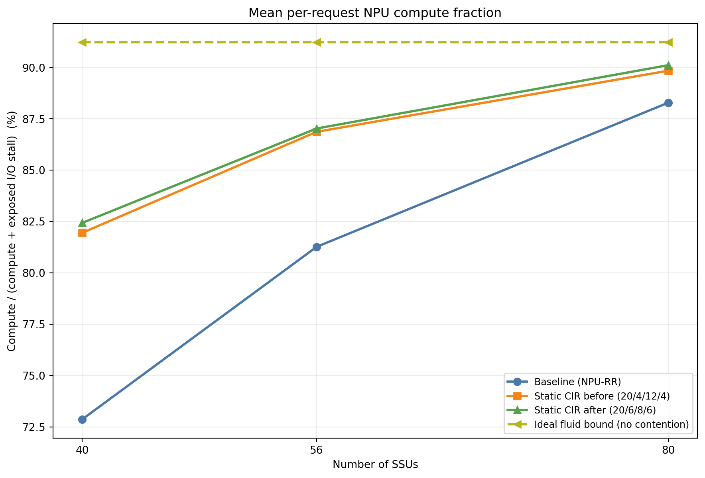

### Pressure Cadence

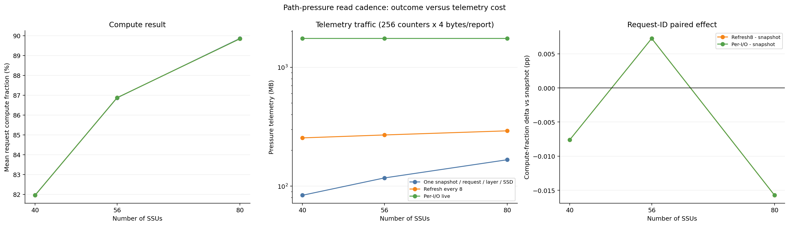

### Static Tuning

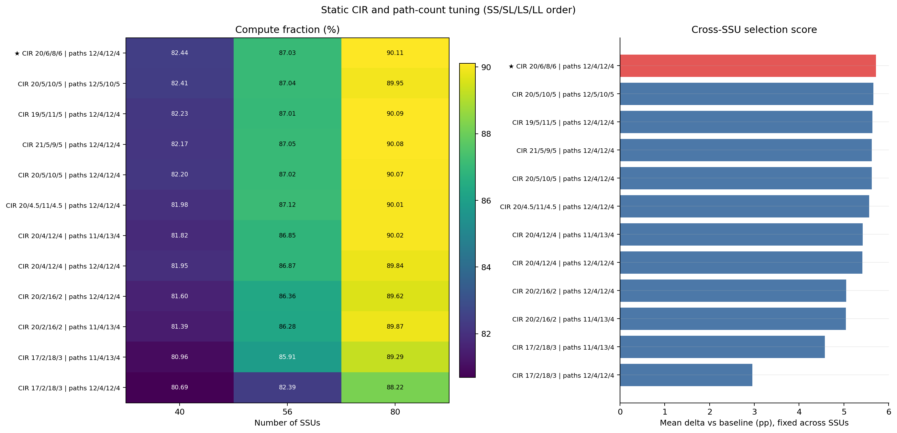

### Paired Input Causality

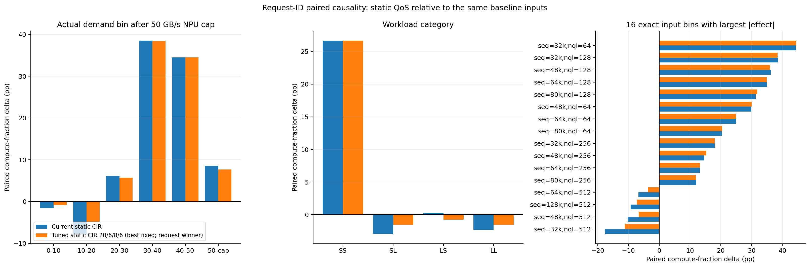

### Category Wait Decomposition

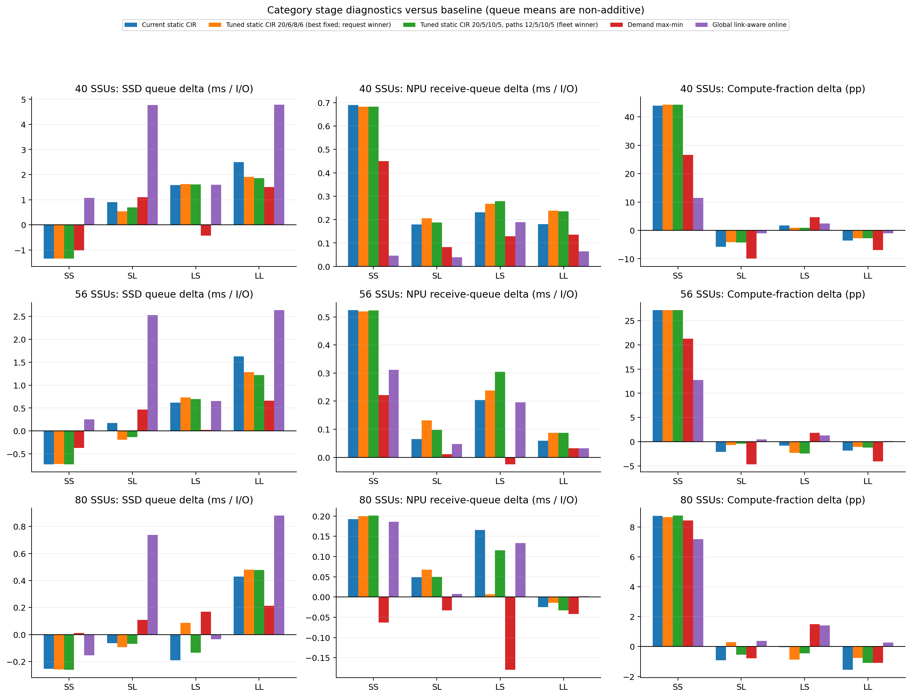

### Delay Workload

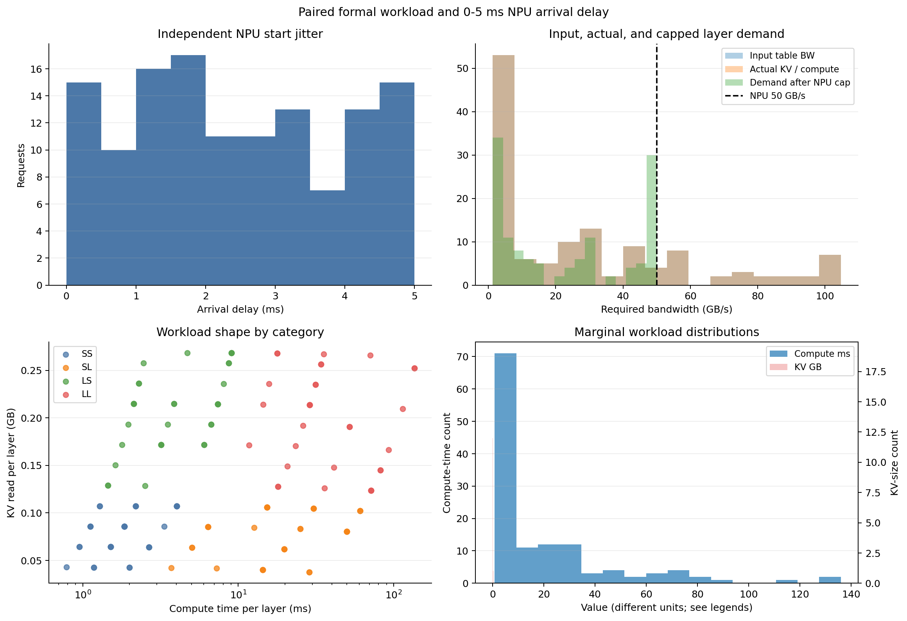

### Practical Ideal Bound Gap

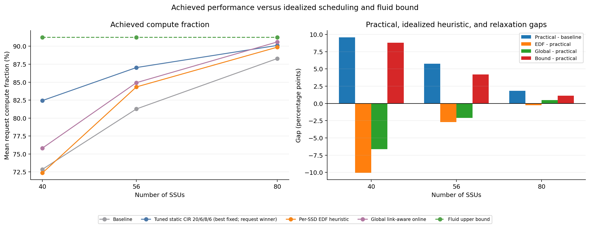

### Batch Layer Waits

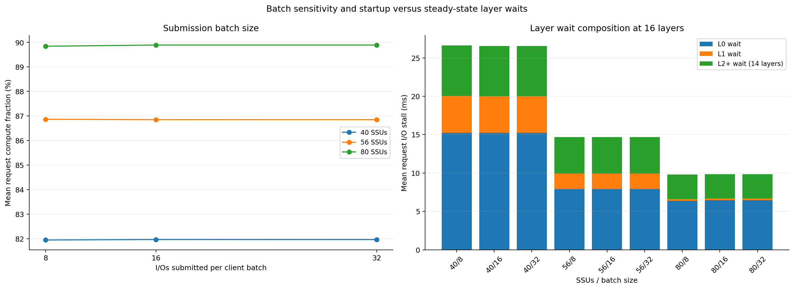

### Maxmin Calibration

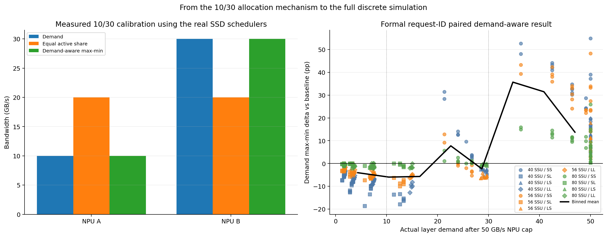

### System Metrics

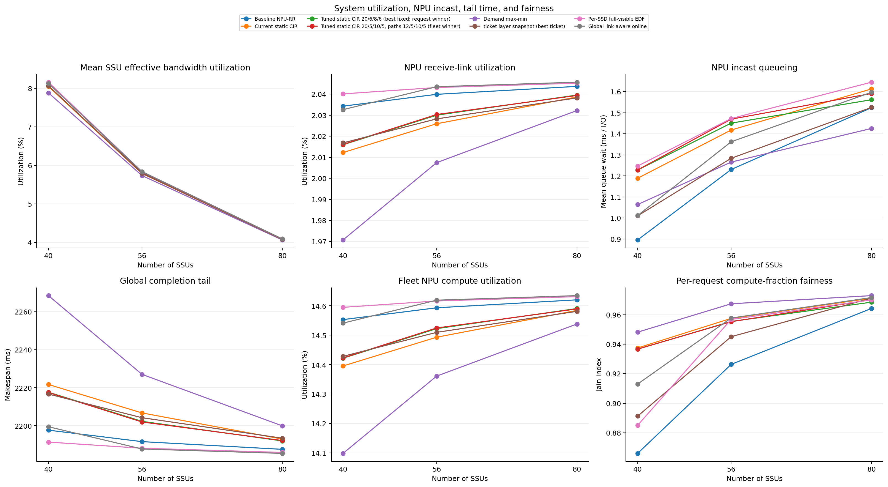

### Allocation Alignment

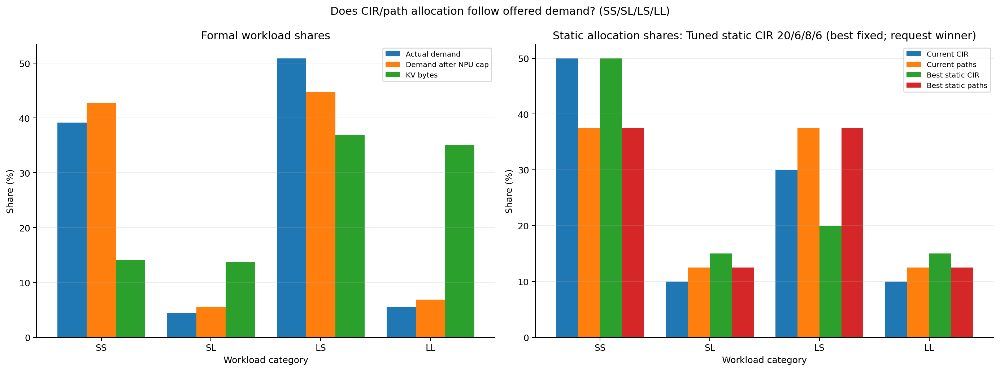
