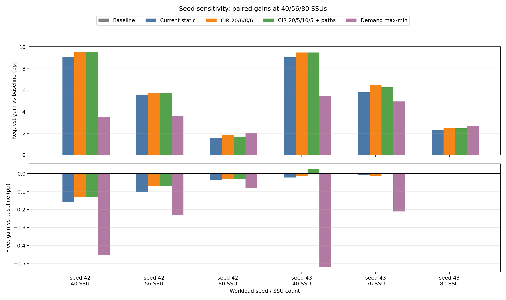

# Seed 42/43 validation

Formal contract and paired fingerprint checks passed for 128 NPUs, 16 layers, and 40/56/80 SSUs.

Primary ranking uses the mean request compute-fraction gain over the three SSU points. Rankings cover only the four predeclared non-baseline candidates shown below, not the full formal registry.

| Seed | Request ranking |
|---:|---|
| 42 | 1. CIR 20/6/8/6 (+5.719 pp); 2. CIR 20/5/10/5 + paths (+5.659 pp); 3. Current static (+5.414 pp); 4. Demand max-min (+3.054 pp) |
| 43 | 1. CIR 20/6/8/6 (+6.154 pp); 2. CIR 20/5/10/5 + paths (+6.077 pp); 3. Current static (+5.738 pp); 4. Demand max-min (+4.384 pp) |

Seed-42 winner within these four candidates: `tune__low_protect_cir_20_6_8_6_current_paths` (request mean +5.719 pp at seed 42, +6.154 pp at seed 43).

- Request-gain direction held at all SSUs: **True**.
- Request rank remained first among these four candidates at seed 43: **True** (rank 1).
- Fleet-gain direction held at all SSUs: **False**.
- Fleet rank among these four candidates was preserved: **True** (seed42 2, seed43 2).

This is a sensitivity check over two deterministic seeds. It does not establish statistical significance.
