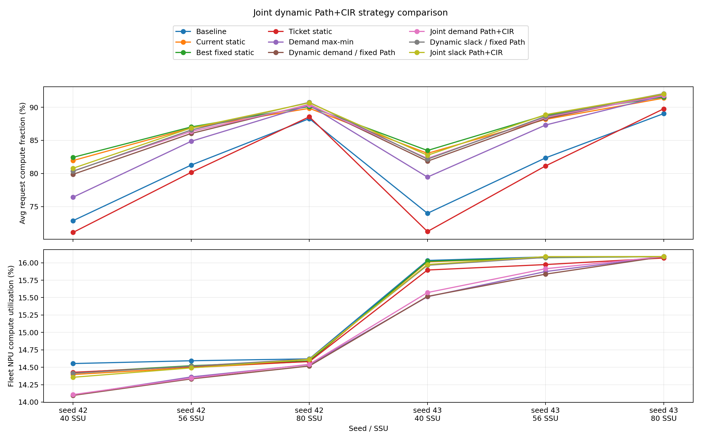
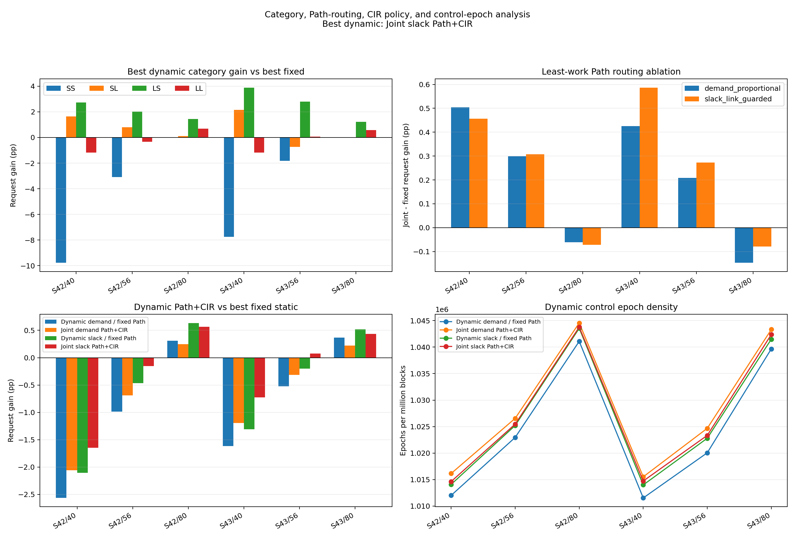

# 联合动态 Path + CIR 分析

严格合同校验已通过：128 NPU、16 层、40/56/80 SSU、配对 workload/placement、全部 invariants，且动态控制记录的历史最大 ΣCIR 不超过 40 GB/s。

动态策略的控制语义是：NPU 上报当前层 demand 并选择自己的两条专属 Path；每块 SSU 在下一条非抢占命令前原子归一化并安装最终 CIR。配置延迟按要求设为 0，而且可以逐命令边界更新，因此结果是零成本控制的乐观在线 heuristic，不等同于已经验证过寄存器写入周期的成熟硬件实现。

## 策略总览

### Seed 42

| Strategy | 40 request/fleet | 56 request/fleet | 80 request/fleet | Mean request gain |
|---|---:|---:|---:|---:|
| Baseline | 72.87% / 14.55% | 81.27% / 14.59% | 88.29% / 14.62% | +0.000pp |
| Current static | 81.95% / 14.40% | 86.87% / 14.49% | 89.84% / 14.58% | +5.414pp |
| Best fixed static | 82.44% / 14.42% | 87.03% / 14.52% | 90.11% / 14.59% | +5.719pp |
| Ticket static | 71.09% / 14.43% | 80.17% / 14.51% | 88.56% / 14.58% | -0.867pp |
| Demand max-min | 76.42% / 14.10% | 84.86% / 14.36% | 90.30% / 14.54% | +3.054pp |
| Dynamic demand / fixed Path | 79.87% / 14.10% | 86.04% / 14.33% | 90.42% / 14.52% | +4.638pp |
| Joint demand Path+CIR | 80.37% / 14.11% | 86.34% / 14.34% | 90.36% / 14.54% | +4.885pp |
| Dynamic slack / fixed Path | 80.33% / 14.41% | 86.57% / 14.52% | 90.75% / 14.62% | +5.075pp |
| Joint slack Path+CIR | 80.79% / 14.36% | 86.87% / 14.49% | 90.68% / 14.61% | +5.306pp |

按三个 SSU 等权平均，Request 第一：`best_fixed_static`；最佳动态策略：`joint_slack_path_cir`；fleet 第一：`baseline`。

### Seed 43

| Strategy | 40 request/fleet | 56 request/fleet | 80 request/fleet | Mean request gain |
|---|---:|---:|---:|---:|
| Baseline | 73.98% / 16.03% | 82.36% / 16.08% | 89.05% / 16.09% | +0.000pp |
| Current static | 83.04% / 16.01% | 88.17% / 16.08% | 91.38% / 16.09% | +5.738pp |
| Best fixed static | 83.47% / 16.02% | 88.82% / 16.07% | 91.55% / 16.09% | +6.154pp |
| Ticket static | 71.23% / 15.90% | 81.14% / 15.97% | 89.77% / 16.07% | -1.081pp |
| Demand max-min | 79.45% / 15.51% | 87.32% / 15.87% | 91.76% / 16.09% | +4.384pp |
| Dynamic demand / fixed Path | 81.85% / 15.52% | 88.30% / 15.84% | 91.92% / 16.09% | +5.564pp |
| Joint demand Path+CIR | 82.28% / 15.57% | 88.50% / 15.91% | 91.78% / 16.09% | +5.726pp |
| Dynamic slack / fixed Path | 82.16% / 15.96% | 88.62% / 16.08% | 92.07% / 16.09% | +5.823pp |
| Joint slack Path+CIR | 82.74% / 15.97% | 88.89% / 16.09% | 91.99% / 16.09% | +6.083pp |

按三个 SSU 等权平均，Request 第一：`best_fixed_static`；最佳动态策略：`joint_slack_path_cir`；fleet 第一：`baseline`。

## Path 选路增益

| Seed | SSU | CIR mode | Request joint-fixed | Fleet joint-fixed | Improved/regressed requests |
|---:|---:|---|---:|---:|---:|
| 42 | 40 | demand_proportional | +0.504pp | +0.012pp | 75 / 45 |
| 42 | 40 | slack_link_guarded | +0.457pp | -0.057pp | 63 / 65 |
| 42 | 56 | demand_proportional | +0.299pp | +0.011pp | 66 / 42 |
| 42 | 56 | slack_link_guarded | +0.308pp | -0.025pp | 70 / 56 |
| 42 | 80 | demand_proportional | -0.062pp | +0.025pp | 47 / 53 |
| 42 | 80 | slack_link_guarded | -0.071pp | -0.005pp | 40 / 55 |
| 43 | 40 | demand_proportional | +0.425pp | +0.055pp | 71 / 43 |
| 43 | 40 | slack_link_guarded | +0.586pp | +0.010pp | 61 / 67 |
| 43 | 56 | demand_proportional | +0.209pp | +0.078pp | 63 / 46 |
| 43 | 56 | slack_link_guarded | +0.273pp | +0.012pp | 67 / 48 |
| 43 | 80 | demand_proportional | -0.147pp | +0.000pp | 40 / 47 |
| 43 | 80 | slack_link_guarded | -0.079pp | +0.000pp | 30 / 49 |

## Dynamic vs best fixed static

| Seed | SSU | Dynamic strategy | Request | Fleet | Largest request gain | Largest regression |
|---:|---:|---|---:|---:|---:|---:|
| 42 | 40 | Dynamic demand / fixed Path | -2.565pp | -0.326pp | +41.416pp (#6) | -23.545pp (#22) |
| 42 | 40 | Joint demand Path+CIR | -2.061pp | -0.314pp | +46.278pp (#6) | -21.741pp (#22) |
| 42 | 40 | Dynamic slack / fixed Path | -2.104pp | -0.009pp | +29.275pp (#6) | -26.357pp (#117) |
| 42 | 40 | Joint slack Path+CIR | -1.647pp | -0.066pp | +29.203pp (#6) | -22.739pp (#54) |
| 42 | 56 | Dynamic demand / fixed Path | -0.988pp | -0.190pp | +32.265pp (#6) | -10.158pp (#117) |
| 42 | 56 | Joint demand Path+CIR | -0.689pp | -0.179pp | +33.726pp (#6) | -8.208pp (#14) |
| 42 | 56 | Dynamic slack / fixed Path | -0.463pp | -0.007pp | +26.489pp (#6) | -11.318pp (#54) |
| 42 | 56 | Joint slack Path+CIR | -0.155pp | -0.032pp | +26.082pp (#6) | -7.927pp (#93) |
| 42 | 80 | Dynamic demand / fixed Path | +0.311pp | -0.073pp | +16.583pp (#6) | -3.361pp (#57) |
| 42 | 80 | Joint demand Path+CIR | +0.249pp | -0.048pp | +15.561pp (#6) | -2.708pp (#24) |
| 42 | 80 | Dynamic slack / fixed Path | +0.635pp | +0.027pp | +16.035pp (#6) | -2.195pp (#24) |
| 42 | 80 | Joint slack Path+CIR | +0.563pp | +0.022pp | +14.452pp (#6) | -2.737pp (#79) |
| 43 | 40 | Dynamic demand / fixed Path | -1.617pp | -0.504pp | +45.693pp (#115) | -19.412pp (#66) |
| 43 | 40 | Joint demand Path+CIR | -1.192pp | -0.449pp | +47.013pp (#115) | -18.041pp (#66) |
| 43 | 40 | Dynamic slack / fixed Path | -1.311pp | -0.057pp | +33.338pp (#115) | -25.035pp (#7) |
| 43 | 40 | Joint slack Path+CIR | -0.725pp | -0.047pp | +33.989pp (#115) | -20.052pp (#7) |
| 43 | 56 | Dynamic demand / fixed Path | -0.522pp | -0.236pp | +31.090pp (#115) | -8.807pp (#96) |
| 43 | 56 | Joint demand Path+CIR | -0.314pp | -0.158pp | +31.415pp (#115) | -8.530pp (#46) |
| 43 | 56 | Dynamic slack / fixed Path | -0.199pp | +0.004pp | +25.692pp (#115) | -9.098pp (#7) |
| 43 | 56 | Joint slack Path+CIR | +0.074pp | +0.016pp | +26.138pp (#115) | -7.894pp (#7) |
| 43 | 80 | Dynamic demand / fixed Path | +0.369pp | +0.000pp | +13.521pp (#115) | -2.563pp (#46) |
| 43 | 80 | Joint demand Path+CIR | +0.222pp | +0.000pp | +13.224pp (#115) | -3.355pp (#124) |
| 43 | 80 | Dynamic slack / fixed Path | +0.516pp | +0.000pp | +13.526pp (#115) | -2.248pp (#80) |
| 43 | 80 | Joint slack Path+CIR | +0.437pp | +0.000pp | +12.590pp (#115) | -2.619pp (#26) |

## 类别归因

Seed 42 最佳动态策略 `joint_slack_path_cir` 相对 best fixed（三个 SSU 等权平均）：

`Request gain` 是相对 best fixed 的差值；三个 wait 列是该动态策略的绝对时间。

| Category | Request gain | I/O wait (absolute) | SSD queue wait (absolute) | NPU link wait (absolute) |
|---|---:|---:|---:|---:|
| SS | -4.288pp | 6.227ms | 0.2983ms | 0.5974ms |
| SL | +0.851pp | 5.616ms | 1.5793ms | 0.5703ms |
| LS | +2.060pp | 31.891ms | 1.0290ms | 1.4986ms |
| LL | -0.276pp | 17.976ms | 1.7356ms | 1.6166ms |

Seed 43 最佳动态策略 `joint_slack_path_cir` 相对 best fixed（三个 SSU 等权平均）：

`Request gain` 是相对 best fixed 的差值；三个 wait 列是该动态策略的绝对时间。

| Category | Request gain | I/O wait (absolute) | SSD queue wait (absolute) | NPU link wait (absolute) |
|---|---:|---:|---:|---:|
| SS | -3.202pp | 4.477ms | 0.2686ms | 0.5115ms |
| SL | +0.467pp | 5.086ms | 1.3643ms | 0.5045ms |
| LS | +2.632pp | 29.451ms | 0.9781ms | 1.5581ms |
| LL | -0.182pp | 17.034ms | 1.7757ms | 1.7267ms |

## 最快/最慢输入

Seed 42 的最佳动态策略 `joint_slack_path_cir`：

| SSU | Fastest input | Fraction | Slowest input | Fraction |
|---:|---|---:|---|---:|
| 40 | #4 SL, BW 1.31 | 99.73% | #5 LS, BW 104.67 | 30.58% |
| 56 | #53 SL, BW 1.61 | 99.80% | #5 LS, BW 104.67 | 36.67% |
| 80 | #8 SL, BW 1.31 | 99.83% | #5 LS, BW 104.67 | 44.20% |

Seed 43 的最佳动态策略 `joint_slack_path_cir`：

| SSU | Fastest input | Fraction | Slowest input | Fraction |
|---:|---|---:|---|---:|
| 40 | #119 SL, BW 1.31 | 99.58% | #56 LS, BW 105.44 | 31.01% |
| 56 | #119 SL, BW 1.31 | 99.83% | #56 LS, BW 105.44 | 37.89% |
| 80 | #119 SL, BW 1.31 | 99.83% | #56 LS, BW 105.44 | 43.85% |

## 控制 epoch 与 CIR

| Seed | SSU | Strategy | Epochs | Epochs/M blocks | Max ΣCIR |
|---:|---:|---|---:|---:|---:|
| 42 | 40 | Dynamic demand / fixed Path | 1725310 | 1012011.7 | 40.000000 |
| 42 | 40 | Joint demand Path+CIR | 1732354 | 1016143.5 | 40.000000 |
| 42 | 40 | Dynamic slack / fixed Path | 1728850 | 1014088.2 | 40.000000 |
| 42 | 40 | Joint slack Path+CIR | 1729765 | 1014624.9 | 40.000000 |
| 42 | 56 | Dynamic demand / fixed Path | 1743962 | 1022952.4 | 40.000000 |
| 42 | 56 | Joint demand Path+CIR | 1750106 | 1026556.3 | 40.000000 |
| 42 | 56 | Dynamic slack / fixed Path | 1747805 | 1025206.6 | 40.000000 |
| 42 | 56 | Joint slack Path+CIR | 1748249 | 1025467.0 | 40.000000 |
| 42 | 80 | Dynamic demand / fixed Path | 1774882 | 1041089.1 | 40.000000 |
| 42 | 80 | Joint demand Path+CIR | 1780795 | 1044557.5 | 40.000000 |
| 42 | 80 | Dynamic slack / fixed Path | 1779080 | 1043551.5 | 40.000000 |
| 42 | 80 | Joint slack Path+CIR | 1779445 | 1043765.6 | 40.000000 |
| 43 | 40 | Dynamic demand / fixed Path | 1722643 | 1011529.6 | 40.000000 |
| 43 | 40 | Joint demand Path+CIR | 1729433 | 1015516.7 | 40.000000 |
| 43 | 40 | Dynamic slack / fixed Path | 1726833 | 1013990.0 | 40.000000 |
| 43 | 40 | Joint slack Path+CIR | 1728089 | 1014727.5 | 40.000000 |
| 43 | 56 | Dynamic demand / fixed Path | 1737155 | 1020051.0 | 40.000000 |
| 43 | 56 | Joint demand Path+CIR | 1745028 | 1024674.0 | 40.000000 |
| 43 | 56 | Dynamic slack / fixed Path | 1741834 | 1022798.5 | 40.000000 |
| 43 | 56 | Joint slack Path+CIR | 1742752 | 1023337.5 | 40.000000 |
| 43 | 80 | Dynamic demand / fixed Path | 1770556 | 1039663.9 | 40.000000 |
| 43 | 80 | Joint demand Path+CIR | 1776791 | 1043325.1 | 40.000000 |
| 43 | 80 | Dynamic slack / fixed Path | 1773676 | 1041496.0 | 40.000000 |
| 43 | 80 | Joint slack Path+CIR | 1775180 | 1042379.1 | 40.000000 |

## 跨 seed 敏感性

Seed42 赢家 `best_fixed_static` 在 seed43 排名 1；排名保持：**True**，40/56/80 SSU 增益方向全部保持：**True**。

这只是两个确定性 seed 的敏感性检查，不能建立统计显著性。

## 图

