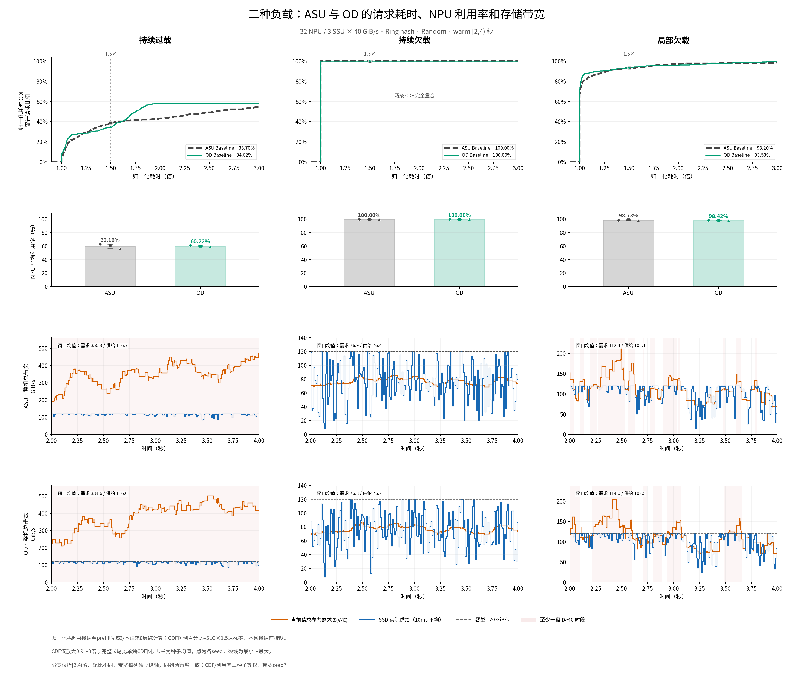

# 三类负载：ASU 与 OD 对比

复用18次已完成的正式运行，未运行新仿真、未修改输入或原有图像。这里只比较 ASU Baseline 和 OD Baseline。

共同配置：**32 NPU、3 SSU×40 GiB/s、Ring hash、Random、8层、batch=1，warm `[2,4)` 秒**。
CDF及指标对seed 7、19、43等权平均；带宽曲线使用seed 7，保留实际时序，不把多个seed的曲线混合平滑。

## 对比图



- [总览：三类负载 × CDF、利用率、ASU与OD带宽](figures/overview.png)
- [TTFT代理归一化CDF：完整长尾](figures/ttft_normalized_cdf.png)
- [TTFT代理归一化CDF：SLO阈值附近放大](figures/ttft_normalized_cdf_zoom.png)
- [NPU平均利用率：均值与三个种子的分布](figures/npu_utilization.png)
- [整机总带宽：需求与实际供给](figures/total_bandwidth.png)
- [ASU：三种负载的逐盘带宽](figures/asu_per_ssu_bandwidth.png)
- [OD：三种负载的逐盘带宽](figures/od_per_ssu_bandwidth.png)

## 数字对照

| 负载 | 策略 | NPU利用率 | SLO×1.5达标率 | 平均总带宽需求 GiB/s | 平均实际供给 GiB/s |
|---|---|---:|---:|---:|---:|
| 持续过载 | ASU Baseline | 60.16% | 38.70% | 375.14 | 115.71 |
| 持续过载 | OD Baseline | 60.22% | 34.62% | 393.91 | 115.47 |
| 持续欠载 | ASU Baseline | 100.00% | 100.00% | 75.38 | 74.93 |
| 持续欠载 | OD Baseline | 100.00% | 100.00% | 75.32 | 74.78 |
| 局部欠载 | ASU Baseline | 98.73% | 93.20% | 107.07 | 98.51 |
| 局部欠载 | OD Baseline | 98.42% | 93.53% | 110.86 | 98.59 |

表中带宽也是三个种子各自窗口均值的等权平均，和只显示seed 7的时序图标注可能不同。

持续过载时，两策略平均利用率约60%，但OD的SLO×1.5达标率低于ASU；隔离路径不保证某个截止阈值下的达标率提高。持续欠载时，两策略的读取都被计算覆盖，CDF在归一化耗时1处达到100%，曲线完全重合。局部欠载时，整体利用率仍高于98%，但有部分请求超出1.5倍门槛。

## 三种负载如何定义

**这里的“持续”限定为所比较的 `[2,4)` 秒窗口**，不把有限请求全部结束后的排空阶段称为持续过载。

```text
SSU s 的参考需求 D_s(t) = 所有当前已接纳请求的 sum(每层落在盘s的读取量 / 每层纯计算时间)
持续过载：窗口内每一时刻，每张盘 D_s > 40 GiB/s
持续欠载：窗口内每一时刻，每张盘 D_s < 40 GiB/s
局部欠载：窗口内既有所有盘都欠载的阶段，也有至少一张盘过载的阶段
```

本次“局部欠载”对应旧实验的“间歇过载”配比，指时间上交替出现两种状态。不是特指固定某一块盘始终欠载。实际选中的事件区间没有恰好等于40的边界情况。

| 负载 | 策略 | 全部盘同时欠载的时间 | 至少一盘过载的时间 | 全部盘同时过载的时间 |
|---|---|---:|---:|---:|
| 持续过载 | ASU Baseline | 0.00% | 100.00% | 100.00% |
| 持续过载 | OD Baseline | 0.00% | 100.00% | 100.00% |
| 持续欠载 | ASU Baseline | 100.00% | 0.00% | 0.00% |
| 持续欠载 | OD Baseline | 100.00% | 0.00% | 0.00% |
| 局部欠载 | ASU Baseline | 67.52% | 32.48% | 21.53% |
| 局部欠载 | OD Baseline | 66.15% | 33.85% | 24.56% |

逐盘每个请求切换区间均已核对，分类不是依据目录名或10ms曲线抽样判断。仅看到整机总需求低于120，也不能推出各盘都低于40；因此另外提供两张逐盘图。

## 曲线怎么读

```text
CDF横轴 = (prefill完成时间 - 请求接纳时间) / 本请求8层纯计算时间
CDF纵轴 = 不超过横轴倍数的请求比例（三个seed的经验CDF等权平均）
横轴1.5处的CDF值 = 表中的SLO×1.5达标率
NPU利用率 = 窗内全部卡实际计算时间 / (32 × 2秒)
```

窗口内接纳的请求全部跟踪至完成，保留窗后完成及超时请求。CDF局部放大不删除长尾样本、不改变分母；完整图保留全部长尾。每个seed的CDF先独立计算，再等权平均，并非把全部seed的请求直接合并。

SLO沿用前次实验的**接纳后prefill完成代理**，不是从原始到达起算的端到端TTFT，也未模拟真实首token事件。全部输入在t=0到达，接纳前排队没有计入主图。不同策略会改变接纳时间，所以同一窗口选中的具体请求集合可能不同。

用户所说的“内存诉求”在本图解释为**SSU读取带宽需求**，单位为GiB/s，不是内存容量（GiB）。橙线是当前请求的参考需求，蓝线是SSD实际服务字节除以10ms。需求按请求切换事件绘制；供给使用10ms均值。两者都不是NPU瞬时利用率。

当前请求在I/O等待期间仍保留V/C参考需求；下一请求尚未接纳的首层预取不重复叠加为第二个活跃请求，但真实预取字节计入实际供给。参考需求可大于供给，也可在单个时段小于供给；不能把两线的瞬时比值直接当成U。

## 来源与比较边界

| 负载 | 原始结果 | 输入 |
|---|---|---|
| 持续过载 | [OD多样输入实验 full](../od_baseline_diverse_ssu3_20260918/README.md) | 24画像；每种长度的miss 256/1024/2048/4096配比3/2/1/1，每卡42条，共1344条 |
| 持续欠载 | [文档原样输入 random](../continuous_underload_asu_od_20260918/README.md) | 10画像；长度32/64/80/128/160K × miss2048/4096，各2条，每卡20条，共640条 |
| 局部欠载 | [OD多样输入实验 semi](../od_baseline_diverse_ssu3_20260918/README.md) | 24画像；每种长度的miss 256/1024/2048/4096配比1/1/1/2，每卡30条，共960条 |

24画像使用长度32/64/80/128/160/200K；各画像的读取量、计算时间都来自data。三组的核心模拟器与策略源码一致。同一负载、同一seed中的ASU和OD共享完全相同的冻结输入。

**跨负载的画像配比、请求数量、请求ID布局及随机排列规则不同。** 因此这是一组现有负载的对照展示，不能把跨组三个点解释成“只改变负载率、其余全部不变”的因果实验。策略优劣应在每组相同输入内比较。

ASU每盘共享一条Path；OD每盘32条NPU独占Path，CIR均分、PIR不限，空闲带宽可借用。它同时改变隔离与份额分配，不能把差值只归因于Path数量。

## 数据与复现

- [三种子均值表](macro_summary.csv)、[18次运行逐项表](comparison.csv)、[CDF逐请求样本](request_samples.csv)
- [统一绘图数据](plot_data.json)、[输入与数值校验](data_checks.json)
- [逐盘逐事件独立审计](audit_load_regimes.json)、[绘图审计](render_checks.json)

```bash
python results/load_regimes_asu_od_comparison_20260918/prepare_comparison.py
python results/load_regimes_asu_od_comparison_20260918/render_figures.py
```

以上命令只读取已完成结果和生成本目录图表，不启动仿真。原始文件哈希保存在校验记录中。
