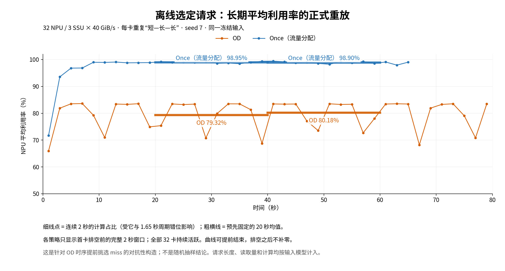

# OD 长期低利用率：怎样构造，Once 能改善多少

**找到了一份输入：OD 在 20–60 秒平均利用率为 79.75%，Once 为 98.92%，相差 19.18 个百分点。** 32 张卡都持续有请求，每张卡都实际计算了长、短两类请求。OD 验证至约 82.5 秒、共 50 轮，没有出现前面差、后面恢复到接近满利用率的情况。

**这份输入属于间歇性强过载，不是持续欠载。** OD 下各盘约 22% 的时间需求超过容量，峰值接近 320 GiB/s，而容量为 40 GiB/s；V/C 的时间平均需求也超过 40。它不满足“任何时刻都欠载”或“平均参考需求也欠载”的要求。本轮没有找到符合这些更强限制的长期低利用率例子。

## 1. 结果先看这里

配置：32 NPU、3 SSU × 40 GiB/s、8 层、每卡 batch=1、卡内 FIFO、一层预取、Ring Hash。两策略使用完全相同的冻结输入及卡内顺序。

|统计窗口|OD 平均 NPU 利用率|Once 平均 NPU 利用率|OD SLO ×1.5|Once SLO ×1.5|
|---|---:|---:|---:|---:|
|原 warm：2–4 秒|81.88%|93.56%|70.64%|81.08%|
|20–40 秒|79.32%|98.95%|67.57%|99.86%|
|40–60 秒|80.18%|98.90%|66.67%|99.31%|
|20–60 秒合计|**79.75%**|**98.92%**|**67.12%**|**99.58%**|

以上窗口都核验了 **32 卡持续活跃、32 卡均计算过两类请求**。首张卡完成全部请求的时间：OD 82.4999 秒，Once 66.6158 秒；统计窗口没有混入卡提前做完后的空闲。

SLO 沿用实验口径：从请求上卡开始到 prefill 完成，阈值为自身 8 层纯计算时间的 1.5 倍；**不含卡内排队，不是完整端到端 TTFT**。窗口接纳的请求全部追踪到完成。Once 推进较快，因此窗口内请求身份不同；补充比较完全相同的全部 4800 个请求，达标率为 OD **66.67%（3200/4800）**、Once **97.13%（4662/4800）**。



细线每点统计连续 2 秒，粗线统计预先固定的 20 秒。OD 细线波动是窗口与重复阶段的相对位置不同；两个长窗口和反复的完整周期都偏低，并非只选了一个低谷。Once 曲线较早结束是请求做完了，排空后的时间没有补成 0。

## 2. 输入究竟怎样分给 32 张卡

**每张卡都按 `短计算请求 A → 长计算请求 B1 → 长计算请求 B2` 运行，重复 50 轮，每卡 150 条。** 总共 4800 条请求，所有请求在时刻 0 就绪。每条请求都有独立物理 ID；按原始 Ring Hash 落盘，没有挑地址来制造某个盘的偏斜。

|请求|总输入长度|miss 数量|每层计算|每层读取|
|---|---:|---:|---:|---:|
|A：短计算|128K|256 token|6.024 ms|175.656 MiB|
|B1：长计算|128K|3328 token|75.604 ms|171.531 MiB|
|B2：长计算|约 127.93–128.49K|3257–3830 token|73.957–87.294 ms|171.531 MiB|

这里的“长短”主要指计算时间：**总输入都约 128K，读取量也差不多。** A 直接来自 data 原始行；B 的计算时间来自 data 网格内插值，固定命中 127744 token，改变 miss 时总长度同步改变。B 的每个参数组合并非都有原始实测值。所有 A 使用同一画像，B2 的 miss 不同；这不是从 data 随机抽样。

## 3. 用小白能理解的方式解释原因

**第一步：让 32 张卡的短计算阶段挤在一起。** OD 虽然每卡有独立 Path，最后仍共同使用这 3 块盘。32 卡同时大量读取时，近似均分得到每卡约 `120 / 32 = 3.75 GiB/s`。A 每层要读约 176 MiB，却只计算约 6 ms，很容易来不及预取下一层。

一段正式记录更直观：A 的一层计算 **6.024 ms**，随后等 I/O **42.190 ms**，合起来 **48.214 ms**。这一小段利用率只有：

```text
6.024 / (6.024 + 42.190) = 12.49%
```

这不是旧 ASU 中“别的卡的大请求在同一个 FIFO 里挡住小请求”。这里主要是许多 A 同时争抢盘带宽。A 结束、大家进入长计算 B 后，读取通常能被计算隐藏，盘又会出现空闲；上一阶段损失的计算时间已经补不回来了。A 转入 B 的首层也有等待，不能说整条 B 完全不等。

**第二步：防止它们跑着跑着自然错开。** 仅仅反复输入相同 A、B，很多候选会逐渐错开，OD 后期恢复到很高利用率。所以本例提前选定每张卡每一轮 B2 的 miss：跑得快的卡，安排计算稍长的 B2；跑得慢的卡，安排计算稍短的 B2，让它们下一轮又在相近时间进入 A。

具体是在离线规划中选请求，随后冻结全部输入，再启动原始仿真器正式重放。**正式运行没有插入睡眠、没有跨卡等待屏障，也没有临时修改请求。** B2 的计算来自选定的 miss 和 data 插值，正常计入计算量。

**第三步：这种损失每轮都再出现。** 平均一轮约有 1318 ms 真正计算、332 ms I/O 等待：

```text
长期利用率约为 1318 / (1318 + 332) = 80%
```

这是对构造的简单解释。正式利用率仍通过实际计算区间积分统计，没有用这个近似替代记录。整个 50 轮的条件式核对值为 79.867741%，正式全程值为 79.867651%。

## 4. Once 为什么能改善

Once 使用原来的流量分配策略和原有 QoS 配置。它改变了 I/O 分配与完成先后，使各卡逐渐错开：一部分卡在长计算，另一些卡在读取，不再每轮都集中进入 A。正式记录中，同一 20–60 秒窗口，短计算类别利用率由 **14.23% 提高到 93.55%**，整机由 **79.75% 提高到 98.92%**。

下面两图使用相同的 39.6–42.9 秒墙钟区间。由于 Once 推进更快，两图中正在执行的请求身份和轮次不相同；完整输入及每卡请求顺序相同。

- [OD：32 卡反复集中等 I/O](figures/scheduled_od_two_cycles.png)
- [Once：各卡错开，等待明显减少](figures/scheduled_once_two_cycles.png)
- [OD：三盘需求为何属于间歇性强过载](figures/scheduled_od_demand.png)

## 5. 结论能用到哪里

- **这是存在性构造，不能据此认定普通随机负载也会这样。** 输入有意针对 OD 选取；真实计算和 SSD 服务抖动是否会破坏这种聚集，本轮没有验证。
- **不是 256 槽导致的。** 取消 OD 的每卡每盘队深限制，4800 请求的关键时刻与 38400 层执行记录完全不变。有限深度确实触发过，改变的是部分等待记在主机还是盘侧。[队深对照](scheduled_input/depth_ablation.md)
- **不是纯选路的单变量对照。** OD 是 32 条独占 Path、均分 CIR；Once 使用原有 256 条 Path、类别 CIR 预算和候选池。队深已做消融，但这仍是两套完整 L3 配置的比较。CIR 是可借用空闲带宽的保底，并非固定硬限速。
- 换 OD 的提交种子 7→19，时序完全相同；这个扰动在本例中没有实际改变执行，不能当作抗真实噪声的证明。[种子检查](scheduled_input/sensitivity/README.md)
- 验证范围是本模型的约 82.5 秒、50 轮，不是无限时间或真实硬件的保证。

更详细的公式、失败候选及 b/B 的真实层周期例子见 [数学与机制解释](math_explanation.md)。完整表格、逐盘需求、SLO 分母、来源与守恒审计见 [正式结果与独立核验](analysis/scheduled_abb_interp_unique_50/README.md)。冻结输入位于 [4800 条请求清单](scheduled_input/inputs/abb_interp_unique_50.json.gz)。本轮只新增实验与分析文件，核心仿真器和策略没有为该输入改动。
