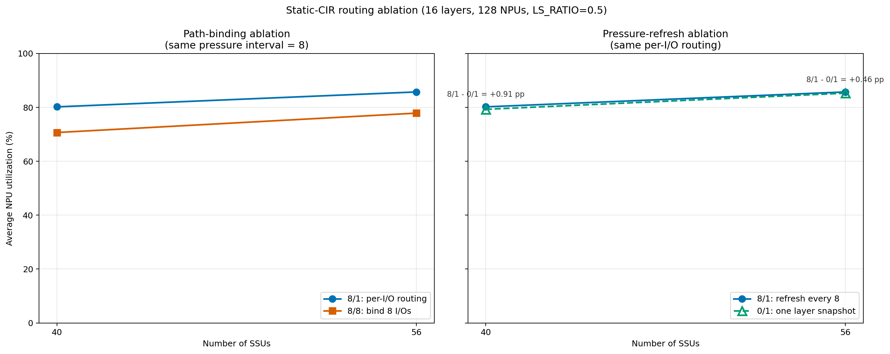

# 16 层客户端 QoS 选路消融：按就绪时间随机轮转提交

日期：2026-08-25

## 实验口径

- 128 个 NPU，16 层，`LS_RATIO=0.5`，请求抽样与数据放置 seed 为 42。
- SSU 数量为 `[40, 56]`；每块 SSU 为 40 GB/s、256 个 Path、8 个 Group。
- 静态 CIR `[SS,SL,LS,LL]=[20,4,12,4]` GB/s，PIR uncapped，WRR 权重固定为 1。
- Baseline 绕过 QoS；Baseline 与 QoS 的 SSU 后端都同时最多执行一个不可抢占 I/O。
- 每种策略、每个 SSU 点都完成相同的 `1,704,832` 个独立 block I/O。

本轮修正了旧程序“一个 NPU 原子提交整层 I/O”的问题。客户端提交语义改为：

1. 每次最多提交 8 个 I/O；
2. 全局按 `ready_time` 调度；
3. 同一 `ready_time` 内按 NPU 无放回随机排列，每轮每个 NPU 最多提交一个 batch；
4. 下一轮重新洗牌；提交顺序 seed 为 `20250825`，与工作负载随机源独立；
5. Baseline、`0/1`、`8/1` 和 `8/8` 使用同一套提交规则与 seed。

`client_submit_interval_us=0`，因此同一 ready time 的各轮不引入人为发送耗时，
但其他 NPU 的 batch 可以在本 NPU 的两个 batch 之间入队并改变 Path 压力。

参数记号为“`压力读取间隔 / Path 绑定 I/O 数`”：

| 名称 | 参数 | 含义 |
|---|---:|---|
| 层级快照 | `0/1` | 每个 `(request, layer, SSU)` 只读一次压力，逐 I/O 选 Path |
| 每 8 个刷新 | `8/1` | 每 8 个 I/O 读取一次压力，逐 I/O 选 Path |
| 每 8 个刷新并绑定 | `8/8` | 每 8 个 I/O 读取一次压力，8 个 I/O 强制共用 Path |

复现命令：

```bash
python experiment.py \
  --compare-routing \
  --layers 16 \
  --workers 2 \
  --rerun \
  --output-dir results/routing_comparison_l16
```

## 平均 NPU utilization

| SSU | Baseline | `0/1` | `8/1` | `8/8` | `8/1 - 8/8` | `8/1 - 0/1` |
|---:|---:|---:|---:|---:|---:|---:|
| 40 | 72.1794% | 79.2781% | 80.1909% | 70.6712% | +9.5197pp | +0.9127pp |
| 56 | 80.6775% | 85.2682% | 85.7264% | 77.8652% | +7.8612pp | +0.4582pp |

相对 Baseline：

| SSU | `0/1` | `8/1` | `8/8` |
|---:|---:|---:|---:|
| 40 | +7.0988pp | +8.0115pp | -1.5082pp |
| 56 | +4.5907pp | +5.0489pp | -2.8123pp |



## 原子提交修正后的核心结论

### `0/1` 与 `8/1` 不再等价

旧程序在一个函数调用中连续完成一层的全部压力窗口和入队，事件循环无法插入其他
NPU；所以 `8/1` 读到的状态只是旧快照加本 NPU 自己已经提交的 I/O，与 `0/1`
的本地影子压力等价。

新程序中，一个 NPU 提交 8 个 I/O 后，同一时刻的其他就绪 NPU 都有机会提交，
然后才轮到下一轮。因此：

- `0/1` 在首次轮到该 `(request, layer, SSU)` 时只读一次，并提前规划其余 I/O；
  后续其他 NPU 对这些 Path 的占用不会被它看到。
- `8/1` 每次轮到下一个 8-I/O batch 时重新读取，能够看到此前其他 NPU 已经入队的
  active + pending I/O。

40 SSU 的 `8/1` 比 `0/1` 高 `+0.9127pp`，56 SSU 高 `+0.4582pp`。
这证明旧结果“读取与不读取完全一样”确实是原子提交事件语义造成的伪影，而不是
压力报告天然无用。

### 刷新为什么只有小幅平均收益

从记录指标看，40 SSU 时：

| 配置 | 平均 block 排队 | NPU utilization Jain | 最大单 Path 积压 |
|:---:|---:|---:|---:|
| `0/1` | 1.7454 ms | 0.94703 | 38 |
| `8/1` | 2.3754 ms | 0.94313 | 31 |

`8/1` 降低了最坏 Path 积压，但提高了全部 block 的平均排队时间。平均 NPU
utilization 仍增加 `+0.9127pp`，而且 SS/SL/LS/LL 四类 p95 相比 `0/1` 分别改善
3.900、4.658、7.567、4.742 ms。说明压力刷新主要改变了请求关键层和类别之间的
服务顺序，并没有降低每个 block 的平均等待；这两个指标不能互相替代。

56 SSU 时，刷新带来 `+0.4582pp`，平均 block 排队也从 0.7898 ms 升到
0.8957 ms；除 SL p95 比 `0/1` 慢 3.041 ms 外，其他三类 p95 都有改善。两个点都
显示“更新压力有用，但收益远小于 Path 绑定粒度的影响”。由于目前只有一个 seed 和
两个 SSU 点，这一机制判断仍应视为结果支持的推断，不能外推成固定规则。

### 8-I/O Path 绑定仍明显退化

`8/1` 与 `8/8` 使用相同的压力读取时刻，只改变 Path 绑定粒度。逐 I/O 选路分别提高
`+9.5197pp` 和 `+7.8612pp`。Path 分布也显示绑定产生更明显热点：

| SSU | 配置 | Path 激活 Jain | Path 激活 CV | 最热 Path I/O | 最大单 Path 积压 |
|---:|:---:|---:|---:|---:|---:|
| 40 | `8/1` | 0.64235 | 0.74618 | 491 | 31 |
| 40 | `8/8` | 0.63016 | 0.76610 | 647 | 35 |
| 56 | `8/1` | 0.64087 | 0.74859 | 377 | 26 |
| 56 | `8/8` | 0.62073 | 0.78167 | 483 | 26 |

Jain 越大、CV 越小表示 Path 使用越均匀。即使 56 SSU 的两种配置最大瞬时积压相同，
`8/8` 的长期激活分布和 NPU utilization 仍明显更差，不能只用一个队列峰值判断
选路质量。

## 尾延迟与公平性

下表为相对 Baseline 的各类别 p95 TTFT 变化；正值表示恶化：

| SSU | 配置 | SS | SL | LS | LL | p95 门槛 |
|---:|:---:|---:|---:|---:|---:|:---:|
| 40 | `0/1` | -21.267 ms | +24.725 ms | +3.365 ms | +31.922 ms | 未通过 |
| 40 | `8/1` | -25.167 ms | +20.067 ms | -4.202 ms | +27.180 ms | 未通过 |
| 40 | `8/8` | -14.884 ms | +4.686 ms | -10.206 ms | +12.942 ms | 未通过 |
| 56 | `0/1` | -4.547 ms | +9.807 ms | +10.337 ms | +25.717 ms | 未通过 |
| 56 | `8/1` | -5.812 ms | +12.848 ms | +5.681 ms | +24.488 ms | 未通过 |
| 56 | `8/8` | -3.952 ms | +5.409 ms | -4.839 ms | +7.164 ms | 未通过 |

40 SSU 时，`8/1` 的平均 utilization 和四类 p95 都优于 `0/1`，但 SL/LL 仍比
Baseline 慢；这再次说明“相对另一个 QoS 方案改善”不等于通过 SLO。所有 QoS 配置中，
`0/1` 和 `8/1` 的 Jain 公平性相对 Baseline 均通过，`8/8` 在两个点均未通过。
但三种 QoS 配置都至少有一类 p95 恶化，因此没有配置通过最终硬门槛。

## 一致性校验

- 每个 SSU 点的所有策略提交相同数量的 batch：40 SSU 为 `248,618`，56 SSU 为
  `263,251`；总 block I/O 均为 `1,704,832`。
- 所有策略、所有 SSU 的 `max_backend_active_io=1`。
- Baseline 和三个 QoS 变体记录的前 256 次同步提交顺序逐项一致；后续 ready_time
  因策略完成时刻不同而自然分化，不强行伪造相同时间线。
- 40/56 SSU 的首轮 128 个 NPU 分别覆盖 39/50 块目标 SSU，没有按磁盘编号同步扫盘。
- `0/1` 的压力读取次数为 40 SSU `81,898`、56 SSU `114,541`；`8/1` 与
  `8/8` 分别为 `248,618`、`263,251`。
- 31 项回归测试通过，包括同 ready_time 无放回随机轮转、每轮每 NPU 至多一个
  batch、独立 seed、可配置提交间隔、目标 SSU 分散，以及 Baseline/QoS 共用提交节奏。
- 路由消融结果 schema 已升为 2，不会复用旧原子提交缓存。

## 结论

1. 按 ready_time、同时间随机轮转的实现消除了整层原子提交伪影；压力刷新现在会真实
   看到其他 NPU 的新增 I/O。
2. 逐 I/O Path 选择仍显著优于 8-I/O 绑定；不建议使用 `path_binding_batch_size=8`。
3. `8/1` 在 40/56 SSU 都略优于 `0/1`，说明刷新能看到其他 NPU 压力，但增益只有
   `+0.91/+0.46pp`；主要收益仍来自逐 I/O 选路而不是更频繁读取。
4. 本轮最佳平均增益是 40 SSU、`8/1` 的 `+8.01pp`，仍未达到 `+10pp`；并且
   SL/LL p95 恶化。因此当前静态 CIR 与选路配置还不能作为最终达标方案。
