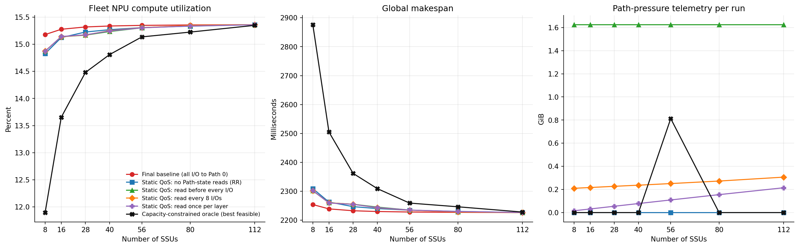
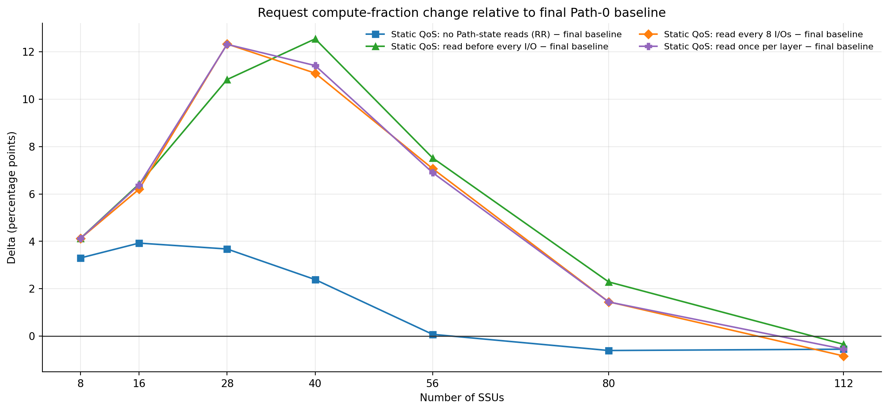

# 最终 Path 选路对比（共用物理 SSD→NPU 数据面）

正式配置：128 NPU、16 层、SSU=`8/16/28/40/56/80/112`、seed=`42/43`、每 NPU 独立 `0–5 ms` 到达延迟、batch=1、每条 I/O 的发行间隔为 `0.1 us`。

主图纵轴按要求简写为 `Average NPU Utilization (%)`，数值定义仍是 128 个请求等权的 `avg_request_compute_fraction`，不是 fleet utilization。

五个可执行策略全部使用同一个 `qos_static_cir` SSD/QoS 数据面、同一个 `20/6/8/6` CIR 和 `12/4/12/4` Path 布局；唯一实验变量是 NPU 写入命令的 Path ID。最终 baseline 把全部 I/O 写入 Path 0；No-state Path RR 完全不读取 Path/I/O 状态，只在类别合法 Path 内轮转；三个 Static 策略分别每条 I/O、每 8 条 I/O、每层/SSU 读取一次压力表。

黑色 Oracle 曲线不再使用删除跨 NPU 竞争的 fluid relaxation。它在每个 paired seed/SSU 中，从五个现有策略和一个 demand-weighted SJF Oracle 候选中选择 request compute fraction 最高的真实事件仿真；所有候选都保留原 block→SSD 映射、每盘单命令 40 GB/s、每 NPU 单接收队列 50 GB/s、原始到达时间和逐层依赖。它是当前找到的最佳可行包络，不声称已经证明数学精确最优。

## Request compute fraction（双 seed 均值）

| SSU | Final Path0 | No-state Path RR | Refresh1 | Refresh8 | Layer once | Capacity-constrained Oracle |
|---:|---:|---:|---:|---:|---:|---:|
| 8 | 31.219% | 34.517% | 35.342% | 35.338% | 35.336% | 48.202% |
| 16 | 46.376% | 50.302% | 52.796% | 52.578% | 52.757% | 65.097% |
| 28 | 60.294% | 63.971% | 71.123% | 72.623% | 72.610% | 77.513% |
| 40 | 70.265% | 72.652% | 82.811% | 81.363% | 81.684% | 83.871% |
| 56 | 80.329% | 80.404% | 87.852% | 87.400% | 87.231% | 87.943% |
| 80 | 88.274% | 87.666% | 90.562% | 89.721% | 89.716% | 90.964% |
| 112 | 91.343% | 90.791% | 90.998% | 90.507% | 90.795% | 91.763% |

## 相对最终 Path-0 baseline

正数表示 request compute fraction 更高；fleet 正数更高，makespan 负数更好。

| 策略 | 跨七个 SSU request Δ | fleet Δ | makespan Δ |
|---|---:|---:|---:|
| No-state Path RR | +1.743 pp | -0.104 pp | +16.129 ms |
| Refresh1 | +6.198 pp | -0.107 pp | +16.446 ms |
| Refresh8 | +5.919 pp | -0.104 pp | +16.017 ms |
| Layer once | +6.004 pp | -0.106 pp | +16.337 ms |
| Capacity-constrained Oracle | +11.036 pp | -0.947 pp | +164.000 ms |

## 收益来自哪里

在用户关注的 28–80 SSU 区间，Refresh1 相对最终 Path-0 baseline 的 request compute fraction 平均提高 **+8.297 pp**。但它不是按每个 NPU 的 10/30 GB/s demand 动态配置 CIR：本矩阵的 CIR 始终是固定的类别预算 `20/6/8/6`。因此这里测到的是类别隔离、跨 Path 分散和压力感知选路的联合效果，不是 per-NPU 精确带宽匹配。

下面按类别拆开 Refresh1−Path0；正数表示该类别变快。

| SSU | SS | SL | LS | LL |
|---:|---:|---:|---:|---:|
| 28 | +45.652 pp | +1.634 pp | +1.268 pp | -5.235 pp |
| 40 | +56.397 pp | -2.178 pp | -0.871 pp | -3.162 pp |
| 56 | +34.844 pp | +0.142 pp | -3.521 pp | -1.373 pp |
| 80 | +11.401 pp | -0.042 pp | -1.593 pp | -0.614 pp |

证据非常集中：中间 SSU 区间的均值提升主要由 SS 请求驱动，而 LL 在四个点全部回退。也就是说 Static QoS 重新分配了服务机会，并没有让所有输入同时变快。No-state Path RR 已经能通过多 Path 和 CIR 隔离获得一部分收益；压力感知选择进一步减少同类 Path 热点。

跨七个 SSU，Refresh1 的 request 指标相对 Path0 平均为 **+6.198 pp**，但 fleet 为 **-0.107 pp**、makespan 为 **+16.446 ms**。原因是 request 指标让 128 个请求等权，而 fleet/makespan 由最晚完成的 LL 尾请求主导；QoS 改善大量短请求的同时延后尾部 LL，因此两组指标方向可以相反。

## Capacity-constrained Oracle 的含义

旧的水平 fluid 曲线已从最终图中删除，因为它为每个请求复制 SSD 容量，不能反映共享盘竞争。新的黑线由实际可运行 schedule 构成，所以 SSU 少时会随共享容量下降，也能合法报告 fleet 和 makespan。

它仍不是带最优性证书的 exact optimum：原问题约有 170 万条非抢占命令，是带动态层 release、SSD→NPU 两阶段约束和非线性 request-utilization 目标的大规模 job-shop/coflow 排程。这里的 `exact_optimum_proven` 固定为 `false`。因此黑线应解读为 **unknown optimum 的可行下界**，而不是新的数学上界。

该包络的选择目标就是主图的平均 request utilization，不是 fleet/makespan；它会优先改善大量短请求并允许 LL 尾部变慢。因此它在小 SSU 点明显提高主图指标，但不代表全局尾长也最优。

| SSU | seed 42 选中 | seed 43 选中 |
|---:|---|---|
| 8 | Demand-weighted SJF Oracle candidate | Demand-weighted SJF Oracle candidate |
| 16 | Demand-weighted SJF Oracle candidate | Demand-weighted SJF Oracle candidate |
| 28 | Demand-weighted SJF Oracle candidate | Demand-weighted SJF Oracle candidate |
| 40 | Demand-weighted SJF Oracle candidate | Demand-weighted SJF Oracle candidate |
| 56 | Static QoS: read before every I/O | Demand-weighted SJF Oracle candidate |
| 80 | Demand-weighted SJF Oracle candidate | Demand-weighted SJF Oracle candidate |
| 112 | Demand-weighted SJF Oracle candidate | Demand-weighted SJF Oracle candidate |

## 五个标准策略中每个 SSU 的最佳策略

| SSU | 最佳策略 | request compute fraction | 相对 Path0 |
|---:|---|---:|---:|
| 8 | Static QoS: read before every I/O | 35.342% | +4.123 pp |
| 16 | Static QoS: read before every I/O | 52.796% | +6.420 pp |
| 28 | Static QoS: read every 8 I/Os | 72.623% | +12.329 pp |
| 40 | Static QoS: read before every I/O | 82.811% | +12.547 pp |
| 56 | Static QoS: read before every I/O | 87.852% | +7.523 pp |
| 80 | Static QoS: read before every I/O | 90.562% | +2.288 pp |
| 112 | Final baseline (all I/O to Path 0) | 91.343% | +0.000 pp |

## 刷新频率与遥测

| SSU | Layer reads | Refresh8 reads | Refresh1 reads | Refresh1−Refresh8 request | Refresh8−Layer request |
|---:|---:|---:|---:|---:|---:|
| 8 | 16384 | 220145 | 1703920 | +0.005 pp | +0.002 pp |
| 16 | 32768 | 227246 | 1703920 | +0.218 pp | -0.179 pp |
| 28 | 57342 | 238130 | 1703920 | -1.500 pp | +0.013 pp |
| 40 | 81903 | 248416 | 1703920 | +1.448 pp | -0.321 pp |
| 56 | 114510 | 263034 | 1703920 | +0.452 pp | +0.169 pp |
| 80 | 162726 | 285954 | 1703920 | +0.841 pp | +0.005 pp |
| 112 | 224984 | 321297 | 1703920 | +0.490 pp | -0.288 pp |

## 图

