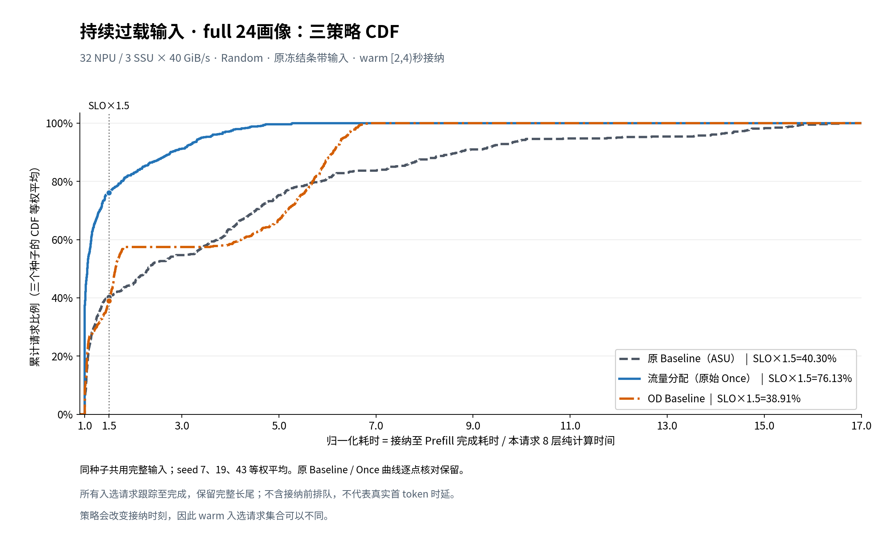
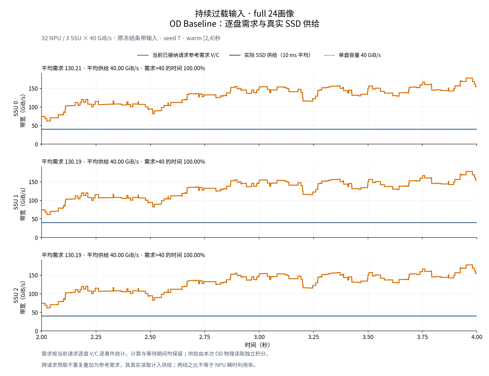
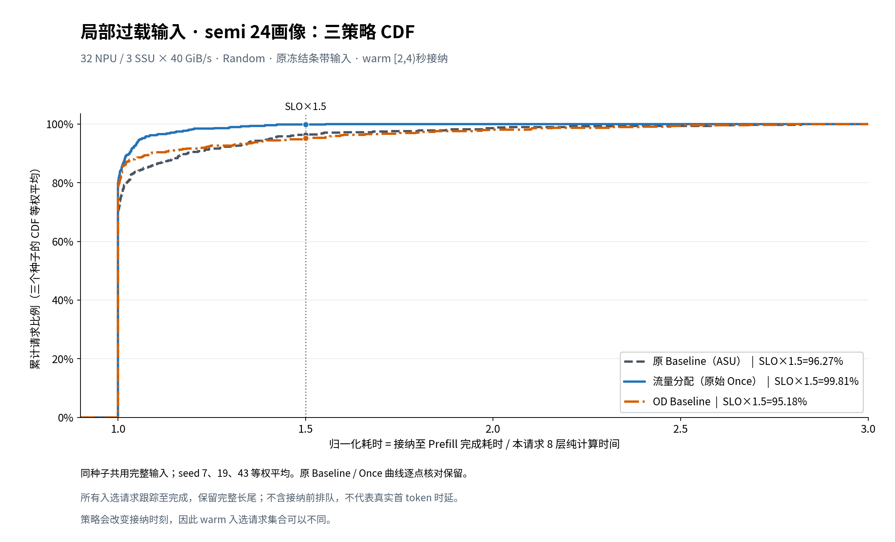
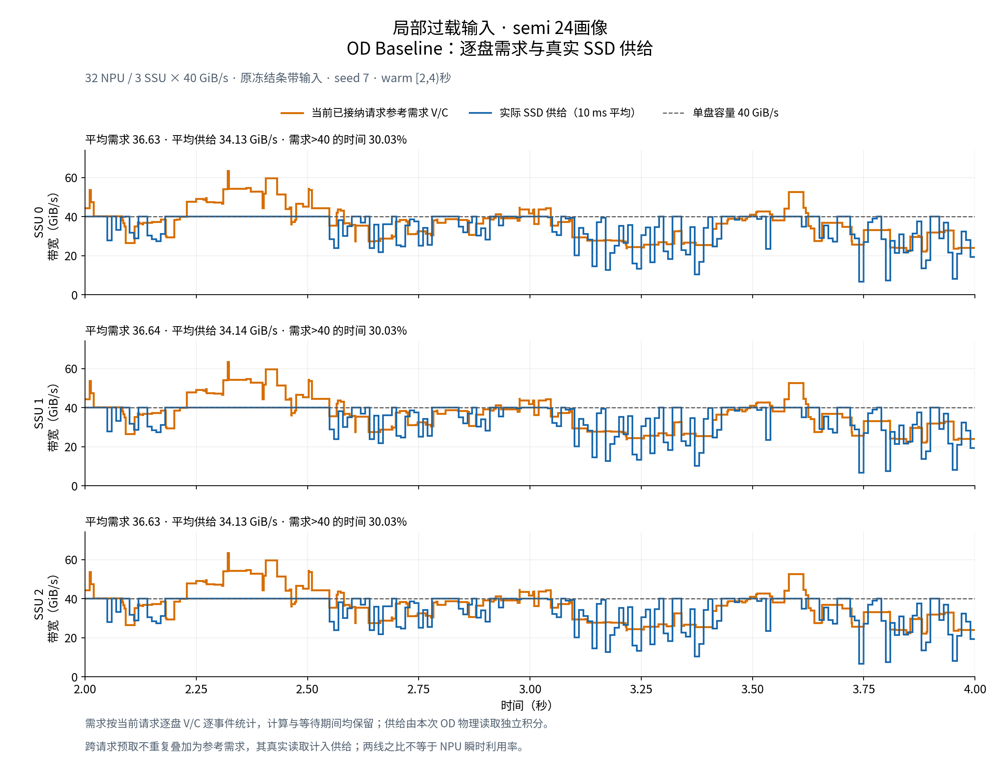
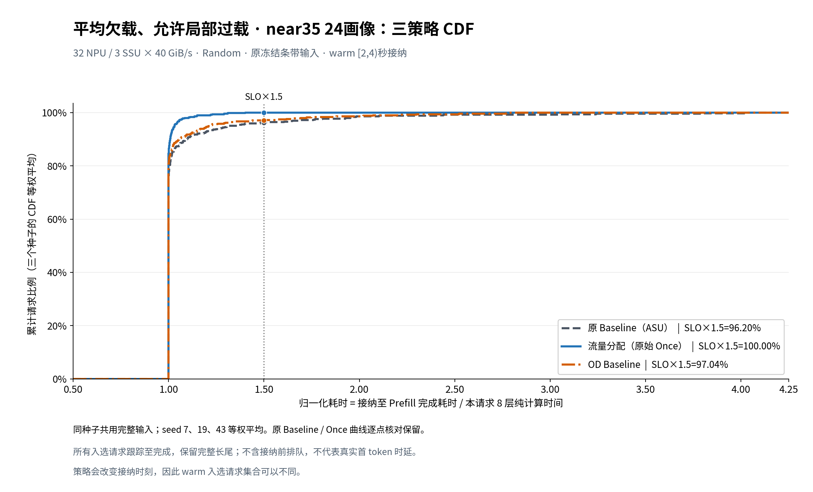
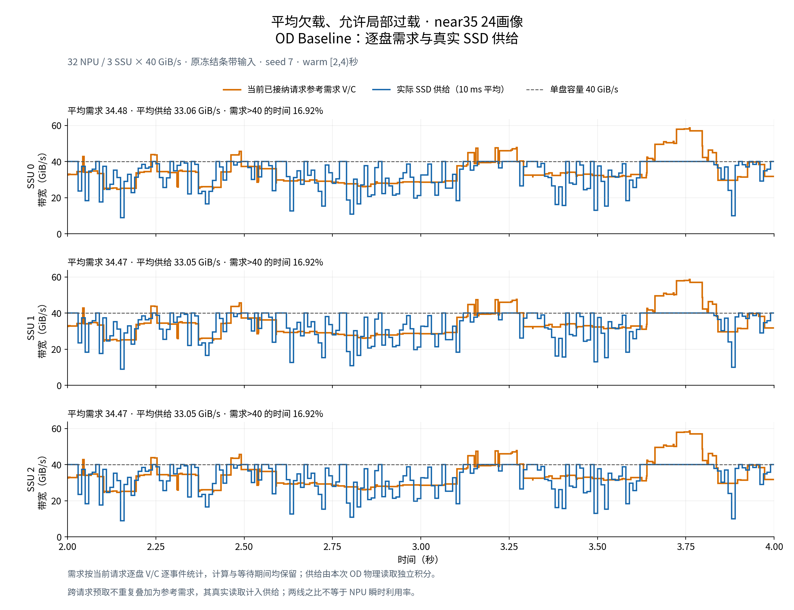
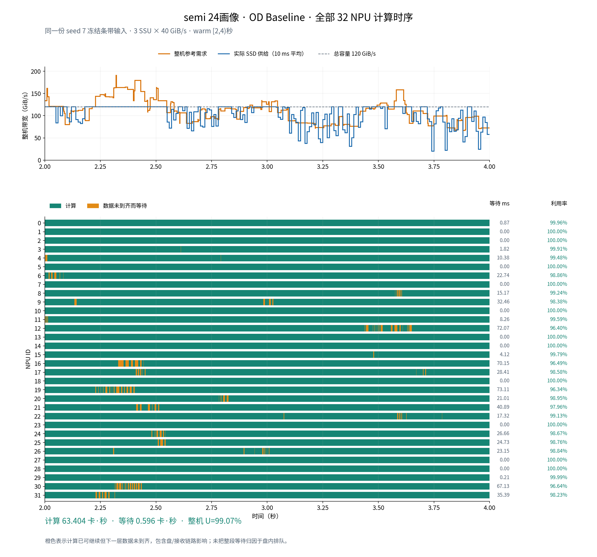

# 模板原输入：新增 OD 比较图

新增 OD 使用模板原冻结输入，不重新生成 Ring hash 落盘。原 Baseline（ASU）和原始 Once 的统计与曲线保留；三组 seed 7 的 ASU 重放均通过原结果时序一致性检查。

配置：32 NPU、3 SSU × 40 GiB/s、8 层、Random；warm 统计为 [2,4) 秒，种子 7、19、43 等权平均。

OD在每盘启用32条独占Path，每张NPU绑定一条，静态CIR为40/32=1.25 GiB/s。空闲容量按原两级调度借用；等CIR不代表任意时刻各卡实际供给都相等。相较原单Path Baseline，这同时改变了隔离方式和带宽分配配置。

| 输入组 | 策略 | NPU平均利用率 | SLO×1.5达标率 | 三种子入选请求总数 |
|---|---|---:|---:|---:|
| full | 原 Baseline（ASU） | 62.3850% | 40.2954% | 589 |
| full | 流量分配（原始 Once） | 64.4407% | 76.1303% | 602 |
| full | OD Baseline | 62.5274% | 38.9137% | 586 |
| semi | 原 Baseline（ASU） | 99.2428% | 96.2705% | 506 |
| semi | 流量分配（原始 Once） | 99.2837% | 99.8095% | 493 |
| semi | OD Baseline | 98.8843% | 95.1804% | 498 |
| near35 | 原 Baseline（ASU） | 99.2497% | 96.1982% | 503 |
| near35 | 流量分配（原始 Once） | 99.4012% | 100.0000% | 509 |
| near35 | OD Baseline | 99.2681% | 97.0447% | 512 |

SLO分母是本请求8层纯计算时间。CDF取窗口内接纳请求，跟踪至完整运行结束；不含接纳前排队，不是实际首token时延。请求总数仅用于说明样本量，CDF和达标率仍先逐种子计算再等权平均。策略改变接纳时刻，所以窗口入选集合可能不同。

near35的含义是平均欠载、允许局部过载，不能解释成逐盘全时欠载。各组负载标签沿用原输入组，不将原Baseline的过载时间比例直接套给OD。

## 新增图

### 持续过载输入 · full 24画像

### 局部过载输入 · semi 24画像

### 平均欠载、允许局部过载 · near35 24画像

### semi：OD全部32卡计算时序

逐盘图和时序图来自OD自己的seed7运行：参考需求为逐事件当前请求的V/C之和，实际供给为物理SSD服务的10ms均值。跨请求预取的读取计入供给；不重复计入参考需求。时序中的等待是数据未到齐造成的暴露等待，不等同于纯SSD排队。

原NEW画像混排图显示的是各策略共用的输入顺序，继续保留即可。本目录不生成本轮排除的8卡、NQL、固定并发、等待分解或sensitivity20k带宽图。

## 来源与复核

- [统一页面汇总](summary.csv)、[JSON汇总](summary.json)
- [逐种子指标](plot_per_seed_metrics.csv)、[逐请求样本](plot_request_samples.csv)、[CDF点](plot_cdf_points.csv)
- [原曲线独立审计](original_source_audit.json)、[新图校验](render_checks.json)、[图表范围审查](SCOPE_REVIEW.md)
- [重绘脚本](render_figures.py)：只读取完整结果，不运行仿真、不改写模板原图。
