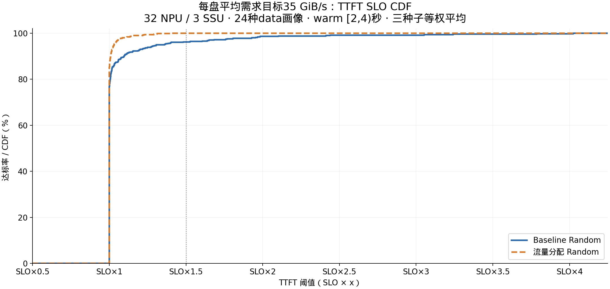
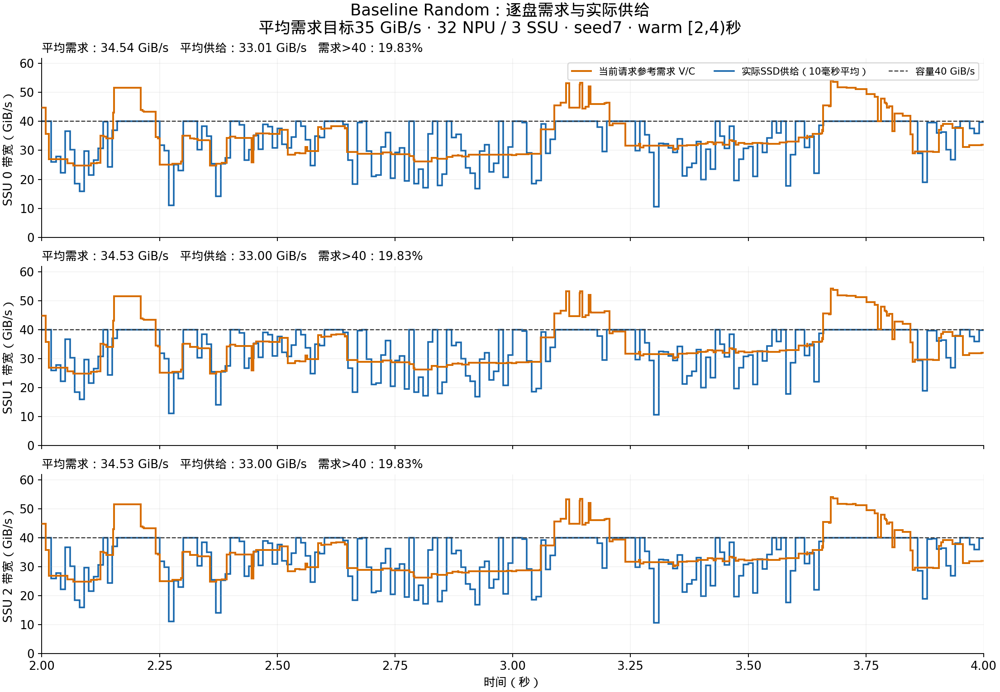
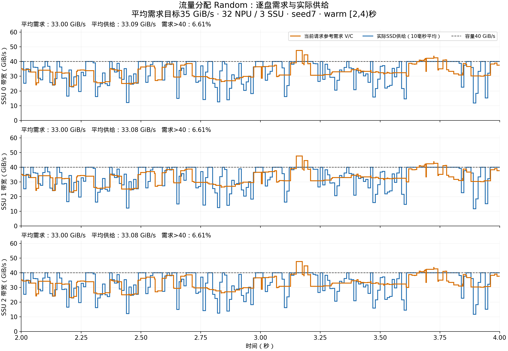

# 每盘平均需求约35 GiB/s：Baseline Random与流量分配 Random

本次按用户更新的目标重新选择请求：关注每盘平均需求约35，不再要求任意画像组合或任意时刻都低于40。跨请求的下一请求L0预取不叠加到当前请求参考需求中；全部真实I/O仍参与仿真并计入实际供给。

32 NPU、3 SSU×40 GiB/s、每NPU接收链路50 GiB/s、8层、batch=1；保留原实验条带放置 `(block_index+npu_id)%3`。单位沿用源码GiB/s。Baseline使用原path0 FIFO；流量分配使用原完整类别合法Path池、每层规划和5ms快照。

总长度32/64/80/128/160/200K，每种长度按miss=256/1024/2048/4096配置1/1/3/2条，合计24种画像、每卡42条、每种子1344条。全部读取量和计算时间直接来自data，不缩放、不填充；每卡队列独立随机打乱。两策略按种子共用完全相同的输入和卡内顺序。

各盘理想平均需求：34.994613 / 34.996053 / 34.994073 GiB/s。计算为每卡总读取量/总纯计算时间，再对32卡求和；各卡纯计算总时长14.9193秒。实测平均按当前已接纳请求的逐盘V/C对时间积分，受等待导致的驻留时间和有限窗口影响。

## 利用率、TTFT SLO和实测平均需求

| 窗口 | 策略 | NPU利用率 | SLO×1 | SLO×1.5 | SSU0平均需求 | SSU1平均需求 | SSU2平均需求 | 任意盘需求>40时间 |
|---|---|---:|---:|---:|---:|---:|---:|---:|
| warm_2_4s | Baseline Random | 99.250% | 76.16% | 96.20% | 36.080 | 36.085 | 36.079 | 25.03% |
| warm_2_4s | 流量分配 Random | 99.401% | 84.58% | 100.00% | 34.752 | 34.756 | 34.752 | 17.94% |
| warm_2_6s | Baseline Random | 99.282% | 76.46% | 96.09% | 36.018 | 36.020 | 36.018 | 25.71% |
| warm_2_6s | 流量分配 Random | 99.452% | 84.80% | 99.90% | 34.740 | 34.742 | 34.739 | 19.64% |
| full_population | Baseline Random | 97.164% | 71.21% | 93.73% | 37.210 | 37.212 | 37.209 | 29.78% |
| full_population | 流量分配 Random | 97.300% | 80.16% | 98.83% | 34.946 | 34.948 | 34.946 | 21.71% |

表格单位GiB/s。seed7/19/43的指标分别计算后等权平均；并非合并所有请求后求达标率。warm窗口全部32张卡持续有请求，利用率=计算卡时间/(32×窗口长度)。完整人口含启动和排空，单独展示。

### [2,4)秒逐类结果

| 类别 | Baseline SLO×1.5 | 流量分配 SLO×1.5 | Baseline类别活跃期利用率 | 流量分配类别活跃期利用率 |
|---|---:|---:|---:|---:|
| SS | 61.11% | 100.00% | 61.64% | 99.27% |
| SL | 100.00% | 100.00% | 99.70% | 99.98% |
| LS | 80.74% | 100.00% | 79.65% | 98.97% |
| LL | 100.00% | 100.00% | 99.89% | 99.24% |

SS/SL/LS/LL沿用源代码：第一个字母按总长度≤80K划S，第二个字母按miss<512划S。这里SS/LS均为miss256，并不意味着读取量小。类别利用率=该类别窗口内计算卡时间/该类别活跃卡时间，先逐种子计算再等权平均。

本组miss256请求在完整输入中占14.29%，却只占纯计算工作量约1.70%。因此短计算请求的等待减少可以使按请求数计的SLO明显改善，而按计算卡时间计的整机利用率提升较小。两策略warm接纳集合会不同，不能将窗口统计差异直接表述为同一批请求逐一被救回。

SLO基准=请求8层纯计算时间，SLO×x表示其x倍。TTFT沿用原工程：prefill完成时刻−接纳时刻，不包含接纳前的卡内队列等待，也不模拟真实首token。CDF取[2,4)秒接纳请求并追踪全部到最终完成，保留窗后完成和超时。SLO×1与×1.5边界采用原统计的1e-9ms浮点容差，CDF在对应关键点使用同一容差；原始时间同时保留。

平均需求约35不等于全程不过载；超过40的参考需求时间比例在表中明确列出。这不包括将下一请求首层预取重复叠加成参考需求。图上10ms实际供给包含所有物理读取，最大不超过单盘40。

橙线是逐事件当前请求V/C之和，计算和stall期间都保留。蓝线按真实SSD服务区间积分，每10ms平均，由5个原始2ms格精确合并；不平滑拟合、不裁剪。图例标明seed7，seed19/43的独立图也附在figures中。

## 全部请求画像

| 总长度K | miss | 类别 | 每层读取MiB | 每层计算ms | 单卡需求GiB/s | 每卡条数 |
|---:|---:|---|---:|---:|---:|---:|
| 32 | 256 | SS | 43.65625 | 1.99748 | 21.34342 | 1 |
| 32 | 1024 | SL | 42.62500 | 7.25723 | 5.73579 | 1 |
| 32 | 2048 | SL | 41.25000 | 14.36910 | 2.80346 | 3 |
| 32 | 4096 | SL | 38.50000 | 28.59284 | 1.31493 | 2 |
| 64 | 256 | SS | 87.65625 | 3.33966 | 25.63192 | 1 |
| 64 | 1024 | SL | 86.62500 | 12.62594 | 6.70007 | 1 |
| 64 | 2048 | SL | 85.25000 | 25.10652 | 3.31595 | 3 |
| 64 | 4096 | SL | 82.50000 | 50.06767 | 1.60915 | 2 |
| 80 | 256 | SS | 109.65625 | 4.01075 | 26.69982 | 1 |
| 80 | 1024 | SL | 108.62500 | 15.31030 | 6.92861 | 1 |
| 80 | 2048 | SL | 107.25000 | 30.47523 | 3.43677 | 3 |
| 80 | 4096 | SL | 104.50000 | 60.80510 | 1.67833 | 2 |
| 128 | 256 | LS | 175.65625 | 6.02401 | 28.47593 | 1 |
| 128 | 1024 | LL | 174.62500 | 23.36336 | 7.29913 | 1 |
| 128 | 2048 | LL | 173.25000 | 46.58136 | 3.63213 | 3 |
| 128 | 4096 | LL | 170.50000 | 93.01733 | 1.79003 | 2 |
| 160 | 256 | LS | 219.65625 | 7.36619 | 29.12063 | 1 |
| 160 | 1024 | LL | 218.62500 | 28.73207 | 7.43076 | 1 |
| 160 | 2048 | LL | 217.25000 | 57.31877 | 3.70137 | 3 |
| 160 | 4096 | LL | 214.50000 | 114.49217 | 1.82958 | 2 |
| 200 | 256 | LS | 274.65625 | 9.04391 | 29.65741 | 1 |
| 200 | 1024 | LL | 273.62500 | 35.44295 | 7.53921 | 1 |
| 200 | 2048 | LL | 272.25000 | 70.74054 | 3.75837 | 3 |
| 200 | 4096 | LL | 269.50000 | 141.33579 | 1.86212 | 2 |

## 复现与文件

`data/summary.csv`与`per_seed_metrics.csv`保存汇总及逐种子指标；`per_class_metrics.csv`为逐类指标；`request_samples.csv`与`cdf_points.csv`为CDF依据；`input_profiles.csv`列出所有画像。

完整包内`source/results/diverse_near35_20260916`包含冻结输入、全部6次完整结果、运行命令、校验和新增构造/运行脚本。原核心仿真源码未改；source_provenance.json记录源仓库版本及文本落地换行差异。旧实验结果独立保留。

可直接运行`python report_near35.py`从包内结果重新生成报告和图；需Python 3、NumPy、Matplotlib。若需重新跑仿真，先移动已有runs目录，再运行新增实验中的运行脚本；输入构造器也保护已有输入，不覆盖。
